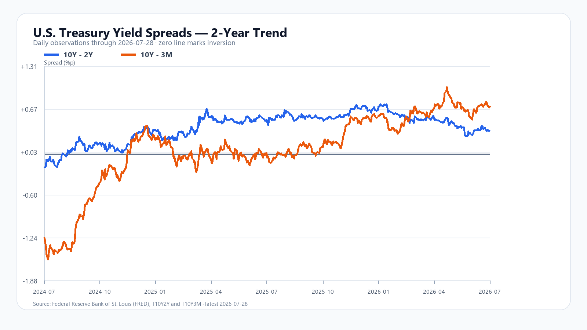
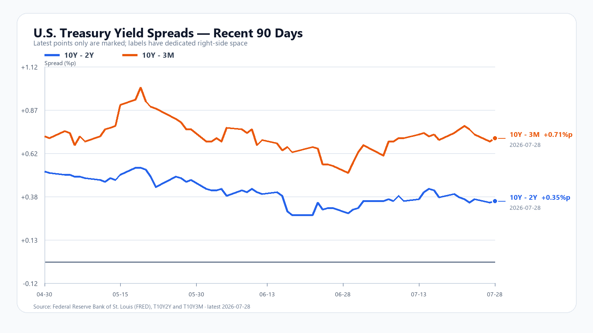

# KOSPI·KODEX 장중 리서치

**기준 시각:** 2026년 7월 29일 10:37 KST
**시장 상태:** 한국 정규장 장중, 미국 7월 28일 정규장 마감 반영
**이전 보고서:** `reports/2026-07-29.md` (10:02 KST)

## 오늘의 핵심 결론

10시 02분 보고서 이후 시장의 성격이 바뀌었다. KOSPI는 장중 6,228.52까지 반등했지만 5,929.35까지 밀린 뒤 10시 37분 5,983.22(-0.67%)에 위치했다. 외국인과 기관, 프로그램이 모두 코스피를 순매수하는데도 지수가 6,000선을 다시 이탈했다.

핵심 변수는 네 가지다.

1. **SK하이닉스 호실적 발표 뒤 매도:** 2분기 매출 79.3조 원, 영업이익 60.5조 원의 사상 최대 실적에도 주가는 1,493,000원(-3.68%)으로 하락했다.
2. **수급 숫자와 가격 행동의 괴리:** 외국인 +1,919억 원, 기관 +1조2,143억 원, 프로그램 +4,864억 원인데 지수는 하락했다. 지수 전체 이탈보다 반도체·고변동성 포지션 청산이 가격을 더 강하게 밀고 있다는 신호다.
3. **미국 반도체의 선택적 급락:** 직전 미국장에서 SOXX -4.92%, AMD -7.53%, Micron -8.80%, SK하이닉스 ADR -8.98%로 메모리와 AI 반도체의 가격 조정이 집중됐다.
4. **외환시장은 비교적 안정:** 달러/원은 10시 32분 1,455.81원(+0.21%)으로 주식 낙폭에 비해 안정적이다. 현재까지는 외환·신용 경색보다 주식시장 내부의 포지션 충격에 가깝다.

**현재 판단:** 메모리 펀더멘털은 강하지만 주식 수급과 밸류에이션 압박이 우세하다.
**대응 점수:** 공격 20 / 관망 60 / 방어 20

## 1. 10시 37분 시장 대시보드

| 항목 | 현재값 | 장중 범위·해석 |
|---|---:|---|
| KOSPI | **5,983.22, -0.67%** | 고가 6,228.52 / 저가 5,929.35 |
| KOSDAQ | **685.47, -2.89%** | 고가 719.39 / 저가 683.31, 52주 저가 갱신 |
| 삼성전자 | **224,000원, +1.82%** | 시가 226,500 / 고가 234,000 / 저가 219,750 |
| SK하이닉스 | **1,493,000원, -3.68%** | 시가 1,567,000 / 고가 1,619,000 / 저가 1,467,000 |
| KODEX 레버리지 | **88,895원, -1.37%** | 시가 92,015 / 고가 96,290 / 저가 86,615 |
| USD/KRW | **1,455.81원, +0.21%** | 10:32, 범위 1,452.83~1,458.22 |

출처: [KOSPI](https://finance.naver.com/sise/sise_index.naver?code=KOSPI), [KOSDAQ](https://finance.naver.com/sise/sise_index.naver?code=KOSDAQ), [삼성전자](https://finance.naver.com/item/main.naver?code=005930), [SK하이닉스](https://finance.naver.com/item/main.naver?code=000660), [KODEX 레버리지](https://finance.naver.com/item/main.naver?code=122630), [USD/KRW](https://kr.investing.com/currencies/usd-krw). 장중 링크는 이후 최신 값으로 바뀔 수 있다.

## 2. 직전 전망에서 바뀐 점

10시 02분 보고서의 기본 범위 6,050~6,220은 장중 저가 5,929.35로 하향 이탈했다. 외국인·기관·프로그램 순매수는 유지됐지만 SK하이닉스의 실적 발표 후 매도와 코스닥 약세를 충분히 상쇄하지 못했다.

| 직전 판단 | 실제 변화 | 평가 |
|---|---|---|
| 외국인·기관 매수가 하단을 지지 | 순매수 확대에도 KOSPI 6,000 이탈 | **가격 영향력 과대평가** |
| SK하이닉스 음전 해소 여부가 핵심 | 고가 +4.45%권 이후 -3.68% | **약세 조건 발생** |
| 기본 범위 6,050~6,220 | 저가 5,929.35 | **하단 실패** |
| 환율은 완충 구간 | USD/KRW 1,455원대 | **유효** |

새로 확인된 사실은 “총수급이 매수냐”보다 **어떤 종목과 어떤 가격대에서 매물이 나오는가**가 더 중요하다는 점이다.

## 3. 국내 수급과 시장 폭

### KOSPI

| 구분 | 순매매 |
|---|---:|
| 개인 | -1조4,077억 원 |
| 외국인 | +1,919억 원 |
| 기관 | +1조2,143억 원 |
| 프로그램 차익 | +2,289억 원 |
| 프로그램 비차익 | +2,575억 원 |
| 프로그램 전체 | +4,864억 원 |

상승 426개, 보합 37개, 하락 451개다. 상승·하락 종목 수는 비슷하지만 지수는 마이너스다. 삼성전자는 플러스인데 SK하이닉스가 하락하고 있어 대형 반도체 내부의 온도차가 지수를 압박한다.

### KOSDAQ

| 구분 | 순매매 |
|---|---:|
| 개인 | +211억 원 |
| 외국인 | +348억 원 |
| 기관 | -617억 원 |
| 프로그램 전체 | +330억 원 |

상승 440개, 보합 59개, 하락 1,231개로 시장 폭이 훨씬 나쁘다. 코스닥 52주 저가 683.31을 새로 기록해 위험선호 회복이 대형주 밖으로 확산되지 못하고 있다.

## 4. SK하이닉스 실적과 주가의 충돌

SK하이닉스는 2분기 매출 79조3,187억 원, 영업이익 60조5,426억 원, 영업이익률 76%를 발표했다. 전년 동기 대비 매출은 257%, 영업이익은 557% 증가했다. 회사는 약 10개 핵심 고객과 장기공급계약을 맺었고, 2분기 HBM4 양산 출하를 시작해 하반기 램프업을 예고했다.

확정 사실만 보면 HBM과 서버 메모리 수요는 강하다. 그러나 주가는 시가 1,567,000원, 고가 1,619,000원을 기록한 뒤 1,493,000원으로 하락했다. 이는 실적이 나빠서가 아니라 다음 변수를 동시에 할인하는 움직임으로 해석한다.

- 사상 최대 실적의 선반영과 호재 소멸
- 미국 Micron·AMD·SOXX 급락의 잔여 충격
- 2027~2028년 증설과 중국 범용 DRAM 경쟁 우려
- AI 투자 규모보다 투자수익률을 요구하는 밸류에이션 변화
- 최근 높은 변동성에 따른 기관·파생 포지션 축소

출처: [SK하이닉스 2Q26 공식 실적](https://news.skhynix.com/en/q2-2026-business-results/)

## 5. 메모리 반도체 수급

7월 28일 공개 스냅샷에서 DDR5·DDR4 현물가격은 상승 흐름을 유지했다.

| 품목 | 세션 평균 | 변화 |
|---|---:|---:|
| DDR5 16Gb 4800/5600 | 50.933달러 | +0.20% |
| DDR5 16Gb eTT | 23.630달러 | +0.04% |
| DDR4 16Gb 3200 | 85.000달러 | +0.58% |
| DDR4 16Gb eTT | 11.525달러 | 보합 |
| DDR4 8Gb 3200 | 42.077달러 | 보합 |

NAND는 품목별 차별화가 계속된다. 128Gb MLC는 26.508달러(+9.73%)로 강한 반면 512Gb TLC는 18.931달러(-1.28%)로 약하다. HBM·서버 DRAM·고신뢰성 NAND는 강하고 소비자용 TLC는 상대적으로 약한 구조다.

**판단:** 현재 실물 수급 붕괴 증거는 없다. 주가는 현재 가격보다 미래 공급 증가, AI 투자수익률, 포지션 과밀을 더 빠르게 할인하고 있다.

출처: [TrendForce DRAM 가격](https://www.trendforce.com/price/dram/dram_spot), [TrendForce NAND 가격](https://www.trendforce.com/price/flash/pcc_oem_ssd_contract), [SLC NAND 전망](https://www.trendforce.com/presscenter/news/20260713-13142.html)

## 6. 미국 반도체와 AI

| 자산 | 7월 28일 미국장 |
|---|---:|
| QQQ | -0.97% |
| TQQQ | -2.90% |
| SOXX | -4.92% |
| SMH | -3.60% |
| Nvidia | +0.31% |
| AMD | -7.53% |
| Micron | -8.80% |
| Broadcom | 약 -0.61% |
| SK하이닉스 ADR | 130.17달러, -8.98% |

Nvidia가 버틴 반면 AMD·Micron·SK하이닉스 ADR이 급락했다. AI 수요 전체가 무너졌다기보다 메모리와 고변동성 반도체에 매도가 집중된 장이다. SK하이닉스 ADR 시간외 +1.79%는 정규장 급락의 일부만 되돌린 수준이며, 한국장의 7월 28일 하락을 뒤늦게 반영한 부분을 7월 29일 전망에 중복 계산하지 않는다.

## 7. 달러/원과 시스템 위험 판단

USD/KRW는 10시 32분 1,455.81원으로 전일 종가 1,452.69원 대비 0.21% 상승했다. KOSPI가 장중 4.9% 넘게 왕복하고 KOSDAQ이 52주 저가를 경신했지만 환율 범위는 1,452.83~1,458.22원에 머물렀다.

**확정 사실:** 주식 변동성에 비해 환율 반응이 제한적이다.
**시장 해석:** 외화 유동성 부족이나 한국 자산의 전면적 이탈보다 반도체·ETF·파생 포지션에 집중된 내부 충격일 가능성이 높다.
**무효화 기준:** 달러/원이 1,470원을 넘어 상승하고 외국인 현물·선물이 동시에 매도로 바뀌면 이 해석을 재검토한다.

## 8. 미 국채 장단기 금리차

FRED 7월 28일 최신 확정치는 10Y-2Y +0.35%p, 10Y-3M +0.71%p다. 7월 27일 대비 각각 +0.01%p, +0.02%p 확대됐다. 역전 상태는 아니지만 반도체 밸류에이션에는 금리차보다 10년물 절대금리 4.6%대가 더 큰 부담이다.

출처: [FRED T10Y2Y](https://fred.stlouisfed.org/series/T10Y2Y), [FRED T10Y3M](https://fred.stlouisfed.org/series/T10Y3M)

## 9. 오늘 밤 경제 캘린더

| 한국시간 | 일정 | 확인할 변수 |
|---|---|---|
| 7월 30일 03:00 | FOMC 성명 | 인플레이션·추가 긴축 문구 |
| 7월 30일 03:30 | Fed 기자회견 | 유가·고용·금리 경로 |
| 7월 30일 05:30 | Meta 실적 콜 | 2026~2027 데이터센터 CAPEX |
| 7월 30일 06:30 | Microsoft 실적 콜 | Azure 성장, AI 인프라 투자수익률 |
| 7월 30일 21:30 | 미국 2분기 GDP·6월 PCE | 성장과 물가의 조합 |
| 7월 31일 06:00 | Amazon 실적 콜 | AWS 성장과 AI CAPEX |

일정은 [Fed](https://www.federalreserve.gov/monetarypolicy/fomccalendars.htm), [Microsoft](https://news.microsoft.com/source/2026/07/08/microsoft-announces-quarterly-earnings-release-date-68/), [Meta](https://investor.atmeta.com/investor-events/event-details/default.aspx), [BEA](https://www.bea.gov/news/schedule/full), [Amazon](https://ir.aboutamazon.com/news-release/news-release-details/2026/Amazon-com-to-Webcast-Second-Quarter-2026-Financial-Results-Conference-Call/default.aspx) 공식 자료로 재확인했다.

## 10. 오후장 조건부 시나리오

### 강세: 6,050~6,150 회복

- KOSPI가 6,000을 회복한 뒤 30분 이상 유지
- SK하이닉스가 1,520,000원 이상 회복
- 삼성전자가 224,000원 이상 유지
- 외국인·기관·프로그램 순매수 지속
- USD/KRW 1,460원 아래

### 기본: 5,920~6,050 고변동성

외국인·기관 매수가 유지되지만 SK하이닉스와 코스닥 약세가 계속되는 경우다. 5,929 저점과 6,000선을 반복 확인할 가능성이 높다.

### 약세: 5,800~5,920 재시험

- KOSPI 5,929.35 이탈
- SK하이닉스 1,467,000원 이탈
- KODEX 레버리지 86,615원 이탈
- 프로그램 매수가 매도로 전환
- USD/KRW 1,470원 접근

## 최종 판단

메모리 실적과 현물가격은 강하지만, 현재 주가는 “좋은 업황”보다 “좋은 업황이 이미 얼마나 반영됐는가”를 묻고 있다. 외국인·기관·프로그램 순매수만으로 바닥을 확정할 수 없고, SK하이닉스와 KOSDAQ의 가격 행동이 수급 숫자보다 더 약하다.

**핵심 확인선:** KOSPI 5,929 / 6,000, SK하이닉스 1,467,000원 / 1,520,000원, KODEX 86,615원, USD/KRW 1,460원.
**대응 점수:** 공격 20 / 관망 60 / 방어 20.

> 이 보고서는 시장 상태를 기록한 정보 자료이며 매수·매도 권유가 아니다. 장중 수치는 이후 달라질 수 있다.
