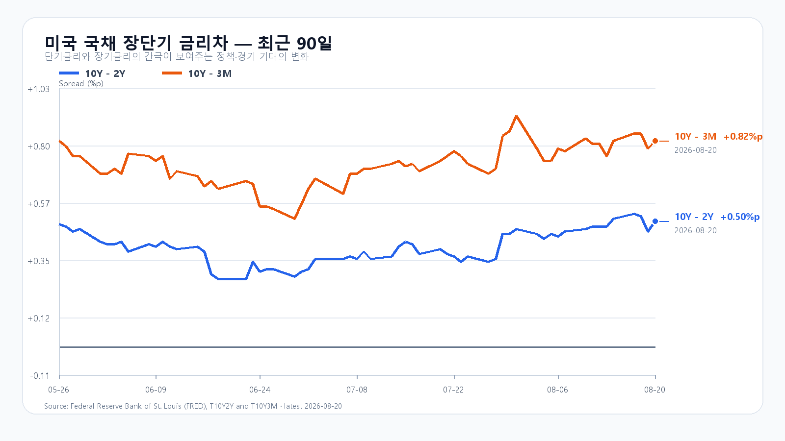
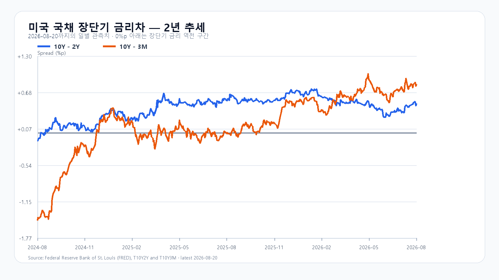

# 2026년 8월 21일 KOSPI·KODEX 레버리지 장전 리서치

- 조사 시작: 08:02 KST
- 데이터 최종 확인: `2026년 8월 21일 08:23:22 KST`
- 발행: `2026년 8월 21일 08:25 KST`
- 시장 상태: 한국 정규장 개장 전

## 핵심 판단

밤사이 미국 10년물은 4.69%, 30년물은 5.23%로 다시 올랐고 Brent는 93달러대로 뛰었다. S&P500은 0.87%, Nasdaq은 1.00% 하락했다. 다만 반도체는 SOXX +0.52%, SMH +0.31%, Micron +3.97%로 시장보다 강했다. 유가·금리 부담과 메모리 상대강도가 맞서는 구도다.

전일 KOSPI는 SK하이닉스 자사주 공시와 외국인 매수 전환으로 5.89% 반등했다. SKHY +4.43%와 EWY +2.14%는 이 움직임을 후행 반영한 부분이 있어 오늘 충격으로 전부 더하지 않는다. 08:23 KST NXT도 삼성전자 +0.18%, SK하이닉스 +0.41%로 전일 종가 부근이다. 대응 점수는 **공격 25 · 관망 50 · 방어 25**다.

## 직전 한국장과 전망 평가

| 항목 | 8월 20일 확정값 | 오늘 확인선 |
|---|---:|---:|
| KOSPI | 6,852.58 · 고가 6,904.55 · 저가 6,600.09 | 6,700 방어 · 6,904.55 돌파 |
| KODEX 레버리지 | 108,710원 · +12.37% | 105,000원 방어 · 110,895원 돌파 |
| 외국인 현물 | +1조7,068억원 | 순매수 유지 여부 |
| 프로그램 전체 | +9,044억원 | 비차익 매수 유지 여부 |

8월 20일 공개 전망은 강세 종가 구간과 전체 장중 경로 안에 들었다. 외국인 현물은 09:30 -844억원에서 10:00 +518억원, 14:00 +1조2,096억원으로 돌아섰다. 미국 반도체 약세를 국내 종가에 직접 가산한 후보 예측은 실제 오차가 기준값 유지보다 컸다. 독립 표본이 10개 미만이므로 이 결과는 오류 분류에만 쓴다.

## 밤사이 시장을 지배한 이슈

Brent는 2.4% 오른 93.78달러를 기록했다. 이란을 둘러싼 긴장이 공급 차질과 인플레이션 우려를 다시 키웠고, 미국 10년물은 전일 4.65%에서 4.69%로 반등했다. 재무부의 장기물 바이백 확대가 만든 금리 안정 효과가 하루 만에 약해졌다.

미국 신규 실업수당 청구는 20만6천 건으로 전주 수정치보다 6천 건 줄었다. 필라델피아 연은 제조업 지수도 41.4에서 47.4로 올라 예상 25를 크게 웃돌았다. 경기 둔화 우려를 낮추는 자료였지만 장기금리에는 상승 압력으로 작용했다. Walmart는 둔화한 미국 동일점포 매출과 보수적인 다음 분기 이익 전망이 부각돼 9.2% 하락했다.

## 미국 AI·반도체와 메모리

- QQQ -0.72%, TQQQ -2.19%.
- SOXX +0.52%, SMH +0.31%.
- Nvidia -0.33%, AMD +0.65%, Micron +3.97%, Broadcom +0.43%.
- 08:09 KST 시간외: Nvidia +0.14%, AMD -0.19%, Micron -0.34%, Broadcom +0.27%.

반도체 ETF와 Micron이 미국 대형지수 하락 속에서도 올랐다. 메모리 펀더멘털도 같은 방향이다. TrendForce의 8월 20일 18:10 GMT+8 공개치에서 DDR5 16Gb 현물 평균은 53.767달러(+0.94%), DDR4 16Gb는 90.585달러(+0.54%), DDR4 8Gb는 43.138달러(+0.15%)였다. 메모리 업황은 견조하지만 전일 국내 메모리주의 두 자릿수 반등 뒤 주가 수급은 별도로 확인해야 한다.

## 금리·유가·환율

- 미국 3개월물 3.87% / 2년물 4.19% / 10년물 4.69% / 30년물 5.23%.
- 10Y-2Y +0.50%p / 10Y-3M +0.82%p.
- `Brent 93.78달러(+2.4%) · WTI 86.30달러(08:09 KST)`.
- `달러/원 1,394.80원(+0.35%, 07:54 KST)`.
- `Nasdaq100 선물 29,315.0(+0.05%) · S&P500 선물 7,668.5(+0.08%, 08:13 KST)`.
- `삼성전자 NXT 271,500원(+0.18%) · SK하이닉스 NXT 1,698,000원(+0.41%, 08:23 KST)`.

원화 약세 폭은 크지 않지만 유가와 장기금리의 동반 상승은 전일 급반등 뒤 차익 실현을 부를 수 있다. 반대로 반도체 상대강도와 DRAM 상승은 6,700선 아래에서 메모리주 매수세가 다시 붙을 수 있는 근거다.

## 오늘의 시나리오

### 기본 · 45%: 6,700~6,950

전일 급반등 뒤 6,800선 안팎에서 숨을 고른다. 미국 대형지수 약세와 유가·금리 부담이 상단을 누르지만 Micron과 DRAM 가격이 메모리주의 하단을 지지한다.

### 강세 · 25%: 6,950~7,200

외국인 현물과 비차익 프로그램이 순매수를 이어가고 삼성전자·SK하이닉스가 전일 고점 부근을 지킨다. KOSPI가 6,904.55를 넘긴 뒤 6,950 위에 안착해야 한다.

### 약세 · 30%: 6,400~6,700

유가·장기금리 상승과 전일 급등 차익 실현이 겹친다. 외국인 현물이 순매도로 돌아서고 6,700을 회복하지 못하면 전일 저가 6,600.09를 다시 시험할 수 있다.

전체 장중 경로는 6,350~7,250으로 본다.

## KODEX 레버리지 기준선

- 2차 지지: 100,130원
- 1차 지지: 105,000원
- 반등 기준: 108,710원
- 저항: 110,895원

105,000원은 전일 상승분의 일부를 지키는 첫 선이다. 108,710원 위에서 110,895원을 넘으면 지수 반등이 다시 확장될 수 있다. 100,130원 아래에서는 전일 반등 구조가 약해진다.

## 오늘 일정

| 한국시간 | 이벤트 | 확인 경로 |
|---|---|---|
| 8월 21일 23:00 | 미국 7월 주별 고용·실업 | BLS 지역별 고용 흐름 |

한국장 중 예정된 미국 핵심 지표는 없다. 장중에는 KOSPI 6,700, 외국인 현물, 비차익 프로그램, 삼성전자·SK하이닉스의 전일 종가 유지가 직접적인 확인값이다.

## 출처

- 국내 지수·수급·NXT: Naver Finance / KRX 연계 시세
- 미국 시장: AP / Yahoo Finance 시세 원문
- 미국 고용: U.S. Department of Labor
- 미국 제조업: Federal Reserve Bank of Philadelphia
- 미국 국채: U.S. Treasury / FRED
- 메모리 가격: TrendForce
- 경제 일정: U.S. Bureau of Labor Statistics

> 이 보고서는 공개 자료를 바탕으로 한 시황 분석이며 특정 상품의 매수·매도를 권유하지 않는다. 빠르게 변하는 NXT·환율·미국 선물은 `2026년 8월 21일 08:23:22 KST`에 마지막으로 확인했으며 정규장에서는 달라질 수 있다.
