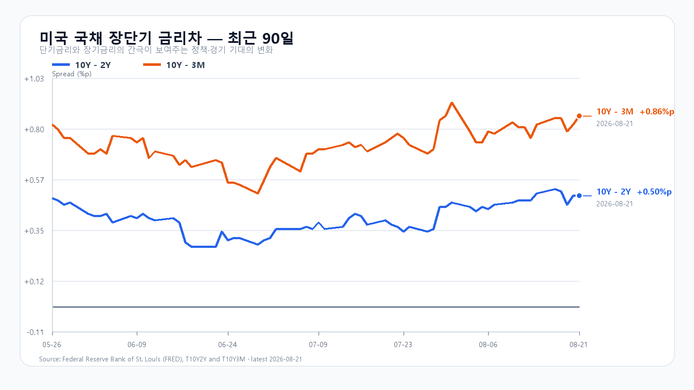
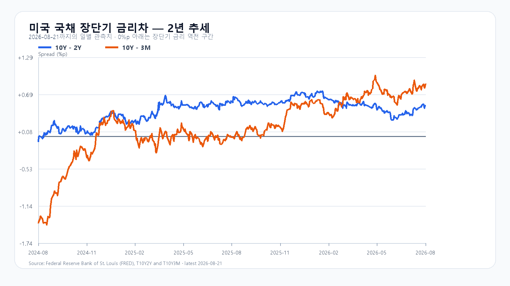

# 2026년 8월 24일 KOSPI·KODEX 레버리지 장전 리서치

- 조사 시작: 08:03 KST
- 데이터 최종 확인: `2026년 8월 24일 08:21:13 KST`
- 발행: `2026년 8월 24일 08:22 KST`
- 시장 상태: 한국 정규장 개장 전

## 핵심 판단

미국 대형지수는 올랐지만 반도체는 뒤처졌다. QQQ는 0.29% 상승했으나 SOXX -0.45%, SMH -0.41%, Nvidia -0.96%, Micron -0.89%였다. 미국 10년물은 4.74%, 30년물은 5.27%로 높아졌고 Brent도 주말 전자거래에서 93달러대로 올라왔다.

메모리 가격은 반대 방향이다. DDR5 16Gb 현물 평균은 0.62%, DDR4 16Gb는 0.54% 올랐다. 여기에 메모리 비용 상승으로 일부 Nvidia AI 서버 가격이 내년 초부터 15% 넘게 오를 수 있다는 보도가 나왔다. 메모리 공급자의 가격 결정력에는 유리하지만 서버 구매자의 비용 부담과 AI 투자 수요에는 위험 요인이다. `08:19` KST NXT에서 삼성전자는 `274,000원(-2.66%)`, SK하이닉스는 `1,781,000원(+2.95%)`로 방향도 갈렸다. 대응 점수는 **공격 20 · 관망 50 · 방어 30**이다.

## 직전 한국장과 전망 평가

| 항목 | 8월 21일 확정값 | 오늘 확인선 |
|---|---:|---:|
| KOSPI | 6,912.95 · 고가 6,954.12 · 저가 6,742.44 | 6,800 방어 · 7,050 돌파 |
| KODEX 레버리지 | 112,240원 · +3.25% | 108,710원 방어 · 113,955원 돌파 |
| 외국인 현물 | +244억원 | 장 초반 순매수 확대 여부 |
| 프로그램 전체 | -6,556억원 | 비차익 매도 축소 여부 |

8월 21일 공개 전망은 기본 종가 구간과 전체 장중 경로 안에 들었다. 외국인 현물은 09:30 -940억원에서 10:00 +1,063억원으로 돌아섰지만 15:30 +244억원까지 줄었다. 프로그램 전체는 15:30 -6,556억원이었다. 미국 반도체 신호를 가산한 후보 예측은 실제 종가 오차가 직전 종가 유지보다 작았지만, 독립 표본이 10개 미만이라 임시 판정만 남긴다.

## 밤사이 시장을 지배한 이슈

미국 증시는 S&P500과 Nasdaq이 각각 0.4%, Dow가 1.0% 올랐다. 그러나 SOXX와 SMH는 하락했고 Nvidia와 Micron도 약세였다. 지수의 위험 선호를 국내 반도체 강세로 곧장 옮기기 어려운 마감이다.

외신은 메모리 비용 상승 탓에 Vera Rubin·Grace Blackwell 기반 Nvidia AI 서버의 다수 구성이 내년 초부터 15% 넘게 비싸질 수 있다고 보도했다. Nvidia가 가격 인상을 공식 발표한 것은 아니다. Broadcom이 600억달러가 넘는 AI 칩 금융조달을 협의 중이라는 보도도 나왔지만 확정 자금조달이나 공급계약은 아니다.

## 미국 AI·반도체와 메모리

- QQQ +0.29%, TQQQ +0.87%.
- SOXX -0.45%, SMH -0.41%.
- Nvidia -0.96%, AMD +0.78%, Micron -0.89%, Broadcom +1.20%.
- 8월 21일 Nvidia 시간외: 정규장 종가 대비 약 +0.31%.

TrendForce의 8월 21일 18:10 GMT+8 공개치에서 DDR5 16Gb 현물 평균은 54.10달러(+0.62%), DDR4 16Gb는 91.073달러(+0.54%), DDR4 8Gb는 43.288달러(+0.35%)였다. Micron은 8월 20일 미국 내 Research Labs에 10년간 100억달러를 투입한다고 발표했다. 이는 장기 연구 투자이며 오늘 공급량을 늘리는 증설 발표는 아니다.

## 금리·유가·환율

- 미국 3개월물 3.88% / 2년물 4.24% / 10년물 4.74% / 30년물 5.27%.
- 10Y-2Y +0.50%p / 10Y-3M +0.86%p.
- `Brent 93.46달러(08:21 KST)`.
- `달러/원 1,387.00원(-0.56%, 07:56 KST)`.
- `Nasdaq100 선물 29,391.25(+0.01%) · S&P500 선물 7,689.75(-0.02%, 08:21 KST)`.
- `삼성전자 NXT 274,000원(-2.66%) · SK하이닉스 NXT 1,781,000원(+2.95%)`.

원화 강세와 DRAM 현물 상승은 메모리주 하단을 받친다. 반면 4.74%의 미국 10년물과 93달러대 Brent는 성장주 할인율과 한국의 교역조건에 부담이다. 삼성전자와 SK하이닉스의 장전 가격이 엇갈린 만큼 지수 방향보다 종목별 외국인 수급을 먼저 확인한다.

## 오늘의 시나리오

### 기본 · 45%: 6,800~7,050

원화 강세와 메모리 현물 상승이 하단을 받치지만 미국 반도체 약세, 유가와 장기금리가 상단을 누른다. 삼성전자 NXT 낙폭이 줄고 외국인 현물이 순매수면 6,900선 안팎에서 지난 상승을 소화한다.

### 강세 · 25%: 7,050~7,300

외국인 현물과 비차익 프로그램이 함께 순매수로 돌아서고 삼성전자·SK하이닉스가 모두 오른다. KOSPI가 6,954.12를 넘긴 뒤 7,050 위에 안착해야 한다.

### 약세 · 30%: 6,500~6,800

삼성전자 장전 약세가 SK하이닉스로 번지고 외국인·프로그램 매도가 확대된다. 6,800을 회복하지 못하면 전일 저가 6,742.44와 6,500선을 차례로 시험할 수 있다.

전체 장중 경로는 6,400~7,350으로 본다.

## KODEX 레버리지 기준선

- 2차 지지: 105,115원
- 1차 지지: 108,710원
- 반등 기준: 112,240원
- 저항: 113,955원

108,710원은 직전 거래일의 출발점이자 첫 방어선이다. 112,240원 위에서 113,955원을 넘으면 지수 강세가 한 단계 확장될 수 있다. 105,115원 아래에서는 지난 상승분을 반납하는 흐름으로 본다.

## 이번 주 일정

| 한국시간 | 이벤트 | 확인 경로 |
|---|---|---|
| 8월 25일 23:00 | 미국 7월 신규주택판매 | U.S. Census Bureau |
| 8월 26일 06:00 | 한국 8월 기업경기조사 | 한국은행 |
| 8월 26일 21:30 | 미국 내구재·2분기 GDP 2차·7월 PCE | U.S. Census Bureau / BEA |
| 8월 27일 06:00 | Nvidia 2분기 실적 | Nvidia IR |

오늘 한국장 중 예정된 미국 핵심 지표는 없다. 장중에는 KOSPI 6,800, 외국인 현물, 비차익 프로그램, 삼성전자 NXT 낙폭 축소가 직접적인 확인값이다.

## 출처

- 국내 지수·수급·NXT: Naver Finance / KRX 연계 시세
- 미국 시장·유가: AP / Yahoo Finance 시세 원문
- AI 서버 가격 보도: Reuters·Bloomberg 인용 보도
- 기업 발표: Micron IR / Nvidia IR
- 미국 국채: U.S. Treasury / FRED
- 메모리 가격: TrendForce
- 경제 일정: U.S. Census Bureau / BEA / 한국은행

> 이 보고서는 공개 자료를 바탕으로 한 시황 분석이며 특정 상품의 매수·매도를 권유하지 않는다. 빠르게 변하는 NXT·환율·미국 선물은 `2026년 8월 24일 08:21:13 KST`에 마지막으로 확인했으며 정규장에서는 달라질 수 있다.
