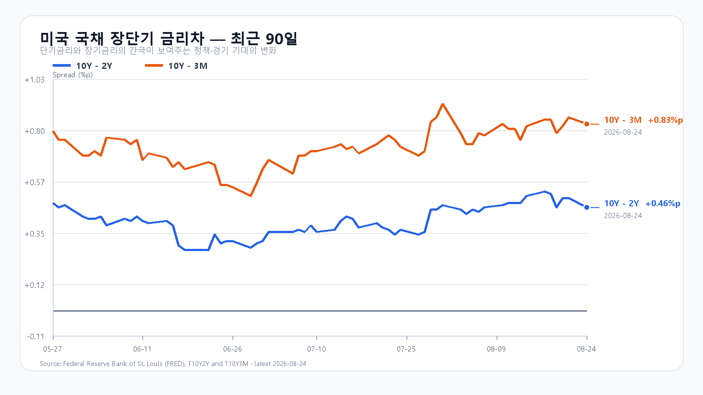
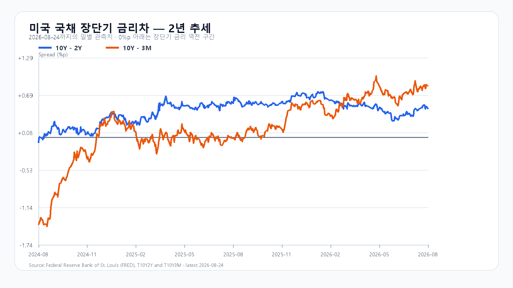

# 2026년 8월 25일 KOSPI·KODEX 레버리지 장전 리서치

- 조사 시작: 08:02 KST
- 데이터 최종 확인: `2026년 8월 25일 08:20:22 KST`
- 발행: `2026년 8월 25일 08:23 KST`
- 시장 상태: 한국 정규장 개장 전

## 핵심 판단

전날 국내 급락을 오늘 충격으로 다시 전부 더하지 않는다. 삼성전자 주주환원에 대한 실망과 중국 메모리 경쟁 우려, AI 밸류에이션 부담은 8월 24일 KOSPI -3.12%, 삼성전자 -8.70%, SK하이닉스 -3.41%에 상당 부분 먼저 반영됐다.

밤사이 미국 반도체가 뒤이어 밀린 점은 새 신호다. QQQ -1.00%, SOXX -2.67%, SMH -2.43%, Nvidia -2.91%, Micron -5.83%였다. `08:20` KST NXT에서도 삼성전자 `251,000원(-2.33%)`, SK하이닉스 `1,625,000원(-2.75%)`으로 두 종목 모두 약했다. 다만 미국 10년물 4.70%, Brent 90.54달러, 달러/원 `1,384.00원(-0.22%)`, 오른 DRAM 현물은 하단을 받칠 수 있다. 대응 점수는 **공격 15 · 관망 45 · 방어 40**이다.

## 직전 한국장과 전망 평가

| 항목 | 8월 24일 확정값 | 오늘 확인선 |
|---|---:|---:|
| KOSPI | 6,696.96 · 고가 6,884.57 · 저가 6,656.07 | 6,450 방어 · 6,750 회복 |
| KODEX 레버리지 | 104,015원 · -7.33% | 100,130원 방어 · 104,015원 회복 |
| 외국인 현물 | -3조7,553억원 | 장 초반 매도 축소 여부 |
| 프로그램 전체 | -2조9,644억원 | 비차익 매도 축소 여부 |

8월 24일 공개 전망은 약세 종가 구간과 전체 장중 경로 안에 들었다. 외국인 현물은 09:30 -8,770억원에서 15:30 -3조7,553억원으로, 프로그램 전체는 -7,385억원에서 -2조9,644억원으로 매도가 확대됐다. 미국 반도체 신호를 가산한 후보 예측은 실제 종가 오차가 직전 종가 유지보다 작았지만 독립 표본이 10개 미만이어서 임시 판정만 유지한다.

## 밤사이 시장을 지배한 이슈

미국 증시는 S&P500 -0.3%, Dow +0.3%, Nasdaq -0.8%로 엇갈렸다. 반도체는 더 약했다. QQQ -1.00%, TQQQ -3.04%, SOXX -2.67%, SMH -2.43%였고 Nvidia -2.91%, AMD -3.49%, Micron -5.83%, Broadcom -2.63%였다. 정규장 뒤 시간외 등락은 -0.50%~+0.13%에 그쳐 급락을 뒤집지 못했다.

Apple이 중국 CXMT의 DRAM과 YMTC의 NAND를 조달하도록 미국 정부가 허용할 수 있다는 보도가 Micron 약세를 키웠다. 공식 정책 발표는 없었다. 한 분석은 CXMT가 저물량 Mac 한 기종에만 승인됐고 YMTC는 아직 자격을 얻지 못했다고 지적했다. 가능성과 확정 사실을 구분해야 한다.

## 이미 반영된 재료와 새 재료

삼성전자는 2026년 주주환원 예상액을 90조~110조원으로 제시하고 15조원 규모 보통주 취득을 공시했다. 취득 목적은 임직원 주식보상이다. 발표 뒤 삼성전자가 8.70% 내린 만큼 이 실망을 오늘 다시 새 악재로 더하지 않는다.

새로 확인할 것은 미국 반도체 매도가 국내 개장 뒤 2차 매도로 이어지는지다. 외국인 현물과 비차익 프로그램 매도가 전날보다 줄면 같은 악재의 중복 반영이 멈췄다고 볼 수 있다. 반대로 두 수급이 다시 커지고 삼성전자·SK하이닉스가 NXT 낙폭을 회복하지 못하면 연속 하락 위험이 남는다.

## 메모리 펀더멘털과 주가 수급

TrendForce의 8월 24일 공개치에서 DDR5 16Gb 현물 평균은 54.167달러(+0.12%), DDR4 16Gb는 91.317달러(+0.27%), DDR4 8Gb는 43.288달러(보합)였다. 주가는 중국 메모리 경쟁 우려와 AI 밸류에이션 부담으로 내렸지만 현물 가격이 동시에 무너진 것은 아니다.

미국 3개월물 3.87%, 2년물 4.24%, 10년물 4.70%, 30년물 5.23%였다. 10Y-2Y는 +0.46%p, 10Y-3M은 +0.83%p다. Brent는 90.54달러로 2.3% 내렸다. 낮아진 장기금리와 유가는 반도체주의 할인율과 한국의 교역조건에 완충재다.

## 오늘의 시나리오

### 기본 · 45%: 6,450~6,750

전날 급락을 다시 전부 더하지 않지만 미국 반도체와 NXT 약세가 반등 폭을 제한한다. 외국인·비차익 매도가 줄고 KOSPI가 6,450을 지키면 6,696.96와 6,750을 차례로 시험한다.

### 강세 · 20%: 6,750~7,000

두 메모리 대형주가 전일 종가를 회복하고 외국인 현물과 비차익 프로그램이 함께 순매수로 돌아선다. KOSPI가 6,750 위에 안착해야 전일 고점 6,884.57과 7,000을 열 수 있다.

### 약세 · 35%: 6,100~6,450

NXT 낙폭이 정규장으로 이어지고 외국인·프로그램 매도가 다시 커진다. 6,450을 회복하지 못하면 6,400과 6,100을 차례로 시험할 수 있다.

전체 장중 경로는 6,000~7,050으로 본다.

## KODEX 레버리지 기준선

- 2차 지지: 96,740원
- 1차 지지: 100,130원
- 반등 기준: 104,015원
- 저항: 108,710원

100,130원은 전날 급락 뒤 첫 방어선이다. 104,015원을 회복하고 108,710원을 넘으면 낙폭 되돌림이 이어질 수 있다. 100,130원 아래에서는 96,740원까지 열어 둔다.

## 이번 주 일정

| 한국시간 | 이벤트 | 확인 경로 |
|---|---|---|
| 8월 25일 23:00 | 미국 7월 신규주택판매 | U.S. Census Bureau |
| 8월 26일 21:30 | 미국 내구재·2분기 GDP 2차·7월 PCE | U.S. Census Bureau / BEA |
| 8월 27일 05:20·06:00 | Nvidia 2분기 실적·컨퍼런스콜 | Nvidia IR |

오늘 한국장 중 예정된 미국 핵심 지표는 없다. 장중에는 KOSPI 6,450, 외국인 현물, 비차익 프로그램, 삼성전자·SK하이닉스의 NXT 낙폭 회복이 직접적인 확인값이다.

## 출처

- 국내 지수·수급·NXT: Naver Finance / KRX 연계 시세
- 미국 시장·유가: AP / Yahoo Finance 시세 원문
- 삼성전자 주주환원·자사주: Samsung Electronics IR
- 중국 메모리 조달 보도: Reuters 인용 보도·분석
- Nvidia 실적 일정: Nvidia IR
- 미국 국채: U.S. Treasury / FRED
- 메모리 가격: TrendForce
- 경제 일정: U.S. Census Bureau / BEA

> 이 보고서는 공개 자료를 바탕으로 한 시황 분석이며 특정 상품의 매수·매도를 권유하지 않는다. 빠르게 변하는 NXT·환율·미국 선물은 `2026년 8월 25일 08:20:22 KST`에 마지막으로 확인했으며 정규장에서는 달라질 수 있다.
