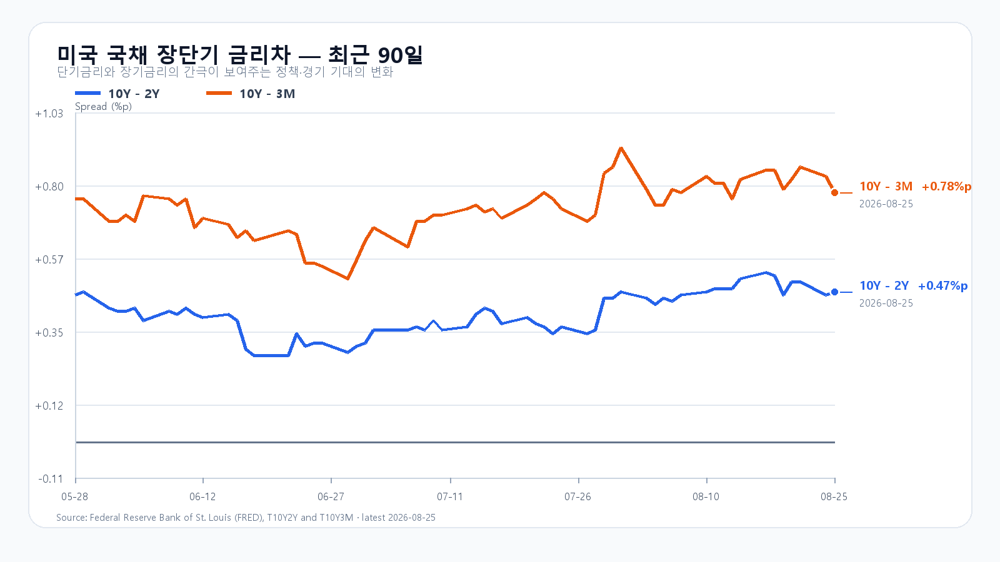
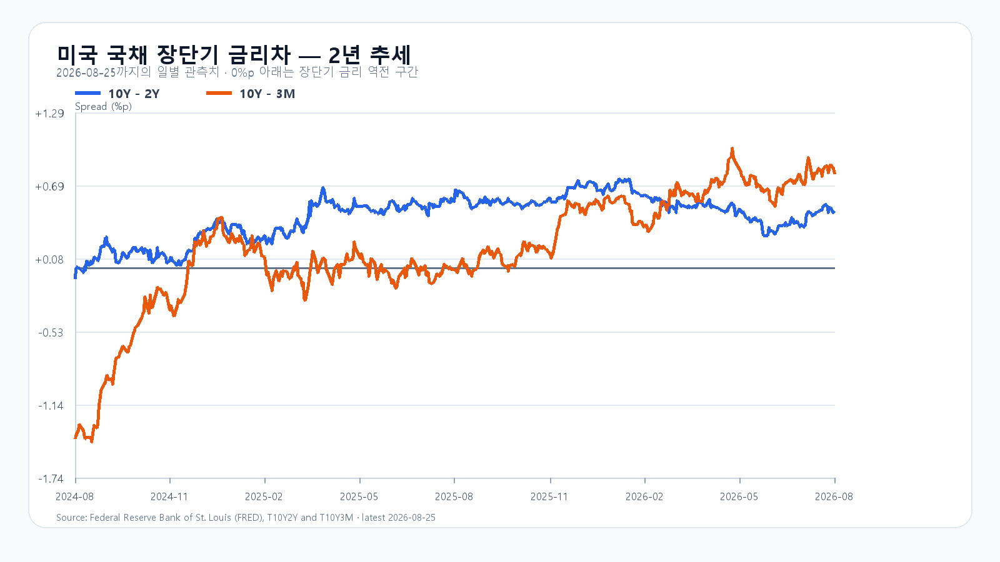

# 2026년 8월 26일 KOSPI·KODEX 레버리지 장전 리서치

- 조사 시작: 08:01 KST
- 데이터 최종 확인: `2026년 8월 26일 08:27:23 KST`
- 발행: `2026년 8월 26일 08:27:28 KST`
- 시장 상태: 한국 정규장 개장 전

## 핵심 판단

밤사이 미국 반도체가 반등하고 유가와 장기금리가 함께 내렸다. QQQ +0.62%, SOXX +1.56%, SMH +1.65%, Nvidia +2.19%, Micron +2.48%였다. Brent는 87.27달러로 3.6% 내렸고 미국 10년물은 4.64%로 낮아졌다. 장전 NXT에서도 삼성전자 `259,500`원(`+0.97%`), SK하이닉스 `1,698,000`원(`+1.19%`)으로 두 종목이 올랐다.

전날 KOSPI가 장중 6,408.82까지 밀렸다가 6,742.74로 돌아온 흐름과 EWY +3.75%는 오늘 새 상승분으로 다시 더하지 않는다. 오늘 밤 미국 GDP·PCE, 이어 Nvidia 실적이 예정돼 있어 이벤트 전 추격은 수급 확인 뒤로 미룬다. 대응 점수는 **공격 25 · 관망 55 · 방어 20**이다.

## 직전 한국장과 전망 평가

| 항목 | 8월 25일 확정값 | 오늘 확인선 |
|---|---:|---:|
| KOSPI | 6,742.74 · 고가 6,747.16 · 저가 6,408.82 | 6,600 방어 · 6,900 회복 |
| KODEX 레버리지 | 105,550원 · +1.48% | 101,000원 방어 · 105,550원 회복 |
| 외국인 현물 | -3조8,140억원 | 장 초반 매도 축소 여부 |
| 비차익 프로그램 | -2조7,337억원 | 외국인과 동반 개선 여부 |

8월 25일 공개 전망은 기본 종가 구간과 전체 장중 경로 안에 들었다. 다만 외국인 순매도만으로 약세 시나리오를 성립시킨 조건은 실제 종가와 어긋났다. 상승 종목 649개가 하락 종목 227개를 웃돌았고 KOSPI는 저점에서 333.92포인트를 회복했다. 오늘은 외국인 절대값보다 비차익 프로그램과 두 메모리 대형주의 가격 반응을 함께 본다.

## 밤사이 시장을 지배한 이슈

미국 기술주는 전날 급락을 일부 되돌렸다. QQQ +0.62%, TQQQ +1.83%, SOXX +1.56%, SMH +1.65%였고 Nvidia +2.19%, AMD +4.91%, Micron +2.48%였다. Broadcom은 0.56% 내렸다. 시간외 등락은 정규장 종가 대비 약 +0.04%~+0.53%로 반등 방향을 바꾸지 않았다.

반등의 바닥에는 유가와 금리 하락이 있었다. Brent는 87.27달러로 3.6% 내렸고 미국 10년물은 4.64%로 낮아졌다. 미국 7월 신규주택판매는 연율 60만7천호로 전월보다 10.5% 줄었고, 8월 소비자신뢰는 89.4로 7개월 최저였다. 약한 수요 지표가 금리를 눌렀지만, 성장 기대가 강해진 것은 아니다.

## 메모리 펀더멘털과 주가 수급

TrendForce의 8월 25일 공개치에서 DDR5 16Gb 현물 평균은 54.167달러로 보합, DDR4 16Gb는 90.561달러로 0.83% 하락, DDR4 8Gb는 43.377달러로 0.21% 상승했다. 메모리 현물이 일제히 오른 날이 아니다. 미국 반도체와 NXT가 반등해도 품목별 가격 분화를 지워서는 안 된다.

전날 삼성전자는 보합, SK하이닉스는 0.42% 올랐지만 외국인 현물은 3조8,140억원 순매도였다. 가격은 회복했고 시장 폭도 좋아졌지만 외국인·비차익 수급은 아직 회복되지 않았다. 오늘은 삼성전자·SK하이닉스가 NXT 상승폭을 지키면서 외국인과 비차익 매도가 동시에 줄어드는지가 핵심이다.

미국 3개월물 3.86%, 2년물 4.17%, 10년물 4.64%, 30년물 5.17%였다. 10Y-2Y는 +0.47%p, 10Y-3M은 +0.78%p다. 장기금리 하락은 반도체 밸류에이션에 우호적이지만 오늘 밤 물가 지표에 따라 되돌릴 수 있다.

## 오늘의 시나리오

### 기본 · 50%: 6,600~6,900

미국 반도체와 NXT 상승, 낮아진 유가·금리가 하단을 받친다. 외국인·비차익 매도가 전날보다 줄고 KOSPI가 6,600을 지키면 6,742.74와 6,900을 차례로 시험한다.

### 강세 · 25%: 6,900~7,150

삼성전자·SK하이닉스가 NXT 상승폭을 지키고 외국인 현물과 비차익 프로그램이 함께 개선된다. KOSPI가 6,900 위에 안착해야 7,000과 7,150을 열 수 있다.

### 약세 · 25%: 6,300~6,600

NXT 상승이 정규장에서 소멸하고 외국인·프로그램 매도가 다시 커진다. 6,600을 회복하지 못하면 전날 저점 6,408.82와 6,300을 차례로 시험할 수 있다.

전체 장중 경로는 6,250~7,200으로 본다.

## KODEX 레버리지 기준선

- 2차 지지: 94,430원
- 1차 지지: 101,000원
- 반등 기준: 105,550원
- 저항: 110,000원

105,550원은 전날 종가이자 고가다. 이 가격을 지키면 110,000원 시험이 가능하다. 101,000원 아래에서는 전날 저점 94,430원까지 다시 열어 둔다.

## 이번 주 일정

| 한국시간 | 이벤트 | 확인 경로 |
|---|---|---|
| 8월 26일 21:30 | 미국 2분기 GDP 2차·7월 개인소득·지출·PCE·내구재 주문 | BEA / U.S. Census Bureau |
| 8월 27일 05:20·06:00 | Nvidia 2분기 실적·컨퍼런스콜 | Nvidia IR |

미국 2분기 GDP 속보치는 연율 +1.5%였고, 7월 근원 PCE 전년 대비 시장 예상은 약 3.3%다. 두 발표 모두 오늘 한국장 마감 뒤 나온다. 장중에는 KOSPI 6,600, 외국인 현물, 비차익 프로그램, 삼성전자·SK하이닉스의 NXT 상승폭 유지가 직접적인 확인값이다.

## 출처

- 국내 지수·수급·NXT: Naver Finance / KRX 연계 시세
- 미국 시장·유가: AP / Reuters / Yahoo Finance 시세 원문
- Nvidia 실적 일정: Nvidia IR
- 미국 국채: U.S. Treasury / FRED
- 메모리 가격: TrendForce
- 미국 신규주택판매: U.S. Census Bureau
- 미국 소비자신뢰: The Conference Board
- 미국 GDP·PCE 일정: BEA

> 이 보고서는 공개 자료를 바탕으로 한 시황 분석이며 특정 상품의 매수·매도를 권유하지 않는다. 빠르게 변하는 NXT·환율·미국 선물은 `2026년 8월 26일 08:27:23 KST`에 마지막으로 확인했으며 정규장에서는 달라질 수 있다.
