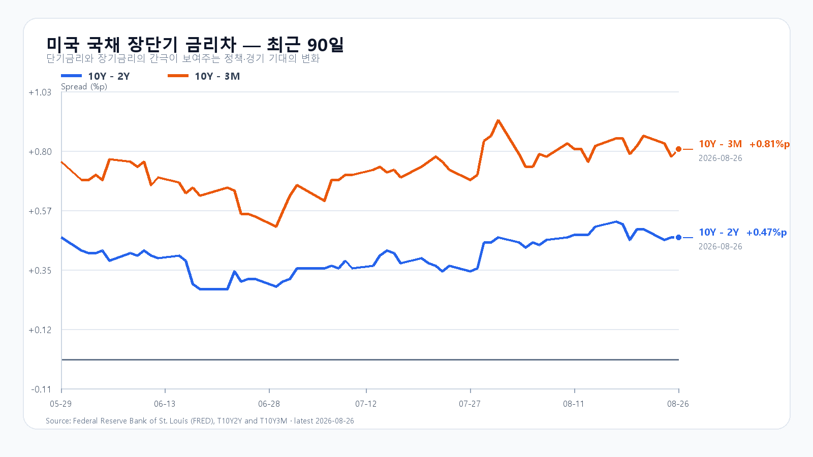
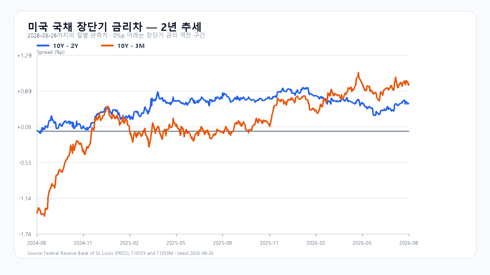

# 2026년 8월 27일 KOSPI·KODEX 레버리지 장전 리서치 · 개장 직후 업데이트

- 조사 시작: 08:01 KST
- 데이터 최종 확인: `2026년 8월 27일 09:11:50 KST`
- 발행: `2026년 8월 27일 09:11:58 KST`
- 시장 상태: 한국 정규장 개장 직후

## 핵심 판단

엔비디아는 2분기 매출 962억2,100만달러, 데이터센터 매출 890억달러를 기록했다. 각각 전년보다 106%, 117% 늘었다. 3분기 매출 가이던스 1,080억달러±2%도 시장 예상을 웃돌았다. 실적 발표 뒤 시간외에서 엔비디아 `+4.71%`, SOXX `+2.50%`, SMH `+2.59%`로 반응했다.

09시 11분 KOSPI는 6,972.00(+2.41%)였고, NXT에서 삼성전자 `269,500`원(`+3.06%`), SK하이닉스 `1,762,000`원(`+4.38%`)이었다. S&P500 선물은 +0.60%, Nasdaq100 선물은 +1.17%였다. AI 수요가 다시 확인된 점은 분명하지만 미국 10년물 4.66%, 달러/원 `1,384.50`원은 추격 매수의 제동 장치다. 대응 점수는 **공격 35 · 관망 50 · 방어 15**다.

## 직전 한국장과 전망 평가

| 항목 | 8월 26일 확정값 | 오늘 확인선 |
|---|---:|---:|
| KOSPI | 6,808.21 · 고가 6,887.18 · 저가 6,704.10 | 6,800 방어 · 7,100 안착 |
| KODEX 레버리지 | 107,495원 · +1.84% | 105,000원 방어 · 110,190원 회복 |
| 외국인 현물 | 15:19 +141억원 | 장 초반 순매수 유지 여부 |
| 비차익 프로그램 | 15:30 -1조1,921억원 | 순매수 전환 여부 |

8월 26일 공개 전망은 기본 종가 구간과 전체 장중 경로 안에 들었다. 15시 20분 KOSPI는 6,813.21로 6,900에 못 미쳤고 외국인만 잠시 순매수로 돌아섰다. 전날 상승을 Nvidia 실적 효과로 소급하지 않는다. 오늘의 새 재료는 실적 발표 뒤 나온 매출·가이던스와 시간외 반도체 반응이다.

## Nvidia가 확인한 수요와 남은 제약

Nvidia 2분기 매출은 962억2,100만달러, 데이터센터 매출은 890억달러였다. 3분기 매출 가이던스는 1,080억달러±2%로 시장 예상 1,048억6,000만달러를 웃돌았다. 중국 데이터센터 컴퓨트 매출을 가이던스에 넣지 않고도 제시한 수치다.

다만 영업비용은 전년보다 55% 늘었고 공급망 제약도 남았다. 수요가 강하다는 사실과 모든 반도체 주가가 제한 없이 오를 것이라는 판단은 같지 않다. 오늘은 삼성전자와 SK하이닉스가 NXT 상승폭을 정규장에서 지키는지, 외국인 현물과 비차익 프로그램이 동시에 순매수로 돌아서는지를 함께 본다.

미국 정규장에서는 QQQ +0.09%, TQQQ +0.28%, SOXX +0.26%, SMH -0.01%였다. Nvidia -1.59%, AMD +0.37%, Micron +0.58%, Broadcom -0.32%로 실적 발표 전에는 방향이 엇갈렸다. 발표 뒤 시간외 반응만 오늘의 새 신호로 분리한다.

## 메모리 펀더멘털과 금리

TrendForce의 8월 26일 공개치에서 DDR5 16Gb 현물 평균은 54.167달러로 보합이었다. DDR4 16Gb는 0.27% 오른 90.805달러, DDR4 8Gb는 0.60% 오른 43.637달러였다. HBM 수요 전망은 강하지만 범용 DDR5 현물이 당장 더 오른 것은 아니다.

미국 2분기 GDP 2차 추정은 연율 1.5%로 유지됐다. 민간 국내 최종수요는 4.2%로 상향됐고 PCE 물가와 근원 PCE도 각각 5.3%, 3.6%로 상향됐다. 미국 3개월물 3.85%, 2년물 4.19%, 10년물 4.66%, 30년물 5.18%였다. 10Y-2Y는 +0.47%p, 10Y-3M은 +0.81%p다. 성장과 물가가 함께 강해진 만큼 금리 하락을 전제한 추격은 위험하다.

## 오늘의 시나리오

### 기본 · 50%: 6,800~7,100

Nvidia 실적과 NXT 상승이 하단을 받친다. 미국 10년물과 환율, 전날 고점 6,887.18의 매물이 상승 속도를 늦춘다. 6,800을 지키면 6,900과 7,100을 차례로 시험한다.

### 강세 · 30%: 7,100~7,350

삼성전자·SK하이닉스가 09시 11분 상승폭을 지키고 외국인 현물과 비차익 프로그램이 함께 순매수로 전환한다. KOSPI가 7,100 위에 안착해야 7,250과 7,350을 열 수 있다.

### 약세 · 20%: 6,500~6,800

NXT 상승이 정규장에서 빠르게 사라지고 달러/원 상승과 프로그램 매도가 겹친다. 6,800을 회복하지 못하면 전날 저점 6,704.10과 6,500을 차례로 본다.

전체 장중 경로는 6,450~7,400으로 본다.

## KODEX 레버리지 기준선

- 2차 지지: 103,700원
- 1차 지지: 105,000원
- 반등 기준: 110,190원
- 저항: 114,000원

110,190원은 전날 장중 고점이다. 이 가격을 회복하고 유지하면 114,000원 시험이 가능하다. 105,000원 아래에서는 전날 저점 103,700원까지 다시 열어 둔다.

## 다음 일정

| 한국시간 | 이벤트 | 확인 경로 |
|---|---|---|
| 8월 27일 21:30 | 미국 주간 신규 실업수당 청구 | U.S. Department of Labor |
| 8월 28일 05:45 | Marvell 2분기 실적 컨퍼런스콜 | Marvell IR |
| 8월 28일 23:00 | Kevin Warsh 연준 의장 잭슨홀 기조연설 | Federal Reserve |

장중에는 KOSPI 6,800, KODEX 레버리지 110,190원, 외국인·비차익의 동반 순매수, 삼성전자·SK하이닉스의 NXT 상승폭 유지가 직접적인 확인값이다.

## 출처

- 국내 지수·수급·NXT: Naver Finance / KRX 연계 시세
- 미국 주가·선물·유가: Yahoo Finance 시세 원문
- Nvidia 실적: Nvidia IR
- 미국 GDP·PCE: U.S. Bureau of Economic Analysis
- 미국 국채: U.S. Treasury / FRED
- 메모리 가격: TrendForce
- 일정: U.S. Department of Labor / Marvell IR / Federal Reserve

> 이 보고서는 공개 자료를 바탕으로 한 시황 분석이며 특정 상품의 매수·매도를 권유하지 않는다. 조사와 원고 준비가 개장 뒤까지 이어져 NXT·환율·미국 선물은 `2026년 8월 27일 09:11:50 KST`에 마지막으로 확인했다. 이는 장전 호가가 아니라 정규장 개장 직후 값이며 이후 달라질 수 있다.
