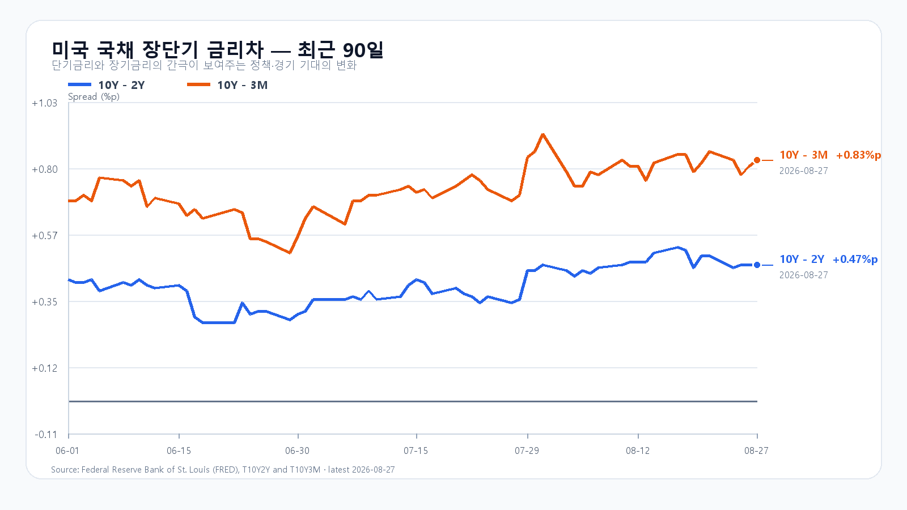
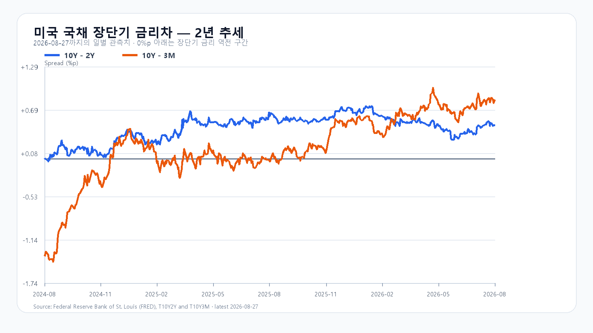

# 2026년 8월 28일 KOSPI·KODEX 레버리지 장전 리서치

- 조사 시작: 08:01 KST
- 데이터 최종 확인: `2026-08-28 08:18:56 KST`
- 발행: `2026-08-28 08:19:10 KST`
- 시장 상태: 한국 정규장 개장 전

## 핵심 판단

엔비디아는 실적 발표 다음 날 정규장에서 8.74% 올랐고 Nasdaq100도 1.43% 상승했다. 그러나 Micron은 0.32% 하락했고, Marvell은 데이터센터 매출이 46% 늘었는데도 시간외에서 약 7% 밀렸다. AI 수요 확인이 반도체 전 종목의 동반 상승으로 이어진 장은 아니었다.

장전 NXT에서 삼성전자 `263,500`원(`-0.94%`), SK하이닉스 `1,705,000`원(`-1.45%`)이다. 달러/원은 `1,381.21`원이고 미국 지수선물은 `Nasdaq 100 -0.23%, S&P 500 -0.15%로 소폭 약세`다. 대응 점수는 **공격 20 · 관망 50 · 방어 30**이다.

## 직전 한국장과 전망 평가

| 항목 | 8월 27일 확정값 | 오늘 확인선 |
|---|---:|---:|
| KOSPI | 6,912.37 · 고가 6,996.12 · 저가 6,841.88 | 6,800 방어 · 7,050 안착 |
| KODEX 레버리지 | 110,390원 · +2.69% | 107,500원 방어 · 111,000원 반등 기준 |
| 외국인 현물 | +895억원 | 장 초반 순매수 유지 여부 |
| 비차익 프로그램 | +902억원 | 순매수 유지 여부 |

8월 27일 공개 전망은 기본 종가 구간 안에 들었다. 15시 20분 KOSPI 6,894.05, 외국인 현물 +911억원, 프로그램 전체 +2,446억원이었다. 수급은 순매수였지만 7,100에는 닿지 못했고 하락 종목 수가 상승 종목 수를 웃돌았다.

## AI 강세와 메모리주의 분화

미국 정규장에서 QQQ +1.37%, TQQQ +4.02%, SOXX +1.95%, SMH +3.10%였다. Nvidia +8.74%, Broadcom +4.49%와 달리 AMD -0.89%, Micron -0.32%로 갈렸다. 시간외에서는 Nvidia·두 반도체 ETF가 약 0.7%씩 되돌렸고 Micron은 약 1.4% 더 내렸다.

Marvell 2분기 매출은 27억3,900만달러로 전년보다 37% 늘었고 데이터센터 매출은 46% 증가했다. 3분기 매출 가이던스 31억5,000만달러±5%와 상향된 장기 전망도 제시했다. 그러나 시간외 주가는 약 7% 하락했다. 강한 실적만으로 높아진 기대를 계속 밀어 올리기 어려운 구간임을 보여 준다.

## 메모리 가격과 금리

TrendForce의 8월 27일 공개치에서 DDR5 16Gb 현물 평균은 53.933달러로 0.12% 내렸다. DDR4 16Gb는 91.049달러로 보합, DDR4 8Gb는 44.011달러로 0.86% 올랐다. AI 메모리 수요는 강하지만 범용 메모리 가격은 제품별로 엇갈린다.

미국 국채는 3개월물 3.84%, 2년물 4.20%, 10년물 4.67%, 30년물 5.19%였다. 10Y-2Y는 +0.47%p, 10Y-3M은 +0.83%p다. 신규 실업수당 청구가 20만3,000건으로 예상보다 적었던 만큼 오늘 밤 잭슨홀 연설 전까지 장기금리 부담은 남는다.

## 오늘의 시나리오

### 기본 · 45%: 6,800~7,050

미국 AI 강세가 하단을 받치지만 국내 NXT와 Micron의 약세, 잭슨홀 대기가 7,000 위 추격을 늦춘다. 6,800을 지키면 전날 고점 6,996과 7,050을 시험한다.

### 강세 · 25%: 7,050~7,250

삼성전자·SK하이닉스가 장전 낙폭을 되돌리고 외국인 현물과 비차익 프로그램이 함께 순매수를 이어 간다. 7,050 위에 안착해야 7,150과 7,250을 열 수 있다.

### 약세 · 30%: 6,550~6,800

NXT 약세가 정규장에서 확대되고 외국인·프로그램 매도가 겹친다. 6,800을 회복하지 못하면 전날 저점 6,841.88 아래에서 6,700과 6,550을 차례로 본다.

전체 장중 경로는 6,500~7,300으로 본다.

## KODEX 레버리지 기준선

- 2차 지지: 105,000원
- 1차 지지: 107,500원
- 반등 기준: 111,000원
- 저항: 114,000원

111,000원을 회복하고 유지하면 전날 고점 113,900원과 114,000원을 다시 시험할 수 있다. 107,500원 아래에서는 105,000원까지 열어 둔다.

## 다음 일정

| 한국시간 | 이벤트 | 확인 경로 |
|---|---|---|
| 8월 28일 23:00 | Kevin Warsh 연준 의장 잭슨홀 기조연설 | Federal Reserve |
| 9월 1일 23:00 | 미국 ISM 제조업지수 | ISM |
| 9월 4일 21:30 | 미국 8월 고용보고서 | U.S. Bureau of Labor Statistics |

장중에는 KOSPI 6,800, KODEX 레버리지 111,000원, 외국인·비차익의 동반 순매수, 삼성전자·SK하이닉스의 장전 낙폭 회복을 직접 확인한다.

## 출처

- 국내 지수·수급·NXT: Naver Finance / KRX 연계 시세
- 미국 주가·선물·유가: Yahoo Finance 시세 원문
- Nvidia 실적: Nvidia IR
- Marvell 실적: Marvell IR
- 미국 PCE: U.S. Bureau of Economic Analysis
- 미국 국채: U.S. Treasury / FRED
- 메모리 가격: TrendForce
- 일정: Federal Reserve / ISM / U.S. Bureau of Labor Statistics

> 이 보고서는 공개 자료를 바탕으로 한 시황 분석이며 특정 상품의 매수·매도를 권유하지 않는다. 국내 NXT·환율·미국 선물은 `2026-08-28 08:18:56 KST`에 마지막으로 확인했으며 이후 달라질 수 있다.
