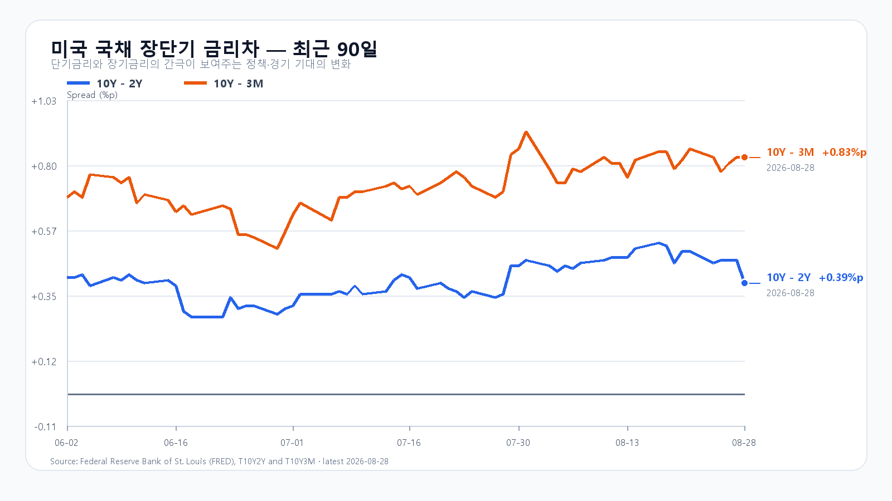
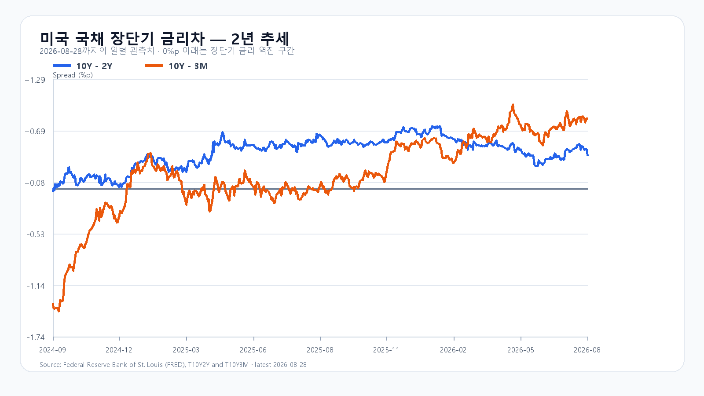

# 2026년 8월 31일 KOSPI·KODEX 레버리지 장전 리서치

- 조사 시작: 07:48 KST
- 데이터 최종 확인: `2026-08-31 08:21:49 KST`
- 발행: `2026-08-31 08:22:10 KST`
- 시장 상태: 한국 정규장 개장 전

## 핵심 판단

호르무즈 해협의 군사 충돌이 다시 불거지며 브렌트유가 90달러를 넘나들고 있다. Kevin Warsh 연준 의장은 물가 안정을 우선하겠다는 태도를 분명히 했고, 미국 10년물 금리는 4.73%로 올랐다. 금요일 미국 반도체도 SOXX -3.20%, Nvidia -4.58%로 밀렸다.

장전 NXT에서 삼성전자 `250,500`원(`-2.53%`), SK하이닉스 `1,612,000`원(`-2.48%`)이다. 달러/원은 `1,381.00`원이고 미국 지수선물은 `Nasdaq100 -0.20%, S&P500 -0.19%`다. 대응 점수는 **공격 10 · 관망 45 · 방어 45**다.

## 직전 한국장과 전망 평가

| 항목 | 8월 28일 확정값 | 오늘 확인선 |
|---|---:|---:|
| KOSPI | 6,788.88 · 고가 6,901.78 · 저가 6,780.13 | 6,600 방어 · 6,800 회복 |
| KODEX 레버리지 | 106,370원 · -3.64% | 102,000원 방어 · 106,000원 회복 |
| 외국인 현물 | -1조6,573억원 | 매도 규모 축소 여부 |
| 비차익 프로그램 | -1조5,398억원 | 순매도 완화 여부 |

8월 28일 공개 전망의 종가 결과는 약세 구간이었다. 15시 19분 KOSPI는 6,804.86으로 기본 구간에 있었지만 동시호가에서 6,788.88까지 밀렸다. 미국 반도체 강세를 국내 종가에 크게 반영했던 실험 가설은 이번 결과로 폐기했다.

## 유가·금리·반도체가 같은 방향을 가리킨다

미국은 일요일 이란 라라크섬의 로켓 발사대를 타격했다. 이란이 보복을 예고하면서 전 세계 원유의 약 20%가 지나는 호르무즈 해협의 운송 차질 위험이 다시 커졌다. 월요일 아시아 개장 초 브렌트유는 배럴당 89달러 후반으로 약 2% 올랐고 장중 90달러를 넘었다.

Warsh 의장은 잭슨홀 연설에서 12개월 PCE 물가 3.7%, 6개월 환산 4.1%를 짚으며 물가 안정에 초점을 맞췄다. 미국 국채는 3개월물 3.90%, 2년물 4.34%, 10년물 4.73%, 30년물 5.22%였다. 유가 상승이 물가 기대를 자극하면 반도체처럼 먼 미래 이익을 먼저 반영한 업종의 할인율 부담이 커진다.

금요일 미국 정규장에서 QQQ -0.65%, TQQQ -1.98%, SOXX -3.20%, SMH -3.47%였다. Nvidia -4.58%, AMD -2.33%, Broadcom -0.74%, Marvell -10.28%로 밀렸다. 8월 28일 한국장 급락은 이미 기준 가격에 반영돼 있지만, 그 뒤 나온 미국 반도체 매도와 주말 유가 충격은 오늘 새로 소화해야 한다.

## 메모리 가격은 하단을 받치지만 단독 반전 신호는 아니다

TrendForce의 8월 28일 공개치에서 DDR5 16Gb 현물 평균은 53.933달러로 보합이었다. DDR4 16Gb는 91.293달러로 0.27%, DDR4 8Gb는 44.189달러로 0.40% 올랐다. 레거시 DDR 가격 상승은 국내 메모리 기업의 실적 하단을 받치지만 구매자 관망이 이어져 오늘 유가·금리 충격을 뒤집을 정도의 신호는 아니다.

## 오늘의 시나리오

### 기본 · 45%: 6,600~6,800

8월 28일 급락 뒤 6,600 부근 매수와 6,800 회복 시도가 맞선다. 브렌트유 90달러, 높은 장기금리, 미국 반도체 약세가 6,800 위 추격을 막는다.

### 약세 · 40%: 6,300~6,600

브렌트유가 90달러 위에 머물고 외국인·프로그램 매도가 이어진다. 삼성전자·SK하이닉스의 장전 약세가 정규장으로 번지면 6,500과 6,300을 차례로 본다.

### 강세 · 15%: 6,800~7,000

브렌트유가 89달러 아래로 밀리고 두 메모리 대형주가 장전 낙폭을 되돌린다. 외국인 현물이 순매수로 전환돼야 6,800 위에 안착할 수 있다.

전체 장중 경로는 6,250~7,050으로 본다.

## KODEX 레버리지 기준선

- 2차 지지: 99,000원
- 1차 지지: 102,000원
- 반등 기준: 106,000원
- 저항: 110,500원

106,000원을 회복하고 유지하면 전일 종가 106,370원과 고점 110,490원을 다시 시험할 수 있다. 102,000원 아래에서는 99,000원까지 열어 둔다.

## 다음 일정

| 한국시간 | 이벤트 | 확인 경로 |
|---|---|---|
| 9월 1일 23:00 | 미국 ISM 제조업지수 | ISM |
| 9월 1일 23:00 | 미국 7월 JOLTS | U.S. Bureau of Labor Statistics |
| 9월 4일 21:30 | 미국 8월 고용보고서 | U.S. Bureau of Labor Statistics |

장중에는 브렌트유 90달러, KOSPI 6,600, KODEX 레버리지 106,000원, 외국인·비차익 매도 규모, 삼성전자·SK하이닉스의 장전 낙폭 회복을 직접 확인한다.

## 출처

- 국내 지수·수급·NXT: Naver Finance / KRX 연계 시세
- 미국 주가·선물·유가: Yahoo Finance 시세 원문
- 호르무즈 충돌: Associated Press
- Warsh 연설: Federal Reserve
- 미국 국채: U.S. Treasury / FRED
- 메모리 가격: TrendForce
- 일정: ISM / U.S. Bureau of Labor Statistics

> 이 보고서는 공개 자료를 바탕으로 한 시황 분석이며 특정 상품의 매수·매도를 권유하지 않는다. 국내 NXT·환율·미국 선물은 `2026-08-31 08:21:49 KST`에 마지막으로 확인했으며 이후 달라질 수 있다.
