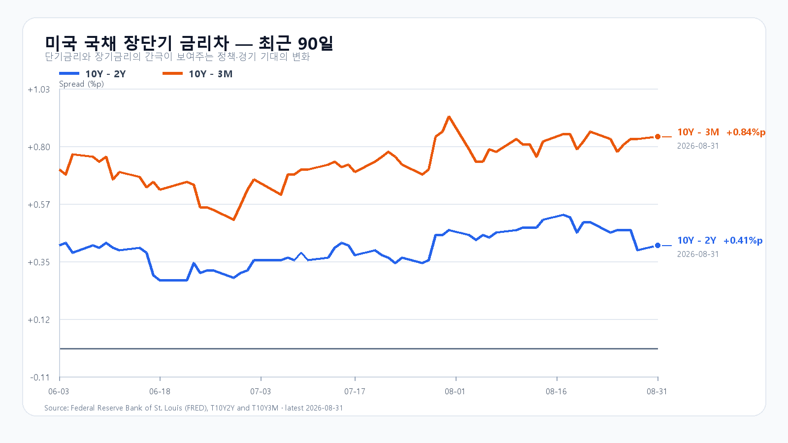
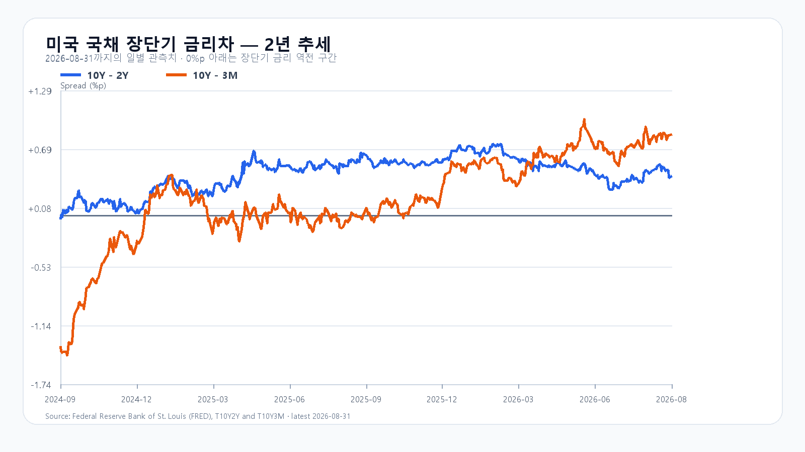

# 2026년 9월 1일 KOSPI·KODEX 레버리지 장전 리서치

- 조사 시작: 08:03 KST
- 데이터 최종 확인: `2026-09-01 08:18:55 KST`
- 발행: `2026-09-01 08:23:30 KST`
- 시장 상태: 한국 정규장 개장 전

## 핵심 판단

월요일 브렌트유는 배럴당 90.49달러로 2.71% 올랐고 미국 10년물 금리는 4.75%까지 상승했다. 다만 미국 증시에서 SOXX는 0.48%, Nvidia는 1.49%, Micron은 2.77% 올라 반도체가 시장보다 강했다. 달러/원도 1,369원대로 내려왔다.

전날 KOSPI가 장중 6,547.76에서 6,820.02까지 반등하며 유가 충격의 상당 부분을 이미 소화했다는 점이 중요하다. 같은 악재를 오늘 전망에 다시 전부 더하지 않는다. 반면 외국인 현물과 프로그램은 종가까지 순매도였기 때문에 반등을 수급 회복으로 단정할 수도 없다. 대응 점수는 **공격 25 · 관망 55 · 방어 20**이다.

## 직전 한국장과 전망 평가

| 항목 | 8월 31일 확정값 | 오늘 확인선 |
|---|---:|---:|
| KOSPI | 6,820.02 · 고가 6,820.10 · 저가 6,547.76 | 6,750 방어 · 6,950 돌파 |
| KODEX 레버리지 | 107,080원 · 고가 107,080원 · 저가 98,015원 | 103,000원 방어 · 107,100원 반등 기준 |
| 외국인 현물 | -1조172억원 | 매도 축소·순매수 전환 여부 |
| 프로그램 전체 | -3,630억원 | 순매수 전환 여부 |

8월 31일 공개 전망의 종가 결과는 강세 구간이었다. 다만 15시 20분 KOSPI는 6,799.17이었고 외국인 현물 -1조233억원, 프로그램 전체 -6,916억원으로 강세 트리거는 충족하지 못했다. 종가 상승과 외국인 수급 개선이 따로 움직인 날이었다.

## 유가와 금리는 상단을 누르고, 반도체와 원화는 하단을 받친다

월요일 미국 증시는 유가 상승 부담으로 S&P500이 0.3%, Nasdaq이 0.1% 내렸다. 브렌트유는 90.49달러, WTI는 85.76달러로 마감했다. 미국 국채는 3개월물 3.91%, 2년물 4.34%, 10년물 4.75%, 30년물 5.24%였다. 유가와 장기금리가 함께 높으면 수입 비용과 성장주의 할인율이 동시에 오른다.

반도체는 달랐다. SOXX +0.48%, SMH +0.64%, Nvidia +1.49%, AMD +1.10%, Micron +2.77%, Broadcom +0.42%였다. 원화도 장전 1,369원대로 강해졌다. 유가와 금리가 지수 상단을 막더라도 메모리 대형주의 하단에는 전날보다 나은 조합이다.

장전 NXT에서 삼성전자와 SK하이닉스는 각각 0.4% 안팎 약세다. 미국 반도체 강세가 국내 시초가에 그대로 복제되지 않는다는 뜻이다. KOSPI 6,820~6,900 구간을 넘으려면 두 종목의 낙폭 회복과 외국인·프로그램 수급 개선이 함께 확인돼야 한다.

## 메모리 가격은 DDR4가 강하고 DDR5는 숨을 고른다

TrendForce의 8월 31일 공개치에서 DDR5 16Gb 현물 평균은 53.917달러로 0.03% 내렸다. DDR4 16Gb는 91.780달러로 0.53%, DDR4 8Gb는 44.367달러로 0.40% 올랐다. 레거시 DDR 강세는 실적 하단을 받치지만 DDR5까지 같은 방향으로 움직이는 전면적인 가격 상승은 아니다.

## 오늘의 시나리오

### 기본 · 55%: 6,750~6,950

미국 반도체 반등과 원화 강세가 하단을 받치지만 브렌트유 90달러와 미국 10년물 4.75%가 6,950 위 추격을 막는다. 6,820~6,900에서 매물 소화가 이어질 가능성이 가장 높다.

### 강세 · 25%: 6,950~7,150

09:00 발표되는 한국 수출이 기대를 웃돌고 삼성전자·SK하이닉스가 NXT 약세를 되돌린다. 외국인 현물과 프로그램이 함께 순매수로 전환해야 6,950 위에 안착할 수 있다.

### 약세 · 20%: 6,500~6,750

NXT 약세가 정규장으로 번지고 외국인·프로그램 매도가 다시 커진다. 전날 반등의 절반가량을 되돌리면 6,750과 6,500을 차례로 본다.

전체 장중 경로는 6,450~7,200으로 본다.

## KODEX 레버리지 기준선

- 2차 지지: 98,000원
- 1차 지지: 103,000원
- 반등 기준: 107,100원
- 저항: 112,000원

107,100원을 회복하고 유지하면 전일 고점과 종가를 넘어 112,000원을 시험할 수 있다. 103,000원 아래에서는 전날 저점 부근인 98,000원까지 열어 둔다.

## 오늘과 이번 주 일정

| 한국시간 | 이벤트 | 확인 경로 |
|---|---|---|
| 9월 1일 09:00 | 한국 8월 수출입 | 산업통상자원부·관세청 |
| 9월 1일 23:00 | 미국 ISM 제조업지수 | ISM |
| 9월 1일 23:00 | 미국 7월 JOLTS | U.S. Bureau of Labor Statistics |
| 9월 4일 21:30 | 미국 8월 고용보고서 | U.S. Bureau of Labor Statistics |

장중에는 KOSPI 6,750과 6,950, KODEX 레버리지 107,100원, 외국인 현물·프로그램 수급, 삼성전자·SK하이닉스의 NXT 낙폭 회복을 확인한다. 09:00 수출 발표가 나오면 예상치가 아니라 실제 수치로 판단을 다시 세워야 한다.

## 출처

- 국내 지수·수급·NXT: Naver Finance / KRX 연계 시세
- 미국 주가·선물: Yahoo Finance 시세 원문 / Associated Press
- 국제유가: Reuters
- 미국 국채: U.S. Treasury / FRED
- 메모리 가격: TrendForce
- 한국 수출 전망: Reuters 설문
- 일정: ISM / U.S. Bureau of Labor Statistics

> 이 보고서는 공개 자료를 바탕으로 한 시황 분석이며 특정 상품의 매수·매도를 권유하지 않는다. 국내 NXT·환율·미국 선물은 `2026-09-01 08:18:55 KST`에 마지막으로 확인했으며 이후 달라질 수 있다.
