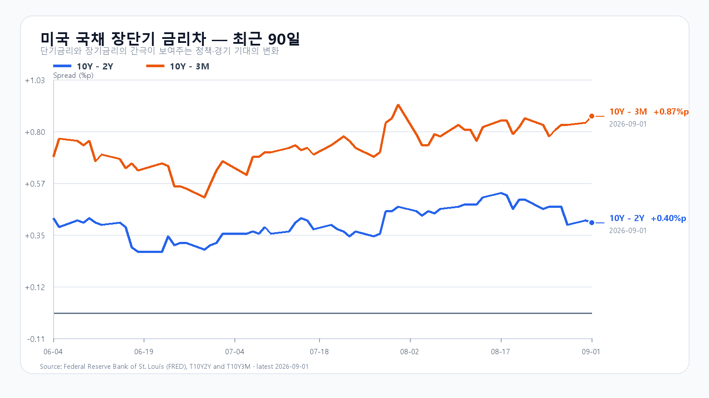
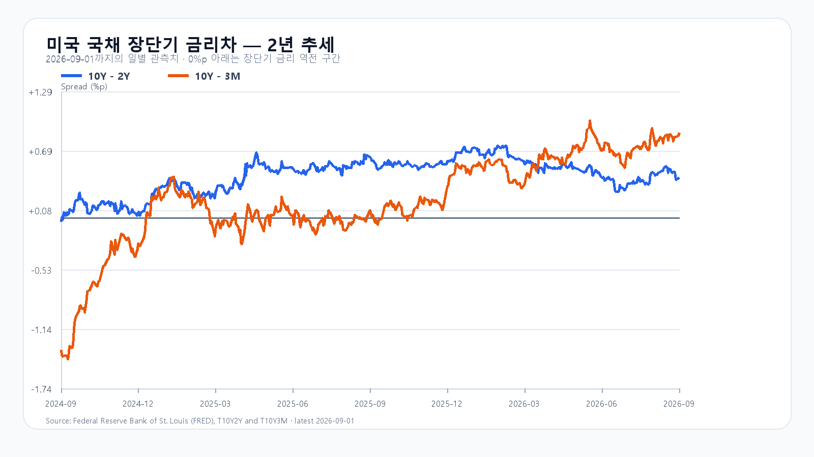

# 유가 95달러와 반도체 급락, KOSPI 6,700 방어가 먼저다

- 조사 시작: 08:02 KST
- 데이터 최종 확인: `2026-09-02 08:13:00 KST`
- 시장 상태: 한국 정규장 개장 전

## 핵심 판단

브렌트유는 94.65달러로 4.6% 올랐고 미국 10년물 금리는 4.79%로 높아졌다. SOXX는 2.13% 내렸으며 장전 NXT에서 삼성전자와 SK하이닉스도 각각 3.07%, 3.48% 하락했다. 유가·금리·반도체·환율이 한꺼번에 KOSPI 하단을 누르는 조합이다.

반면 한국의 8월 반도체 수출은 466.5억달러로 월간 최고였고 DRAM 현물 가격도 올랐다. 다만 수출 발표는 전날 개장과 함께 공개돼 9월 1일 장에 이미 반영됐다. 오늘의 새 호재로 다시 세지 않는다. 대응 점수는 **공격 10 · 관망 45 · 방어 45**다.

## 직전 한국장과 전망 평가

| 항목 | 9월 1일 확정값 | 오늘 확인선 |
|---|---:|---:|
| KOSPI | 6,835.80 · 고가 6,857.35 · 저가 6,732.47 | 6,700 방어 · 6,900 회복 |
| KODEX 레버리지 | 107,725원 · 고가 108,675원 · 저가 104,090원 | 102,000원 방어 · 107,700원 회복 |
| 외국인 현물 | 15:20 -4,966억원 | 매도 축소·순매수 전환 |
| 프로그램 전체 | 15:20 -3,043억원 | 순매수 전환 |

9월 1일 공개 전망은 기본 시나리오에 들어왔다. KOSPI는 6,835.80에 마감했지만 외국인과 프로그램은 15시 20분까지 순매도였다. 기록적인 수출이 나와도 수급이 붙지 않으면 6,900 위로 이어지기 어렵다는 조건이 확인됐다.

## 오늘 새로 들어온 충격은 유가·금리·반도체다

미국 정규장에서 S&P500은 0.71%, Nasdaq은 1.03% 내렸다. SOXX -2.13%, QQQ -1.28%, TQQQ -3.85%, Nvidia -1.51%, AMD -2.34%, Micron -2.69%였다. EWY도 2.41% 하락했지만 여기에는 전날 한국장 움직임이 섞여 있어 오늘 충격으로 전부 더하지 않는다.

브렌트유는 94.65달러, WTI는 90.22달러로 뛰었다. 미국 2년물은 4.39%, 10년물은 4.79%, 30년물은 5.27%다. 원유 수입 비용과 성장주 할인율이 동시에 오르는 환경이다. 08시 13분 Nasdaq100 선물 -1.29%, S&P500 선물 -0.69%, 달러/원 1,375.50원(+0.44%)도 위험 회피 흐름을 확인한다.

## 반도체 수출과 DRAM 가격은 낙폭의 바닥을 만든다

한국 8월 수출은 982.5억달러로 68.7% 늘었고 반도체 수출은 466.5억달러로 209% 증가했다. TrendForce의 9월 1일 공개치에서 DDR5 16Gb는 54.083달러(+0.31%), DDR4 16Gb는 92.024달러(+0.27%), DDR4 8Gb는 44.544달러(+0.40%)였다.

펀더멘털은 나쁘지 않다. 그러나 장전 NXT의 삼성전자 253,000원(-3.07%)과 SK하이닉스 1,634,000원(-3.48%)은 밤사이 미국 반도체와 유가·금리 충격이 시초가에 반영될 가능성을 보여 준다. 수출과 DRAM 가격은 급락을 막는 바닥 재료이지, 장전 약세를 지우는 즉시 반등 신호는 아니다.

## 오늘의 시나리오

### 약세 · 45%: 6,500~6,700

NXT 3%대 약세가 정규장으로 이어지고 외국인·프로그램 매도가 커진다. 6,700을 회복하지 못하면 6,500까지 열어 둔다.

### 기본 · 40%: 6,700~6,900

장 초반 충격 뒤 반도체 수출과 DRAM 가격이 하단을 받친다. 6,700은 지키지만 6,900 위 추격 매수는 붙지 않는다.

### 강세 · 15%: 6,900~7,100

삼성전자와 SK하이닉스가 NXT 낙폭을 빠르게 되돌리고 외국인 현물·프로그램이 함께 순매수로 바뀐다. 6,900 안착이 확인돼야 한다.

전체 장중 경로는 6,400~7,150으로 본다.

## KODEX 레버리지 기준선

- 2차 지지: 98,000원
- 1차 지지: 102,000원
- 회복 기준: 107,700원
- 저항: 112,000원

102,000원 아래에서는 방어가 우선이다. 107,700원을 회복해도 외국인 현물과 프로그램이 함께 개선되지 않으면 추세 반전으로 보지 않는다.

## 오늘과 이번 주 일정

| 한국시간 | 이벤트 | 확인 경로 |
|---|---|---|
| 9월 2일 21:15 | 미국 8월 ADP 민간고용 | 고용 둔화 폭 |
| 9월 2일 23:00 | 미국 7월 공장주문 | 제조업 수요 |
| 9월 3일 03:00 | 연준 베이지북 | 경기·물가 판단 |
| 9월 3일 06:00 | Broadcom 실적 콘퍼런스콜 | AI 반도체 수요 |
| 9월 3일 21:30 | 미국 신규 실업수당·무역수지·생산성 | 노동·성장·비용 |
| 9월 3일 23:00 | 미국 ISM 서비스업지수 | 서비스 물가 |
| 9월 4일 21:30 | 미국 8월 고용보고서 | 연준 금리 경로 |

장중에는 KOSPI 6,700, KODEX 레버리지 102,000원, 삼성전자 250,000원, SK하이닉스 1,600,000원과 외국인·프로그램 수급을 함께 확인한다.

## 출처

- [Naver Finance KOSPI](https://m.stock.naver.com/domestic/index/KOSPI/total)
- [Naver Finance KODEX 레버리지](https://finance.naver.com/item/main.naver?code=122630)
- [Reuters 국제유가](https://www.reuters.com/business/energy/)
- [U.S. Treasury 국채금리](https://home.treasury.gov/resource-center/data-chart-center/interest-rates/TextView?type=daily_treasury_yield_curve)
- [TrendForce DRAM 현물](https://www.trendforce.com/price/dram/dram_spot)
- [산업통상자원부 수출입 동향](https://www.motie.go.kr/)
- [ISM 제조업 보고서](https://www.ismworld.org/supply-management-news-and-reports/reports/ism-report-on-business/pmi/august/)
- [BLS JOLTS](https://www.bls.gov/jlt/)
- [Broadcom IR](https://investors.broadcom.com/)

> 이 보고서는 공개 자료를 바탕으로 한 시황 분석이며 특정 상품의 매수·매도를 권유하지 않는다. NXT·원/달러·미국 선물은 `2026-09-02 08:13:00 KST`에 마지막으로 확인했으며 이후 달라질 수 있다.
