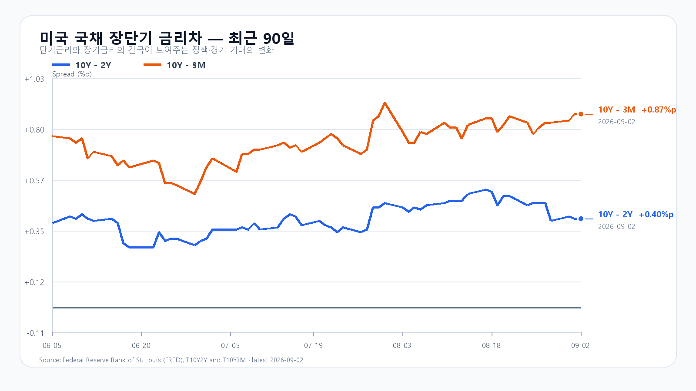
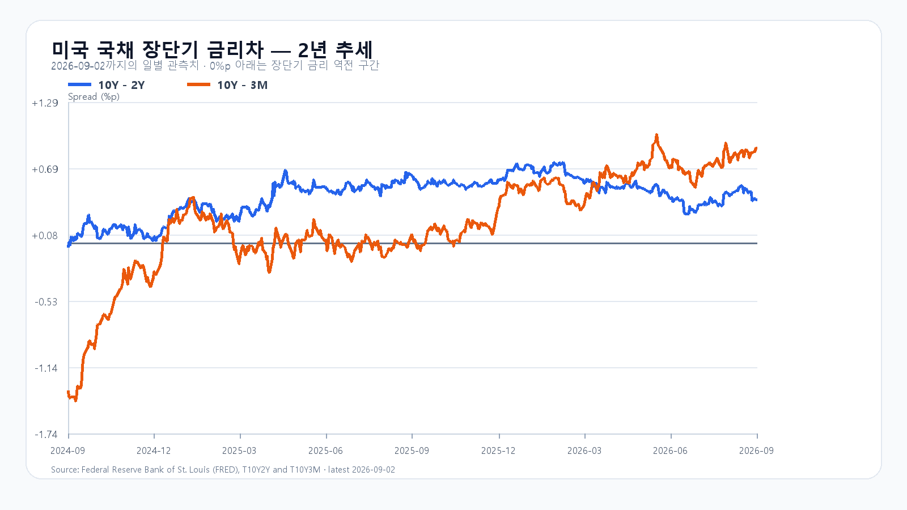

# 2026-09-03 KOSPI·KODEX 일일 리서치

작성·발행: 2026-09-03T08:19:07+09:00 / 데이터 최종 확인: 2026-09-03 08:19:05 KST / 한국 정규장 개장 전. 지연 호가와 고시환율이며 시장별 관측 시각은 아래와 같다.

## 핵심 결론

미국 반도체·원화·NXT 회복이 긍정적이지만 Broadcom 기대치 부담과 유가 95달러대·10년물 4.79%가 상단을 제한한다. 기본 6,500~6,700을 중심으로 6,700 위에는 외국인·프로그램 동반 매수가 필요하다는 조건부 판단이다. 공격 25 / 관망 50 / 방어 25. 이는 시나리오 확률과 별개다.

## 밤사이 시장을 지배한 이슈

1. Nvidia +3.21%, Micron +2.43%와 장전 원화·NXT 회복. AMD -0.55%, SOXX +0.23%여서 업종 전체의 강한 추세 전환으로 확대하지 않는다.
2. Broadcom Q3 AI 매출 167억달러(+221%), Q4 총매출 전망 348억달러. LSEG 350.3억달러보다 낮지만 FactSet 346.8억달러보다 높다. 성장과 기대의 차이를 분리한다. [기업 원문](https://investors.broadcom.com/news-releases/news-release-details/broadcom-inc-announces-third-quarter-fiscal-year-2026-financial)
3. Brent $95.63(+1.0%), WTI $91.01(+0.9%) 9월 2일 정산. EIA 상업용 재고 450만배럴 감소. [유가](https://pflpetroleum.com/reports/petroleum-daily-report-9-2-2026/) · [EIA](https://www.eia.gov/petroleum/supply/weekly/pdf/highlights.pdf)
4. DRAM 호가 상승과 거래 부진의 공존. AI 서버 수요를 소비자 DDR·NAND 전체 수요로 확대하지 않는다.

## 전일 대비 바뀐 변수와 유지 변수

한국장 -3.99%는 이미 실현된 충격이다. 유가·교전 전부를 오늘 다시 차감하지 않는다. 미국 정규장 반등과 Broadcom 새 실적, 추가 유가 상승, 원화·NXT 회복을 새 변수로 둔다. EWY +1.74%, SKHY +2.61%는 한국 종가 시차와 원화 변동이 섞이므로 별도 호재로 중복 가산하지 않는다. 활성 가설은 없으며 폐기·후보 가설로 점수를 바꾸지 않았다.

## 한국시장·KODEX 대시보드

9월 2일 KOSPI OHLC 6,625.47 / 6,694.57 / 6,558.30 / 6,562.72(-3.99%). KODEX 100,995 / 103,200 / 98,885 / 98,900원(-8.19%). 삼성 250,500(-4.02%), 하이닉스 1,613,000(-4.73%), KOSDAQ 803.98(-2.10%). [KOSPI](https://m.stock.naver.com/api/index/KOSPI/price?pageSize=10&page=1) · [KODEX](https://m.stock.naver.com/api/stock/122630/price?pageSize=10&page=1)

삼성전자 NXT 254,000원(1.40%), SK하이닉스 1,641,000원(1.74%) · 08:19:06 KST. 달러/원 1,360.30원(-1.11%, 07:32:31 KST 고시). Nasdaq100 선물 29,182.25 (08:08:57 KST), S&P500 선물 7,677.00 (08:09:04 KST). Broadcom 시간외 $361.82(-1.48%, 08:19:05 KST).

NXT [원천](https://stock.naver.com/api/polling/domestic/NXT/stock?itemCodes=005930,000660), [고시환율](https://api.stock.naver.com/marketindex/exchange/FX_USDKRW), [미국 선물](https://finance.yahoo.com/quote/NQ=F/). 선물은 검증된 가격·시각만 사용하고 세션 기준이 혼동되는 등락률은 계산하지 않았다.

## 메모리 반도체 수급

9월 2일 18:10 GMT+8(19:10 KST) DDR5 16Gb $54.250(+0.31%), DDR4 16Gb $92.649(+0.68%), DDR4 8Gb $44.571(+0.06%). [현물](https://www.trendforce.com/price/dram/dram_spot). 거래 부진 속 공급자 호가가 가격을 지지한다. HBM·서버 DRAM/eSSD와 소비자용 메모리는 분리한다. HPE Q3 $122억(+34%)·Cloud & AI $90억(+25.4%)는 AI 인프라 수요 보조 근거다. [HPE](https://www.hpe.com/us/en/newsroom/press-release/2026/09/hpe-reports-fiscal-2026-third-quarter-results.html)

RDIMM 공개값은 8월 24일 DDR5 32GB $1,665(+4.06%)로 시차가 있다. NAND 공개 현물은 8월 24일 SLC 2Gb $4.285(+0.05%), MLC 64Gb $37.587(+2.73%), 512Gb TLC $20.896(-1.47%); 당일값으로 쓰지 않는다. [NAND](https://www.trendforce.com/price/flash/flash_spot). 8월 계약가격 상세는 유료영역이며 신규 HBM 수율·고객별 공급량·빅테크별 CAPEX 변경치는 미확인이다.

## 미국 반도체·AI

9월 2일 16:00 ET(9월 3일 05:00 KST) 정규장, USD.

|자산|시가|고가|저가|종가|전일 대비|
|---|---:|---:|---:|---:|---:|
|QQQ|707.11|709.80|705.11|709.24|+0.23%|
|TQQQ|68.97|69.76|68.39|69.60|+0.65%|
|SOXX|498.18|504.02|493.31|501.44|+0.23%|
|SMH|545.00|553.19|541.75|550.48|+0.96%|
|NVDA|218.79|227.95|218.48|224.41|+3.21%|
|AMD|458.45|462.21|452.37|457.06|-0.55%|
|MU|930.83|958.00|927.16|956.08|+2.43%|
|AVGO|369.68|371.09|364.65|367.24|-0.66%|
|EWY|176.81|179.11|176.24|178.86|+1.74%|
|SKHY|159.76|165.47|158.67|164.98|+2.61%|

[Yahoo Finance](https://finance.yahoo.com/quote/QQQ/history/) 일봉 원문을 종목별 조회했다. Micron은 고가 근처, Nvidia는 고가 아래, Broadcom은 저가 쪽에서 끝났다. 시간외 Broadcom $361.82(-1.48%, 08:19:05 KST)는 정규장 등락과 합치지 않았다. 관련 원자료·시각·해시는 `research/evidence/2026-09-03-initial.json`에 보존한다.

## 달러/원·국내 수급·시장 구조

9월 2일 18:06 현물 누적 개인 +23,029억원·외국인 -19,173억원·기관 -20,361억원, 기타법인 +16,505억원. 18:05 프로그램 차익 -440·비차익 -14,700·전체 -15,140억원. 이는 장후 값이며 정규장 종가 묶음은 확보하지 못했다. [현물](https://finance.naver.com/sise/investorDealTrendTime.naver?bizdate=20260902&sosok=01&page=1) · [프로그램](https://finance.naver.com/sise/programDealTrendTime.naver?bizdate=20260902&sosok=01&page=1). 기관 세부는 취재 노트에 보존했다. KOSPI200 선물 외국인·시장폭·부문별 확산의 확정값은 미확인이다.

## 경제 캘린더

- 9월 3일 21:30 KST(08:30 ET): 신규 실업수당·생산성/단위노동비용 수정치·무역수지.
- 9월 3일 23:00 KST(10:00 ET): ISM 서비스업 PMI.
- 9월 4일 21:30 KST(08:30 ET): 8월 미국 고용보고서.

[뉴욕연은](https://www.newyorkfed.org/research/calendars/i-sep26.html) · [BLS](https://www.bls.gov/schedule/2026/). 예정 발표의 실제치를 채우지 않았다. ADP·공장주문·베이지북의 종합 실제치 대조는 미완료여서 확정 숫자를 넣지 않았다.

## 미 국채와 장단기 금리차

9월 2일 재무부 3M 3.92%·2Y 4.39%·10Y 4.79%, 전일 동일. 10Y-2Y +0.40%p·10Y-3M +0.87%p. 곡선 변화보다 높은 10년물 절대금리가 반도체 평가에 부담이다. [Treasury](https://home.treasury.gov/resource-center/data-chart-center/interest-rates/TextView?field_tdr_date_value=2026&type=daily_treasury_yield_curve) · [FRED](https://fred.stlouisfed.org/series/T10Y2Y)

## 오늘 KOSPI·KODEX 시나리오

|구간|확률|조건|무효화|
|---|---:|---|---|
|기본 6,500~6,700|50%|6,500 이상, 6,700 이하, 외국인·프로그램 매도 완화|6,500 이탈 또는 6,700 위 동반 순매수|
|강세 6,700~6,950|25%|6,700 초과, 외국인 현물 순매수, 프로그램 순매수|6,700 이하 복귀 또는 수급 매도 전환|
|약세 6,250~6,500|25%|6,500 미만, 외국인 현물 순매도, 프로그램 순매도|6,500 회복과 수급 개선|

경계 6,500·6,700은 기본 우선. 종가 전체 포괄 및 장중 경로 6,200~7,000 명목 신뢰수준은 90%. 확률은 판단값이며 성과 보장이 아니다. KODEX 93,000·97,000 지지 / 102,000 반등 / 106,000 저항. 15:20 AND 조건은 전망 계약으로 수치화한다. 기본의 수급 완화는 보조 관찰 조건이며 정량 트리거는 가격 구간을 사용한다.

## 장중 체크리스트

09:30·10:00·14:00 외국인 현물·프로그램 원문, 6,500 방어와 6,700 회복, 메모리 대형주의 NXT 대비 낙폭·고가 유지, USD/KRW 재상승과 유가 95달러대 지속을 확인한다.

## 직전 전망 정산과 출처

9월 2일 08:40 전망은 약세 종가, 예상 장중 경로 안이었다. 6,700 방어 가정은 실패했다. 15:20 지수 6,563.67, 15:19 외국인 -21,228억원으로 강세 조건은 불충족. 프로그램 마감 전 원문과 완결 수급 앵커는 결측으로 남겼다. 실제값·결과는 `research/evaluation/actuals/2026-09-02.json`, `outcomes/2026-09-02-0840-same-close.json` 참조. 이슈 순위·검증 한계·이미지 콘셉트는 `research/2026-09-03-notes.md`에 분리했다.
