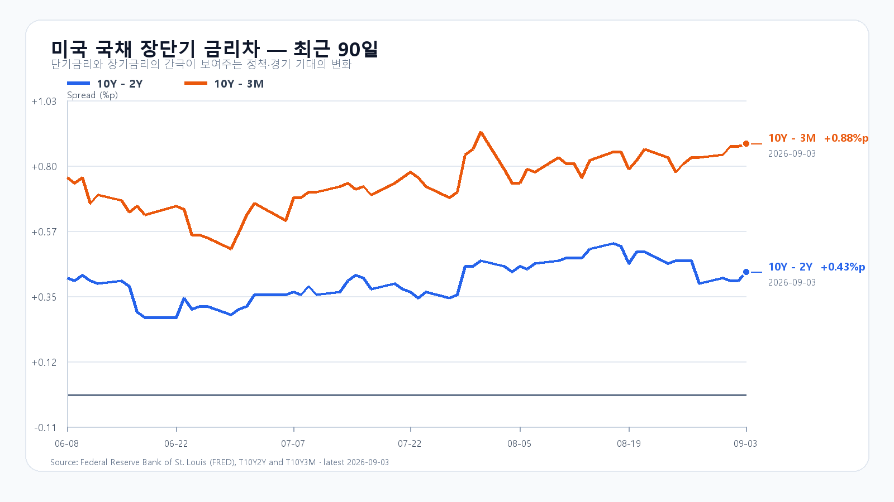
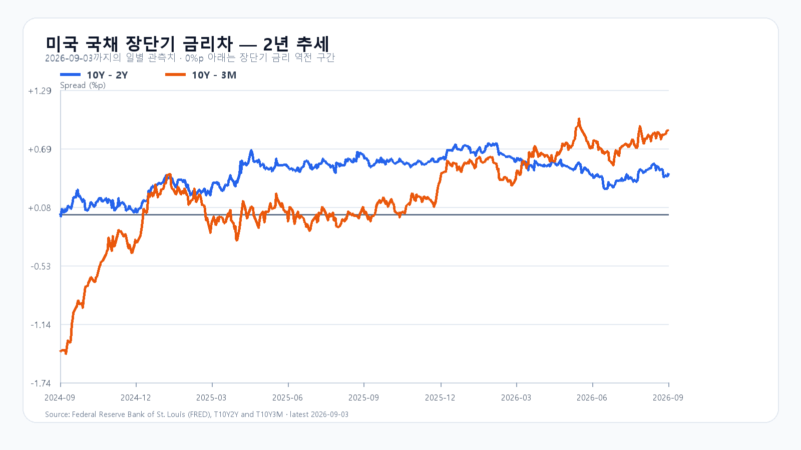

# 2026-09-04 KOSPI·KODEX 장전 리서치

작성 2026-09-04T08:18:19+09:00 / 최종 확인 2026-09-04 08:18:19 KST / 한국 정규장 개장 전. NXT·미국 선물·시간외는 각각 표시 시각이며 지연 가능.

## 핵심 결론
미국 기술주·NXT 회복과 국내 수급 부진이 맞선다. 기본6500~6750(50%), 강세6750~6950(25%), 약세6250~6500(25%), 경계는 기본. 장중6200~7000(90%). 공격25/관망55/방어20.

## 밤사이 시장 지배 이슈와 전일 대비 변화
Waller의 조건부 동결 지지, Nvidia 인수 합의, ISM 서비스 수요·물가가 신규 중심 사건. Broadcom 실적 발표 자체와 국내 9월3일 움직임은 이미 반영된 기준점이며 밤사이 실제 가격 반응만 새 정보로 반영. EWY +0.95%는 한국장·환율 후행분과 섞여 추가 독립 호재로 가산하지 않았다. 후보 점수와 제외 이유는 [취재 노트](../research/2026-09-04-notes.md).

## 장전 최종값
삼성전자 NXT 252,500원(+1.00%), SK하이닉스 1,609,000원(+0.81%) · 08:18:19 KST 조회. 달러/원 1,358.50원(-0.13%, 07:58:16 KST 고시). Nasdaq100 선물 29,508.00(08:08:16 KST), S&P500 선물 7,753.25(08:08:00 KST). 브렌트유 선물 $95.89(08:07:00 KST), WTI 선물 $91.80(08:07:41 KST).

## 분석 본문과 출처

### 미국 기술주 반등이 국내 매수로 이어질까

미국 기술주의 상승과 금리 진정이 오늘 한국 증시의 반등을 받친다. 그러나 미국 반도체 ETF의 상승 폭은 Nasdaq100보다 작았고, 국내에서는 전날 삼성전자와 SK하이닉스가 함께 내렸다. KOSPI는 6,500을 지키면서 6,750을 넘을 수 있는지, 그 과정에 외국인과 프로그램 매수가 동참하는지가 관건이다.

Waller 연준 이사는 물가 둔화가 이어지면 현재 금리를 유지할 수 있지만 물가가 다시 뜨거워지면 인상을 고려하겠다고 밝혔다. 동결 가능성이 열리며 할인율 부담은 줄었지만, 금리 인하를 예고한 발언은 아니다. [연준 연설 원문](https://www.federalreserve.gov/newsevents/speech/waller20260903a.htm)

Nvidia는 Hugging Face를 129억3,030만달러에 인수하기로 합의했다. 개발자가 모델을 찾고 배포하는 플랫폼까지 사업 기반을 넓히는 결정이다. 개방형 플랫폼을 유지하고 Nvidia 컴퓨팅 사용을 의무화하지 않겠다는 설명도 붙였다. AI 사용 기반의 확대는 반도체 수요에 우호적이지만 이 합의 자체가 삼성전자·SK하이닉스의 신규 메모리 주문을 뜻하지는 않는다. [Nvidia 발표](https://blogs.nvidia.com/blog/nvidia-to-acquire-hugging-face/)

### 전날 지수 반등에도 반도체와 수급은 약했다

9월 3일 KOSPI는 6,650.33에 출발해 6,682.97까지 올랐다가 6,439.49까지 밀렸고, 6,579.48로 0.26% 상승 마감했다. KODEX 레버리지는 94,590~102,735원을 오간 끝에 99,100원으로 0.20% 올랐다. 종가의 작은 변화 뒤에 큰 장중 변동이 있었다. [KOSPI 일봉](https://m.stock.naver.com/api/index/KOSPI/price?pageSize=10&page=1) · [KODEX 일봉](https://m.stock.naver.com/api/stock/122630/price?pageSize=10&page=1)

삼성전자는 250,000원(-0.20%), SK하이닉스는 1,596,000원(-1.05%)에 마감했다. KOSDAQ도 790.21로 1.71% 하락했다. 개인·외국인·기관의 동반 매도 속에 기타법인 매수가 지수를 떠받쳤다는 점에서, 시장 전반의 매수세가 살아난 하루로 보기는 어렵다. [전날 수급 보도](https://www.edaily.co.kr/News/Read?mediaCodeNo=257&newsId=04323046645576512)

### 장전 가격

삼성전자 NXT 252,500원(+1.00%), SK하이닉스 1,609,000원(+0.81%) · 08:18:19 KST 조회. 달러/원 1,358.50원(-0.13%, 07:58:16 KST 고시). Nasdaq100 선물 29,508.00(08:08:16 KST), S&P500 선물 7,753.25(08:08:00 KST). 브렌트유 선물 $95.89(08:07:00 KST), WTI 선물 $91.80(08:07:41 KST).

NXT는 정규장 시초가와 다를 수 있고 미국 선물은 지연 호가다. [NXT 가격](https://stock.naver.com/api/polling/domestic/NXT/stock?itemCodes=005930,000660) · [환율](https://stock.naver.com/marketindex/exchange/FX_USDKRW/price) · [Nasdaq100 선물](https://finance.yahoo.com/quote/NQ=F/)

### Nvidia는 올랐지만 Broadcom은 하락했다

QQQ는 1.19%, TQQQ는 3.49% 올랐지만 SOXX는 0.15%, SMH는 0.39% 상승에 그쳤다. Nvidia는 1.80% 올랐고 Micron은 0.22% 상승했다. AMD는 0.20%, Broadcom은 2.74% 하락했다. 미국 기술주 전체의 상승을 국내 메모리주의 같은 폭 상승으로 연결하기 어려운 조합이다.

Broadcom은 장중 342.33달러까지 밀렸다가 357.16달러로 낙폭을 줄였다. 저가 매수는 들어왔으나 전일 종가를 회복하지 못했다. 전날 공개된 실적의 기대치 부담이 실제 정규장 가격으로 이어진 셈이다.

[Yahoo Finance 일봉](https://query1.finance.yahoo.com/v8/finance/chart/QQQ?range=5d&interval=1d&includePrePost=true) · [시간외 분봉](https://query1.finance.yahoo.com/v8/finance/chart/NVDA?range=1d&interval=1m&includePrePost=true)

### 메모리 부족과 현물 가격의 분화

ISM 서비스업 조사에서는 메모리가 8개월 연속 부족 품목에 올랐고 GPU도 공급 부족 품목에 포함됐다. AI 서버 투자는 메모리 수요를 받치지만, 품목별 가격은 함께 움직이지 않는다. 9월 3일 19시 10분 KST 현물에서 DDR5 16Gb는 54.00달러로 0.46% 내렸고 DDR4 16Gb는 92.912달러로 0.28% 올랐다. DDR4 8Gb는 44.571달러로 보합이었다. [ISM 서비스업 보고서](https://www.ismworld.org/supply-management-news-and-reports/reports/ism-pmi-reports/services/august/) · [DRAM 현물 가격](https://www.trendforce.com/price/dram/dram_spot)

HBM·서버 DRAM·RDIMM과 기업용 SSD의 수요는 AI 설비 투자와 연결된다. 소비자용 DDR·SLC·MLC·TLC 현물은 제품 교체와 재고 조정의 영향도 받는다. 현물 가격 하나로 메모리 전체의 수요나 주가 방향을 정하면 이 차이를 놓친다. [TrendForce 서버·HBM 공개 요약](https://www.trendforce.com/research/category/Semiconductors/AI%20Server_HBM_Server)

### 금리는 내려도 서비스업 물가 부담은 남았다

미국 국채 10년물은 4.79%에서 4.77%로, 2년물은 4.39%에서 4.34%로 내려왔다. 3개월물은 3.89%다. 단기물이 더 크게 하락해 10년-2년 금리차는 0.43%포인트, 10년-3개월 금리차는 0.88%포인트로 넓어졌다. 이번 확대는 장기금리 급등보다 단기금리 하락의 영향이 크다. [미 재무부 금리](https://home.treasury.gov/resource-center/data-chart-center/interest-rates/TextView?field_tdr_date_value=2026&type=daily_treasury_yield_curve)

8월 ISM 서비스업지수는 55.4, 신규주문은 60.9로 수요 확대를 가리켰다. 반면 고용지수는 47.8로 위축 구간에 있고 가격지수는 72.6으로 높아졌다. 신규 실업수당은 20만6,000건으로 전주 수정치 20만4,000건보다 늘었다. 수요와 물가는 강하고 채용은 약한 조합이어서 오늘 밤 고용과 다음 주 물가 발표가 금리 기대를 다시 바꿀 수 있다. [ISM 서비스업 보고서](https://www.ismworld.org/supply-management-news-and-reports/reports/ism-pmi-reports/services/august/) · [미 노동부 실업수당](https://www.dol.gov/ui/data.pdf)

브렌트유는 장전 지연 선물 기준 95달러대다. 원유 수입 비용과 물가 압력이 남아 있어 금리의 소폭 하락만으로 부담이 해소됐다고 보기는 어렵다.

9월 3일: 10Y-2Y +0.43%p · 10Y-3M +0.88%p. FRED.
9월 3일: 10Y-2Y +0.43%p · 10Y-3M +0.88%p. FRED.

### 6,500 지지와 6,750 돌파의 조건

기본 종가 구간은 6,500~6,750(50%), 강세는 6,750 초과~6,950(25%), 약세는 6,250~6,500 미만(25%)이다. 경계 6,500과 6,750은 기본 구간에 넣는다. 장중 예상 고가·저가 범위는 6,200~7,000으로, 종가 구간과 별도로 본다. 전체 종가·장중 범위의 명목 포괄 수준은 90%이며 보장 범위는 아니다.

기본 시나리오는 6,500 방어, 6,750 이하의 등락, 반도체 장전 회복의 유지가 조건이다. 강세는 6,750 돌파와 외국인 현물·프로그램 동반 순매수가 필요하다. 약세는 6,500 이탈과 두 수급의 동반 순매도가 조건이다. 각 가격 경계를 반대로 넘거나 수급 조건이 깨지면 해당 시나리오를 다시 판단한다.

KODEX 레버리지는 전날 저가 94,590원 부근인 95,000원을 지지 기준으로, 고가 102,735원 부근인 102,700원을 반등 기준으로 본다. 그 위 저항은 106,000원이다. 대응 점수는 공격 25·관망 55·방어 20이다. 개장 30분·60분과 14시에 가격과 수급을 함께 비교하고, 시나리오 조건은 15시 20분까지 관측한다.

### 오늘 밤 고용, 다음 주에는 물가와 미국 휴장

오늘 9월 4일 21시 30분 KST(08:30 ET)에 미국 8월 고용보고서가 나온다. 취업자 수뿐 아니라 실업률과 시간당 임금이 금리 기대에 함께 영향을 준다. 다음 주 9월 10일과 11일 같은 시각에는 각각 PPI와 CPI가 예정돼 있다. [BLS 발표 일정](https://www.bls.gov/schedule/2026/09_sched.htm)

9월 7일 월요일 미국 주식시장은 노동절로 쉰다. 금요일 고용 발표 뒤 미국 현물시장이 긴 주말에 들어가는 만큼, 오늘 국내장에서는 종가까지 남는 매수와 장중 되돌림을 구분해 볼 필요가 있다. [Nasdaq 휴장 공지](https://www.nasdaqtrader.com/TraderNews.aspx?id=ETS2026-47)

## 미국 정규장·시간외
|종목|시가|고가|저가|종가|등락|시간외(종가대비)|KST|
|---|---|---|---|---|---|---|---|
| QQQ | 710.85 | 718.91 | 709.69 | 717.67 | +1.19% | 717.16 (-0.07%) | 08:09:48 |
| TQQQ | 70.06 | 72.42 | 69.71 | 72.03 | +3.49% | 71.90 (-0.18%) | 08:09:44 |
| SOXX | 496.34 | 503.32 | 489.21 | 502.20 | +0.15% | 502.10 (-0.02%) | 08:09:23 |
| SMH | 546.72 | 553.74 | 540.07 | 552.60 | +0.39% | 553.11 (+0.09%) | 08:09:43 |
| NVDA | 226.02 | 230.40 | 224.75 | 228.45 | +1.80% | 229.46 (+0.44%) | 08:09:50 |
| AMD | 452.70 | 459.77 | 440.50 | 456.16 | -0.20% | 455.40 (-0.17%) | 08:09:50 |
| MU | 956.78 | 959.76 | 918.88 | 958.16 | +0.22% | 954.94 (-0.34%) | 08:09:30 |
| AVGO | 351.61 | 359.40 | 342.33 | 357.16 | -2.74% | 356.40 (-0.21%) | 08:09:50 |

## 데이터 한계와 전일 평가
전일 종가6579.48은 기본 범위,6439.49~6682.97은 전체 경로 포괄. 정규장 종가 수급·시장폭 묶음,15:20 트리거·시간별 수급 궤적은 원문 미확보로 결측. 장후 수급 급변·통합시장 보도를 종가 원천으로 대체하지 않았다. 활성 가설 없음.
HBM·서버DRAM·DDR5·DDR4·RDIMM·NAND/eSSD·TLC·SLC/MLC는 품목별 수급이 다르다. 최신 현물은 DDR5/DDR4만9월3일 확인. RDIMM·NAND 공개표는8월24일 등 구자료. 신규 삼성/하이닉스 수율·CAPEX·고객별 주문,Micron/빅테크 신규 CAPEX,ADR,세부 기관·KOSPI200선물·완결 시장폭은 미확인으로 남긴다. 과거 숫자는 최신값으로 재사용하지 않음.

## 원문 링크
- [연준 연설 원문](https://www.federalreserve.gov/newsevents/speech/waller20260903a.htm)
- [Nvidia 발표](https://blogs.nvidia.com/blog/nvidia-to-acquire-hugging-face/)
- [KOSPI 일봉](https://m.stock.naver.com/api/index/KOSPI/price?pageSize=10&page=1)
- [KODEX 일봉](https://m.stock.naver.com/api/stock/122630/price?pageSize=10&page=1)
- [전날 수급 보도](https://www.edaily.co.kr/News/Read?mediaCodeNo=257&newsId=04323046645576512)
- [NXT 가격](https://stock.naver.com/api/polling/domestic/NXT/stock?itemCodes=005930,000660)
- [환율](https://stock.naver.com/marketindex/exchange/FX_USDKRW/price)
- [Nasdaq100 선물](https://finance.yahoo.com/quote/NQ=F/)
- [Yahoo Finance 일봉](https://query1.finance.yahoo.com/v8/finance/chart/QQQ?range=5d&interval=1d&includePrePost=true)
- [시간외 분봉](https://query1.finance.yahoo.com/v8/finance/chart/NVDA?range=1d&interval=1m&includePrePost=true)
- [ISM 서비스업 보고서](https://www.ismworld.org/supply-management-news-and-reports/reports/ism-pmi-reports/services/august/)
- [DRAM 현물 가격](https://www.trendforce.com/price/dram/dram_spot)
- [TrendForce 서버·HBM 공개 요약](https://www.trendforce.com/research/category/Semiconductors/AI%20Server_HBM_Server)
- [미 재무부 금리](https://home.treasury.gov/resource-center/data-chart-center/interest-rates/TextView?field_tdr_date_value=2026&type=daily_treasury_yield_curve)
- [ISM 서비스업 보고서](https://www.ismworld.org/supply-management-news-and-reports/reports/ism-pmi-reports/services/august/)
- [미 노동부 실업수당](https://www.dol.gov/ui/data.pdf)
- [BLS 발표 일정](https://www.bls.gov/schedule/2026/09_sched.htm)
- [Nasdaq 휴장 공지](https://www.nasdaqtrader.com/TraderNews.aspx?id=ETS2026-47)

