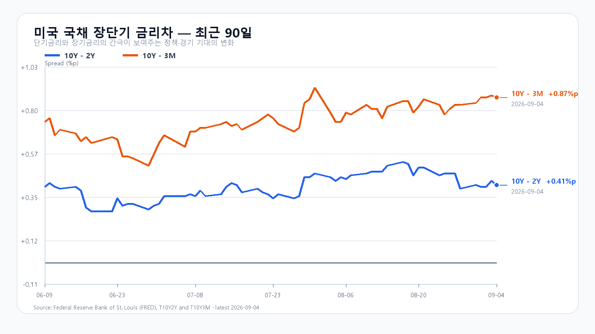

# Micron 급등 뒤 반도체 동반 강세, KOSPI 6,900선의 조건

- 작성·데이터 최종 확인: 2026-09-07T11:34:28+09:00; 한국 정규장 장중.
- 확정 사실과 조건부 판단: 본문의 가격·발표는 출처 관측값, 종가 구간·확률·대응 점수는 분석 가정.
- 직전 전망: 9월4일 종가6687.21은 당시 기본 구간, 일봉6632.77~6746.14는 당시 경로 안. 그러나 원시 바이트 봉인 실패로 평가 표본 무효이며 적중 성과로 집계하지 않는다.
- 새 변수: 미국 고용·반도체 상대강세·NXT 추가 상승. 유지 변수: 높은 유가와 AI 수요/가격 부담. EWY·ADR 후행분 중복 가산 없음.
- 취재 노트: [이슈 레이더](../research/2026-09-07-notes.md). 원천: research/evidence/2026-09-07/.

## 반도체가 먼저 오른다, 다음은 국내 매수다
Micron이 6.10% 오르고 미국 반도체 ETF SOXX가 3.52% 상승했다. Nasdaq100을 따르는 QQQ의 상승률 0.18%보다 훨씬 강했다. 삼성전자와 SK하이닉스도 장전 거래에서 상승하고 있어 오늘 KOSPI의 반등 출발을 받친다. 다만 6,900을 넘어서려면 정규장에서도 외국인과 프로그램 매수가 이어져야 한다.

미국 8월 취업자는 16만2천 명 늘었고 실업률은 4.1%를 유지했다. 6·7월 취업자 증감은 합계 5만5천 명 상향 수정됐다. 시간당 임금은 전월보다 0.3%, 전년보다 3.1% 올랐다. 고용이 견조해 경기 급랭 우려는 줄지만 빠른 금리 인하를 기대할 근거도 약하다. [BLS 고용보고서](https://www.bls.gov/news.release/archives/empsit_09042026.htm)

고용보고서는 금요일 한국장이 끝난 뒤 발표된 새 정보다. 금요일 국내 반도체 상승을 후행 반영한 미국 ETF의 움직임은 독립적인 추가 호재와는 다르다. 오늘 장전 상승 폭에는 새 기대가 이미 일부 들어가 있다.

## 금요일 반등 위에 장전 상승이 더해졌다
9월 4일 KOSPI는 6,687.21로 1.64% 올랐다. 시가 6,654.36, 고가 6,746.14, 저가 6,632.77이었다. KOSDAQ은 813.50으로 2.95% 상승했다. KODEX 레버리지는 101,120~105,090원을 오간 뒤 103,055원으로 3.99% 올랐다. [KOSPI 일봉](https://m.stock.naver.com/api/index/KOSPI/price?pageSize=10&page=1) · [KODEX 일봉](https://m.stock.naver.com/api/stock/122630/price?pageSize=10&page=1)

삼성전자는 255,500원으로 2.20%, SK하이닉스는 1,647,000원으로 3.20% 상승 마감했다. 장전의 추가 상승이 유지되면 지수 기여가 크지만, 시초가 이후 상승 폭을 반납하면 반등을 추격한 물량이 매물로 돌아올 수 있다.

삼성전자 NXT 266,000원(+4.11%), SK하이닉스 1,725,000원(+4.74%) · 08:14:50 KST. 달러/원 1,349.50원(2026-09-05 15:49:45 KST 하나은행 고시). Nasdaq100 선물 29,565.25(2026-09-07 08:04:38 KST) · S&P500 선물 7,722.00(2026-09-07 08:04:46 KST) · 브렌트유 선물 96.28(2026-09-07 08:03:24 KST) · WTI 선물 91.48(2026-09-07 08:04:25 KST). 선물은 지연 시세이며 계약별 원수준이다. [NXT 시세](https://stock.naver.com/api/polling/domestic/NXT/stock?itemCodes=005930,000660) · [환율](https://api.stock.naver.com/marketindex/exchange/FX_USDKRW) · [Nasdaq100 선물](https://finance.yahoo.com/quote/NQ=F/)

## 미국 반도체의 상승 폭이 컸다
미국 9월 4일 정규장 종가(한국 9월 5일 05:00)와 시간외 19:59 EDT(한국 08:59)를 나눠 보면, 반도체의 큰 정규장 상승 뒤 시간외에서는 소폭 조정이 나타났다. AMD와 Micron이 앞섰고 Nvidia와 Broadcom의 상승 폭은 작았다.

종목 | 정규 종가($) | 정규 등락 | 시간외($) | 정규 대비 |
[QQQ](https://stockanalysis.com/etf/qqq/) | 718.96 | +0.18% | 717.54 | -0.20% |
[TQQQ](https://stockanalysis.com/etf/tqqq/) | 72.37 | +0.47% | 72.04 | -0.46% |
[SOXX](https://stockanalysis.com/etf/soxx/) | 519.86 | +3.52% | 518.69 | -0.23% |
[SMH](https://stockanalysis.com/etf/smh/) | 567.01 | +2.61% | 566.01 | -0.18% |
[NVDA](https://stockanalysis.com/stocks/nvda/) | 230.36 | +0.84% | 229.47 | -0.39% |
[AMD](https://stockanalysis.com/stocks/amd/) | 477.57 | +4.69% | 476.25 | -0.28% |
[MU](https://stockanalysis.com/stocks/mu/) | 1,016.59 | +6.10% | 1,014.95 | -0.16% |
[AVGO](https://stockanalysis.com/stocks/avgo/) | 357.90 | +0.21% | 357.07 | -0.23% |

## DRAM 가격은 오르지만 고객 비용도 커진다
9월 4일 19:10 KST DRAM 현물에서 DDR5 16Gb 4800/5600 평균은 54.067달러로 0.12%, DDR4 8Gb 3200은 45달러로 0.96% 올랐다. 공급사의 가격 협상력에는 우호적이다. 다만 현물 호가는 HBM 계약가격이나 삼성전자·SK하이닉스의 실제 판매단가와 같지 않다. [TrendForce 현물 가격](https://www.trendforce.com/price/dram/dram_spot)

메모리 공급 부족이 가격을 끌어올릴수록 PC·서버 구매자의 비용도 늘어난다. 주가의 단기 상승과 실제 주문량의 확대는 구분해 봐야 한다. HBM·서버 DRAM·eSSD 수요를 지지하는 AI 투자가 소비용 메모리 수요까지 같은 속도로 끌어올리는 것은 아니다.

Broadcom의 3분기 AI 반도체 매출은 167억달러였고 회사가 제시한 4분기 전망은 217억달러다. AI 인프라 수요를 뒷받침하는 배경이지만 9월 2일 발표된 실적이므로 국내 시장이 이미 접한 재료다. [Broadcom 실적](https://investors.broadcom.com/news-releases/news-release-details/broadcom-inc-announces-third-quarter-fiscal-year-2026-financial)

## 고용 이후 금리는 소폭 상승, 유가는 부담이다
9월 4일 미국 국채 3개월물은 3.91%, 2년물은 4.37%, 10년물은 4.78%였다. 전날보다 2년물은 3bp, 10년물은 1bp 올랐다. 고용 호조가 할인율 부담을 조금 높였지만 금리가 급등한 상황은 아니다. 10년물과 2년물의 차이는 0.41%포인트, 3개월물과의 차이는 0.87%포인트다. [미 재무부 수익률](https://home.treasury.gov/resource-center/data-chart-center/interest-rates/TextView?type=daily_treasury_yield_curve&field_tdr_date_value=2026)

브렌트유 96달러대는 한국 기업의 수입 비용과 물가에 부담이다. 미국의 이란 관련 금융망 제재도 유가의 위험 요인이다. 이번 제재는 금융기관 지정이며 원유 생산 중단을 발표한 조치는 아니다. [미 재무부 제재 발표](https://content.govdelivery.com/accounts/USTREAS/bulletins/4286d43)

9월 4일 10Y-2Y +0.41%p · 10Y-3M +0.87%p. FRED.
9월 4일 10Y-2Y +0.41%p · 10Y-3M +0.87%p. FRED.

## 6,650 방어와 6,900 돌파를 나눠 본다
기본 종가 구간은 6,650~6,900(50%), 강세는 6,900 초과~7,150(30%), 약세는 6,350~6,650 미만(20%)이다. 두 경계 6,650과 6,900은 기본 구간에 넣는다. 장중 예상 범위는 6,300~7,200으로 종가 구간보다 넓게 잡는다. 전체 종가·장중 범위의 명목 포괄 수준은 90%이며 보장 범위는 아니다.

기본 시나리오는 6,650을 지키되 6,900 돌파가 막히는 흐름이다. 강세 전환에는 6,900 돌파와 외국인 현물·프로그램의 동반 순매수가 필요하다. 약세는 6,650 이탈과 두 수급의 동반 순매도가 조건이다. 가격이 해당 구간을 벗어나거나 수급 방향이 반대로 바뀌면 그 시나리오는 무효로 본다.

KODEX 레버리지는 금요일 저가 부근인 101,100원을 1차 지지, 고가 부근인 105,100원을 반등 기준으로 삼는다. 그 위의 110,000원은 저항을 살필 분석 기준이다. 대응 점수는 공격 30·관망 50·방어 20이다. 개장 30분과 60분, 오후 2시에 반도체 가격과 누적 수급이 같은 방향인지 비교한다. 시나리오 조건은 15시 20분까지 관측한다.

## 미국은 오늘 휴장, 이번 주 후반에는 물가
9월 7일 미국 현물 주식시장은 노동절로 쉰다. 오늘 한국장에서 형성된 판단을 같은 날 밤 미국 현물 가격으로 바로 확인할 수 없으므로 국내 수급의 비중이 커진다. [NYSE 휴장 일정](https://www.nyse.com/trade/hours-calendars)

9월 10일 PPI, 11일 CPI가 각각 21:30 KST(08:30 ET)에 발표된다. 고용보고서 뒤의 금리 기대가 물가 발표로 이어지는 주간이다. 9월 15~16일에는 경제전망이 포함된 FOMC가 예정돼 있다. [BLS 일정](https://www.bls.gov/schedule/2026/09_sched.htm) · [연준 일정](https://www.federalreserve.gov/monetarypolicy/fomccalendars.htm)

## 미확인 항목과 평가

- 9월4일 최종 수급·프로그램·시장폭 묶음은 다음 거래일 PREOPEN에서 초기화되어 미확인. 0으로 대체하지 않았다. 확정 KODEX OHLCV는 원천에 보존했다.
- HBM·RDIMM·eSSD 최신 계약가격, 신규 생산량/수율/주문량과 세부 NAND 최신 수치는 미확인. 공개 NAND 원문은 8월24일로 오래돼 당일 가격으로 사용하지 않았다.
- 신규 대규모 청산·증자 직접 충격은 미확보로 제외. NBIM 국채 벤치마크 변경은 권고이며 실행 매각으로 해석하지 않았다.
- 활성 가설 없음. 수급 후보는 flow_trajectory_v1 차단 유지.

## 장중 갱신

Micron이 6.10% 오르고 SOXX가 3.52% 상승한 뒤 삼성전자와 SK하이닉스가 국내 장중 동반 강세를 보였다. 11:34 KOSPI는 6,898.54로 3.16% 올랐고 외국인 현물은 +9,065억원, 프로그램은 +6,743억원 순매수다. 6,900선 안착 여부는 오후에도 이 매수가 이어지는지에 달렸다. 11:34 삼성전자는 266,000원(+4.11%), SK하이닉스는 1,743,000원(+5.83%), KODEX 레버리지는 110,170원(+6.90%)이다. 원/달러는 1,344.50원(11:29:43 KST 고시)이다. 시장 폭은 상승 452·하락 405·보합 54종목이다. 데이터 기준 11:34:28 KST.
