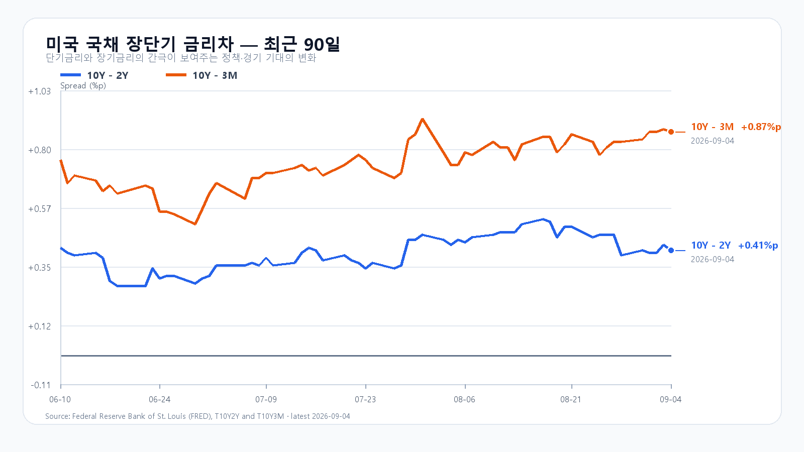
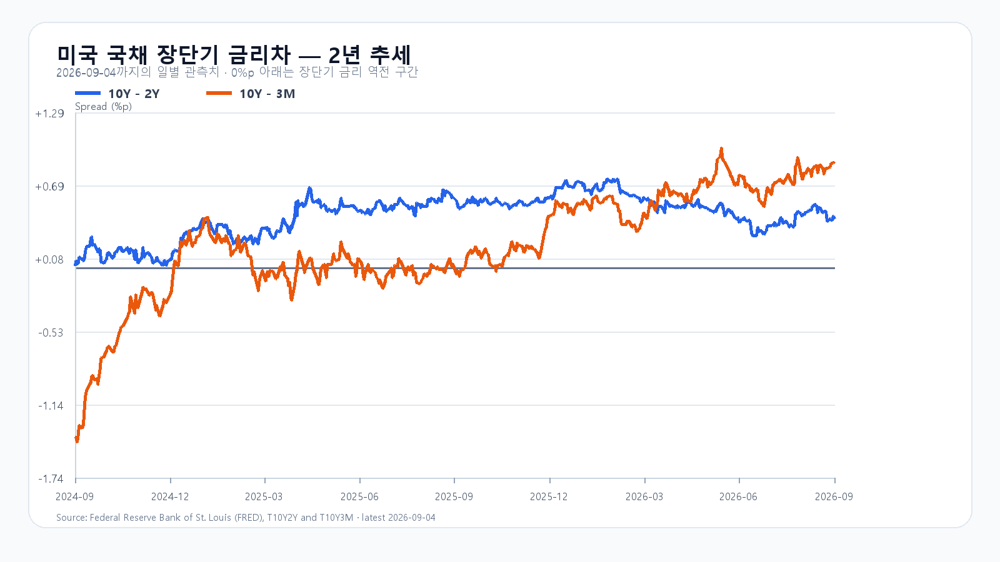

# 7,000선 앞의 KOSPI, 유가 부담 속 국내 매수가 관건

- 작성: 2026-09-08T08:14:33+09:00; 데이터 최종 확인: 2026-09-08T08:14:33+09:00; 한국 개장 전.
- 수치는 출처 관측값, 시나리오·확률·대응점수는 조건부 분석 가정이다.
- 전일 6995.39 종가는 직전 장중판 기본 범위 안. 상세 정산은 evaluation 원장을 따른다.
- 신규 변수: 한국장 마감 뒤 DRAM 현물의 품목 차별화와 유가 상승. 미국9/4 상승·OPEC9/6 발표는 이미 알려진 배경으로 중복 적용하지 않는다.
- 취재 원문과 미확인 항목: research/evidence/2026-09-08/overnight-notes.md. 전일 프로그램·시장폭 최종 묶음은 오늘 PREOPEN 초기화값으로 복원하지 않았다.

KOSPI는 9월 7일 6,995.39로 마감하며 7,000선 문턱까지 올라왔다. 시가 6,910.78에서 출발해 장중 저가 6,867.91을 거친 뒤 6,995.40까지 회복했다. 삼성전자는 270,000원(+5.68%), SK하이닉스는 1,783,000원(+8.26%)으로 급등했고 KOSDAQ은 822.19(+1.07%)로 마감했다. KODEX 레버리지는 113,045원(+9.69%)으로, 109,070원에서 113,100원까지 넓게 움직였다. 장전에는 두 종목이 전일 종가 부근에서 움직였다. [KOSPI 지수](https://m.stock.naver.com/api/index/KOSPI/price?pageSize=10&page=1)와 [KODEX 레버리지](https://m.stock.naver.com/api/stock/122630/price?pageSize=10&page=1) 가격이다.

## 현물가격과 국내 수급은 서로 다른 근거다

반도체 급등의 배경에는 메모리 가격 기대가 있다. 7일 저녁 DRAM 현물시장에서 DDR5 16Gb는 0.43%, DDR4 8Gb는 0.79%, eTT는 1.85% 올랐지만 DDR4 16Gb는 0.27% 내렸다. 품목별 현물 가격은 실적 기대를 지지하는 재료이지, 삼성전자와 SK하이닉스의 확정 매출을 뜻하지는 않는다. 오늘 지수 상단을 열려면 반도체의 추가 상승보다 국내 매수가 다른 대형주로 이어지는지가 관건이다. [DRAMeXchange](https://www.dramexchange.com/)의 세션 평균 기준이다.

전일 유가증권시장에서 외국인은 2조5,532억원, 기관은 2조6,491억원을 순매수했고 개인은 6조8,374억원을 순매도했다. 기관 순매수 가운데 금융투자가 2조2,185억원이었다. 강한 매수가 있었던 것은 사실이지만 금융투자 비중이 컸던 만큼, 이 수치만으로 오늘도 매수가 이어진다고 단정할 수 없다. 개장 뒤 외국인 현물과 프로그램의 방향을 별도로 봐야 한다. [네이버 투자자별 거래동향](https://finance.naver.com/sise/investorDealTrendDay.naver?bizdate=20260907&sosok=01) 기준이다.

## 미국 휴장 사이에 유가가 올랐다

미국은 9월 7일 노동절로 휴장했다. 아래 9월 4일 정규장 반도체 강세는 이미 국내 7일 장에 반영된 재료여서, 오늘 추가 상승의 근거로 다시 더할 수 없다. 반면 브렌트유는 배럴당 97.31달러로 1.1% 올라 수입물가와 원화에 부담을 남겼다. 유가 상승과 원화 약세가 겹치면 7,000선 위에서는 비용 부담과 할인율이 먼저 지수 상단을 제한한다. [NYSE 거래일 캘린더](https://www.nyse.com/trade/hours-calendars)와 [브렌트유 보도](https://uk.marketscreener.com/news/oil-extends-gains-after-us-and-iran-strike-ships-ce785bdbdd8cf42d)를 따른다.

|미국 자산|9월 4일 종가(달러)|등락|
|---|---:|---:|
|[QQQ](https://stockanalysis.com/etf/qqq/history/)|718.96|+0.18%|
|[TQQQ](https://stockanalysis.com/etf/tqqq/history/)|72.37|+0.47%|
|[SOXX](https://stockanalysis.com/etf/soxx/history/)|519.86|+3.52%|
|[SMH](https://stockanalysis.com/etf/smh/history/)|567.01|+2.61%|
|[NVDA](https://stockanalysis.com/stocks/nvda/history/)|230.36|+0.84%|
|[AMD](https://stockanalysis.com/stocks/amd/history/)|477.57|+4.69%|
|[MU](https://stockanalysis.com/stocks/mu/history/)|1,016.59|+6.10%|
|[AVGO](https://stockanalysis.com/stocks/avgo/history/)|357.90|+0.21%|

## 금리 부담과 이번 주 경제 일정

미국 국채는 9월 4일 3개월 3.91%, 2년 4.37%, 10년 4.78%였다. 전날보다 단기 금리가 더 올라 10년-2년 금리차는 0.43%포인트에서 0.41%포인트로, 10년-3개월 금리차는 0.88%포인트에서 0.87%포인트로 좁아졌다. 10년물의 절대금리 4.78%는 AI 장기 이익에 적용되는 할인 부담을 남긴다. [미 재무부 일일 수익률 곡선](https://home.treasury.gov/resource-center/data-chart-center/interest-rates/TextView?field_tdr_date_value=2026&type=daily_treasury_yield_curve) 기준이다.

한국은행이 8일 발표한 2분기 국민소득 잠정치에서 실질 GDP는 전기 대비 0.6%, 전년 동기 대비 3.7% 늘었다. 실질 GNI는 전기 대비 3.1%, 전년 동기 대비 15.6% 증가했다. 성장과 소득은 함께 늘었지만, 분기 경제지표만으로 오늘의 주식 매수 지속 여부를 판단할 수는 없다. [한국은행 국민소득 잠정치](https://www.bok.or.kr/portal/bbs/B0000501/view.do?nttId=11064532&menuNo=201264) 기준이다.

이번 주는 9일 23:00 KST 미국 6월 고용보상비용, 10일 21:30 KST 미국 8월 PPI, 11일 21:30 KST 미국 8월 CPI가 이어진다. 중국은 9일 10:30 KST에 8월 CPI와 PPI를 발표한다. FOMC는 현지 15~16일에 경제전망과 함께 열린다. 지수 상단의 매수는 이 물가·금리 일정 전까지 국내 수급이 버티는지로 평가받는다. [BLS 일정](https://www.bls.gov/schedule/2026/), [중국 국가통계국 일정](https://www.stats.gov.cn/xw/tjxw/tzgg/202512/t20251224_1962137.html), [Fed 회의 일정](https://www.federalreserve.gov/monetarypolicy/fomccalendars.htm) 기준이다.

## 6,900 지지와 7,100 돌파의 조건

종가 기준 기본 시나리오는 KOSPI가 6,900 이상 7,100 이하이고 외국인 현물이 0 이상인 경우로 50%다. 강세 시나리오는 KOSPI가 7,100을 넘고 외국인 현물과 프로그램이 모두 순매수인 경우로 7,100 초과~7,300, 25%다. 약세 시나리오는 KOSPI가 6,900 아래이고 외국인 현물과 프로그램이 모두 순매도인 경우로 6,650~6,900 미만, 25%다. 각 조건이 깨지면 해당 시나리오는 무효다. 종가가 범위 경계에 걸리면 기본 시나리오를 우선 적용한다. 전체 종가 범위 6,650~7,300과 장중 예상 범위 6,600~7,350은 각각 명목 포괄 수준 90%의 분석 가정이며 보장 범위가 아니다.

KODEX 레버리지는 109,000원을 지지선, 전일 고가 113,100원을 반등 기준, 116,000원을 저항선으로 둔다. 113,100원 위에서 강세 시나리오 조건이 갖춰져야 116,000원 저항을 시험할 수 있고, 109,000원 아래에서는 그 반등 기준이 무효가 된다. 대응 점수는 공격 25, 관망 55, 방어 20이다. 09:30에는 KOSPI 7,000선과 외국인 현물·프로그램을, 10:00에는 반도체 외 업종으로의 매수 확산을, 14:00에는 유가·원화와 지수 상단의 충돌을 확인한다. 15:20에는 종가 시나리오 조건이 유지되는지만 관측한다.

## 장전 가격

|항목|가격·변화|출처 기준 시각|
|---|---:|---|
|삼성전자 NXT|269,000원 · -0.37%|9월 8일 08:14:32 KST 조회|
|SK하이닉스 NXT|1,784,000원 · 0.06%|9월 8일 08:14:32 KST 조회|
|달러/원 하나은행 고시|1,347.00원|2026-09-08T07:52:58+09:00|
|Nasdaq100 선물|29,550.25 · -0.051%|2026-09-08T08:04:31+09:00 지연 시세|
|S&P500 선물|7,704.75 · -0.223%|2026-09-08T08:04:31+09:00 지연 시세|
|브렌트 선물|97.21 · +0.966%|2026-09-08T08:02:49+09:00 지연 시세|
|WTI 선물|92.56 · +1.181%|2026-09-08T08:04:15+09:00 지연 시세|

[NXT](https://stock.naver.com/api/polling/domestic/NXT/stock?itemCodes=005930,000660) · [환율](https://api.stock.naver.com/marketindex/exchange/FX_USDKRW) · [Nasdaq100 선물](https://finance.yahoo.com/quote/NQ=F/) · [S&P500 선물](https://finance.yahoo.com/quote/ES=F/) · [브렌트](https://finance.yahoo.com/quote/BZ=F/) · [WTI](https://finance.yahoo.com/quote/CL=F/)

NXT는 정규장과 별도 시장이다. 선물은 지연 시세이며, 등락률은 출처가 제공한 각 계약의 비교 기준을 따른다.

## 미국 가격 세부·취재 근거

모든 정규장 가격은 2026-09-04 16:00 EDT(9/5 05:00 KST), 시간외는 19:59 EDT(9/5 08:59 KST). 출처 StockAnalysis/S&P Global. 이날 상승은 한국 9/7에 반영 가능한 기존 정보이며 9/8 밤사이 신규 상승 아님.

|자산|시가|고가|저가|종가|정규장 변화|시간외 가격|시간외 변화|
|---|---:|---:|---:|---:|---:|---:|---:|
|QQQ|719.35|721.86|716.56|718.96|+0.18%|717.54|-0.20%|
|TQQQ|72.49|73.24|71.65|72.37|+0.47%|72.04|-0.46%|
|SOXX|509.31|520.56|507.25|519.86|+3.52%|518.69|-0.23%|
|SMH|560.50|569.40|557.72|567.01|+2.61%|566.01|-0.18%|
|NVDA|231.09|234.76|229.63|230.36|+0.84%|229.47|-0.39%|
|AMD|462.00|478.83|458.00|477.57|+4.69%|476.25|-0.28%|
|MU|971.34|1017.77|969.00|1016.59|+6.10%|1014.95|-0.16%|
|AVGO|359.70|360.16|353.70|357.90|+0.21%|357.07|-0.23%|

- https://stockanalysis.com/etf/qqq/history/
- https://stockanalysis.com/etf/tqqq/history/
- https://stockanalysis.com/etf/soxx/history/
- https://stockanalysis.com/etf/smh/history/
- https://stockanalysis.com/stocks/nvda/history/
- https://stockanalysis.com/stocks/amd/history/
- https://stockanalysis.com/stocks/mu/history/
- https://stockanalysis.com/stocks/avgo/history/
- 교차 확인: QQQ 718.96 financecharts, NVDA 230.36 StatMuse, MU 1016.59 ChipSentiment 일치. AVGO 보조 사이트 357.89와 0.01 차이 있어 동일 표에서는 StockAnalysis 357.90 고정. TQQQ ChartExchange 헤더 72.35와 일봉 72.37 차이 있어 일봉 표 72.37 고정.
- 반도체 펀더멘털 배경: Broadcom 9/2 공식 실적 매출 296억달러(+86%), Q4 가이던스 약 348억달러(+93%). 9/7 이후 신규 사실 아님.
- https://investors.broadcom.com/news-releases/news-release-details/broadcom-inc-announces-third-quarter-fiscal-year-2026-financial

