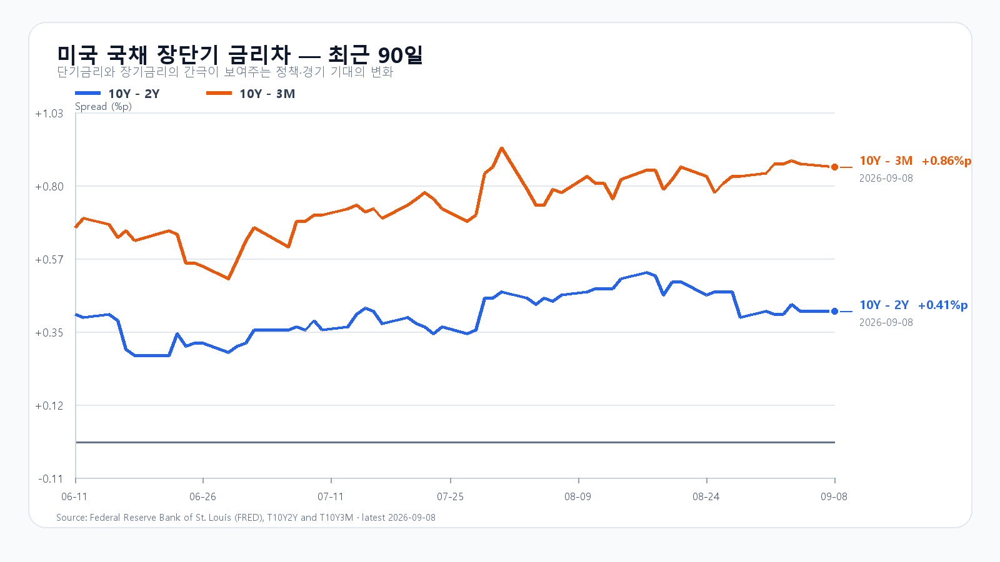
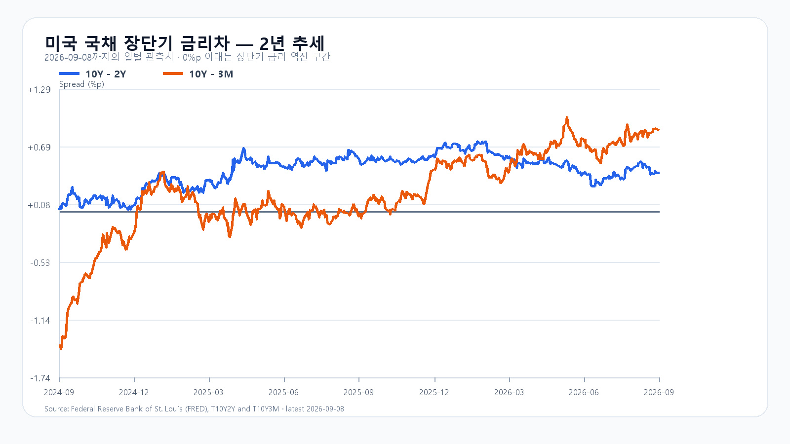

# 미국 반도체 ETF는 올랐지만 Micron은 하락, KOSPI 반등의 조건

- 작성: 2026-09-09T08:16:56+09:00; 데이터 최종 확인: 2026-09-09T08:16:55+09:00; 한국 개장 전.
- 수치는 출처 관측값, 시나리오·확률·대응점수는 조건부 분석 가정이다.
- 전일 6954.52 종가는 직전 장전판 기본 범위 안. 상세 정산은 evaluation 원장을 따른다.
- 신규 변수: 미국 반도체 ETF와 개별 종목의 분화, Qualcomm·Amazon 협업, 99달러대 브렌트. 한국장 반납 흐름과 EWY 후행 반응은 새 충격으로 중복 적용하지 않는다.
- 취재 원문과 미확인 항목: research/evidence/2026-09-09/overnight-notes.md. 전일18:59 마감후 수급·시장폭은 보존했으나 15:30 수급 원문 앵커는 결측이다.

미국 반도체 ETF 상승만으로 국내 메모리주의 동반 강세를 기대하기에는 밤사이 주가의 방향이 갈렸다. 9월 8일 SOXX는 1.64%, SMH는 1.19% 올랐지만 Nvidia는 2.01%, Micron은 1.61% 하락했다. AMD와 Broadcom에 몰린 매수가 삼성전자·SK하이닉스로 이어지는지, 그 반등에 다른 업종도 참여하는지가 오늘 KOSPI의 관건이다.

## AI 수요 기대와 메모리 주가는 다른 방향으로 움직였다

AMD는 5.90%, Broadcom은 2.98% 상승했다. 반면 QQQ는 0.08%, TQQQ는 0.29% 내렸다. 반도체 업종 안에서도 주도 종목이 갈렸고, 기술주 전반의 위험 선호가 함께 강해진 장은 아니었다.

|종목|9월 8일 정규장 종가·등락률|
|---|---:|
|[QQQ](https://stockanalysis.com/etf/qqq/)|718.36달러 · -0.08%|
|[TQQQ](https://stockanalysis.com/etf/tqqq/)|72.16달러 · -0.29%|
|[SOXX](https://stockanalysis.com/etf/soxx/)|528.40달러 · +1.64%|
|[SMH](https://stockanalysis.com/etf/smh/)|573.73달러 · +1.19%|
|[Nvidia](https://stockanalysis.com/stocks/nvda/)|225.73달러 · -2.01%|
|[AMD](https://stockanalysis.com/stocks/amd/)|505.74달러 · +5.90%|
|[Micron](https://stockanalysis.com/stocks/mu/)|1,000.26달러 · -1.61%|
|[Broadcom](https://stockanalysis.com/stocks/avgo/)|368.56달러 · +2.98%|

AMD 경영진은 Citi 행사에서 AI 시장과 데이터센터 사업의 성장 전망을 제시했다. 이런 기대는 HBM·첨단 패키징 수요를 뒷받침하지만 경영진 전망과 확정 주문은 다르다. [AMD 공식 행사](https://ir.amd.com/news-events/ir-calendar/detail/20260908-citis-2026-global-tmt-conference)

Qualcomm과 Amazon의 AI 데이터센터 협업은 클라우드 투자가 새로운 칩 공급자로 확장되는 사례다. Amazon 계열사에 부여되는 주식매수권은 상업 합의와 구속력 있는 주문, 실제 구매에 따라 단계적으로 권리가 생긴다. 계약에 등장하는 600억달러는 이 조건의 지급 상한이며, 이미 확보한 매출이 아니다. [SEC 공시](https://www.sec.gov/Archives/edgar/data/804328/000110465926105718/tm2623289d1_8k.htm)

메모리 현물가격도 품목별로 갈렸다. 9월 8일 19:10 KST 기준 DDR5 16Gb는 54.333달러로 0.06% 올랐지만 DDR4 16Gb는 91.750달러로 1.61% 내렸다. DDR4 8Gb는 45.364달러로 0.02% 상승했다. NAND 역시 서버·AI 고객 수요가 계약가격을 지지하는 가운데 소비자 현물은 수요 부진으로 횡보한다. 메모리 업체의 실적 기대를 소비자 수요 전반의 회복으로 확대해서는 안 된다. [DRAM 현물](https://www.trendforce.com/price/dram/lpddr_spot) · [9월 2일 NAND 주간 자료](https://www.trendforce.com/research/download/RP260902CD)

## 7,171까지 갔던 KOSPI가 되돌아온 이유

전날 KOSPI는 7,045.79에서 출발해 7,171.52까지 올랐다가 6,954.52로 마감했다. 종가는 장중 저점 6,951.78에 가까웠다. 삼성전자는 269,500원으로 0.19% 하락했고 SK하이닉스는 1,793,000원으로 0.56% 올랐다. 두 대형주의 가격 방향도 같지 않았다. [KOSPI 확정 일봉](https://m.stock.naver.com/api/index/KOSPI/price?pageSize=10&page=1)

마감 후 공개 자료에서 외국인은 6,316억원, 기관은 6,427억원 순매수했고 개인은 3조329억원 순매도했다. 프로그램은 808억원 순매수였다. 그런데도 상승 종목은 231개, 하락 종목은 634개였다. 외국인 순매수 하나만으로 지수 상승의 지속을 판단하기 어려웠던 하루다. 오늘은 반도체의 반등과 함께 하락 종목 수가 줄어드는지도 봐야 한다. [9월 8일 마감 자료](https://m.stock.naver.com/api/index/KOSPI/integration)

유가는 이 반등의 부담이다. 중동 공급 차질 우려 속에서 장전 브렌트 선물이 99달러대로 올라 수입 비용과 물가 압력을 키우고 있다. 미국 10년물 금리는 9월 8일 4.80%, 2년물은 4.39%로 각각 직전 관측일보다 2bp 상승했다. 3개월물은 3.94%다. 장단기 금리차가 크게 달라지지 않아도 높은 장기금리 자체가 반도체 주가의 상단을 누를 수 있다. [미 재무부](https://home.treasury.gov/resource-center/data-chart-center/interest-rates/TextView?field_tdr_date_value=2026&type=daily_treasury_yield_curve) · [Reuters 유가 결제 동향](https://za.investing.com/news/commodities-news/oil-rises-as-risks-of-prolonged-mideast-conflict-heighten-supply-worries-4455577)

오늘 첫 주요 일정은 10:30 KST 중국 CPI·PPI다. 미국 PPI는 9월 10일, CPI는 11일 각각 21:30 KST에 나온다. FOMC 성명과 경제전망은 한국 시각 9월 17일 03:00, 기자회견은 03:30이다. [중국 국가통계국](https://www.stats.gov.cn/english/PressRelease/ReleaseCalendar/202512/t20251226_1962154.html) · [BLS](https://www.bls.gov/schedule/2026/09_sched_list.htm) · [연준](https://www.federalreserve.gov/newsevents/2026-september.htm)

## 오늘의 범위와 KODEX 기준선

기본 판단은 KOSPI 6,900~7,100의 등락이다. 공격 30·관망 50·방어 20을 대응 비중으로 두되, 아래 시나리오 확률과는 별개로 본다. 장중 예상 경로는 6,600~7,350이며 명목 포락 수준은 90%다. 이는 통계적으로 보장된 적중률이 아닌 분석 가정이다.

|종가 시나리오|범위·확률|유지 조건|무효화 기준|
|---|---|---|---|
|기본|6,900~7,100 · 50%|가격이 범위 안이고 외국인 현물 순매매가 0 이상|범위 이탈 또는 외국인 순매도|
|강세|7,100 초과~7,300 · 30%|7,100 초과·외국인 현물·프로그램 순매수 동반|7,100 이하 또는 어느 한 수급의 순매수 중단|
|약세|6,650~6,900 미만 · 20%|6,900 미만·외국인 현물·프로그램 순매도 동반|6,900 회복 또는 어느 한 수급의 순매도 중단|

KODEX 레버리지는 전날 112,150원으로 0.79% 하락했다. 장중 범위는 112,065~120,015원이었다. 오늘은 112,000원을 1차 지지, 115,000원을 반등 기준, 120,000원을 저항으로 둔다. 115,000원 회복에 삼성전자·SK하이닉스 상승과 외국인·프로그램 동반 매수가 붙어야 전날 반납한 상승분을 되찾는 흐름으로 볼 수 있다. [KODEX 확정 일봉](https://m.stock.naver.com/api/stock/122630/price?pageSize=10&page=1)

## 장전 가격

|항목|가격·변화|출처 기준 시각|
|---|---:|---|
|삼성전자 NXT|272,000원 · 0.93%|9월 9일 08:16:56 KST 조회|
|SK하이닉스 NXT|1,826,000원 · 1.84%|9월 9일 08:16:56 KST 조회|
|달러/원 하나은행 고시|1,341.50원|2026-09-09T07:27:08+09:00|
|Nasdaq100 선물|29,536.50 · -0.008%|2026-09-09T08:06:54+09:00 지연 시세|
|S&P500 선물|7,681.25 · +0.010%|2026-09-09T08:06:54+09:00 지연 시세|
|브렌트 선물|99.40 · +1.511%|2026-09-09T08:06:28+09:00 지연 시세|
|WTI 선물|94.28 · +1.344%|2026-09-09T08:06:55+09:00 지연 시세|

[NXT](https://stock.naver.com/api/polling/domestic/NXT/stock?itemCodes=005930,000660) · [환율](https://api.stock.naver.com/marketindex/exchange/FX_USDKRW) · [Nasdaq100 선물](https://finance.yahoo.com/quote/NQ=F/) · [S&P500 선물](https://finance.yahoo.com/quote/ES=F/) · [브렌트](https://finance.yahoo.com/quote/BZ=F/) · [WTI](https://finance.yahoo.com/quote/CL=F/)

NXT는 정규장과 별도 시장이다. 선물은 지연 시세이며, 등락률은 출처가 제공한 각 계약의 비교 기준을 따른다.

## 미국 가격 세부·취재 근거

# 2026-09-09 장전 해외 취재 노트

- 조사 기준: 2026-09-09 08:10 KST
- 범위: 2026-09-08 미국 정규장·시간외, 해외 반도체/규제/계약 이슈, 메모리 가격, 유가·미 국채, 9월 9일 이후 공식 경제 일정
- 주의: 독자용 원고가 아닌 사실 검증 메모다. 한국 전일 정산·수급과 현재 NXT는 메인 담당 자료를 사용한다.

## 미국 정규장과 시간외

StockAnalysis의 S&P Global 정규장 종가와 Cboe/Nasdaq 통합 시간외 표시를 각각 읽었다. 시간외는 종목별 최종 표시 시각이 달라 스냅샷으로만 쓴다.

| 종목 | 9/8 정규장 종가(EDT) | 시간외 스냅샷(EDT) | 원문 |
|---|---:|---:|---|
| QQQ | 718.36, -0.08% (16:00) | 718.21, -0.02% (18:50) | https://stockanalysis.com/etf/qqq/ |
| TQQQ | 72.16, -0.29% (16:00) | 72.10, -0.08% (18:50) | https://stockanalysis.com/etf/tqqq/ |
| SOXX | 528.40, +1.64% (16:00) | 528.93, +0.10% (18:25) | https://stockanalysis.com/etf/soxx/ |
| SMH | 573.73, +1.19% (16:00) | 574.20, +0.08% (18:58) | https://stockanalysis.com/etf/smh/ |
| NVDA | 225.73, -2.01% (16:00) | 225.93, +0.09% (19:03) | https://stockanalysis.com/stocks/nvda/ |
| AMD | 505.74, +5.90% (16:00) | 506.11, +0.07% (19:03) | https://stockanalysis.com/stocks/amd/ |
| MU | 1,000.26, -1.61% (16:00) | 1,006.50, +0.62% (19:01) | https://stockanalysis.com/stocks/mu/ |
| AVGO | 368.56, +2.98% (16:00) | 367.34, -0.33% (18:32) | https://stockanalysis.com/stocks/avgo/ |

- 시장 전체: S&P 500 7,673.52(-0.6%), 다우 52,786.07(-1.2%), 나스닥 종합 26,421.41(-0.3%). AP 9/8 미국장 마감 기사: https://apnews.com/article/cadd309d4fd4933397cd38fe436edb71
- Reuters 마감 해설은 유가 급등·중동 공급위험과 금리 부담을 지수 약세의 핵심으로 짚었다. https://www.marketscreener.com/news/wall-st-slips-as-gulf-tensions-send-oil-to-over-six-week-high-ce785bd8df8ffe22
- 해석: `SOXX/SMH 상승 = 미국 반도체 전반 강세`로 단순화하면 안 된다. AMD·AVGO는 강했지만 NVDA·MU는 하락했다. 특히 MU 정규장 -1.61%는 한국 메모리주에 단독 상방 확인 신호가 아니다. 시간외 변화도 대부분 ±0.6% 이내라 새 방향을 만들 정도는 아니다.

## 이슈 레이더

점수는 직접 KOSPI 영향(0~3)+가격 확인(0~3)+새로움(0~2)+출처 품질(0~3)+전개 속도(0~2), 총 13점이다.

| 순위 | 후보 | 점수 | 사실·경계 | KOSPI 연결 |
|---|---|---:|---|---|
| 1 | 중동 공급위험으로 Brent 장중 $99.46 | 12 | 9/8 결제 WTI 10월물 $93.03(+1.7%), Brent 11월물 $97.92(+0.9%). 사우디 에너지 시설 공격과 호르무즈 공급차질 우려가 새 충격. Reuters 9/8 21:53 표시: https://za.investing.com/news/commodities-news/oil-rises-as-risks-of-prolonged-mideast-conflict-heighten-supply-worries-4455577 | 인플레·장기금리·원가를 동시에 올리는 장전 최우선 위험. 08시 선물 현재가와 9/8 결제가는 분리 표기한다. |
| 2 | AMD AI 수요 전망과 +5.90% | 11 | AMD CFO가 9/8 Citi TMT 행사에서 2030년 AI TAM을 약 $2조~$3조로 보고, 2027년 데이터센터 매출이 두 배로 늘 수 있다는 경영진 전망을 제시했다. 공식 행사: https://ir.amd.com/news-events/ir-calendar/detail/20260908-citis-2026-global-tmt-conference ; 발언 보조 확인: https://uk.marketscreener.com/news/amd-shares-rise-after-cfo-says-total-addressable-market-could-hit-3-trillion-ce785bd8d18ff227 | HBM·첨단 패키징 수요 기대를 지지. 회사 전망이지 확정 매출·계약은 아니다. |
| 3 | Qualcomm-Amazon AI 데이터센터 협업 | 11 | 9/8 09:00:20 EDT SEC 8-K. Amazon 계열사에 최대 2,500만 QCOM주 워런트, 행사가는 $161.26. 상업 합의·구속력 있는 주문·실제 구매와 연동해 총 지급액 $600억까지 단계별 베스팅. https://www.sec.gov/Archives/edgar/data/804328/000110465926105718/tm2623289d1_8k.htm ; Reuters: https://www.marketscreener.com/news/qualcomm-amazon-strike-4-billion-custom-chip-deal-ce785bd8df8bf022 | AI 추론칩·광연결·메모리 수요 저변 확대. `$600억 확정 구매계약`으로 쓰면 오보이며, 베스팅 상한 조건이다. |
| 4 | 중국, 일본산 DCS 잠정 반덤핑 | 9 | 중국 상무부가 9/8부터 일본산 디클로로실란에 80.8~99.2% 보증금 조치를 시행. DCS는 반도체 박막 증착 소재. MOFCOM 9/8 10:47 CST: https://cacs.mofcom.gov.cn/article/gnwjmdt/sb/zo/202609/189170.html ; 영문 공식 요약: https://english.scio.gov.cn/pressroom/2026-09/08/content_118685124.html | 중국 내 메모리 생산원가와 동아시아 소재망 불확실성. 삼성·SK하이닉스에 대한 방향은 단정 불가. |
| 5 | 미국 NSA·FBI·CISA, 중국 AI 모델 증류 경고 | 7 | 9/8 공동 권고는 중국계 AI 기업의 미국 프런티어 모델 대규모 증류 활동을 경고했다. https://www.nsa.gov/Press-Room/Press-Releases-Statements/Press-Release-View/Article/4592113/nsa-and-others-warn-china-based-ai-companies-are-distilling-us-frontier-ai-mode/ | 미중 AI 규제 강화 신호. 이번 발표 자체가 새 반도체 수출금지 조치는 아니다. |
| 6 | Anthropic, AI 칩 통제 법안 갈등으로 ITI 탈퇴 | 6 | Axios 9/8 18:35 UTC 보도. AI OVERWATCH·Chip Security·MATCH 등은 의회 논의 법안이며 아직 법률이 아니다. https://www.axios.com/2026/09/08/anthropic-breaks-tech-group-chips | 규제 논쟁 심화의 보조 신호. 가격 확인과 직접 한국 영향은 약하다. |
| 7 | 미 CHIPS R&D 양자컴퓨팅 보조금 확정 | 5 | D-Wave·Rigetti·Quantinuum에 각각 $1억 규모 최종 협약. 미국 정부 소수·비지배 지분 조건 포함. https://www.sec.gov/Archives/edgar/data/1907982/000190798226000141/chipsactpressrelease.htm ; https://ir.quantinuum.com/news-releases/news-release-details/quantinuum-finalizes-100-million-chips-rd-award-us-department ; https://investors.rigetti.com/news-releases/news-release-details/rigetti-signs-definitive-agreement-100m-us-government-accelerate | 미국 첨단컴퓨팅 정책의 장기 신호이나 오늘 KOSPI 직접성은 낮다. |
| 8 | 미국 소프트웨어 약세·반도체 선택적 강세 | 5 | Reuters는 GPT-6 Astra 관련 경쟁 우려로 소프트웨어·서비스 지수가 약 1.5% 내린 가운데 일부 칩·데이터센터 수혜주가 강했다고 보도. https://www.marketscreener.com/news/s-p-500-falls-as-ai-worries-hit-software-makers-ce785bd8d08bf22c | AI 자금이 모든 성장주가 아니라 인프라 안에서 선택적으로 이동한다는 보조 근거. 발표 자체는 9/8 신규가 아니어서 선도 이슈로 쓰지 않는다. |

### 우선 사용할 4개

1. 유가·장기금리 부담: 지수 전체의 위험 프리미엄을 올리는 가장 직접적인 새 충격.
2. AMD의 AI 수요 전망과 주가 확인: HBM 수요 기대는 지지하되 경영진 전망이라는 경계를 유지.
3. Qualcomm-Amazon 협업: AI 추론·광연결 투자 저변 확대. 계약 금액을 확정 발주처럼 쓰지 않음.
4. 중국의 일본산 DCS 조치: 실제 시행된 소재 규제지만 한국 메모리주의 수혜·피해 방향은 열어 둠.

- 청산 점검: 9/8 공개 원문 검색에서 KOSPI에 직접 연결할 새 강제청산·대형 블록딜·펀드 환매 확정 건은 확인하지 못했다. 이전 한국 신용잔고 위험 분석을 오늘 발생한 청산 사실처럼 재사용하지 않는다.

## DRAM·NAND

### DRAM 현물

- TrendForce 표시 시각 2026-09-08 18:10 GMT+8, 즉 19:10 KST: DDR5 16Gb 4800/5600 평균 $54.333(+0.06%), DDR4 16Gb 3200 $91.750(-1.61%), DDR4 16Gb eTT $12.088(+0.94%), DDR4 8Gb 3200 $45.364(+0.02%), DDR4 8Gb eTT $5.050(+2.02%). 원문: https://www.trendforce.com/price/dram/lpddr_spot
- 해석: DDR5 보합, 표준 DDR4 16Gb 약세, eTT 상승의 혼조다. `DRAM 전 품목 상승`으로 쓰지 않는다.
- 8/31 공개 요약은 PC DRAM 계약가 상승 지속, 서버용 전환에 따른 die 공급 제약, OEM 재고축적과 LTA 협상 시작을 언급한다. 숫자 본문은 유료이므로 공개 요약 범위만 사용: https://www.trendforce.com/research/download/RP260831UX
- 7/3 공개 3분기 전망은 conventional DRAM 계약가 +13~18% QoQ: https://www.trendforce.com/presscenter/news/20260703-13134.html

### NAND

- 9/2 최신 주간 공개 요약: 서버 OEM·CSP·AI 수요로 3분기 계약 가격이 확정되는 한편 소비자 현물은 최종 수요 부진과 거래 위축으로 횡보. https://www.trendforce.com/research/download/RP260902CD
- 8/31 계약 요약: 고층 3D NAND 우선 배분으로 niche 공급 부족 지속, SLC는 완만한 상승, MLC는 구매자 비용 한계로 고점 횡보. https://www.trendforce.com/research/download/RP260831EM
- 7/3 공개 3분기 전체 NAND 계약가 전망은 +10~15% QoQ. eSSD와 소비자/client 수요의 방향을 분리해야 한다: https://www.trendforce.com/presscenter/news/20260703-13134.html
- 무료 NAND 숫자표는 표시 시각이 2026-07-27에 머물러 있어 오늘 현물값으로 인용하지 않는다: https://www.trendforce.com/price/flash/memCard_spot

## 유가·미 국채

- 9/8 뉴욕 결제: WTI 10월물 $93.03(+1.55달러, +1.7%), Brent 11월물 $97.92(+0.92달러, +0.9%). 장중 고가는 각각 $94.73, $99.46. Reuters 9/8 21:53 표시: https://za.investing.com/news/commodities-news/oil-rises-as-risks-of-prolonged-mideast-conflict-heighten-supply-worries-4455577
- 9/8 미 재무부 공식 CMT: 3개월 3.94%, 2년 4.39%, 10년 4.80%. 따라서 10년-2년 +0.41%p, 10년-3개월 +0.86%p. 9/4보다 2년·10년 모두 2bp 상승해 장단기차는 유지. 원문: https://home.treasury.gov/resource-center/data-chart-center/interest-rates/TextView?field_tdr_date_value=2026&type=daily_treasury_yield_curve
- FRED 10년-2년 확인값도 9/8 +0.41%p, 페이지 업데이트 표시 9/8 16:04 CDT: https://fred.stlouisfed.org/series/T10Y2Y
- 해석: 커브 모양 변화보다 10년 절대금리 4.80%와 배럴당 100달러에 가까운 Brent가 반도체 밸류에이션과 인플레 기대에 더 직접적인 부담이다.

## 9월 9일 이후 공식 경제 일정

예상치는 공식 일정에 없으므로 별도 컨센서스 출처 없이 넣지 않는다.

| KST | 이벤트 | 공식 원문 |
|---|---|---|
| 9/9 10:30 | 중국 8월 CPI·PPI(09:30 Beijing) | 중국 국가통계국: https://www.stats.gov.cn/english/PressRelease/ReleaseCalendar/202512/t20251226_1962154.html |
| 9/9 23:00 | 미국 2분기 고용비용(10:00 EDT) | BLS 9월 달력: https://www.bls.gov/schedule/2026/09_sched_list.htm |
| 9/10 21:30 | 미국 8월 PPI(08:30 EDT) | BLS: https://www.bls.gov/schedule/news_release/ppi.htm |
| 9/11 21:30 | 미국 8월 CPI·실질임금(08:30 EDT) | BLS: https://www.bls.gov/schedule/2026/home.htm |
| 9/15 11:00 | 중국 8월 산업생산·소매판매·고정자산투자(10:00 Beijing) | 중국 국가통계국: https://www.stats.gov.cn/english/PressRelease/ReleaseCalendar/202512/t20251226_1962154.html |
| 9/16 21:30 | 미국 8월 소매판매(08:30 EDT) | Census: https://www.census.gov/retail/release_schedule.html |
| 9/17 03:00·03:30 | FOMC 성명·SEP, 기자회견(9/16 14:00·14:30 EDT) | Fed: https://www.federalreserve.gov/newsevents/2026-september.htm ; https://www.federalreserve.gov/monetarypolicy/fomccalendars.htm |

## 장전 해석에 남길 경계

- 9/8 한국장이 이미 끝난 뒤 생긴 새 충격은 유가의 추가 상승과 9/8 미국 개별 반도체 종목 분화다. 미국 ETF 상승분을 전부 다음 한국장에 재적용하지 않는다.
- 미국 반도체 지수의 상승보다 MU 하락과 AMD·AVGO 상승의 원인이 서로 다르다는 점이 중요하다. 메모리 펀더멘털은 계약가 강세, 현물 혼조, 소비자 NAND 횡보로 분리한다.
- 장 시작 뒤 중국 CPI·PPI가 나오는 10:30 KST가 첫 변곡점이다. 08시 장전 원고에서는 결과를 미리 확정하지 않는다.

## 추가 검증 경계

- 미국 개별 종목의 시가·고가·저가·거래량은 이번 핵심판에서 미확인이다. 종가와 시간외 스냅샷만 사용하며 고점 반납 여부를 단정하지 않는다.
- 국내 9월 9일 거래일은 당일 PREOPEN 종목 일봉과 NXT OPEN 응답으로 확인했다.
- 9월 8일 외국인·기관·개인 마감 수급은 18:59 응답이며 15:30 앵커로 소급하지 않는다. 전일15:20 KOSPI6952.65,15:19외국인4556억원을 원격 보존 분봉에서 복구해 정산했다.
- 9월 8일 중국 DCS 조치는 한국장 중 이미 알려진 재료라 오늘 새 충격으로 중복 계산하지 않는다.

- 미국 9월 8일16:00 EDT 정규장 종가는 한국9월9일05:00 KST다. 시간외18:25~19:03 EDT는 한국9월9일07:25~08:03 KST이며 종목별 원문시각은 위 표에 보존했다.

