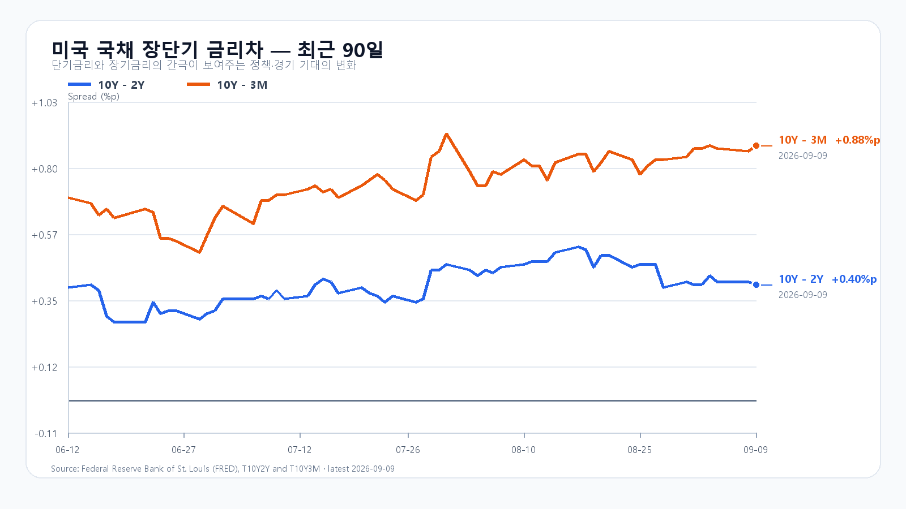
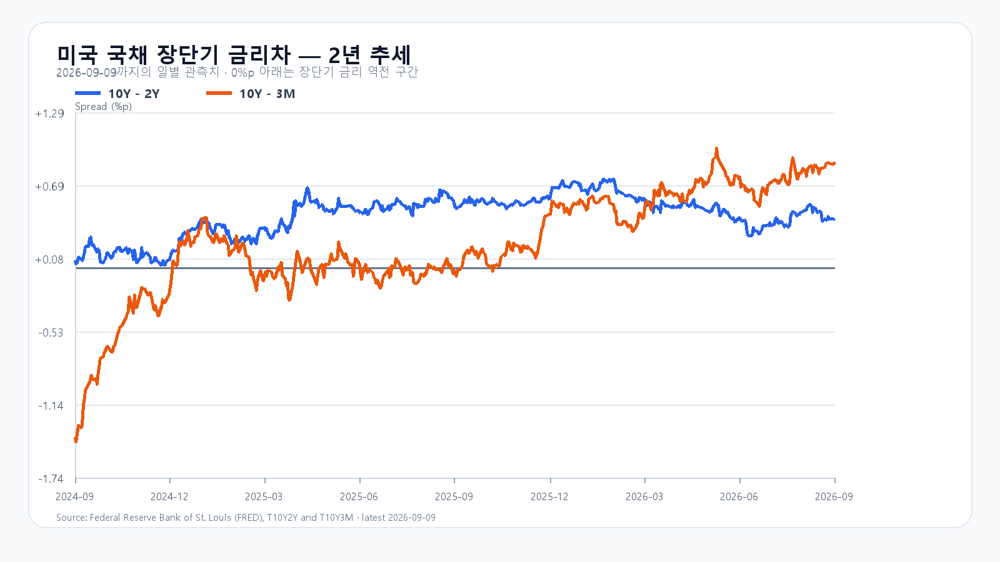

# 유가 100달러의 압력 속, KOSPI 7,000선의 변수는 SK하이닉스

- 작성: 2026-09-10T08:28:11+09:00; 데이터 최종 확인: 2026-09-10T08:24:41+09:00; 한국 개장 전.
- 수치는 출처 관측값이며 시나리오·확률·대응점수는 조건부 분석이다.
- 전일 KOSPI 7,051.64 종가는 직전 장전판 기본 구간 안, 일중 고가·저가는 전체 경로 안에 들어왔다. 확정 수급은 미확인으로 보존했다.

유가가 다시 100달러를 넘자 미국 증시는 일제히 밀렸다. 9월 9일 S&P500은 0.5%, Nasdaq은 0.6% 내렸고 10년물 국채금리는 4.84%까지 올랐다. 장기금리와 유가가 함께 오르는 날에는 반도체의 밸류에이션과 한국의 수입물가가 동시에 부담을 받는다.

그렇다고 미국장의 하락을 그대로 서울에 옮겨 적기는 어렵다. 전날 KOSPI는 7,051.64로 1.40% 올랐고 KODEX 레버리지는 3.06% 상승했다. SK하이닉스는 정규장에서 3.51% 올랐고, 장전 NXT에서도 1.45% 강세를 유지했다. 반면 삼성전자는 NXT에서 0.37% 내렸다. 미국에서 Nvidia와 Broadcom이 약세였지만 SOXX·SMH·AMD·Micron은 버텼다는 점은 반도체 안에서도 일방향 신호가 아니라는 뜻이다.

다만 SK하이닉스 한 종목의 강세를 범용 반도체 수요의 전면 회복으로 읽을 단계는 아니다. TrendForce는 DDR5 현물 조달이 여전히 제한적이라고 짚었다. 반면 DDR4 1Gx8 3200은 한 주 동안 1.78% 올랐고, NAND TLC 웨이퍼는 2.71% 내렸다. 메모리 가격은 품목별로 갈린다. 오늘 장에서도 삼성전자가 반등해 강세가 넓어지는지, 외국인·프로그램 매수가 뒤따르는지를 따로 봐야 한다.

중국의 8월 CPI는 전년 대비 0.8%, PPI는 3.8% 올랐다. 원자재와 제조업 가격의 반등은 중국 수요 측면에서는 긍정적이지만, 지금처럼 유가가 높은 국면에서는 세계 물가와 금리 기대를 다시 자극한다. 원/달러가 1,341.00원으로 전일 대비 0.04% 내린 점은 당장의 완충재다.

오늘의 기본 경로는 KOSPI 7,000~7,150이다. SK하이닉스의 장전 강세가 정규장으로 이어지고 삼성전자도 반등해 7,000을 지키면 7,150 위를 시험할 수 있다. 반대로 유가와 장기금리 부담이 반도체 매도로 번지거나 외국인·프로그램 수급이 함께 돌아서면 7,000 아래의 변동성이 커진다. KODEX 레버리지는 112,500원을 첫 지지선으로, 115,000원 회복 여부와 전일 고점 117,925원 부근을 차례로 확인할 가격대다.

오늘 밤 21시 30분 KST에는 미국 8월 PPI가 나온다. 다음 날 같은 시각 CPI, 9월 15~16일에는 FOMC가 이어진다. SK하이닉스의 강세가 이어져도 이 일정 전의 급등은 유가·금리 변수와 함께 읽어야 한다.

## 장전 가격

|항목|가격·변화|출처 기준 시각|
|---|---:|---|
|삼성전자 NXT|268,500원 · -0.37%|9월 10일 08:24:41 KST 조회|
|SK하이닉스 NXT|1,883,000원 · 1.45%|9월 10일 08:24:41 KST 조회|
|달러/원 하나은행 고시|1,341.00원 · -0.04%|2026-09-10T07:22:45+09:00|
|Nasdaq100 선물|29,422.25 · -0.090%|2026-09-10T08:14:34+09:00 지연 시세|
|S&P500 선물|7,646.50 · +0.036%|2026-09-10T08:14:28+09:00 지연 시세|
|브렌트 선물|102.07 · +0.850%|2026-09-10T08:14:37+09:00 지연 시세|
|WTI 선물|97.08 · +1.072%|2026-09-10T08:14:37+09:00 지연 시세|

[NXT](https://stock.naver.com/api/polling/domestic/NXT/stock?itemCodes=005930,000660) · [환율](https://api.stock.naver.com/marketindex/exchange/FX_USDKRW) · [Nasdaq100 선물](https://finance.yahoo.com/quote/NQ=F/) · [S&P500 선물](https://finance.yahoo.com/quote/ES=F/) · [브렌트](https://finance.yahoo.com/quote/BZ=F/) · [WTI](https://finance.yahoo.com/quote/CL=F/)

NXT는 정규장과 별도 시장이고 선물은 지연 시세다.

## 취재 근거

# 2026-09-10 장전 취재 노트

## 기준 시각과 시장 상태

- 원시 시세 수집: 2026-09-10 08:24:41 KST. 한국 정규장은 개장 전이며, NXT는 별도 장외시장 호가다.
- 전일 한국 정규장: KOSPI 7,051.64(+1.40%), 고가 7,112.48·저가 6,968.06. KODEX 레버리지 115,580원(+3.06%), 고가 117,925원·저가 112,430원. 삼성전자 269,500원(0.00%), SK하이닉스 1,856,000원(+3.51%). Naver Finance 원시 응답은 `KOSPI.json`, `122630.json`, `005930.json`, `000660.json`에 보존.
- 장전 NXT: 삼성전자 268,500원(-0.37%), SK하이닉스 1,883,000원(+1.45%), NXT 서버 시각 08:24:41 KST. 정규장 종가와 혼용하지 않는다.
- 달러/원: 하나은행 고시 1,341.00원(-0.04%), 07:22:45 KST.
- 지연 선물: Nasdaq100 29,430.25(-0.06%), S&P500 7,646.75(+0.04%), 브렌트 101.99달러(+0.77%), WTI 96.98달러(+0.98%). 07:54~07:55 KST 원시 시각. `yahoo-NQF.json` 등 참조.

## 이슈 레이더

|순위|사건|확정된 범위|한국 전달 경로|판정|
|---:|---|---|---|---|
|1|유가 100달러 재돌파와 금리 상승|AP는 9월 9일 브렌트가 100달러를 다시 넘고 S&P500 -0.5%, Nasdaq -0.6%를 보도했다. 10년물은 4.84%, 2년물은 4.43%로 올랐다.|수입물가·장기금리 상단 부담, PPI 직전 위험회피|주도 이슈|
|2|국내 메모리주의 장전 엇갈림|전일 SK하이닉스 +3.51%에 이어 NXT +1.45%, 삼성전자 NXT -0.37%.|SK하이닉스 강세가 지수 전반으로 번지는지 확인 필요|주도 이슈|
|3|미국 반도체의 내부 분화|9월 9일 SOXX +0.68%, SMH +0.10%, AMD +3.04%, Micron +2.75%인 반면 Nvidia -0.91%, Broadcom -1.13%.|메모리와 반도체 전반을 같은 방향으로 해석하지 못하게 하는 제약|보강 이슈|
|4|중국 물가의 반등|중국 국가통계국 발표 기반으로 8월 CPI +0.8% YoY·+0.4% MoM, PPI +3.8% YoY·+0.4% MoM.|중국 수요·원자재 가격 압력 동반 재개|보강 이슈|
|5|메모리 현물 품목별 분화|TrendForce 9월 9일: DDR5 조달량은 제한적, DDR4 1Gx8 3200은 44.57달러에서 45.36달러로 주간 +1.78%, TLC 웨이퍼는 주간 -2.71%.|메모리 공급 여건은 지지하지만 범용 수요 회복과 동일시할 수 없음|보강 이슈|
|6|미국 물가·FOMC 일정|BLS: 미국 8월 PPI 9월 10일 08:30 ET(21:30 KST), CPI 9월 11일 08:30 ET. 연준: 9월 15~16일 FOMC.|국내 장 마감 뒤 금리·환율 재가격 위험|체크포인트|

## 수치·원문 근거

- [AP 미국장 마감](https://apnews.com/article/wall-street-stocks-dow-nasdaq-31c966aef214740b8fec71e399a051b8), [AP 유가·국채금리 상세](https://apnews.com/article/d1284eb72934a3b076c14449bc087fbd), 2026-09-09 미국 정규장.
- [TrendForce 메모리 현물 업데이트](https://www.trendforce.com/news/2026/09/09/insights-memory-spot-price-update-ddr4-mainstream-prices-rise-1-78-on-2gx8-orders-ddr5-demand-remains-limited/), 2026-09-09.
- [중국 국가통계국 발표 전재](https://english.scio.gov.cn/pressroom/2026-09/09/content_118687246.html), 2026-09-09.
- [BLS PPI 일정](https://www.bls.gov/schedule/news_release/ppi.htm), [BLS CPI](https://www.bls.gov/cpi/), [연준 FOMC 일정](https://www.federalreserve.gov/monetarypolicy/fomccalendars.htm).
- FRED 수집 2026-09-10: T10Y2Y 9월 9일 +0.40%p, T10Y3M +0.88%p; DGS2 9월 8일 4.39%, DGS10 4.80%, DGS3MO 3.94%. `scripts/update_yield_spreads.py` 출력.

## 작가용 판단

- 중심 명제 후보: 유가와 금리가 지수의 상단을 누르는 가운데 SK하이닉스만 장전 강세를 유지해, 7,000선 하단의 지지가 반도체 전반으로 넓어지는지 확인이 필요하다. 오늘 밤 PPI 전에는 7,150선 위를 추세로 단정하지 않는다.
- 전일 KOSPI 7,051.64는 9월 9일 공개 전망의 기본 종가 구간 6,900~7,100 안에 들었다. 전일 고가·저가도 전체 경로 6,600~7,350 안이다. 최종 현물·프로그램·시장폭 수급 원천은 확보하지 못했으며 0으로 채우지 않는다.
- EWY·ADR는 전일 한국장과 시차가 섞일 수 있어 오늘 독립 충격으로 더하지 않는다.

