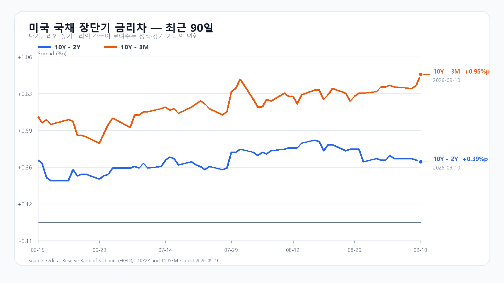
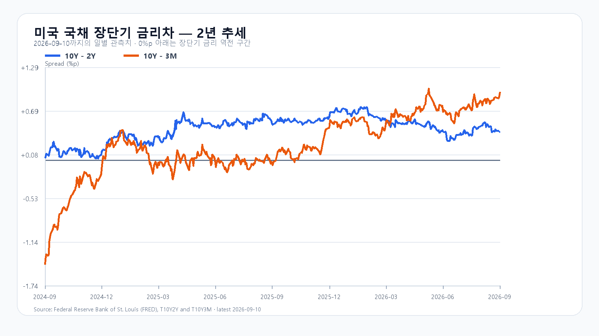

# 2026-09-11 KOSPI·KODEX 일일 리서치

작성 2026-09-11T08:21:29+09:00 / 데이터 최종 확인 2026-09-11T08:21:06+09:00 / 한국 개장 전.

확정 수치는 출처 시각 기준이다. 시나리오·확률·대응점수는 조건부 분석이다. 전일 종가 7,033.92는 직전 기본 구간 안, 경로 6,898.45~7,072.79는 예상 경로 안이었다. 15:20 이전 트리거 원문은 없어 미확인으로 보존했다.

KOSPI가 전날 지켜 낸 7,000선을 다시 시험받는다. 미국 반도체주가 일제히 하락한 뒤 삼성전자와 SK하이닉스도 NXT 장전 거래에서 함께 밀렸다. 유가와 미국 국채금리 상승에 원화 약세까지 겹쳐, 오늘은 반등의 크기보다 개장 뒤 매도가 줄어드는지가 먼저다.

## 유가가 올리고, 금리가 누른다

9월 10일 브렌트유는 6.3% 오른 배럴당 107.63달러에 정산됐다. 미국과 이란의 해운 공격 확대는 에너지 수입 의존도가 높은 한국에 비용 부담을 더한다. 전날 한국장에 반영된 유가 100달러 돌파에 이어, 밤사이 상승폭이 더 커졌다는 점이 새 악재다. [AP 시장 마감](https://apnews.com/article/stocks-markets-oil-trump-rates-7fbc77061abd778608068d3beb1bbbaf)

미국 8월 생산자물가(PPI)는 전월 대비 0.4%, 전년 대비 5.4% 상승했다. 최종수요 에너지 가격이 4.2%, 디젤연료가 24.1% 뛰었다. 반면 서비스 상승률은 0.1%였다. 생산단계 에너지 비용이 오른 상황에서 오늘 밤 소비자물가(CPI)가 금리 기대를 다시 흔들 수 있다. [미 노동통계국 PPI](https://www.bls.gov/news.release/ppi.nr0.htm)

미 재무부의 9월 10일 국채금리는 3개월 4.00%, 2년 4.56%, 10년 4.95%다. 하루 전보다 각각 5bp, 13bp, 12bp 올랐다. 10년-2년 금리차는 0.39%포인트로 1bp 좁아졌지만, 장기금리 자체가 오른 만큼 성장주 평가에는 부담이다. 10년-3개월 금리차는 0.95%포인트로 7bp 확대됐다. [미 재무부 일별 금리](https://home.treasury.gov/resource-center/data-chart-center/interest-rates/TextView?field_tdr_date_value_month=202609&type=daily_treasury_yield_curve) · [FRED 금리차](https://fred.stlouisfed.org/series/T10Y2Y)

## 미국 반도체, 시간외에도 회복은 작았다

미국 9월 10일 정규장은 11일 05:00 KST에 끝났다. 반도체 ETF가 나스닥100 ETF보다 크게 내렸고 Micron의 낙폭이 두드러졌다.

|종목|정규장 종가·달러|등락률|
|---|---:|---:|
|[QQQ](https://finance.yahoo.com/quote/QQQ/)|708.69|-1.06%|
|[TQQQ](https://finance.yahoo.com/quote/TQQQ/)|69.21|-3.27%|
|[SOXX](https://finance.yahoo.com/quote/SOXX/)|517.43|-2.74%|
|[SMH](https://finance.yahoo.com/quote/SMH/)|560.28|-2.44%|
|[Nvidia](https://api.nasdaq.com/api/quote/NVDA/info?assetclass=stocks)|218.36|-2.26%†|
|[AMD](https://finance.yahoo.com/quote/AMD/)|503.60|-3.36%|
|[Micron](https://finance.yahoo.com/quote/MU/)|977.41|-4.90%|
|[Broadcom](https://finance.yahoo.com/quote/AVGO/)|360.83|-0.97%|

† Nvidia는 배당락을 반영한 Nasdaq 등락률이며 나머지는 Yahoo Finance 표시 기준이다. SOXX는 장중 고점 522.50달러를 지키지 못하고 517.43달러로 마감했다. Micron도 고점 999.00달러에서 977.41달러로 밀렸다. 08:11~08:12 KST Nasdaq 시간외 스냅샷에서 이들 8종목의 정규장 종가 대비 변화는 -0.30~0.00%에 그쳤다. 정규장 매도를 뒤집을 만큼의 회복은 아니었다. [Nasdaq QQQ](https://api.nasdaq.com/api/quote/QQQ/info?assetclass=etf) · [TQQQ](https://api.nasdaq.com/api/quote/TQQQ/info?assetclass=etf) · [SOXX](https://api.nasdaq.com/api/quote/SOXX/info?assetclass=etf) · [SMH](https://api.nasdaq.com/api/quote/SMH/info?assetclass=etf) · [Nvidia](https://api.nasdaq.com/api/quote/NVDA/info?assetclass=stocks) · [AMD](https://api.nasdaq.com/api/quote/AMD/info?assetclass=stocks) · [Micron](https://api.nasdaq.com/api/quote/MU/info?assetclass=stocks) · [Broadcom](https://api.nasdaq.com/api/quote/AVGO/info?assetclass=stocks)

## AI 수요와 주식 가격은 다른 속도로 움직인다

Oracle의 2027회계연도 1분기 매출은 193억달러로 전년 대비 30% 늘었고, OCI 인프라 매출은 74억달러로 121% 증가했다. 잔여수행의무(RPO)는 6,640억달러다. AI 인프라 주문은 여전히 강하지만, 계약잔액이 당장 현금으로 들어오는 것은 아니다. 회사가 제시한 연간 설비투자 900억~950억달러와 분기 잉여현금흐름 -50억달러는 확장에 드는 자금 부담도 보여 준다. [Oracle 공식 실적](https://investor.oracle.com/files/content_files/1q27-pressrelease-September_FINAL.pdf)

TSMC의 8월 연결 매출도 전년 대비 53.3% 늘어난 5,148억600만 대만달러였다. 연산 수요가 사라졌다는 해석과는 거리가 있다. 다만 파운드리 매출이나 클라우드 계약잔액만으로 삼성전자·SK하이닉스의 HBM 주문량과 수익을 계산할 수는 없다. 메모리의 공급·가격 조건과 높은 금리에서 주식에 지불할 가격을 나눠 봐야 한다. [TSMC 월매출](https://investor.tsmc.com/english/monthly-revenue/2026)

메모리 현물은 품목별로 갈렸다. 9월 10일 19:10 KST 기준 DDR5 16Gb 평균은 54.333달러로 0.31%, DDR4 16Gb는 90.50달러로 0.55% 내렸다. 같은 용량의 eTT 제품은 각각 0.83%, 0.71% 올랐다. 9월 9일 공개 주간 집계의 512Gb TLC 웨이퍼는 20.146달러로 2.71% 하락했다. 범용 메모리 전체가 한 방향으로 오르는 장은 아니다. [TrendForce 현물표](https://www.trendforce.com/price/dram/lpddr_spot) · [주간 NAND·DRAM](https://www.trendforce.com/news/2026/09/09/insights-memory-spot-price-update-ddr4-mainstream-prices-rise-1-78-on-2gx8-orders-ddr5-demand-remains-limited/)

계약시장은 현물과 온도가 다르다. TrendForce는 3분기 범용 DRAM 계약가격이 전분기 대비 13~18% 오를 것으로 전망했다. HBM·서버 수요가 공급을 끌어가는 가운데 고용량 RDIMM의 가격 프리미엄은 줄고 있다. 기업용 SSD 수요의 강세도 소비자용 NAND 현물 약세와 구분해야 한다. 이처럼 메모리 수요가 유지돼도 금리와 주식 수급이 악화되면 주가는 먼저 내릴 수 있다. [TrendForce DRAM 산업 자료](https://www.trendforce.com/presscenter/news/20260907-13219.html) · [기업용 SSD](https://www.trendforce.com/presscenter/news/20260901-13211.html)

## 7,000선을 지켜도 외국인 매도는 남았다

9월 10일 KOSPI는 6,898.45까지 내려갔다가 7,033.92로 마감해 하루 낙폭을 0.25%로 줄였다. 고점은 7,072.79였다. KODEX 레버리지는 109,815~116,050원에서 움직인 뒤 115,000원에 마감했다. 오늘의 1차 지지는 전일 저점 109,815원, 반등 기준은 112,500원, 저항은 전일 종가 115,000원으로 둔다. 장전 악재로 지지선 아래에서 출발하면 109,815원은 회복 여부를 보는 선으로 바뀐다. [KOSPI 일봉](https://m.stock.naver.com/api/index/KOSPI/price?pageSize=20&page=1) · [KODEX 일봉](https://m.stock.naver.com/api/stock/122630/price?pageSize=10&page=1)

전일 외국인은 코스피 현물을 2조4,907억원 순매도했다. 개인은 3,622억원, 기관은 4,615억원 순매수했다. 프로그램은 차익 4,403억원 순매수에도 비차익이 2조9,761억원 순매도해 전체로는 2조5,358억원 순매도였다. 지수가 종가를 끌어올렸다고 외국인 매도까지 끝났다고 볼 수는 없다. [서울신문 KRX 마감 수급](https://m.seoul.co.kr/news/economy/securities/2026/09/10/20260910500232)

미국장에서 거래되는 한국 ETF·ADR의 등락에는 이미 끝난 한국장의 움직임이 섞인다. 오늘 추가로 부담이 된 것은 한국장 마감 뒤의 PPI, 유가·국채금리 상승과 미국 반도체 매도다. NXT 가격은 그 재료가 국내 메모리주에 전달되는 모습을 보여 준다. 개장 후에는 은행 고시환율과 별도로 외국인 현물·프로그램 수급이 같은 방향으로 움직이는지 살펴야 한다.

## 오늘의 가격 조건

대응 비중은 공격 15, 관망 45, 방어 40으로 둔다. 아래 확률은 각 종가 구간에 대한 조건부 전망이며 대응 비중과 구분한다.

|시나리오|종가 범위·확률|성립 조건|무효화|
|---|---|---|---|
|기본|6,800~7,000 · 50%|6,800 이상, 7,000 이하, 외국인 현물 순매도 1조원 이내|6,800 이탈 또는 7,000 돌파|
|강세|7,000 초과~7,150 · 20%|7,000 돌파, 외국인 현물 순매수, 프로그램 전체 순매수|7,000 아래 재진입|
|약세|6,550~6,800 미만 · 30%|6,800 이탈, 외국인 현물 순매도, 프로그램 전체 순매도|6,800 회복|

별도 장중 예상 범위는 6,450~7,250이며 명목 포괄 수준은 90%다. 실제 장중 변동은 이 범위를 벗어날 수 있다. 09:30에는 시초가 이후 메모리주의 낙폭과 6,800 방어, 10:00에는 외국인·프로그램 매매의 동행 여부, 14:00에는 수급이 반전했는지를 다시 본다. 조건 관측 마감은 15:20이다.

오늘 밤 21:30 KST 미국 8월 CPI가 나온다. 다음 주요 일정은 9월 16일 21:30 소매판매·수출입물가, 17일 03:00 FOMC 결정과 경제전망, 03:30 기자회견이다. 오늘 한국장은 CPI 발표 전에 끝나므로 발표 결과에 대한 위험은 주말과 다음 거래일로 이어진다. [BLS CPI 일정](https://www.bls.gov/schedule/news_release/cpi.htm) · [미 Census 일정](https://www.census.gov/economic-indicators/calendar-listview.html) · [연준 FOMC 일정](https://www.federalreserve.gov/monetarypolicy/fomccalendars.htm)

## 장전 가격

|항목|가격·변화|출처 시각|
|---|---:|---|
|삼성전자 NXT|259,500원 · -3.53%|2026-09-11T08:21:07.100309+09:00|
|SK하이닉스 NXT|1,791,000원 · -3.35%|2026-09-11T08:21:07.100318+09:00|
|달러/원 하나은행 고시|1,351.00원 · 0.75%|2026-09-11T07:57:55+09:00|
|Nasdaq100 선물|29,106.25 · -0.100%|2026-09-11T08:11:03+09:00 · 지연 시세|
|S&P500 선물|7,600.25 · +0.023%|2026-09-11T08:11:02+09:00 · 지연 시세|
|브렌트 선물|108.90 · +1.180%|2026-09-11T08:10:40+09:00 · 지연 시세|
|WTI 선물|103.79 · +1.278%|2026-09-11T08:11:01+09:00 · 지연 시세|

[NXT](https://stock.naver.com/api/polling/domestic/NXT/stock?itemCodes=005930,000660) · [환율](https://api.stock.naver.com/marketindex/exchange/FX_USDKRW) · [Nasdaq100 선물](https://finance.yahoo.com/quote/NQ=F/) · [S&P500 선물](https://finance.yahoo.com/quote/ES=F/) · [브렌트](https://finance.yahoo.com/quote/BZ=F/) · [WTI](https://finance.yahoo.com/quote/CL=F/)

NXT는 국내 정규장과 별도 시장이다. 환율은 은행 고시이며 선물은 지연 시세다.

## 취재 근거와 확인 시각

# 2026-09-11 장전 해외·이슈 취재 노트

> 내부 취재용. 공개 원고가 아니다. 숫자와 사실은 아래 적힌 시장 구간·확인 시각에만 유효하다.

## 0. 조사 범위와 기준

- 조사 기준 시각: **2026-09-11 08:02:46~08:10 KST**.
- 미국 시세 구간: **2026-09-10 정규장 종가(16:00 EDT = 2026-09-11 05:00 KST)**와 **19:11~19:12 EDT(08:11~08:12 KST) Nasdaq 시간외 스냅샷**을 분리했다. OHLC 원시자료는 08:02:46 KST 수집본이다.
- 국내 판단 구간: 9월 10일 KOSPI 정규장 확정치, 9월 11일 08:02 KST NXT·외환·지수 상태.
- 뉴스 신규성 기준선: 직전 보고서 원시자료 수집 시각인 **2026-09-10 08:24 KST 이후**.
- 원시 응답: 이 폴더의 `KOSPI-fresh.json`, `FX.json`, `NXT.json`, `yahoo-*.json`. 각 파일에 요청 URL, 수집시각, 원문 해시가 있다.

## 1. 국내 거래일과 전일 정산

### 거래일 확인

- **2026-09-11(금)은 국내 정규장 거래일로 판단한다.** KRX는 주중 영업일에 개장하고 토·일요일, 공휴일, 근로자의 날, 연말 휴장일에 휴장한다고 안내한다. 9월 11일은 해당 휴장 사유가 아니다. [KRX 시장운영 안내](https://global.krx.co.kr/contents/GLB/06/0602/0602010201/GLB0602010201T1.jsp)
- 실시간 상태 교차 확인: 08:02:47 KST 네이버 KOSPI 응답은 `PREOPEN`, NXT 삼성전자·SK하이닉스 응답은 `OPEN/preMarket`이었다. [KOSPI 상태 API](https://m.stock.naver.com/api/index/KOSPI/basic) · [NXT 상태 API](https://stock.naver.com/api/polling/domestic/NXT/stock?itemCodes=005930,000660)

### 9월 10일 확정치

| 항목 | 값 | 출처·확인 경계 |
|---|---:|---|
| KOSPI | O 7,038.85 / H 7,072.79 / L 6,898.45 / **C 7,033.92, -0.25%** | 08:04:44 KST 재조회 [네이버 일봉 API](https://m.stock.naver.com/api/index/KOSPI/price?pageSize=20&page=1); [서울신문의 KRX 마감치](https://m.seoul.co.kr/news/economy/securities/2026/09/10/20260910500232)로 교차 확인 |
| KODEX 레버리지(122630) | **115,000원, -0.50%** | 08:02:46 KST [네이버 일봉 API](https://m.stock.naver.com/api/stock/122630/price?pageSize=10&page=1) |
| 외국인/개인/기관 | **-2조4,907억원 / +3,622억원 / +4,615억원** | 9/10 KRX 마감 인용 [서울신문](https://m.seoul.co.kr/news/economy/securities/2026/09/10/20260910500232) |
| 프로그램 | 차익 **+4,403억원**, 비차익 **-2조9,761억원**, 합계 **-2조5,358억원** | 같은 출처 |

- 최초 지수 일봉 엔드포인트가 9월 9일에서 멈춘 상태였으나, 08:04:44 KST `pageSize=20` 재조회에서 9월 10일 봉을 확보했다. `basic`의 7,033.92는 08:02 장전 현재가가 아니라 **전일 종가 이월값**이다.

### 9월 11일 장전 전달 확인

| 항목 | 08:02 KST 값 | 해석 경계 | 출처 |
|---|---:|---|---|
| 삼성전자 NXT | **260,000원, -3.35%**; O 260,000 / H 264,000 / L 257,500; 거래량 466,595 | NXT 프리마켓 스냅샷, KRX 시가 아님 | [NXT API](https://stock.naver.com/api/polling/domestic/NXT/stock?itemCodes=005930,000660) |
| SK하이닉스 NXT | **1,784,000원, -3.72%**; O 1,800,000 / H 1,800,000 / L 1,769,000; 거래량 97,356 | 같은 경계 | 같은 출처 |
| USD/KRW | **1,351.00원, +10.00원(+0.75%)**; 제공처 표시시각 07:57:55 KST | 장중 환율 스냅샷 | [네이버·하나은행 환율 API](https://api.stock.naver.com/marketindex/exchange/FX_USDKRW) |

## 2. 미국 9월 10일 정규장·시간외

정규장 등락률은 Yahoo 응답의 `regularMarketChangePercent`, 시간외 등락률은 08:02:46 KST `fulldayPrice`와 정규장 종가로 계산했다. `chartPreviousClose`는 5일 조회 시작 전 값이므로 일간 등락 계산에 쓰지 않았다.

| 종목 | 정규장 O / H / L / C (USD) | 정규장 | 거래량 | Nasdaq 시간외 / 종가 대비·시각 | 원천 |
|---|---:|---:|---:|---:|---|
| QQQ | 707.57 / 712.06 / 706.86 / **708.69** | **-1.06%** | 30,814,129 | **707.9169 / -0.11%, 19:11 EDT** | [Yahoo OHLC](https://query1.finance.yahoo.com/v8/finance/chart/QQQ?range=5d&interval=1d&includePrePost=true) · [Nasdaq 시세](https://api.nasdaq.com/api/quote/QQQ/info?assetclass=etf) |
| TQQQ | 68.90 / 70.23 / 68.68 / **69.21** | **-3.27%** | 54,833,615 | **69.0000 / -0.30%, 19:11 EDT** | [Yahoo OHLC](https://query1.finance.yahoo.com/v8/finance/chart/TQQQ?range=5d&interval=1d&includePrePost=true) · [Nasdaq 시세](https://api.nasdaq.com/api/quote/TQQQ/info?assetclass=etf) |
| SOXX | 518.32 / 522.50 / 514.31 / **517.43** | **-2.74%** | 6,462,586 | **516.5000 / -0.18%, 19:11 EDT** | [Yahoo OHLC](https://query1.finance.yahoo.com/v8/finance/chart/SOXX?range=5d&interval=1d&includePrePost=true) · [Nasdaq 시세](https://api.nasdaq.com/api/quote/SOXX/info?assetclass=etf) |
| SMH | 561.39 / 565.14 / 557.09 / **560.28** | **-2.44%** | 6,248,436 | **559.7300 / -0.10%, 19:11 EDT** | [Yahoo OHLC](https://query1.finance.yahoo.com/v8/finance/chart/SMH?range=5d&interval=1d&includePrePost=true) · [Nasdaq 시세](https://api.nasdaq.com/api/quote/SMH/info?assetclass=etf) |
| NVDA | 220.49 / 220.99 / 217.20 / **218.36** | **-2.26%†** | 100,845,811 | **218.3585 / -0.00%, 19:12 EDT** | [Yahoo OHLC](https://query1.finance.yahoo.com/v8/finance/chart/NVDA?range=5d&interval=1d&includePrePost=true) · [Nasdaq 시세](https://api.nasdaq.com/api/quote/NVDA/info?assetclass=stocks) |
| AMD | 508.70 / 516.33 / 502.92 / **503.60** | **-3.36%** | 15,908,424 | **502.7300 / -0.17%, 19:12 EDT** | [Yahoo OHLC](https://query1.finance.yahoo.com/v8/finance/chart/AMD?range=5d&interval=1d&includePrePost=true) · [Nasdaq 시세](https://api.nasdaq.com/api/quote/AMD/info?assetclass=stocks) |
| MU | 996.78 / 999.00 / 973.50 / **977.41** | **-4.90%** | 25,554,875 | **975.1500 / -0.23%, 19:11 EDT** | [Yahoo OHLC](https://query1.finance.yahoo.com/v8/finance/chart/MU?range=5d&interval=1d&includePrePost=true) · [Nasdaq 시세](https://api.nasdaq.com/api/quote/MU/info?assetclass=stocks) |
| AVGO | 360.02 / 365.27 / 357.78 / **360.83** | **-0.97%** | 21,364,163 | **360.2000 / -0.17%, 19:12 EDT** | [Yahoo OHLC](https://query1.finance.yahoo.com/v8/finance/chart/AVGO?range=5d&interval=1d&includePrePost=true) · [Nasdaq 시세](https://api.nasdaq.com/api/quote/AVGO/info?assetclass=stocks) |

확인된 사실:

- 반도체 ETF와 메모리 주식이 나스닥보다 크게 하락했다. 특히 **MU -4.90%**, **AMD -3.36%**, **SOXX -2.74%**가 약했다.
- 08:11~08:12 KST Nasdaq 시간외에는 대상 8종 모두 종가 대비 **-0.30~0.00%** 범위였다. 정규장 낙폭을 되돌리는 후속 매수는 확인되지 않았다.
- † NVDA는 9월 10일 배당락이었다. Nasdaq은 배당 조정 전일종가 **223.42달러** 대비 **-2.26%**로 표시한다. Yahoo 일봉의 9월 9일 비조정 종가 **223.67달러**로 단순 계산하면 -2.37%이므로 공개 원고에는 거래소 표기 -2.26%와 배당락 주석을 사용한다.
- NQ 선물은 07:52:44 KST **29,111.75(-0.08%)**, ES 선물은 **7,600.25(+0.02%)**였다. 이는 다음 선물 세션 스냅샷이며 미국 정규장 종가가 아니다. [NQ Yahoo JSON](https://query1.finance.yahoo.com/v8/finance/chart/NQ%3DF?range=1d&interval=1m&includePrePost=true) · [ES Yahoo JSON](https://query1.finance.yahoo.com/v8/finance/chart/ES%3DF?range=1d&interval=1m&includePrePost=true)

## 3. 메모리 현물·계약가격과 제품별 차별화

### 9월 10일 현물: 거래 부진 속 품목별 혼조

- TrendForce/DRAMeXchange 현물표의 최종 갱신은 **2026-09-10 18:10 GMT+8(19:10 KST)**이다. 공개 표 기준 평균값과 당일 변화는 다음과 같다. [TrendForce DRAM 현물·계약가격 표](https://www.trendforce.com/price/dram/lpddr_spot)

| 품목 | 세션 평균(USD) | 세션 변화 | 판독 |
|---|---:|---:|---|
| DDR5 16Gb 4800/5600 | **54.333** | **-0.31%** | 브랜드 제품 견적 소폭 하락 |
| DDR5 16Gb eTT | **24.20** | **+0.83%** | 테스트 다이 계열은 상승 |
| DDR4 16Gb 3200 | **90.50** | **-0.55%** | 브랜드 제품 약세 |
| DDR4 16Gb eTT | **12.30** | **+0.71%** | eTT는 상승 |
| DDR4 8Gb 3200 | **45.279** | **-0.09%** | 주류 브랜드 가격 소폭 하락 |
| DDR4 8Gb eTT | **5.22** | **+1.75%** | 특정 저가·다이 품목 강세 |

- 9월 10일 Daily Express는 DDR5 일부 용량 견적이 소폭 내려갔고, 매수자는 관망했으며 문의와 거래가 부진했다고 요약한다. 즉 **DDR4 또는 DDR5 전체가 일괄 상승한 날이 아니라, 실제 주문이 붙은 일부 다이만 오른 혼조 장세**다. [TrendForce 공개 요약](https://www.trendforce.com/presscenter)
- 9월 9일 주간 자료에서는 주류 DDR4 1Gx8 3200 평균이 9월 2일 **44.57달러**에서 9월 8일 **45.36달러(+1.78%)**로 상승했지만, DDR5 구매량은 여전히 제한적이었다. 9월 10일 일간 가격의 소폭 하락과 함께 보면 DDR4 강세도 전 품목 추세가 아닌 선택적 주문 효과다. [TrendForce 주간 현물 분석](https://www.trendforce.com/news/2026/09/09/insights-memory-spot-price-update-ddr4-mainstream-prices-rise-1-78-on-2gx8-orders-ddr5-demand-remains-limited/)

### NAND: 서버·기업용과 소비자 현물의 방향이 다름

- 최신 공개 주간 수치에서 **512Gb TLC 웨이퍼 현물은 20.146달러, 주간 -2.71%**였다. 공급자의 가격 유연성 확대에도 소비자 최종수요와 구매량이 약했다. [TrendForce 9월 9일 현물 분석](https://www.trendforce.com/news/2026/09/09/insights-memory-spot-price-update-ddr4-mainstream-prices-rise-1-78-on-2gx8-orders-ddr5-demand-remains-limited/)
- 반면 AI 서버·CSP용 enterprise SSD는 계약가격 조기 확정과 물량 증가가 이어졌다. 상위 5개 기업용 SSD 공급사 2분기 매출은 **375.9억달러, 전분기 대비 +103.6%**로 집계됐다. 이는 NAND 전체의 가격 강세가 아니라 **기업용 SSD 강세와 소비자·웨이퍼 현물 약세의 분리**를 뜻한다. [TrendForce 9월 1일 공식 발표](https://www.trendforce.com/presscenter/news/20260901-13210.html)
- 9월 10일 Daily Express의 전체 본문은 로그인 뒤에 있어 NAND 당일 설명을 직접 열지 못했다. 따라서 NAND는 9월 9일 공개 주간 수치를 최신 검증값으로 사용하며, 8월 31일 표를 9월 10일 값처럼 쓰지 않는다.

### 계약시장·HBM·서버 DRAM

- TrendForce의 9월 7일 공식 자료는 3분기 **범용 DRAM 계약가격 상승률을 +13~18% QoQ**로 전망한다. 상승세는 이어지지만 고용량 RDIMM에서 저용량으로 수요가 이동하고 PC·스마트폰 고객의 추가 인상 흡수력이 떨어져 상승률이 둔화될 수 있다는 조건이 붙는다. [TrendForce DRAM 산업 자료](https://www.trendforce.com/presscenter/news/20260907-13219.html)
- 7월에 발표된 3분기 계약가격 전망은 범용 DRAM **+13~18% QoQ**, NAND Flash **+10~15% QoQ**였다. 이는 분기 전망이며 9월 10일 일간 현물 변화와 섞어 쓰지 않는다. [TrendForce 3분기 메모리 가격 전망](https://www.trendforce.com/presscenter/news/20260703-13134.html)
- 9월 9일 DRAM Bulletin은 **고용량 RDIMM 프리미엄 축소**, 현물의 제한적 실거래를 확인했다. 동시에 cHBM은 AI 칩 면적·성능 이점이 있지만 전력·열, 멀티소싱, 개발비 부담 때문에 초기 도입이 주요 하이퍼스케일러에 제한된다고 평가한다. [TrendForce DRAM Bulletin](https://www.trendforce.com/research/download/RP260909QB)
- 2분기 공급사 자료에서 삼성전자는 HBM4 양산·출하의 조기 전환으로 3사 중 비트 출하 증가가 가장 컸고, SK하이닉스는 3사 중 HBM 비트 비중이 가장 높았으며, Micron은 공급 제약 속 서버 DRAM을 우선했다. 이는 **HBM·서버 펀더멘털 강세**를 확인하지만, 9월 10일 DDR 현물 부진을 부정하지 않는다. [TrendForce 9월 7일 공식 자료](https://www.trendforce.com/presscenter/news/20260907-13219.html)
- 2026년 HBM과 RDIMM은 DRAM 비트 공급의 **51%**를 차지할 것으로 추정되고, 일부 2분기 장기계약에는 가격 상한이 포함됐다. TrendForce는 HBM 계약가격이 2027년에 **+70~140%** 오를 수 있다고 전망하지만 이는 장기 전망이며 9월 10일 일일 가격이 아니다. [TrendForce 8월 25일 공식 자료](https://www.trendforce.com/presscenter/news/20260825-13198.html)
- 공개 계약가격 숫자는 시차가 있다. 페이지는 8월 계약가격 업데이트가 8월 31일 이뤄졌다고 알리지만 상세표는 유료이며, 공개 숫자표는 7월 31일 값으로 남아 있다. 따라서 ‘8월 계약가격’의 정확한 제품별 숫자는 기재하지 않는다.

### 국내 메모리주에 대한 함의

- **긍정:** HBM4·서버 RDIMM·enterprise SSD 수요와 계약시장은 구조적으로 강하다. Oracle OCI/RPO와 TSMC 월매출도 AI 인프라 수요 자체가 꺾였다는 주장을 반박한다.
- **부정:** 최신 현물은 거래량이 약하고 DDR5·DDR4 브랜드 제품이 동반 소폭 하락했으며, 소비자 NAND 웨이퍼도 약하다. 이는 범용 메모리 가격을 HBM과 같은 방향으로 묶을 수 없다는 근거다.
- **주가 판단:** 펀더멘털과 밤사이 주가 수급을 분리한다. HBM·서버의 중기 강세가 MU -4.90%, SOXX -2.74%, NXT 삼성전자·SK하이닉스 -3%대라는 당일 위험회피 신호를 즉시 상쇄하지는 않는다.

## 4. 금리·유가·물가·환율

### 미국 국채

미 재무부 일별 수익률의 9월 10일 확정 행:

| 만기 | 9/9 | 9/10 | 일간 변화 |
|---|---:|---:|---:|
| 3개월 | 3.95% | **4.00%** | **+5bp** |
| 2년 | 4.43% | **4.56%** | **+13bp** |
| 10년 | 4.83% | **4.95%** | **+12bp** |

- **10년-2년 = +0.39%p**, **10년-3개월 = +0.95%p**.
- 출처: [미 재무부 2026년 9월 일별 국채 수익률](https://home.treasury.gov/resource-center/data-chart-center/interest-rates/TextView?field_tdr_date_value_month=202609&type=daily_treasury_yield_curve), 08:05 KST 확인.
- FRED의 9월 10일 스프레드도 각각 +0.39%p, +0.95%p였으나 절대금리 DGS 계열은 확인 당시 9월 9일까지였다. 절대금리는 미 재무부 원표를 우선했다.

### 생산자물가

- 9월 10일 21:30 KST 발표된 미국 8월 최종수요 PPI는 **전월 대비 +0.4%, 전년 대비 +5.4%**였다. 7월은 +0.1%, 6월은 -0.1%로 제시됐다.
- 최종수요 상품 **+1.1%**, 에너지 **+4.2%**, 디젤연료 **+24.1%**, 서비스 **+0.1%**. 식품·에너지·무역서비스 제외는 **+0.3% m/m, +4.7% y/y**였다.
- 전월비 헤드라인은 시장 예상에 대체로 부합했고 전년비는 Reuters 조사 5.3%보다 0.1%p 높았다. 따라서 전체 지표를 ‘전면적 서프라이즈’로 표현하면 안 된다.
- 원문: [BLS PPI 보도자료](https://www.bls.gov/news.release/ppi.nr0.htm) · [미 노동부 PDF](https://www.dol.gov/newsroom/economicdata/ppi_09102026.pdf). 시장 반응 교차 확인: [AP](https://apnews.com/article/producer-prices-inflation-economy-iran-66d1591b979271ee7b79b113d715f6ef).

### 원유·해운

- 9월 10일 Brent는 **+6.3%, 배럴당 107.63달러에 정산**, 장중 108달러를 웃돌았다. 직전 보고서의 9월 9일 정산가 101.21달러에서 신규 악화다. [AP 시장·유가 마감](https://apnews.com/article/stocks-markets-oil-trump-rates-7fbc77061abd778608068d3beb1bbbaf)
- WTI 2026년 10월물은 보조 시세표에서 **102.76달러, +6.99%**로 정산 표시됐다. O/H/L은 **96.09/103.00/95.39달러**다. CME 공식 정산표가 동적이라 본문 값을 직접 추출하지 못했으므로 보조 원천값으로 분류한다. [Investing의 CME 계약 표](https://za.investing.com/commodities/crude-oil-historical-data?cid=1178037) · [CME 공식 정산 페이지](https://www.cmegroup.com/markets/energy/crude-oil/light-sweet-crude.settlements.html)
- 9월 11일 07:52~07:49 KST 다음 선물 세션에서 WTI는 **103.88달러(+1.37%)**, Brent는 **108.95달러(+1.23%)**였다. [WTI Yahoo JSON](https://query1.finance.yahoo.com/v8/finance/chart/CL%3DF?range=1d&interval=1m&includePrePost=true) · [Brent Yahoo JSON](https://query1.finance.yahoo.com/v8/finance/chart/BZ%3DF?range=1d&interval=1m&includePrePost=true)
- 이란·미국 간 유조선 공격이 확대됐고, 후티의 예멘 모카항 장악 보도로 Hormuz뿐 아니라 Bab el-Mandeb 우회축 위험도 커졌다. 다만 실제 통항량, 한국향 물량 감소폭, 개별 선사의 운항 중단은 확인하지 못했다. [Reuters 해운공격 미러](https://ca.investing.com/news/commodities-news/iran-and-us-hit-tankers-in-biggest-wave-of-attacks-on-shipping-since-war-began-4833843) · [AP 후티 보도](https://apnews.com/article/e4e799701b382799a955969c212800ea)

## 5. 이슈 레이더: 후보 9건과 선정

점수는 `직접노출(0~3) + 가격확인(0~3) + 신규성(0~2) + 원문신뢰(0~3) + 전달속도(0~2)`, 총 13점이다. 동점이면 공식 공시와 한국 반도체·환율로의 전달 경로가 명확한 항목을 우선했다.

| 순위 | 후보 | 점수 | 판정 |
|---:|---|---:|---|
| 1 | 원유·해상운송 충격 확대 | **3+3+2+3+2 = 13** | **상위 검증**. Brent 정산·주식·금리 가격반응과 신규 해운 사건 확인 |
| 2 | 미국 8월 PPI와 금리 경로 재평가 | **3+3+2+3+2 = 13** | **상위 검증**. BLS·Treasury 원문 및 가격반응 확인 |
| 3 | Oracle AI 수요와 자금부담 동시 확인 | **3+3+2+3+2 = 13** | **상위 검증**. 공식 실적·RPO·설비계획 확인, 공급사 귀속은 미확인 |
| 4 | TSMC 8월 월매출 사상 최대 | **2+1+2+3+1 = 9** | **상위 검증**. 공식 월매출 확인, 발표 후 현물 가격확인은 아직 없음 |
| 5 | NVIDIA-Groq 거래의 미 DOJ 조사 보도 | **3+0+2+2+2 = 9** | 보조. DOJ 공식 발표·확정 제재·깨끗한 가격반응 없음 |
| 6 | ECB 25bp 인상 | **1+2+2+3+1 = 9** | 보조. 대부분 예상됐고 KOSPI 직접 전달은 제한적. [ECB 원문](https://www.ecb.europa.eu/press/pr/date/2026/html/ecb.mp260910~314e508016.pl.html) |
| 7 | 미국 신규실업수당 20.6만건 | **1+1+2+3+1 = 8** | 보조. PPI와 동시 발생해 독립 가격반응 분리 곤란. [FRED 원천계열](https://fred.stlouisfed.org/graph/?id=ICSA) |
| 8 | NVIDIA-Palantir 공급망 AI 협업 | **1+0+2+3+1 = 7** | 보조. 금액·구매량 없는 협업·배치 발표, 공급계약으로 분류하지 않음 |
| 9 | BofA ‘최대 1,630억달러 강제매도 가능’ 시나리오 | **1+0+1+1+1 = 4** | **제외**. 실제 청산·마진콜·블록딜이 아닌 조건부 추정 |

### 상위 1 — 원유·해운 충격

- 확인 사실: Brent +6.3%·107.63달러 정산, 10년물 4.95%, S&P 500 -0.6%, Nasdaq -0.7%가 같은 세션에 관측됐다. [AP](https://apnews.com/article/stocks-markets-oil-trump-rates-7fbc77061abd778608068d3beb1bbbaf)
- 전달 경로: 한국 에너지 수입비용 → 원화 약세·물가 기대 → 장기금리·할인율 → 고밸류 반도체. 08:02 NXT 반도체와 USD/KRW 방향이 이 경로와 일치한다.
- 해석 한계: 유가와 PPI가 동시에 금리·주식에 영향을 줬으므로 하락분을 한 사건에 전부 귀속할 수 없다.
- 무효화 단서: 해상 통항 정상화 확인, Brent 100달러 하향 복귀, USD/KRW와 NXT 낙폭의 동시 축소.

### 상위 2 — PPI와 국채금리

- 확인 사실: PPI +0.4% m/m·+5.4% y/y, 2년물 +13bp·10년물 +12bp. 생산단계의 에너지 충격이 서비스 전체로 번졌다고 단정할 수는 없지만, 금리시장은 완화 기대를 낮추는 방향으로 반응했다.
- 전달 경로: 할인율 상승과 달러 강세가 외국인 수급·성장주 밸류에이션에 부담. 9월 10일 KOSPI 외국인 순매도 2조4,907억원과 9월 11일 1,351원 환율은 국내 전달 강도를 높인다.
- 무효화 단서: 9월 11일 CPI가 예상보다 낮고, 2년·10년 금리가 PPI 발표 전 수준으로 복귀하는 경우.

### 상위 3 — Oracle AI 수요와 자금부담

- Oracle FY2027 1분기 공식 발표: 매출 **193억달러(+30%)**, 전체 클라우드 **116억달러(+62%)**, OCI/IaaS **74억달러(+121%)**, SaaS **42억달러(+10%)**, RPO **6,640억달러**, 데이터센터 용량 **850MW 추가**. 비GAAP EPS **1.92달러(+30%)**. [Oracle IR 원문 PDF](https://investor.oracle.com/files/content_files/1q27-pressrelease-September_FINAL.pdf)
- Oracle 시간외 가격은 보조 출처끼리 정규장 기준값과 등락이 일치하지 않아 **수치 사용을 보류한다**. 공식 실적은 유효하지만 시간외 가격반응을 확정 근거로 쓰지 않는다. [MarketBeat 실적 페이지](https://www.marketbeat.com/earnings/reports/2026-9-10-oracle-co-stock/)
- 계약 분류: RPO는 체결 계약의 잔여 수행의무지만 고객명과 GPU·HBM 공급사별 물량, 이행 시점은 공개되지 않았다. 삼성전자·SK하이닉스 수혜액으로 바로 환산하면 안 된다.
- 자금 조달 분류: 200억달러 ATM 발행 완료는 사전 공시된 자금 조달이며 이번 밤사이 강제청산·블록딜이 아니다. FY2027 설비투자 900억~950억달러, 1분기 FCF -50억달러는 수요 강도와 재무부담을 함께 봐야 할 근거다.
- 반대근거 판단: AI 인프라 수요가 꺾였다는 해석에는 분명한 반증이다. 다만 SOXX·MU·AMD의 정규장 낙폭과 대상 종목 시간외 반등 부재를 뒤집지는 못해, 9월 11일 KOSPI 강세 시나리오 확률을 높일 정도의 확인은 아니다.

### 상위 4 — TSMC 월매출

- TSMC 8월 연결 매출은 **NT$5,148.06억**, 전월 대비 **+10.1%**, 전년 대비 **+53.3%**. 1~8월 누계는 **NT$3.387조, +39.3%**로 공식 발표됐다. [TSMC 공식 월매출](https://investor.tsmc.com/english/monthly-revenue/2026) · [공식 일정](https://investor.tsmc.com/english/financial-calendar)
- 발표 후 대만 현물시장이 열리지 않았고 고객별 AI·스마트폰 기여가 공개되지 않아 가격확인 점수는 1점으로 제한했다. [CNA 교차 확인](https://focustaiwan.tw/business/202609100014)
- 한국 메모리에 대한 함의는 AI 연산 수요의 방향성 확인까지다. HBM 공급사별 주문량·가격을 뜻하지 않는다.

## 6. 계약·공시·규제·강제청산 분류

- **실제 강제청산·마진콜·블록딜:** 08:08 KST까지 신뢰할 만한 보도나 회사 공시로 확인하지 못했다. BofA 관련 1,630억달러는 조건부 시장 시나리오이며 실현액이 아니다. [해당 2차 보도](https://www.thestreet.com/investing/bank-of-america-163-billion-forced-selling-stocks)
- **대상 반도체 회사 신규 공시:** NVDA·AMD·MU·AVGO의 EDGAR 회사별 목록과 IR 검색에서 미국 9월 10일 정규장 종료 후 주가를 설명할 새 중대 8-K를 확인하지 못했다. 이는 해당 시각까지의 검색 결과이며 ‘공시가 존재하지 않는다’는 포괄 결론이 아니다. [NVIDIA SEC](https://www.sec.gov/edgar/browse/?CIK=1045810&owner=exclude) · [AMD SEC](https://www.sec.gov/edgar/browse/?CIK=2488&owner=exclude) · [Micron SEC](https://www.sec.gov/edgar/browse/?CIK=723125&owner=exclude) · [Broadcom SEC](https://www.sec.gov/edgar/browse/?CIK=1730168&owner=exclude)
- **NVIDIA-Groq:** NYT·Reuters는 비독점 라이선스와 임원 영입이 기업결합 심사를 우회했는지 DOJ가 정보를 요구했다고 보도했다. 공식 DOJ 발표나 제재 결정은 확인되지 않았다. 거래액도 보도별 170억~200억달러로 달라 확정값으로 쓰지 않는다. [NYT](https://www.nytimes.com/2026/09/09/business/nvidia-groq-antitrust.html) · [Reuters 미러](https://www.marketscreener.com/news/us-doj-probes-nvidias-licensing-deal-with-ai-startup-groq-nyt-reports-ce785bded88cf121)
- **NVIDIA-Palantir:** 공급망에 Nemotron과 Palantir 소프트웨어를 배치하는 협업 발표다. 금액·구매량이 없어 반도체 공급계약이나 MOU 수주액으로 처리하지 않는다. [NVIDIA 원문](https://nvidianews.nvidia.com/news/nvidia-and-palantir-bring-sovereign-intelligence-to-critical-supply-chains)
- **중국 AI 모델 증류 경고:** NSA·FBI·CISA 등의 9월 8일 권고는 중국계 AI 기업의 산업 규모 모델 증류 위험을 경고한다. 공식 자료지만 직전 보고서 기준선 이전 사안이라 이번 밤사이 핵심 신규 이슈에서는 제외했다. [NSA 원문](https://www.nsa.gov/Press-Room/Press-Releases-Statements/Press-Release-View/Article/4592113/nsa-and-others-warn-china-based-ai-companies-are-distilling-us-frontier-ai-mode/)

## 7. 예정 이벤트

모든 미국 시각은 EDT 기준이며 KST로 변환했다.

| KST | 이벤트 | 공식 출처 | 취재 포인트 |
|---|---|---|---|
| **9/11 21:30** | 미국 8월 CPI | [BLS CPI 일정](https://www.bls.gov/schedule/news_release/cpi.htm) | PPI 뒤 금리·달러 방향을 확정할 첫 관문. 발표 전 결과를 단정하지 않음 |
| **9/15 06:00** | 한국 8월 수출입물가지수·무역지수 잠정 | [한국은행 통계 공표일정](https://www.bok.or.kr/portal/stats/statsPublictSchdul/listCldr.do) | 유가·환율의 국내 수입물가 전달 |
| **9/16 21:30** | 미국 소매판매·수출입물가 | [미 Census 일정](https://www.census.gov/economic-indicators/calendar-listview.html) · [BLS 9월 일정](https://www.bls.gov/schedule/2026/09_sched.htm) | 수요와 수입 인플레 동시 확인 |
| **9/17 03:00 / 03:30** | FOMC 결정·SEP / 기자회견 | [연준 FOMC 일정](https://www.federalreserve.gov/monetarypolicy/fomccalendars.htm) | PPI·CPI 이후 정책 경로 확인 |
| **9/17 21:30** | 미국 주택착공 | [미 Census 일정](https://www.census.gov/economic-indicators/calendar-listview.html) | 고금리 실물 영향 |
| **9/18 22:15** | 미국 산업생산 | [연준 9월 일정](https://www.federalreserve.gov/newsevents/2026-september.htm) | 제조업·반도체 수요 보조 확인 |

- 한국은행 공식 일정에서 9월 11일 장중 시장을 직접 바꿀 최상위 통계 발표는 확인하지 못했다. 이 판단은 한국은행 공표일정 범위에 한정한다.

## 8. 집필 인계 판단

### 확정 사실

- 국내는 거래일이며 전일 KOSPI는 7,033.92에 마감했다.
- 밤사이 미국 반도체가 나스닥보다 크게 하락했고 시간외 회복은 없었다.
- PPI와 국채금리가 동반 상승했고, Brent는 107.63달러에 정산했다.
- 08:02 KST 원화는 1,351원, NXT 삼성전자·SK하이닉스는 각각 -3.35%, -3.72%였다.
- Oracle·TSMC 자료는 AI 수요가 사라졌다는 판단을 반박하지만, 한국 메모리 공급사별 수혜액은 확인되지 않았다.

### 조건부 해석

- **기본 6,800~7,000 50%, 강세 7,000 초과~7,150 20%, 약세 6,550~6,800 미만 30%; 대응 15/45/40, 넓은 경로 6,450~7,250**의 잠정안은 현재 증거와 일치한다.
- 시나리오 확인 계약: 기본은 **6,800~7,000 및 외국인 순매도 1조원 이내**, 강세는 **7,000 초과 및 외국인·프로그램 모두 순매수**, 약세는 **6,800 미만 및 외국인·프로그램 모두 순매도**다. 지수만 구간에 들어오고 수급 조건이 맞지 않으면 해당 시나리오가 확인된 것으로 처리하지 않는다.
- Oracle·TSMC는 강세 반대근거지만, SOXX -2.74%, MU -4.90%, 원화 1,351원, NXT -3%대가 동시에 확인돼 강세 확률을 20%보다 높일 근거는 부족하다.
- KOSPI가 7,000을 회복하더라도 외국인·프로그램 순매수가 동반되는지 확인하기 전에는 장전 악재 소진을 확정하지 않는다. 반대로 6,800 이탈은 유가·환율·NXT 약세가 현물 수급으로 연결됐다는 확인 신호다.
- 9월 11일 21:30 KST CPI 전까지 금리·환율 변동성이 커질 수 있으므로, 장중 원고는 CPI 결과를 선반영한 단정 대신 조건을 명시해야 한다.

## 9. 접근·검증 한계

- Yahoo 원시 API는 공식 거래소 원천이 아니므로 미국 종가·시간외는 보조 시세다. 수집 파일의 원문 해시를 보존했고 정규장과 시간외를 분리했다.
- Oracle 시간외 값은 보조 출처끼리 불일치해 사용을 보류했다. 공식 결과 수치는 Oracle IR 원문만 사용했다.
- TrendForce 9월 10일 Daily Express 본문과 최신 제품별 계약가격 상세표는 로그인·유료 구간이었다. 공개된 9월 10일 DRAM 현물표, 9월 9일 주간 NAND·DRAM 자료, 공식 보고서 요약까지만 확정 근거로 사용했다.
- SEC/회사 IR·주요 통신 검색에서 찾지 못한 사건은 ‘미확인’으로 남겼다. 실제 강제청산의 부재를 증명한 것은 아니다.
- Reuters 원문 일부는 직접 열리지 않아 신디케이션 페이지를 사용했다. 핵심 수치가 있는 PPI·국채·Oracle·TSMC는 공식 원문으로 대체 또는 교차 확인했다.

## 최종 발행 스냅샷

- 08:21:05~08:21:06 KST 환율·지수선물·유가·NXT 병렬 재조회. 최초 08:02 관측은 `*-initial.json`에 보존했다.
- NXT 삼성전자 259,500원(-3.53%), SK하이닉스 1,791,000원(-3.35%). 양사 동반 약세라는 판단은 유지된다. 원/달러 하나은행 고시는 1,351.00원, 출처 시각 07:57:55 KST로 가격표에 그대로 표시한다.
- 집필 모델 분리는 세션의 agent thread limit으로 실행할 수 없어 조사 산출물 확정 후 root가 집필과 humanize-korean 최종 윤문을 순서대로 수행했다.
- 그림 논제: 유가·물가 압력과 반도체 약세 / 하락 위험 / 긴장 / 밝은 하늘색·호박색 원유·은색 칩. 생성 이미지와 90일·2년 금리차 차트를 직접 확인했다.

