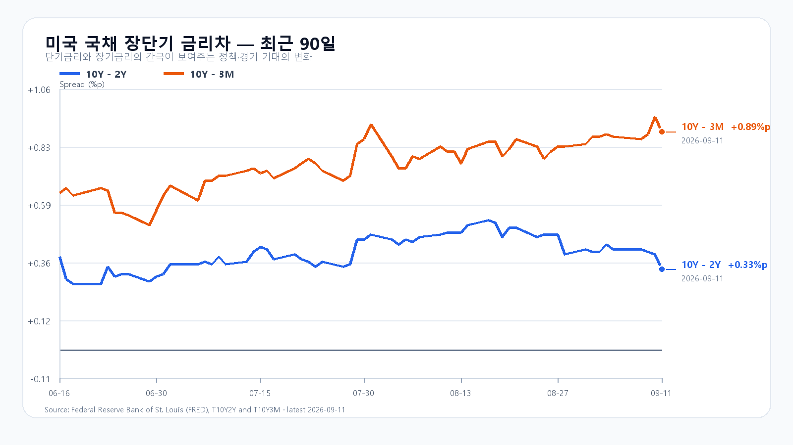
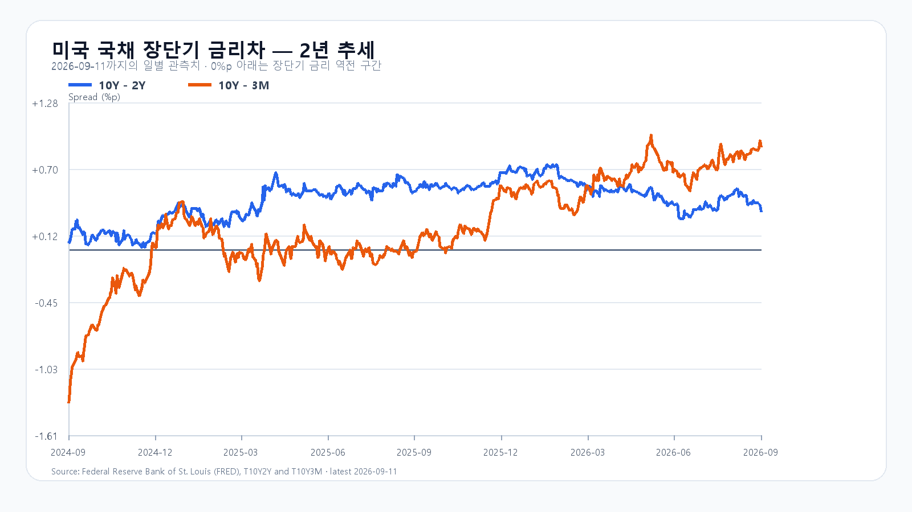

# 2026-09-14 KOSPI·KODEX 일일 리서치

작성 2026-09-14T08:15:50+09:00 / 데이터 최종 확인 2026-09-14T08:15:31+09:00 / 한국 개장 전.

확정 수치는 출처 시각 기준이다. 시나리오·확률·대응점수는 조건부 분석이다. 전일 종가 6,909.91은 직전 기본 구간 안이었다. 확정 일봉과 수급 원문 대조는 아래 정산 기록에 보존한다.

월요일 한국장은 유가 재상승과 미국 지수선물 약세를 안고 출발한다. 사우디는 드론 공격 뒤 예방적으로 East-West 송유관을 일시 폐쇄했고, 홍해와 호르무즈 해상 운송 위험도 겹쳤다. [Reuters](https://www.internazionale.it/ultime-notizie-reuters/2026/09/12/saudis-shut-down-oil-pipeline-as-houthis-tighten-grip-on-red-sea-shipping)와 [AP](https://apnews.com/article/9c2b68921a16bb7bf9a90d31fb7473d9)가 보도한 상황이다. 원유 수입 비용이 오르면 물가와 금리 경로를 거쳐 위험자산 수요가 위축될 수 있어 장전 선물의 약세가 더 중요해졌다.

미국장은 금요일에 올랐다. S&P 500은 0.86%, 나스닥은 0.96% 상승했지만, 그 반등을 한국 메모리주의 회복 신호로 읽기에는 종목별 흐름이 갈렸다. [미국장 마감](https://apnews.com/article/67a463295d9ea178d7802ca4338a6eb5)을 종목별로 보면 SOXX는 1.863%, AMD는 2.488% 올랐으나 NVIDIA는 0.032%, Micron은 0.220% 내렸다. 지수는 반등했지만 메모리주 전반으로 매수세가 번진 날은 아니었다.

|티커|정규장 종가(달러)|등락률|
|---|---:|---:|
|[QQQ](https://query1.finance.yahoo.com/v8/finance/chart/QQQ?range=1d&interval=5m&includePrePost=true)|714.88|+0.873%|
|[TQQQ](https://query1.finance.yahoo.com/v8/finance/chart/TQQQ?range=1d&interval=5m&includePrePost=true)|70.98|+2.557%|
|[SOXX](https://query1.finance.yahoo.com/v8/finance/chart/SOXX?range=1d&interval=5m&includePrePost=true)|527.07|+1.863%|
|[SMH](https://query1.finance.yahoo.com/v8/finance/chart/SMH?range=1d&interval=5m&includePrePost=true)|568.53|+1.472%|
|[NVDA](https://query1.finance.yahoo.com/v8/finance/chart/NVDA?range=1d&interval=5m&includePrePost=true)|218.29|-0.032%|
|[AMD](https://query1.finance.yahoo.com/v8/finance/chart/AMD?range=1d&interval=5m&includePrePost=true)|516.13|+2.488%|
|[MU](https://query1.finance.yahoo.com/v8/finance/chart/MU?range=1d&interval=5m&includePrePost=true)|975.26|-0.220%|
|[AVGO](https://query1.finance.yahoo.com/v8/finance/chart/AVGO?range=1d&interval=5m&includePrePost=true)|361.99|+0.321%|

국내에서는 지난 금요일 [코스피](https://m.stock.naver.com/api/index/KOSPI/price?pageSize=2&page=1&cacheBust=20260914085001)가 6,909.91로 1.76% 내렸고, [KODEX 레버리지](https://m.stock.naver.com/api/stock/122630/price?pageSize=10&page=1)는 109,995원으로 4.35% 하락했다. 장중 저점은 106,200원, 고점은 111,545원이었다. 110,000원을 되돌림의 기준선으로, 106,200원을 지지선으로, 111,545원을 저항선으로 둔다. 월요일 장전 [NXT 거래](https://stock.naver.com/api/polling/domestic/NXT/stock?itemCodes=005930,000660)에서 삼성전자와 SK하이닉스가 함께 약세를 보인 점도 미국의 금요일 반등만으로 국내 메모리주 매수세가 확인된 것은 아니라는 판단을 뒷받침한다.

9월 11일 15시 30분 외국인 현물은 2조3,556억원, 프로그램은 1조8,199억원 순매도였다. 그런데도 코스피 종가는 기본 경로의 가격 범위인 6,800~7,000에 남았다. 지수의 낙폭이 제한돼도 외국인 매도는 장 후반까지 이어졌다. [보존 장중 자료](https://www.hpmplab.com/assets/data/kospi-intraday/2026-09-11.json)와 [프로그램 매매 원문](https://finance.naver.com/sise/programDealTrendTime.naver?bizdate=20260911&sosok=01&page=3) 기준이다.

메모리의 중기 재료가 사라진 것은 아니다. [TrendForce의 9월 11일 현물표](https://www.trendforce.com/price/dram/dram_spot)에서 DDR5 16Gb는 54.333달러로 보합, DDR4 8Gb는 45.214달러로 0.14% 내렸다. 공급 제약은 남아 있지만 이 숫자가 당일 주가 수급을 대신하지는 않는다. 상위 10개 팹리스 기업의 2분기 매출이 전년보다 73% 늘었다는 [TrendForce 집계](https://www.trendforce.com/presscenter/news/20260911-13231.html)도 장기 AI 수요의 근거이지 월요일 개장 방향을 단정할 근거는 아니다.

이번 주에는 에너지 가격 상승에 따른 물가 우려가 연준의 금리 경로와 맞물린다. 8월 미국 CPI는 전월 대비 0.4%, 전년 대비 3.4% 올랐고 근원 CPI는 각각 0.3%, 2.4% 상승했다. 9월 11일 미 국채 금리는 3개월 4.07%, 2년 4.63%, 10년 4.96%였다. [CPI](https://www.bls.gov/news.release/cpi.nr0.htm)와 [미 재무부 수익률](https://home.treasury.gov/resource-center/data-chart-center/interest-rates/TextView?type=daily_treasury_yield_curve&field_tdr_date_value=2026)은 높은 할인율의 부담이 아직 남아 있음을 보여준다. [미국 소매판매](https://www.census.gov/economic-indicators/calendar-listview.html)와 [수출입물가](https://www.bls.gov/schedule/2026/09_sched.htm)는 9월 16일 21:30 KST, [FOMC 일정](https://www.federalreserve.gov/monetarypolicy/fomccalendars.htm)은 9월 15~16일(미국 동부시간)이며 성명은 9월 17일 03:00 KST에 나온다.

|경로|범위·확률|성립 조건|무효화·전환 신호|
|---|---|---|---|
|기본|6,800~7,000, 50%|외국인 현물 수급 -10,000억원 이상|6,800 미만 또는 7,000 초과|
|강세|7,000 초과~7,150, 20%|외국인 현물·프로그램 모두 순매수|7,000 이하|
|약세|6,550~6,800 미만, 30%|외국인 현물·프로그램 모두 순매도|6,800 이상|

지수의 명목 90% 포괄 범위는 6,450~7,250으로 둔다. 이는 통계적으로 보정한 신뢰구간이 아니다. 대응 점수는 공격 15, 관망 45, 방어 40으로 둔다. 15시 20분에는 6,800선과 외국인 현물·프로그램 수급을 다시 확인한다. 7,000 초과와 두 수급의 순매수는 강세 경로를, 6,800 미만과 두 수급의 순매도는 약세 경로를 각각 확인한다.

## 장전 가격

|항목|가격·변화|출처 시각|
|---|---:|---|
|삼성전자 NXT|254,000원 · -2.12%|2026-09-14T08:15:32.582726+09:00|
|SK하이닉스 NXT|1,755,000원 · -3.15%|2026-09-14T08:15:32.582741+09:00|
|달러/원 하나은행 고시|1,343.80원 · -0.53%|2026-09-14T07:41:57+09:00|
|Nasdaq100 선물|29,060.00 · -1.113%|2026-09-14T08:05:27+09:00 · 지연 시세|
|S&P500 선물|7,617.75 · -0.545%|2026-09-14T08:05:19+09:00 · 지연 시세|
|브렌트 선물|107.55 · +2.810%|2026-09-14T08:05:27+09:00 · 지연 시세|
|WTI 선물|102.33 · +2.279%|2026-09-14T08:05:28+09:00 · 지연 시세|

[NXT](https://stock.naver.com/api/polling/domestic/NXT/stock?itemCodes=005930,000660) · [환율](https://api.stock.naver.com/marketindex/exchange/FX_USDKRW) · [Nasdaq100 선물](https://finance.yahoo.com/quote/NQ=F/) · [S&P500 선물](https://finance.yahoo.com/quote/ES=F/) · [브렌트](https://finance.yahoo.com/quote/BZ=F/) · [WTI](https://finance.yahoo.com/quote/CL=F/)

NXT는 국내 정규장과 별도 시장이다. 환율은 은행 고시이며 선물은 지연 시세다.

## 직전 전망 정산

# 2026-09-11 종가 정산 노트

- 확인 시각: 2026-09-14 08:07~08:13 KST
- 시장 상태: 2026-09-11 KRX 정규장 확정값
- 대상 전망: `2026-09-11-0821-same-close`

## 확정 가격

| 대상 | 시가 | 고가 | 저가 | 종가 | 등락률 | 거래량 |
|---|---:|---:|---:|---:|---:|---:|
| KOSPI | 6,802.50 | 6,948.83 | 6,802.50 | 6,909.91 | -1.76% | 미제공 |
| KOSDAQ | 816.91 | 826.53 | 816.91 | 820.64 | -1.95% | 미제공 |
| KODEX 레버리지(122630) | 106,385원 | 111,545원 | 106,200원 | 109,995원 | -4.35% | 15,433,511주 |

- KOSPI·KOSDAQ은 Naver Finance 일봉 API에 캐시 무효화 값을 붙여 다시 조회했다. `pageSize=2` 응답의 첫 행이 모두 `2026-09-11`이었다.
- KOSPI 원문: `https://m.stock.naver.com/api/index/KOSPI/price?pageSize=2&page=1&cacheBust=20260914085001`, SHA-256 `8c519863d45ae79c11c2c2f193b35a25bcb549efce0823f27ff97b2f1e12535f`.
- KOSDAQ 원문: `https://m.stock.naver.com/api/index/KOSDAQ/price?pageSize=2&page=1&cacheBust=20260914085002`, SHA-256 `0df8101a5acb89e26f6255ab5aa405790533d839d34f6dc890b41f921ae76ae8`.
- KODEX 원문: `https://m.stock.naver.com/api/stock/122630/price?pageSize=10&page=1`, 2026-09-14 08:03:12 KST 수집, SHA-256 `271ab077aa97c050e6e7f22cae2449af8c8108b83309798cb5b2af1eab8d8c0e`.
- KODEX의 106,385원은 시가이고 세션 저가는 106,200원이다. 지지선 근거에는 106,200원을 사용한다.

## 보존된 수급과 15:20 트리거

| 시각 | 외국인 현물 | 기관 현물 | 개인 현물 | 프로그램 비차익 | 프로그램 전체 |
|---|---:|---:|---:|---:|---:|
| 09:30 | -4,716억원 | -5,114억원 | +8,155억원 | -3,021억원 | -3,875억원 |
| 10:00 | -8,324억원 | -7,542억원 | +12,875억원 | -5,815억원 | -6,746억원 |
| 14:00 | -21,215억원 | -11,398억원 | +19,005억원 | -16,292억원 | -17,577억원 |
| 15:30 | -23,556억원 | -11,123억원 | +18,191억원 | -17,656억원 | -18,199억원 |

- 외국인·기관·개인 값은 2026-09-11에 보존된 Naver Finance KOSPI 장중 아카이브 및 역사 페이지의 정확한 시각 행과 일치한다. 로컬 아카이브 SHA-256은 `6c0aa68ff7870e204504e3ebfe6ad23321b4d241151baeb3294a7e64c1db56f6`이다.
- 프로그램 역사 페이지의 보존 원문 SHA-256은 09:30 page 39 `f3034658f80ac80528f3b287bd7421b14249402968e38ba76c94681409d3f15a`, 10:00 page 36 `345cb6bfdda9849dba95b0844863e0b8c8f195d9ff162141003789b12269d9e1`, 14:00 page 12 `73336b4b9c978408b0210e9cb8d30da6d09be229cdb92d23c10ff7d4f9c489cd`, 15:30 page 3 `700e9e44f4c026e0972b7908427069d0e3675e8adffa181e94420a1ad38436f5`이다.
- 프로그램 원문 URL은 `https://finance.naver.com/sise/programDealTrendTime.naver?bizdate=20260911&sosok=01&page=39`(09:30), `https://finance.naver.com/sise/programDealTrendTime.naver?bizdate=20260911&sosok=01&page=36`(10:00), `https://finance.naver.com/sise/programDealTrendTime.naver?bizdate=20260911&sosok=01&page=12`(14:00), `https://finance.naver.com/sise/programDealTrendTime.naver?bizdate=20260911&sosok=01&page=3`(15:30)이며, 15:20 값은 `https://finance.naver.com/sise/programDealTrendTime.naver?bizdate=20260911&sosok=01&page=4`에서 확인했다.
- 15:20 KOSPI는 6,910.90이었다. 외국인 현물은 15:20 직전의 15:19 행에서 -23,527억원, 프로그램 전체는 15:20 정확 행에서 -19,605억원이었다.
- 15:20 기준 가격은 기본 구간 조건(6,800 이상, 7,000 이하)을 충족했지만 외국인 현물이 -1조원 아래여서 봉인된 기본 시나리오의 AND 트리거는 불성립했다.

## 정산 판단과 증거 한계

- 종가 6,909.91은 기본 시나리오 6,800~7,000에 들어갔다. 당일 고가·저가 6,802.50~6,948.83도 90% 경로 포락 6,450~7,250 안에 있었다.
- 발행 기준 7,033.92 대비 종가는 124.01포인트 하락했다.
- KOSPI 확정 일봉 종가는 6,909.91이고, 보존 1분봉의 15:30 마지막 값은 6,909.92다. 0.01포인트 차이가 있으므로 정산 종가는 확정 일봉을 사용하고 1분봉은 장중 경로와 수급 시각 증거로만 사용한다.
- KODEX 확정 일봉 거래량 15,433,511주는 보존 분봉 합계 15,346,658주와 86,853주 차이가 난다. OHLCV 정산은 확정 일봉을 사용한다.
- 현물·프로그램 마감값은 확인됐지만 9월 11일의 최종 시장 폭 원문은 확보하지 못했다. 네 묶음이 모두 필요한 `closeSnapshot`은 `null`로 두고, 이 계약상 `flowTrajectory.close`도 누락 증거로 남긴다. 09:30·10:00·14:00의 세 지표는 정확 시각 원문이 있어 가용 앵커로 보존한다.

## 취재 근거와 확인 시각

# 2026-09-14 미국·주말 취재 노트

- 조사 시각: 2026-09-14 08:01~08:06 KST. 공개 원고 아님. 최신 가격은 발행 직전 root의 재조회 결과 우선.
- 시장 상태: 미국 9/11 정규장·시간외 종료, 9/14 아시아 선물 재개. 금요일 반등을 월요일 현재 방향으로 쓰지 않는다.

## 이슈 레이더 (노출/가격/새로움/신뢰/속도, 13점 만점)

1. 사우디 East-West 송유관 가동중단 및 홍해 항로 위험: 3/3/2/2/2=12. Reuters 9/12 원문, AP 독립 보도 교차. root 08:03 Brent 107.51(+2.772%), WTI 102.37(+2.319%), NQ -1.051%, ES -0.522%가 전달경로 확인. 원유수입 비용→물가·금리→국내 외국인 위험축소. 무효화: 송유관 재가동·항로 안전 개선과 유가 반락. 실제 공급손실 4~5%로 확정하지 않는다.
2. CPI 이후 FOMC 인상 위험과 높은 금리: 3/2/2/3/2=12. BLS 8월 헤드라인 MoM +0.4%, YoY +3.4%; 근원 +0.3%, +2.4%. Treasury 9/11 10년 4.96%, 2년 4.63%, 3개월 4.07%. 성장주 할인율 부담. 무효화: 금리 하락과 연준 완화적 전망.
3. 금요일 업종 반등 내부 차별화: 3/2/2/2/2=11. SOXX +1.863%, AMD +2.488%이나 NVDA -0.032%, MU -0.220%. 메모리주까지 전면 회복으로 해석 금지. 한국 NXT·외국인 매수 동반 여부가 필요.
4. 주말 호르무즈 화물선 피격·이란 주변국 설명회 연기: 3/2/2/2/2=11. AP 9/13 보도, Reuters 같은 날 해운 피격 보도로 교차. 사상자 숫자 및 공격 주체 단정 생략. 1번과 동일 유가 경로이므로 점수·충격 중복 적용 금지.
5. AI 팹리스 2분기 성장: 3/1/1/3/1=9이나 신규 직접 공시 아님·가격확인 미달로 보조. TrendForce 9/11 상위 10개 매출 73% YoY 증가, AMD 3위. 장기 AI 수요의 반대 근거.
6. DRAM 현물·계약 공급 제약: 3/1/0/3/1=8. 현물 9/11 DDR5 16Gb 54.333달러 보합, DDR4 8Gb 45.214달러 -0.14%. 공급 부족 펀더멘털은 유지되나 당일 주가 수급과 별개. 9/7 산업매출 자료는 이미 알려진 배경.
7. Broadcom 실적: 2/1/0/3/1=7. 9/2 공식 실적은 신규 재료 아님. 매출 296억달러, 다음 분기 가이던스 348억달러. 재활용 충격 제외.
8. 대규모 청산·증자·신규 공급계약: 검색했으나 오늘 시장을 지배할 검증된 신규 사건 확보 못함. 0점·공개 제외. Rigetti 9/8 CHIPS 주식계약은 국내 지수 직접성 낮아 제외. NVIDIA 뉴스룸 최신 9/10 물리AI·Palantir 협업은 금요일 이후 신규 충격으로 사용하지 않는다.

## 핵심 원문과 사실 경계

- Reuters 2026-09-12: 사우디가 드론 공격 후 예방적으로 송유관을 일시 폐쇄했다고 보도. 수출 영향은 사우디 외교부 발표에서 상세 미공개. 최근 운송량 400~500만 bpd는 선박추적회사·분석가 수치이며 이미 발생한 글로벌 공급손실과 다르다. 후티의 Perim 장악은 정부 소식통 보도. 한국 9/11 종가 뒤 전달된 신규 위험을 월요일 반영하되 지난주 유가 상승 전체를 다시 더하지 않는다.
  https://www.internazionale.it/ultime-notizie-reuters/2026/09/12/saudis-shut-down-oil-pipeline-as-houthis-tighten-grip-on-red-sea-shipping
- AP 9/12 독립 교차: 주요 송유관 폐쇄, 홍해 항로·호르무즈 복합 압박.
  https://apnews.com/article/9c2b68921a16bb7bf9a90d31fb7473d9
- AP 9/13 05:53 UTC: 케슘 인근 이란 화물선 피격 및 주변국 설명회 연기. AP 원문 open 실패로 검색 제공 본문만 확보; 세부 단정은 제외.
  https://apnews.com/article/aa034da0d8226f5a3b4794b10afb8b3b
- Reuters 9/13 해운 공격: 검색 본문, 원문 open 실패.
  https://au.investing.com/news/commodities-news/new-report-of-attack-on-strait-of-hormuz-shipping-fans-fears-of-threats-to-oil-supplies-4639583
- BLS 9/11 08:30 ET = 21:30 KST: 8월 CPI 위 수치. 에너지 MoM +2.1%, 휘발유 +3.9%. 헤드라인 전년비 전월과 동일, 근원 전년비 2.5→2.4%. 금리 인하 신호로 단순화 금지.
  https://www.bls.gov/news.release/cpi.nr0.htm
- 미 재무부 9/11 일일 par yield: 3개월 4.07%, 2년 4.63%, 10년 4.96%; 10Y-2Y=0.33%p, 10Y-3M=0.89%p. 전일 4.00/4.56/4.95 → 각각 +7/+7/+1bp. FRED 차트와 날짜가 다를 수 있어 별도 라벨 필요.
  https://home.treasury.gov/resource-center/data-chart-center/interest-rates/TextView?type=daily_treasury_yield_curve&field_tdr_date_value=2026
- Reuters 금요일 19:09 UTC 장중: CPI 뒤 25bp 인상 기대 약 85%, 이전 약 67%. 시장 가격 추정으로 정책 확정치 아님. Brent 104.49는 장중; AP 정산 104.61(-2.8%)과 구분.
  https://ae.marketscreener.com/news/wall-street-jumps-oil-lower-ahead-of-fed-vote-next-week-ce785bdfde8af322
- AP 금요일 정산: S&P 7656.98(+0.86%), Dow 52573.29(+0.98%), Nasdaq 26333.04(+0.96%).
  https://apnews.com/article/67a463295d9ea178d7802ca4338a6eb5

## 미국 8종목 (USD)

Yahoo 직접 chart 응답 보존 us-*.json, 요약 us-prices.json. 정규장 2026-09-11 16:00 EDT=9/12 05:00 KST. 시간외는 마지막 관측 19:59 EDT 봉으로 정산가 아님. 수익률은 전일 정규장 종가 대비 산술 검증.

|종목|정규장|등락률|마지막 시간외 관측|
|---|---:|---:|---:|
|QQQ|714.88|+0.873%|714.8865|
|TQQQ|70.98|+2.557%|70.9985|
|SOXX|527.07|+1.863%|527.6667|
|SMH|568.53|+1.472%|568.8799|
|NVDA|218.29|-0.032%|218.26|
|AMD|516.13|+2.488%|515.779|
|MU|975.26|-0.220%|975.45|
|AVGO|361.99|+0.321%|361.7361|

출처 형식: https://query1.finance.yahoo.com/v8/finance/chart/QQQ?range=1d&interval=5m&includePrePost=true (티커 치환). 시간외 소폭 변동에 별도 대형 사건 추정 없음. ADR/EWY는 독립 새 충격에 미포함.

## 메모리·AI 원문

- TrendForce 9/11 18:10 GMT+8=19:10 KST 현물: DDR5 16Gb 54.333달러 0%, DDR4 8Gb 45.214달러 -0.14%. 공개 계약표는 7/31이며 8월 유료 갱신을 최신 공개 숫자로 대체하지 않는다.
  https://www.trendforce.com/price/dram/dram_spot
- TrendForce 9/7 DRAM 산업매출 +59.5% QoQ, 공급 확장 수요 뒤처짐. 이미 지난주 알려진 구조적 배경.
  https://www.trendforce.com/presscenter/news/20260907-13219.html
- TrendForce 9/11 팹리스: 상위 10 매출 1414.5억달러 이상(+73% YoY), NVIDIA 1위, AMD 3위. 2분기 집계이지 이번 주 신규 주문 공시 아님.
  https://www.trendforce.com/presscenter/news/20260911-13231.html
- Broadcom 공식 9/2: 위 실적·가이던스, 신규성 없음.
  https://investors.broadcom.com/news-releases/news-release-details/broadcom-inc-announces-third-quarter-fiscal-year-2026-financial

## 공식 캘린더

- FOMC 9/15~16 ET. 성명 9/16 14:00 ET=9/17 03:00 KST, 기자회견 03:30 KST; 전망자료 발표 회의(*). 회의일 공식 확인, 시간은 통상 성명시간과 캘린더 교차.
  https://www.federalreserve.gov/monetarypolicy/fomccalendars.htm
- 미국 소매판매 9/16 08:30 ET=9/16 21:30 KST, 대상 8월. Census 공식 목록 확인.
  https://www.census.gov/economic-indicators/calendar-listview.html
- 미국 수출입물가 9/16 08:30 ET=21:30 KST. BLS 공식 달력.
  https://www.bls.gov/schedule/2026/09_sched.htm
- Micron 실적콜 9/30 14:30 Mountain daylight time=10/1 05:30 KST. 8/26 회사 공식 공지, 이번 주 아님.
  https://investors.micron.com/news/press-release/2026/Micron-Technology-to-Report-Fiscal-Fourth-Quarter-Results-on-September-30-2026/default.aspx

## 시나리오 재료

- 기본: 미국 금요일 반등보다 월요일 원유·선물 악화를 우선. 국내 반도체와 외국인 수급 확인 전 반등 추종 제한.
- 강세 성립 재료: 유가 반락, 선물 낙폭 회복, 삼성전자·SK하이닉스 동반 회복과 외국인 매도 둔화.
- 약세 성립 재료: 원유 재상승, 국내 메모리 약세, 외국인·프로그램 동반 순매도. 공급손실을 근거 없는 금액·지수 하락률로 환산 금지.

- NAND 공개 현물표 최신은 2026-08-31 14:40 GMT+8. 512Gb TLC 20.708달러(-0.90%)는 8월31일 값으로 9/11 최신 현물처럼 쓰지 않는다. NAND 신규 당일 현물 미확인. 9/11 SSD 소매표는 제조사 NAND 계약가와 다른 자료.
  https://www.trendforce.com/price/flash/flash_spot
- AP 독립 교차 보도는 검색 본문 확보·원문 open 실패. 핵심 송유관 사실은 열린 Reuters 원문을 우선 출처로 사용.

## 미국 정규장 고저·시간외 원천

|종목|종가|고가|저가|고가 대비 종가|
|---|---:|---:|---:|---:|
|QQQ|714.88|717.62|713.65|-0.38%|
|TQQQ|70.98|71.76|70.611|-1.09%|
|SOXX|527.07|531.04|521.14|-0.75%|
|SMH|568.53|572.8|564.0|-0.75%|
|NVDA|218.29|222.0|218.15|-1.67%|
|AMD|516.13|521.06|501.35|-0.95%|
|MU|975.26|993.99|967.38|-1.88%|
|AVGO|361.99|366.78|361.64|-1.31%|

미국 9월 11일 정규장 기준. 각 yahoo-*.json에 조회 시각·URL·원문 해시를 보존했다. 시간외는 us-prices.json의 마지막 관측 시각과 가격을 따로 사용한다.
