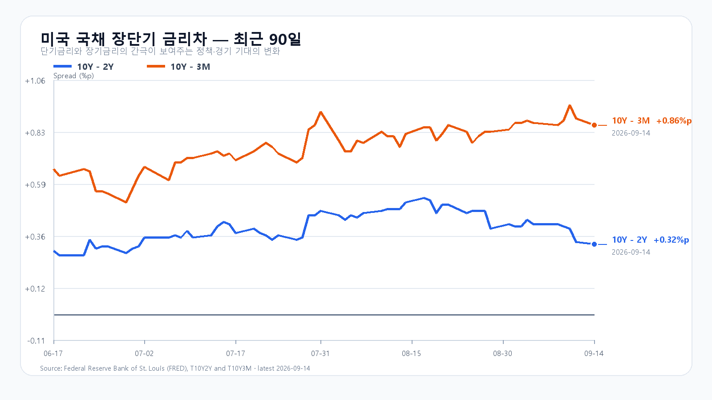
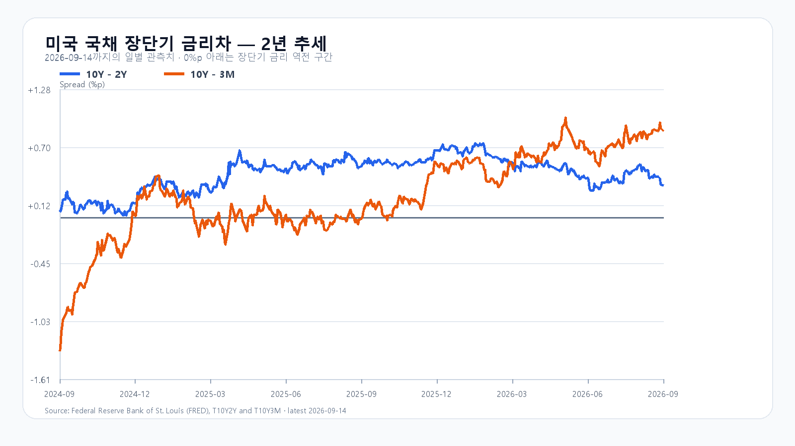

# 2026-09-15 KOSPI·KODEX 일일 리서치

작성 2026-09-15T08:17:32+09:00 / 데이터 최종 확인 2026-09-15T08:17:09+09:00 / 한국 개장 전.

확정 수치는 출처 시각 기준이다. 시나리오·확률·대응점수는 조건부 분석이다. 전일 종가 6,684.37은 직전 약세 구간에 들어갔다. 확정 일봉과 수급 원문 대조는 아래 정산 기록에 보존한다.

전일 KOSPI는 6,684.37로 3.26% 하락했다. 시가는 6,692.61, 장중 고가는 6,773.97, 저가는 6,654.82였다. KODEX 레버리지는 102,095원으로 7.18% 내렸고 삼성전자는 249,000원, SK하이닉스는 1,697,000원에 마감했다. 오늘은 전일 저점과 가까운 6,650선에서 매도를 버틸지가 첫 관건이다. [KOSPI 일봉](https://m.stock.naver.com/api/index/KOSPI/price?pageSize=11&page=1), [KODEX 일봉](https://m.stock.naver.com/api/stock/122630/price?pageSize=10&page=1).

미국 시장은 지수보다 반도체의 낙폭이 훨씬 컸다. QQQ는 0.80%, TQQQ는 2.41% 내렸지만 SOXX는 5.63%, SMH는 4.75% 하락했다. Nvidia는 3.36%, AMD는 4.40%, Micron은 5.25%, Broadcom은 4.77% 떨어졌다. 시간외 거래에서는 이들 ETF와 종목이 소폭 반등했으나, 정규장 낙폭을 되돌린 흐름은 아니다. [QQQ](https://stockanalysis.com/etf/qqq/history/), [SOXX](https://stockanalysis.com/etf/soxx/history/), [SMH](https://stockanalysis.com/etf/smh/history/), [Nvidia](https://stockanalysis.com/stocks/nvda/history/), [AMD](https://stockanalysis.com/stocks/amd/history/), [Micron](https://stockanalysis.com/stocks/mu/history/), [Broadcom](https://stockanalysis.com/stocks/avgo/history/)의 9월 14일 장 마감과 시간외 표시 기준이다.

이번 매도는 AI 투자 속도와 미래 성장에 높은 값을 매겼던 주가가 재평가되는 흐름으로 해석한다. Dario Amodei의 제안은 AI 능력 개선 속도를 조절하자는 것이며, 모델 훈련과 기술 진보의 중단을 뜻하지는 않는다. [Amodei 원문](https://darioamodei.com/post/we-must-pace-the-frontier). 이 논쟁은 주말부터 알려져 월요일 한국장도 먼저 반응했다. 오늘 새로 더해진 정보는 미국 반도체 매도의 강도다. 국내 주가가 얼마나 더 밀리는지, 외국인 매도가 이어지는지가 추가 충격의 크기를 가른다. [AP의 9월 12일 보도](https://apnews.com/article/d59552edcb27892d8ee4d98a48397706).

메모리 현물도 주가와 분리해서 봐야 한다. [TrendForce](https://www.trendforce.com/price/dram/dram_spot)의 9월 14일 표에서 DDR5 16Gb 4800/5600의 세션 평균은 54.333달러로 보합이었다. DDR4 16Gb 3200은 0.56% 내렸고 DDR4 8Gb 3200은 0.79% 올랐다. 품목별 현물 가격의 엇갈림은 HBM 계약가격이나 메모리 수요 붕괴를 뜻하지 않는다. 반도체 주가의 급락을 단기 현물 수급 변화로 곧바로 번역해서도 안 된다.

높은 금리는 미래 이익의 현재 가치를 낮추는 부담이다. 미 국채 10년물은 장중 5%를 넘었지만 9월 14일 재무부 일별 수익률은 4.97%였다. 같은 날 3개월물은 4.11%, 2년물은 4.65%로 10년-2년 금리차는 0.32%포인트, 10년-3개월 금리차는 0.86%포인트다. 전 거래일보다 10년물은 1bp, 2년물은 2bp, 3개월물은 4bp 올라 금리차는 조금 좁아졌지만 금리 수준 자체는 높아졌다. 성장 기대가 주가에 많이 반영된 반도체주에는 부담이 남는다. [미 재무부 일별 수익률](https://home.treasury.gov/resource-center/data-chart-center/interest-rates/TextView?type=daily_treasury_yield_curve&field_tdr_date_value=2026), [Reuters 장중 금리](https://www.investing.com/news/economy-news/us-10year-yields-reach-5-highest-since-2023-4899925).

유가도 반등을 제약한다. 사우디 송유관과 해운 차질 우려로 장중 약 5% 뛰었던 유가는 트럼프의 이란 협상 의향 발언 뒤 상승폭을 줄였다. 브렌트 정산가는 105.68달러로 1.0%, WTI는 101.39달러로 1.3% 올랐다. 협상 기대가 장중 불안을 덜었어도 한국 기업의 수입 비용을 높이는 유가 수준은 남아 있다. [Reuters 유가 정산](https://www.investing.com/news/commodities-news/oil-prices-climb-over-2-after-strikes-on-saudi-pipeline-and-ships-in-middle-east-4900107).

AI 인프라의 실제 수주와 주가 평가도 따로 움직인다. Oracle은 9월 10일 실적에서 클라우드 인프라 매출이 74억달러로 121% 늘었고 분기 중 추가한 AI 클라우드 계약이 300억달러를 넘었다고 밝혔다. 이미 발표된 수주가 남아 있는 가운데, 시장은 앞으로 투자와 이익이 늘어날 속도에 더 낮은 값을 매기고 있다. [Oracle 실적](https://investor.oracle.com/investor-news/news-details/2026/Oracle-Announces-Q1-Results-Driven-by-Triple-Digit-Growth-in-Cloud-Infrastructure-Revenues/default.aspx).

|미국 자산|9월 14일 정규장 등락률|시간외 흐름·9월 15일 KST|
|---|---:|---:|
|[QQQ](https://stockanalysis.com/etf/qqq/history/)|-0.80%|+0.09% · 07:53|
|[TQQQ](https://stockanalysis.com/etf/tqqq/history/)|-2.41%|+0.12% · 07:45|
|[SOXX](https://stockanalysis.com/etf/soxx/history/)|-5.63%|+0.46% · 07:51|
|[SMH](https://stockanalysis.com/etf/smh/history/)|-4.75%|+0.37% · 07:34|
|Nvidia|-3.36%|+0.62% · 07:38|
|AMD|-4.40%|+0.08% · 07:50|
|Micron|-5.25%|+0.27% · 07:50|
|Broadcom|-4.77%|+0.49% · 07:49|

기본 종가 범위는 6,650~6,800, 확률은 45%로 둔다. 전일 저점 부근인 6,650선을 지키고 6,800 이하에 머물며 15시 20분 외국인 현물 순매도가 1조원 이내일 때를 가정한다. 외국인과 프로그램 매도가 함께 이어지며 6,650을 깨면 약세 시나리오에 무게가 실린다. 반대로 6,800을 넘고 두 수급이 모두 순매수라면 반등의 근거가 강해진다. 아래 조건은 각 행의 세 항목을 모두 충족해야 한다.

|종가 시나리오|범위·확률|15시 20분 성립 조건|무효화·전환 신호|
|---|---|---|---|
|기본|6,650~6,800, 45%|6,650 이상 · 6,800 이하 · 외국인 순매도 1조원 이내|범위 이탈 또는 외국인 순매도 1조원 초과|
|강세|6,800 초과~6,950, 20%|6,800 초과 · 외국인 순매수 · 프로그램 전체 순매수|6,800 이하 또는 수급 반전|
|약세|6,400~6,650 미만, 35%|6,650 미만 · 외국인 순매도 · 프로그램 전체 순매도|6,650 회복 또는 수급 반전|

종가 전체 범위와 별도로 장중 예상 고저 범위는 6,300~7,050으로 넓게 둔다. 두 전체 범위의 목표 신뢰수준은 90%이며 실제 적중률을 뜻하지 않는다. 대응 점수는 공격 15, 관망 40, 방어 45다. KODEX 레버리지는 전일 저가 100,885원을 지지선, 전일 시가 102,500원을 반등 기준, 전일 고가 105,215원을 저항선으로 본다. 개장 뒤 9시 30분에는 첫 방향과 외국인 수급을, 10시에는 6,650선의 유지 여부를, 14시에는 프로그램 매매와 지수의 방향 전환을 확인한다.

다음 큰 일정은 9월 16일 21시 30분 KST의 미국 소매판매·수출입물가와 9월 17일 03시 KST의 FOMC 결정이다. 소비와 물가가 금리 전망을 어떻게 바꾸는지가 반도체 반등의 지속성에도 영향을 준다. [미 Census 소매판매 일정](https://www.census.gov/retail/release_schedule.html), [BLS 일정](https://www.bls.gov/schedule/2026/), [연준 FOMC 일정](https://www.federalreserve.gov/monetarypolicy/fomccalendars.htm).

## 장전 가격

|항목|가격·변화|출처 시각|
|---|---:|---|
|삼성전자 NXT|248,500원 · -0.20%|2026-09-15T08:17:09.379542+09:00|
|SK하이닉스 NXT|1,688,000원 · -0.53%|2026-09-15T08:17:09.379552+09:00|
|달러/원 하나은행 고시|1,348.50원 · 0.35%|2026-09-15T07:57:13+09:00|
|Nasdaq100 선물|29,454.00 · +0.015%|2026-09-15T08:06:56+09:00 · 지연 시세|
|S&P500 선물|7,695.25 · +0.032%|2026-09-15T08:07:06+09:00 · 지연 시세|
|브렌트 선물|106.36 · +0.643%|2026-09-15T08:03:41+09:00 · 지연 시세|
|WTI 선물|101.97 · +0.572%|2026-09-15T08:06:03+09:00 · 지연 시세|

[NXT](https://stock.naver.com/api/polling/domestic/NXT/stock?itemCodes=005930,000660) · [환율](https://api.stock.naver.com/marketindex/exchange/FX_USDKRW) · [Nasdaq100 선물](https://finance.yahoo.com/quote/NQ=F/) · [S&P500 선물](https://finance.yahoo.com/quote/ES=F/) · [브렌트](https://finance.yahoo.com/quote/BZ=F/) · [WTI](https://finance.yahoo.com/quote/CL=F/)

NXT는 국내 정규장과 별도 시장이다. 환율은 은행 고시이며 선물은 지연 시세다.

삼성전자와 SK하이닉스 NXT는 08:13에 각각 +0.20%, +0.24%까지 돌아섰으나 마지막 조회에서는 다시 소폭 하락했다. 짧은 장전 반등만으로 매도 압력이 끝났다고 볼 수 없다. 정규장에서 전일 저점 방어와 외국인 매도 완화가 함께 이어져야 반등의 근거가 강해진다.

## 직전 전망 정산

# 2026-09-14 종가 정산

- 확인 시각: 2026-09-15T08:07:22+09:00
- KOSPI 시가 6,692.61 / 고가 6,773.97 / 저가 6,654.82 / 종가 6,684.37 (-3.26%). 캐시 응답을 배제하고 KOSPI-fresh.json 확정 일봉 사용.
- 종가 약세 구간 6,550~6,800 적중, 기본 구간 6,800~7,000 미달. 경로 포락 6,450~7,250 안에 전체 장중 범위 포함.
- 09:30 외국인 -11,658 / 프로그램 비차익 -9,287 / 전체 -9,801억원.
- 10:00 외국인 -15,449 / 비차익 -12,592 / 전체 -13,133억원.
- 14:00 외국인 -28,490 / 비차익 -22,797 / 전체 -22,867억원.
- 15:30 외국인 -33,231 / 기관 -10,843 / 개인 +29,190 / 프로그램 비차익 -27,096 / 전체 -27,371억원. 원문 시장 구분과 시간외 합산 여부가 확인되지 않아 공개 KRX 최종 수급으로 단정하지 않는다.
- 15:19 외국인 -33,073, 15:20 프로그램 전체 -27,573억원. 가격 분봉은 HTTP400으로 미확보하여 가격 트리거 결측.
- final breadth 미확보로 closeSnapshot null, close 앵커 결측; 나머지 정확시각 앵커 보존.
- 원문: flow-source-manifest.json, flow-source-additional.json 및 gzip HTML.

## 취재 근거와 확인 시각

# 2026-09-15 밤사이 취재 노트

- 08:13 최종 NXT는 삼성 +0.20%, 하이닉스 +0.24%로 08:03의 약세에서 반등했다. 최초 공개판 표는 최종값을 담았으나 driver와 STATE의 약세 설명이 남아 정정판으로 계보를 연결한다. 같은 뉴스의 추가 하방 충격을 기계적으로 합산하지 않는 반대 신호로 서술한다. 대응점수·종가구간은 유지하며 최초 공개판은 평가 대표로 보존한다.

- 추가 원시 시세 대조 08:08 KST: 저장한 Yahoo chart 정규장 meta가 QQQ 709.18(-0.797%), SOXX 497.40(-5.629%)를 지지한다. 공개값은 이 정규장 시각 meta와 StockAnalysis 상단이 일치하는 값을 채택한다. historical 행의 차이는 원천 차이로 보존한다. 다른 6개 자산도 Yahoo meta와 위 표 종가가 일치한다.
- FRED CSV 실행 결과의 9/14 T10Y2Y +0.32%p, T10Y3M +0.86%p를 오늘 차트로 생성했다. 아래 DGS 개별 시리즈 9/11 값은 관측일 지연 설명이며 최신 Treasury 9/14 행으로 공개 금리표를 대체한다.

- 조사 시각: 2026-09-15 08:01~08:06 KST. 공개 원고가 아닌 집필용 근거.
- 미국 9월 14일 정규장 종료, 시간외 진행. 한국 9월 15일 정규장 개장 전. 아래 시간외 시세는 각 원문 표시 시각이며 발행 직전 시세가 아니다.
- RESEARCH_SPEC.md, DATA_SOURCES.md, STATE.md, issue-radar.md 확인. 전날 STATE 숫자는 현재값으로 재사용하지 않았다.

## 이슈 후보와 선택

점수 순서: 국내 노출/가격 확인/새로움/출처/속도, 최대 13. 점수는 내부 우선순위이며 투자확률이 아니다.

|후보|점수|처리와 전달 경로|
|---|---|---|
|AI 개발 속도조절 논쟁 이후 미국 반도체 집중 매도|3/3/1/3/2=12|상위. 주말 발언은 한국 9/14에 이미 공개되어 있었다. 새로운 미국 가격 반응과 한국장 마감 이후의 정책 논쟁만 추가 정보. 국내 메모리 밸류에이션·외국인 수급 경로.|
|사우디 송유관 차질 장기화 우려와 유가 급등 후 상승폭 축소|3/3/2/2/2=12|상위. AP의 수리 3~5주 전망은 익명 지역 당국자 2명 발언이지 확정 복구 일정이 아니다. Reuters 정산 Brent 105.68달러, WTI 101.39달러. 국내 수입물가·달러 수요·마진 경로.|
|미 10년물 장중 5% 돌파, FOMC 임박|3/3/2/2/2=12|상위. 주가 할인율과 AI 인프라 자금조달 비용. 5% 돌파는 장중, FRED 최신 확정 일별값은 9/11로 시계열 분리.|
|미국 지수 낙폭 회복 및 반도체 시간외 소폭 반등|3/3/2/2/2=12|상위 반대 신호. Nasdaq -0.56%에 비해 반도체 약세가 훨씬 큼. 소폭 시간외 반등은 정규장 손실 만회가 아니다.|
|DDR5 현물 보합, DDR4 품목별 엇갈림|3/1/1/3/1=9|보조. 당일 HBM 계약 취소나 메모리 수요 붕괴의 증거로 확대하지 않는다.|
|Oracle 9/10 실적·AI 계약과 Broadcom 9/2 가이던스|3/1/0/3/1=8|배경. 기존 계약·실적과 주식 재평가를 분리. 오늘 새 실적처럼 쓰지 않는다.|
|60개국 강제노동 관세가 오늘 반도체 매도를 유발했다는 웹 기사|3/1/0/3/1=8|제외. USTR 원문 발표는 7/23. 9/14 신규 관세 발표로 재포장하지 않는다.|
|강제청산·마진콜·블록딜·신규 대형 증자|2/0/0/0/1=3|제외. 날짜 포함 탐색에서 오늘 주도 사건을 뒷받침하는 새 공시 미확인. 비사건을 공개 원고에 쓰지 않는다.|

## AI 원문과 사실 경계

[Dario Amodei 원문](https://darioamodei.com/post/we-must-pace-the-frontier): 모델 능력 개선 속도조절을 제안. 원문은 모델 훈련이나 기술진보의 중단을 뜻하지 않는다고 명시한다. Anthropic이 당장 약속한 것은 외부 평가자 상주 접근이며, 산업 전체·국제 조율은 별도 단계다. 따라서 전 세계 AI 투자 중단, GPU 주문 취소, HBM 공급계약 취소로 쓰면 안 된다.

[AP 9/12 보도](https://apnews.com/article/d59552edcb27892d8ee4d98a48397706), [Reuters 9/14 장중 시장 보도](https://currently.att.yahoo.com/att/ai-warnings-knock-nasdaq-futures-092329455.html)와 날짜·시장반응 대조. [Axios 9/14 트럼프 반대 발언](https://www.axios.com/2026/09/14/trump-ai-safety-anthropic-dario-amodei) 17:59 UTC는 한국 9/15 02:59에 해당. 새 규제 시행 공시와 정치적 발언을 구분한다.

해석 후보: 당장 출하량보다 향후 투자 속도와 프리미엄에 대한 재평가가 주가를 압박. 무효화·완화 조건은 메모리주 가격 회복과 외국인 매도 둔화, 미국 선물 안정. 실제 CAPEX 하향·계약 취소가 나오면 펀더멘털 판단을 별도 갱신.

## 미국 정규장·시간외

StockAnalysis 각 상단의 9/14 16:00 EDT 종가 채택. KST 9/15 05:00. 시간외는 종가 대비.

|자산|종가 USD|정규장|시간외 USD / 변동|시간외 KST|출처|
|---|---:|---:|---|---|---|
|QQQ|709.18|-0.80%|709.84 / +0.09%|07:53|[StockAnalysis](https://stockanalysis.com/etf/qqq/history/), [CoinGlass](https://www.coinglass.com/stocks/QQQ)|
|TQQQ|69.27|-2.41%|69.35 / +0.12%|07:45|[원문](https://stockanalysis.com/etf/tqqq/history/)|
|SOXX|497.40|-5.63%|499.68 / +0.46%|07:51|[원문](https://stockanalysis.com/etf/soxx/history/)|
|SMH|541.50|-4.75%|543.50 / +0.37%|07:34|[원문](https://stockanalysis.com/etf/smh/history/)|
|Nvidia|210.96|-3.36%|212.26 / +0.62%|07:38|[원문](https://stockanalysis.com/stocks/nvda/history/)|
|AMD|493.41|-4.40%|493.80 / +0.08%|07:50|[원문](https://stockanalysis.com/stocks/amd/history/)|
|Micron|924.03|-5.25%|926.50 / +0.27%|07:50|[원문](https://stockanalysis.com/stocks/mu/history/)|
|Broadcom|344.72|-4.77%|346.40 / +0.49%|07:49|[원문](https://stockanalysis.com/stocks/avgo/history/)|

데이터 경계: QQQ 일봉 행은 709.26(-0.79%)로 상단과 다르나 CoinGlass 및 Investing ETF 표가 709.18(-0.80%)을 지지. SOXX 일봉 행은 497.70(-5.57%)로 상단과 상충하므로 공개 정밀값은 추가 직접 시세 교차 확인이 권장된다. Nasdaq 공식 historical 페이지를 열었으나 숫자 행을 추출하지 못했다. 공식 정밀 종가를 모두 확인했다고 표현하지 않는다. SOXX를 본문에서 약 5.6% 하락으로 표현하면 두 수치의 공통 방향·규모를 보존한다.

[AP 종가 요약](https://apnews.com/article/8f72a301be85728018018735163f4dad): Nasdaq 26,186.41(-146.62, -0.6%), Dow 52,421.20(-152.09, -0.3%), S&P500 7,619.98(-37.00, -0.5%). Reuters/Investing S&P 표시 7,619.96과 0.02 차이. Nasdaq 두 출처 일치하며 정확 등락률 -0.56%. 지수 전반과 반도체 ETF 하락을 혼동하지 않는다.

## 유가·금리

[Reuters 9/14 정산](https://www.investing.com/news/commodities-news/oil-prices-climb-over-2-after-strikes-on-saudi-pipeline-and-ships-in-middle-east-4900107): Brent +1.07달러(+1.0%) 105.68달러, WTI +1.34달러(+1.3%) 101.39달러. 장중 약 5% 급등 뒤 트럼프의 이란 협상 의향 발언으로 상승폭 축소. 협상 타결은 아니다. 송유관·홍해 위험은 한국 월요일에 이미 알려졌으므로 후속 차질 기간과 정산가만 새 정보로 다룬다.

[AP 후속](https://apnews.com/article/efa431e2fa771e34880c8453c62ffb92): 수리 3~5주 가능성은 익명 지역 당국자 2명 추정. 공식 확정 복구 일정 미확인. Reuters의 5~7일 항구 재고도 업계 관계자 추정이며 확정 공급손실과 다르다.

[Reuters 금리](https://www.investing.com/news/economy-news/us-10year-yields-reach-5-highest-since-2023-4899925): 9/14 장중 10년물이 5%를 넘음. 기사 속 마지막 값 5.01%, Investing 시세판 18:25:18 표시 4.991%, 고가 5.017%로 시각이 다르므로 5.01%를 확정 종가로 쓰지 않는다.

FRED 현재 재조회 최신 관측일 9/11: [10년 4.96%](https://fred.stlouisfed.org/series/DGS10), [2년 4.63%](https://fred.stlouisfed.org/series/DGS2), [3개월 4.07%](https://fred.stlouisfed.org/series/DGS3MO). 갱신 표시는 9/14 15:16 CDT지만 관측일은 9/11. 같은 날 차이는 10Y-2Y +0.33%p, 10Y-3M +0.89%p. 9/14 실시간 10년과 이 값들을 섞어 최신 스프레드를 만들지 않는다.

08:08 KST 추가 검증: [미 재무부 공식 일별 Par Yield 표](https://home.treasury.gov/resource-center/data-chart-center/interest-rates/TextView?type=daily_treasury_yield_curve&field_tdr_date_value=2026) 9/14 행·열 제목을 직접 대조했다. **3개월 4.11%, 2년 4.65%, 10년 4.97%**. 10Y-2Y +0.32%p, 10Y-3M +0.86%p로 오늘 생성 차트와 일치. 공개 보고서의 최신 일별 금리는 이 재무부 9/14 값을 채택하고, FRED DGS 페이지의 하루 늦은 값과 혼합하지 않는다. 장중 5% 돌파와 일별 4.97%는 모순이 아니라 관측 기준 차이다.

## 메모리·기업

[TrendForce DRAM](https://www.trendforce.com/price/dram/dram_spot) 9/14 18:10 GMT+8(19:10 KST): DDR5 16Gb 4800/5600 session average 54.333달러, 0.00%; DDR4 16Gb 3200 89.25달러 -0.56%; DDR4 8Gb 3200 45.571달러 +0.79%. 현물 특정 품목 수치이며 HBM 계약가격이 아니다. [NAND](https://www.trendforce.com/price/flash/flash_spot) 최신 표시는 9/7 14:40 GMT+8로 낡아 오늘 변화 판단에서 제외.

[Oracle 9/10 공식 실적](https://investor.oracle.com/investor-news/news-details/2026/Oracle-Announces-Q1-Results-Driven-by-Triple-Digit-Growth-in-Cloud-Infrastructure-Revenues/default.aspx): FY27 Q1 매출 193억달러, 클라우드 인프라 매출 74억달러(+121%), RPO 6,640억달러, 분기 추가 AI 클라우드 계약 300억달러 초과. 회사는 이 신규 계약 구조에 따른 추가 자금조달 계획 영향이 없다고 설명. 이미 발표된 자료이며 이번 밤사이 실적이 아니다.

[Broadcom 9/2 공식 실적](https://investors.broadcom.com/news-releases/news-release-details/broadcom-inc-announces-third-quarter-fiscal-year-2026-financial): Q3 매출 296억달러(+86%), Q4 매출 가이던스 약 348억달러. 기존 전망이며 월요일 주가 하락을 가이던스 하향으로 쓰지 않는다.

[USTR 7/23 공식 발표](https://www.ustr.gov/about/policy-offices/press-office/press-releases/2026/july/ustr-takes-action-forced-labor-section-301-investigations): 60개국 관세 관련 9/14 재서술 웹 기사를 신규 사건에서 제외한 근거.

## 공식 일정

- [Fed FOMC](https://www.federalreserve.gov/monetarypolicy/fomccalendars.htm): 9/15~16, SEP 포함. 결정 9/16 14:00 ET = 9/17 03:00 KST, 기자회견 03:30 KST(표준 발표 시각; 발행 담당 최종 캘린더 확인).
- [Census 소매판매](https://www.census.gov/retail/release_schedule.html): 8월분 9/16 08:30 ET = 9/16 21:30 KST.
- [BLS 수출입물가](https://www.bls.gov/schedule/2026/): 8월분 9/16 08:30 ET = 9/16 21:30 KST. CPI 9/11, PPI 9/10은 이미 발표.
- [Fed 산업생산 G.17](https://www.federalreserve.gov/releases/g17/): 9/18 09:15 ET = 9/18 22:15 KST. 9/15로 오기 금지.
- [Micron 공식 IR](https://investors.micron.com/news/press-release/2026/Micron-Technology-to-Report-Fiscal-Fourth-Quarter-Results-on-September-30-2026/default.aspx): FY Q4 콜 9/30 14:30 Mountain = 10/1 05:30 KST. 9/23은 2025 일정이므로 사용 금지.

## 발행 담당자 재조회 항목

08:05 전후 웹판: [Nasdaq100 12월 선물](https://www.investing.com/indices/nq-100-futures) 29,461.50(+0.04%), 표시 18:33:10; 9/13에 12월물로 교체되었으므로 9월물 절대값과 비교 금지. [USD/KRW](https://www.investing.com/currencies/usd-krw) 1,347.32(+0.02%), 표시 18:06:05. 시세판 시간대가 원문에 명시되지 않아 이 표시를 임의로 KST로 변환하지 않는다. 국내 원천·미국 선물·NXT 최종 조회로 대체할 것. 이 노트 작성 시점의 값은 발행 최종 확인값이 아니다.

## 미국 정규장 고저·시간외 원천

|종목|종가|고가|저가|고가 대비 종가|
|---|---:|---:|---:|---:|
|QQQ|709.18|712.95|702.75|-0.53%|
|TQQQ|69.27|70.37|67.34|-1.56%|
|SOXX|497.4|503.18|495.15|-1.15%|
|SMH|541.5|546.76|537.73|-0.96%|
|NVDA|210.96|212.77|208.93|-0.85%|
|AMD|493.41|498.39|480.33|-1.00%|
|MU|924.03|932.21|902.6|-0.88%|
|AVGO|344.72|350.25|343.91|-1.58%|

미국 9월 14일 정규장 기준. 각 yahoo-*.json에 조회 시각·URL·원문 해시를 보존했다. 시간외는 취재 노트의 별도 시각·가격을 사용한다.
