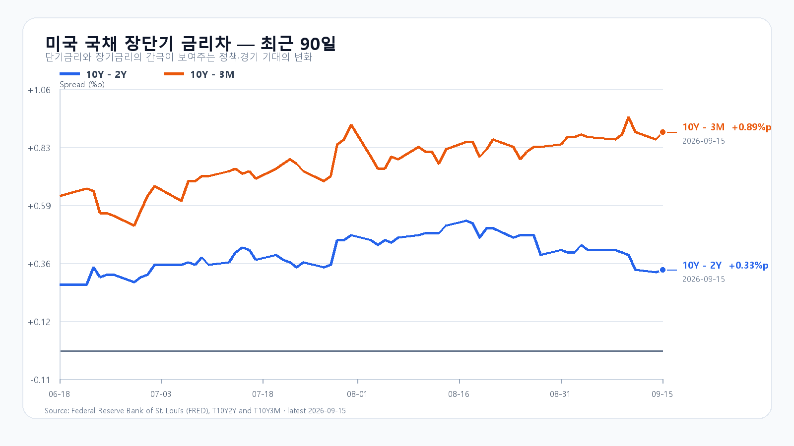
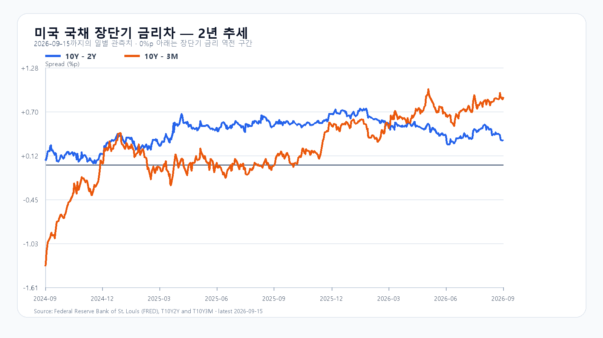

# 2026-09-16 KOSPI·KODEX 일일 리서치

작성 2026-09-16T09:11:24+09:00 / 데이터 최종 확인 2026-09-16T09:11:24+09:00 / 한국 개장 직후.

확정 수치는 출처 시각 기준이다. 시나리오·확률·대응점수는 조건부 분석이다. 전일 종가 6,627.26은 직전 약세 구간에 들어갔다. 확정 일봉과 수급 원문 대조는 아래 정산 기록에 보존한다.

미국 반도체주는 전날 급락 뒤 소폭 반등했지만 뉴욕증시 전체는 다시 밀렸다. 유가 급등과 미 국채 10년물 5% 돌파, FOMC 금리 인상 전망이 동시에 주식의 할인율과 기업 비용을 끌어올렸다. 오늘 KOSPI는 반도체의 제한적 회복보다 6,600선에서 외국인 매도를 얼마나 흡수하는지가 더 중요하다.

9월 15일 미국장에서 다우는 0.63%, S&P 500은 0.45%, 나스닥은 0.78% 하락했다. WTI는 4.4%, 브렌트는 2.9% 올랐고 미 국채 10년물은 장중 5%를 넘었다. 시장은 9월 16일 FOMC에서 25bp 금리 인상이 나올 확률을 94.5%로 반영했다. 에너지 가격과 금리가 함께 오르면 한국에는 원가·환율·성장주 할인율의 세 경로로 부담이 전달된다. [Reuters](https://www.reuters.com/business/wall-st-futures-slip-rising-oil-treasury-yields-compound-ai-anxiety-2026-09-15/).

반도체의 반등 폭은 작았다. QQQ는 0.65%, TQQQ는 1.98% 내렸지만 SOXX는 0.29%, SMH는 0.11% 올랐다. Nvidia는 0.57%, AMD는 2.19%, Micron은 0.39% 상승했고 Broadcom은 1.58% 하락했다. 필라델피아 반도체지수도 0.4% 오르는 데 그쳐 전날 급락을 의미 있게 되돌리지 못했다. 다만 월요일 미국 반도체 급락은 화요일 한국장에 이미 상당 부분 반영됐다. 같은 충격을 오늘 하락 요인으로 전부 다시 더하지 않는다.

메모리 현물은 주가보다 안정적이다. TrendForce의 9월 15일 표에서 DDR5 16Gb 4800/5600 평균은 54.40달러로 0.12% 올랐다. DDR4 16Gb 3200은 0.14%, DDR4 8Gb 3200은 0.08% 내렸다. 품목별 혼조는 HBM 계약가격이나 서버 메모리 수요 붕괴를 뜻하지 않는다. 오늘도 메모리 펀더멘털과 주식 수급을 나눠 봐야 한다. [TrendForce](https://www.trendforce.com/price/dram/dram_spot).

미국 장단기 금리차는 9월 15일 기준 10년-2년 +0.33%포인트, 10년-3개월 +0.89%포인트다. 곡선의 기울기보다 10년물 절대 수준이 5%를 넘었다는 사실이 반도체 밸류에이션에는 더 직접적인 부담이다. 장기금리가 5% 아래로 빠르게 내려오거나 유가가 상승분을 반납하기 전에는 주가 반등의 상단을 넓게 잡기 어렵다. [FRED 10년-2년](https://fred.stlouisfed.org/series/T10Y2Y), [FRED 10년-3개월](https://fred.stlouisfed.org/series/T10Y3M).

전 거래일 KOSPI는 6,627.26으로 0.85% 하락했다. 장중 고가는 6,715.46, 저가는 6,582.20이었다. 삼성전자는 0.60%, SK하이닉스는 0.88% 올랐지만 지수는 약세로 마감했다. 반도체 반등이 시장 전체 매도를 되돌리지 못했다는 뜻이다. KODEX 레버리지는 99,690원으로 2.36% 내렸다. [KOSPI](https://m.stock.naver.com/api/index/KOSPI/price?pageSize=10&page=1), [KODEX 레버리지](https://m.stock.naver.com/api/stock/122630/price?pageSize=10&page=1).

오늘 기본 종가 범위는 6,500~6,650, 확률은 45%로 둔다. 6,500을 지키되 6,650 아래에서 외국인 매도를 소화하는 흐름이다. 6,650을 회복하고 외국인 현물과 프로그램이 함께 순매수로 돌아서면 강세 범위 6,650 초과~6,800으로 전환할 수 있다. 반대로 6,500을 깨고 두 수급이 모두 순매도라면 약세 범위 6,300~6,500 미만의 가능성이 커진다.

|종가 시나리오|범위·확률|15시 20분 성립 조건|무효화·전환 신호|
|---|---|---|---|
|기본|6,500~6,650, 45%|6,500 이상 · 6,650 이하 · 외국인 순매도 1조원 이내|범위 이탈 또는 외국인 순매도 1조원 초과|
|강세|6,650 초과~6,800, 20%|6,650 초과 · 외국인 현물 순매수 · 프로그램 전체 순매수|6,650 이하 또는 수급 반전|
|약세|6,300~6,500 미만, 35%|6,500 미만 · 외국인 현물 순매도 · 프로그램 전체 순매도|6,500 회복 또는 수급 반전|

종가 범위와 별도로 남은 장의 예상 고저 범위는 6,200~6,900으로 둔다. 두 전체 범위의 목표 신뢰수준은 90%이며 실제 적중률을 뜻하지 않는다. 대응 점수는 공격 15, 관망 40, 방어 45다. KODEX 레버리지는 전일 저가 98,695원을 1차 지지, 전일 종가 99,690원을 반등 기준, 전일 고가 103,230원을 저항으로 본다. 가격이 많이 빠졌다는 이유만으로 지지 확인 전에 대응 강도를 높이지 않는다.

장중에는 첫 30분의 6,500선 방어, 삼성전자·SK하이닉스의 동반 방향, 외국인 현물과 프로그램의 같은 방향 여부를 차례로 확인한다. 오늘 21시 30분에는 미국 8월 소매판매와 수출입물가가 발표된다. FOMC 결정과 경제전망은 9월 17일 03시, 기자회견은 03시 30분 KST다. [미 Census](https://www.census.gov/retail/release_schedule.html), [BLS](https://www.bls.gov/schedule/2026/), [연준](https://www.federalreserve.gov/monetarypolicy/fomccalendars.htm).

## 개장 직후 가격

|항목|가격·변화|출처 시각|
|---|---:|---|
|KOSPI|6,619.74 · -0.11%|2026-09-16T09:10:00+09:00|
|KOSDAQ|804.33 · -0.99%|2026-09-16T09:10:00+09:00|
|KODEX 레버리지|99,905원 · 0.22%|2026-09-16T09:10:00+09:00|
|삼성전자|248,500원 · 0.00%|2026-09-16T09:10:00+09:00|
|SK하이닉스|1,698,000원 · 0.47%|2026-09-16T09:10:00+09:00|
|달러/원 하나은행 고시|1,365.20원 · 0.11%|2026-09-16T09:09:53+09:00|
|Nasdaq100 선물|29,272.50 · +0.088%|2026-09-16T09:01:23+09:00 · 지연 시세|
|S&P500 선물|7,665.25 · +0.121%|2026-09-16T09:01:21+09:00 · 지연 시세|
|브렌트 선물|108.39 · -0.331%|2026-09-16T09:01:06+09:00 · 지연 시세|
|WTI 선물|105.41 · -0.397%|2026-09-16T09:01:15+09:00 · 지연 시세|

[KOSPI](https://m.stock.naver.com/api/index/KOSPI/basic) · [KODEX](https://m.stock.naver.com/api/stock/122630/price?pageSize=10&page=1) · [환율](https://api.stock.naver.com/marketindex/exchange/FX_USDKRW) · [Nasdaq100 선물](https://finance.yahoo.com/quote/NQ=F/) · [S&P500 선물](https://finance.yahoo.com/quote/ES=F/) · [브렌트](https://finance.yahoo.com/quote/BZ=F/) · [WTI](https://finance.yahoo.com/quote/CL=F/)

국내 가격은 개장 직후 스냅샷, 환율은 은행 고시, 미국 선물은 지연 시세다.

## 직전 전망 정산

# 2026-09-15 종가 정산

- 확인 시각: 2026-09-16T08:55:46+09:00.
- KOSPI 시가 6,659.25 / 고가 6,715.46 / 저가 6,582.20 / 종가 6,627.26(-0.85%). KODEX 레버리지 시가 100,990원 / 고가 103,230원 / 저가 98,695원 / 종가 99,690원(-2.36%).
- 최초 공개판과 08:17 정정판 모두 종가는 약세 구간 6,400~6,650에 들어갔고, 장중 고저는 6,300~7,050 경로 안에 있었다. 기본 구간 6,650~6,800은 종가 기준 미달했다.
- 삼성전자는 250,500원(+0.60%), SK하이닉스는 1,712,000원(+0.88%)으로 마감했다. 두 종목 반등에도 KOSPI 종가는 전일보다 낮아 메모리주만으로 지수 하방을 되돌리지 못했다.
- 15시 20분 외국인 현물·프로그램 원문과 최종 시장 폭을 이번 실행에서 확보하지 못했다. 종가 수치로 같은 시각 트리거를 대신하지 않고 수급 조건은 `unavailable`로 남긴다.
- 원시 가격: `research/evidence/2026-09-16/KOSPI.json`, `122630.json`, `005930.json`, `000660.json`.

## 취재 근거와 확인 시각

# 2026-09-16 밤사이 취재 노트

- 조사 시각: 2026-09-16 08:55~09:00 KST. 미국 9월 15일 정규장 종료, 한국 9월 16일 개장 전에서 개장 직후로 전환.
- 미국 시세는 Yahoo chart 원시 응답, 시장 지배 이슈는 Reuters 9월 15일 마감 기사, 메모리 현물은 TrendForce 9월 15일 18:10 GMT+8 표로 대조했다.

## 이슈 후보와 우선순위

|후보|점수|처리와 전달 경로|
|---|---:|---|
|WTI +4.4%, Brent +2.9%와 미 10년물 5% 돌파|13|최상위. 수입물가·달러/원·할인율을 함께 높여 한국 성장주와 반도체 상단을 누른다.|
|FOMC 금리 인상 확률 94.5%|13|최상위. Reuters가 CME FedWatch를 인용한 시장 가격이며 확정 결정은 아니다. 9월 17일 03:00 KST 결과 전까지 변동성 요인.|
|미 반도체 제한적 반등과 대형지수 추가 하락|12|상위 반대 신호. SOXX·SMH는 소폭 반등했지만 QQQ -0.65%, Broadcom -1.58%로 전날 급락을 의미 있게 되돌리지 못했다.|
|국내 메모리 NXT 소폭 반등|10|상위 국내 확인 신호. 08:50 삼성전자 +0.20%, SK하이닉스 +0.12%. 정규장 지속 여부를 확인한다.|
|DDR5 +0.12%, DDR4 품목별 혼조|9|보조. HBM 계약가격이나 수요 붕괴의 증거로 확대하지 않는다.|
|미국 소매판매·수출입물가 21:30 KST|9|오늘 밤 이벤트. 장중 실현값이 아니라 일정으로만 반영한다.|
|신규 대형 공급계약·증자·강제청산·블록딜|3|새 주도 공시를 확인하지 못했다. 비사건은 공개 원고에서 제외한다.|

## 미국 정규장과 시장 구조

- Reuters: Dow -0.63%, S&P 500 -0.45%, Nasdaq -0.78%. WTI +4.4%, Brent +2.9%, 미 10년물 5% 돌파. 9월 16일 FOMC에서 25bp 인상을 가격에 반영한 확률은 94.5%.
- Yahoo 원시 일봉: QQQ 704.54(-0.65%), TQQQ 67.90(-1.98%), SOXX 498.85(+0.29%), SMH 542.11(+0.11%), Nvidia 212.17(+0.57%), AMD 504.20(+2.19%), Micron 927.60(+0.39%), Broadcom 339.27(-1.58%).
- 반도체 반등은 전날 SOXX -5.63%, SMH -4.75% 급락을 되돌린 것으로 보지 않는다. 한국장에는 전날 급락이 이미 반영돼 있어 미국 반도체의 같은 충격을 다시 전부 더하지 않는다.
- 주요 출처: https://www.reuters.com/business/wall-st-futures-slip-rising-oil-treasury-yields-compound-ai-anxiety-2026-09-15/

## 메모리 현물

- TrendForce 2026-09-15 18:10 GMT+8: DDR5 16Gb 4800/5600 평균 54.40달러(+0.12%), DDR4 16Gb 3200 89.125달러(-0.14%), DDR4 8Gb 3200 45.536달러(-0.08%).
- 서버 DDR5·HBM의 중장기 계약 수급과 공개 현물 일일 변화를 구분한다.
- 출처: https://www.trendforce.com/price/dram/dram_spot

## 금리와 일정

- FRED 9월 15일 스프레드: 10년-2년 +0.33%p, 10년-3개월 +0.89%p. 개별 DGS 최신 관측은 9월 14일 3개월 4.11%, 2년 4.65%, 10년 4.97%다. Reuters의 장중 5% 돌파와 관측 시각이 다르다.
- 9월 16일 21:30 KST 미국 8월 소매판매·수출입물가, 9월 17일 03:00 KST FOMC 결정·경제전망, 03:30 기자회견.
- 출처: https://www.federalreserve.gov/monetarypolicy/fomccalendars.htm, https://www.census.gov/retail/release_schedule.html, https://www.bls.gov/schedule/2026/

## 발행 직전 재조회 항목

- KOSPI·KOSDAQ, KODEX 레버리지, 삼성전자·SK하이닉스, 외국인·기관·프로그램, USD/KRW, Nasdaq100·S&P500 선물, Brent·WTI.
- 09:00을 넘기면 `preopen`이 아니라 실제 개장 직후 평가 구간으로 새 전망 계약을 봉인한다.

## 미국 정규장 고저·시간외 원천

|종목|종가|고가|저가|고가 대비 종가|
|---|---:|---:|---:|---:|
|QQQ|704.54|709.53|703.635|-0.70%|
|TQQQ|67.9|69.33|67.61|-2.06%|
|SOXX|498.85|504.74|496.58|-1.17%|
|SMH|542.11|548.19|540.105|-1.11%|
|NVDA|212.17|213.94|211.16|-0.83%|
|AMD|504.2|513.665|497.511|-1.84%|
|MU|927.6|944.89|920.13|-1.83%|
|AVGO|339.27|347.26|337.915|-2.30%|

미국 9월 15일 정규장 기준. 각 yahoo-*.json에 조회 시각·URL·원문 해시를 보존했다. 시간외는 취재 노트의 별도 시각·가격을 사용한다.
