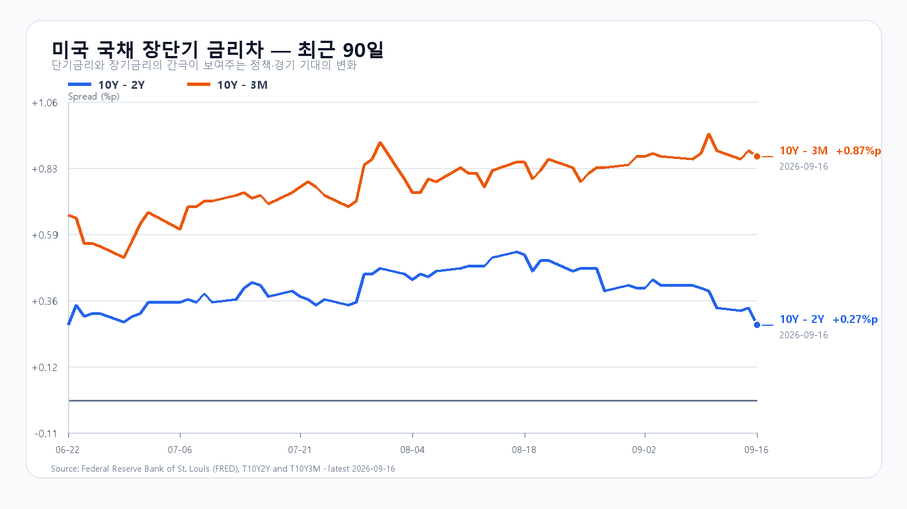
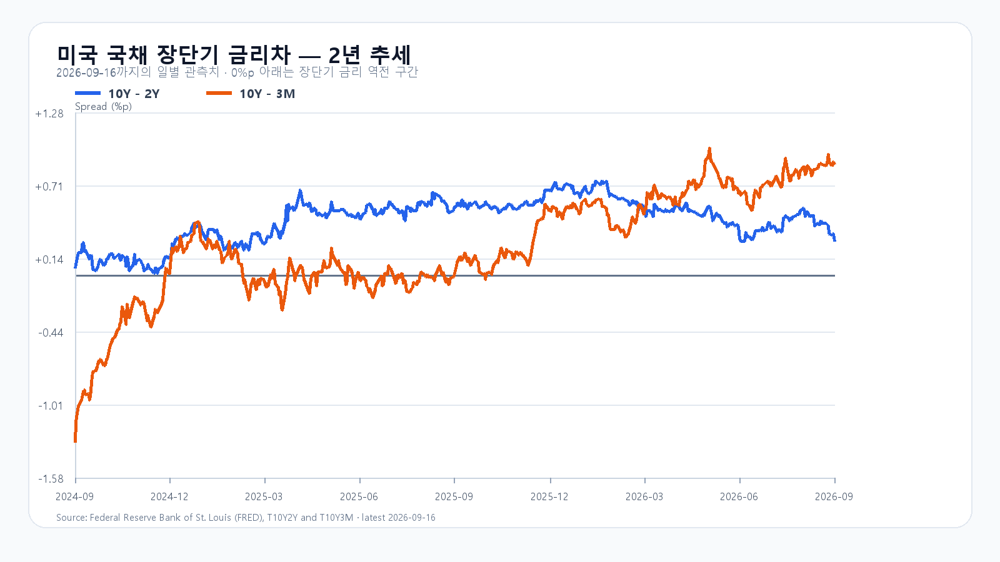

# 2026-09-17 KOSPI·KODEX 일일 리서치

작성 2026-09-17T08:13:28+09:00 / 데이터 최종 확인 2026-09-17T08:13:13+09:00 / 한국 장전.

확정 사실은 출처 시각 기준, 시나리오와 확률은 조건부 전망이다. 9/16 KOSPI 6,717.97은 직전 강세 구간에 들어갔다.

연준이 기준금리를 0.25%포인트 올린 뒤 원/달러 환율이 1,370원대 후반으로 뛰었다. 전날 한국장에서 반등한 삼성전자와 SK하이닉스가 오늘도 상승을 이어 가려면 높아진 금리와 원화 약세 속에서 외국인 매도를 견뎌야 한다.

연준은 9월 16일 정책금리 목표 범위를 3.75~4.00%로 높였다. 위원들은 올해 말 정책금리 중앙값을 4.1%, 올해 개인소비지출 물가 상승률을 3.7%로 제시했다. 이는 한 차례 인상으로 긴축이 끝나리라는 기대에 부담을 준다. 미국의 8월 소매판매도 반등해 경기가 급격히 꺾이지 않았다는 신호를 보냈다. [연준 성명](https://www.federalreserve.gov/newsevents/pressreleases/monetary20260916a.htm) · [연준 경제전망](https://www.federalreserve.gov/monetarypolicy/fomcprojtabl20260916.htm)

뉴욕증시 전체가 일제히 급락한 것은 아니다. 9월 16일 정규장에서 나스닥 종합지수는 거의 보합이었고 SOXX와 SMH는 각각 약 0.64% 올랐다. 엔비디아는 0.82%, AMD는 1.65% 상승했지만 마이크론은 0.11% 내렸다. 반도체 안에서도 메모리주가 똑같이 움직이지 않았다. 미국 ETF 상승에는 이미 끝난 한국장 반등의 후행 반영이 섞일 수 있어 오늘의 상승 재료로 전부 다시 계산할 수 없다. [미국 시세](https://finance.yahoo.com/quote/SOXX/) · [나스닥 마감](https://apnews.com/article/b082e78c9b572b6b0a94b8033a0ee96b)

국내 반도체의 전날 움직임은 더 뚜렷했다. KOSPI는 9월 16일 6,717.97로 1.37% 올랐고 삼성전자는 253,500원, SK하이닉스는 1,757,000원으로 마감했다. 두 종목은 각각 2.01%, 3.96% 상승했다. 외국인 현물은 순매도를 이어 갔지만 지수는 5거래일 만에 반등했다. 전일 장중 보고서의 기본 종가 상단 6,650을 넘어 강세 범위에 들어갔다. [KOSPI](https://kr.investing.com/indices/kospi-historical-data) · [국내 수급](https://www.newsis.com/view/NISX20260916_0003792380)

메모리 현물은 품목별로 갈렸다. TrendForce의 9월 16일 표에서 DDR5 16Gb 평균은 54.833달러로 0.80% 올랐고 DDR4 16Gb는 87.625달러로 1.68% 내렸다. DDR4 8Gb는 0.55% 올랐다. 현물 한 품목의 하루 변화만으로 HBM 계약가격이나 서버 주문을 단정할 수는 없다. 메모리 수요와 오늘 주식 매매를 따로 봐야 한다. [TrendForce](https://www.trendforce.com/price/dram/dram_spot)

연준 결정 뒤 하나은행의 9월 17일 07:27 고시 환율은 달러당 1,377.50원으로 전날보다 1.01% 올랐다. 환율 상승이 이어지면 외국인에게는 전날 국내 주가 반등을 따라 사기 부담스럽다. 반면 08시 전후 미국 반도체 선물과 국제유가가 급격히 악화한 모습은 아니다. 금리차는 9월 16일 기준 미 국채 10년-2년 +0.27%포인트, 10년-3개월 +0.87%포인트다. 성장주에는 금리차 자체보다 높은 장기금리와 환율의 동행이 더 직접적인 시험이다. [환율](https://api.stock.naver.com/marketindex/exchange/FX_USDKRW) · [FRED 10년-2년](https://fred.stlouisfed.org/series/T10Y2Y) · [FRED 10년-3개월](https://fred.stlouisfed.org/series/T10Y3M)

오늘 KOSPI 기본 종가 범위는 6,600~6,750, 확률은 50%로 본다. 6,750을 넘어서고 외국인 현물과 프로그램이 함께 순매수로 돌아서면 강세 범위 6,750 초과~6,900으로 올라설 수 있다. 6,600이 무너지고 두 수급이 함께 순매도라면 약세 범위 6,400~6,600 미만을 열어 둔다. 강세 확률은 20%, 약세는 30%다. 이 범위는 조건부 전망이며 확정 시세가 아니다.

|종가 시나리오|범위·확률|15시 20분 확인 조건|전환 신호|
|---|---|---|---|
|기본|6,600~6,750 · 50%|6,600 이상 · 6,750 이하 · 외국인 매도 축소|범위 이탈|
|강세|6,750 초과~6,900 · 20%|6,750 초과 · 외국인·프로그램 동반 순매수|6,750 아래 재진입|
|약세|6,400~6,600 미만 · 30%|6,600 미만 · 외국인·프로그램 동반 순매도|6,600 회복|

장중 고저 예상 범위는 6,300~7,000으로 둔다. 종가 범위와 장중 범위의 목표 신뢰수준은 각각 90%이며 과거 적중률을 뜻하지 않는다. 대응 점수는 공격 20, 관망 45, 방어 35다. KODEX 레버리지는 전일 저가 99,115원을 1차 지지, 종가 103,580원을 반등 기준, 고가 103,615원을 저항으로 본다. 가격이 이 기준을 지키는지와 외국인 수급이 돌아서는지를 함께 봐야 한다.

## 장전 가격

|항목|가격·변화|출처 시각|
|---|---:|---|
|KOSPI 전일 종가|6,717.97 · +1.37%|2026-09-16 정규장 종가|
|KODEX 레버리지 전일 종가|103,580원 · +3.90%|2026-09-16 정규장 종가|
|삼성전자 NXT|254,000원 · 0.20%|2026-09-17T08:13:13.27337+09:00|
|SK하이닉스 NXT|1,755,000원 · -0.23%|2026-09-17T08:13:13.273379+09:00|
|달러/원 하나은행 고시|1,377.50원 · 1.01%|2026-09-17T07:27:59+09:00|
|Nasdaq100 선물|29,353.50 · +0.331%|2026-09-17T08:03:07+09:00 · 지연 시세|
|S&P500 선물|7,636.50 · +0.177%|2026-09-17T08:03:12+09:00 · 지연 시세|
|브렌트 선물|105.61 · -0.208%|2026-09-17T08:02:00+09:00 · 지연 시세|
|WTI 선물|102.01 · -0.410%|2026-09-17T08:02:41+09:00 · 지연 시세|

[NXT](https://stock.naver.com/api/polling/domestic/NXT/stock?itemCodes=005930,000660) · [환율](https://api.stock.naver.com/marketindex/exchange/FX_USDKRW) · [Nasdaq100 선물](https://finance.yahoo.com/quote/NQ=F/) · [S&P500 선물](https://finance.yahoo.com/quote/ES=F/)

NXT는 대체거래소 장전 거래, 미국 선물은 지연 시세다.

## 직전 전망 정산

# 2026-09-16 종가 정산

- 확인 시각: 2026-09-17T08:06:51+09:00. KOSPI 시가 6,611.24 / 고가 6,717.97 / 저가 6,598.87 / 종가 6,717.97(+1.37%). KODEX 레버리지 시가 99,690 / 고가 103,615 / 저가 99,115 / 종가 103,580(+3.90%).
- 09:11 공개 전망의 기본 범위 6,500~6,650을 벗어나 강세 범위 6,650 초과~6,800에서 마감했다. 장중 6,598.87~6,717.97은 경로 6,200~6,900 안에 있었다. 유가·금리 압력으로 상단을 제약한다는 가정은 당일 반도체 반등을 과대 억제했다.
- 외국인 현물 약 1.6~1.7조원 순매도는 언론 범위이며 정확한 15:20 원문이 없다. 트리거는 unavailable.
- Naver KOSPI basic 종가 및 Investing.com 9/16 일봉 교차 확인. KODEX·삼성·하이닉스는 Naver 일봉 원문을 `research/evidence/2026-09-17/`에 보존.

## 취재 근거와 확인 시각

# 2026-09-17 장전 취재 노트

- 조사 시작: 2026-09-17 08:01 KST. 미국 9월 16일 정규장 종료, 한국 정규장 개장 전.
- 이 문서는 취재 기록이며 공개 원고가 아니다. 가격은 각 원시 JSON의 `fetchedAt`과 원천 거래 시각을 구분한다.

## 밤사이 이슈 레이더

|후보|우선순위|확정 범위·전달 경로|
|---|---:|---|
|FOMC 25bp 인상과 연말 금리 전망 상향|1|연준 9/16 성명: 3.75~4.00%, 만장일치. 경제전망의 2026년 말 정책금리 중앙값 4.1%, 2026년 PCE 3.7%. 원/달러·성장주 할인율 경로.|
|원/달러 1% 상승|2|하나은행 9/17 07:27:59 고시 1,377.50원(+1.01%). 한국 외국인 수급과 반도체 평가에 직접 연결.|
|미국 반도체 ETF의 제한적 상승|3|9/16 정규장 SOXX +0.64%, SMH +0.64%, AMD +1.65%. MU -0.11%로 메모리주 동행은 약함.|
|미국 8월 소매판매 반등|4|9/16 발표. 소비 회복은 성장에 우호적이나 추가 금리 인상 논거도 강화. Census 원문 수치 검증 전 기사에는 숫자 미기재.|
|유가 고점 이후 하락|5|9/17 07:50 무렵 Yahoo 선물 BZ 105.57, CL 101.96. 정규장과 다른 시각·계약. 유가 부담 일부 완화.|
|9/16 한국장 반도체주 반등|6|KOSPI 6,717.97(+1.37%), KODEX 103,580(+3.90%), 삼성 253,500(+2.01%), 하이닉스 1,757,000(+3.96%). 이미 끝난 한국장의 상승은 오늘 새 충격으로 중복 적용하지 않음.|
|DDR5·DDR4 현물 차별화|7|TrendForce 9/16 18:10 GMT+8: DDR5 16Gb $54.833(+0.80%), DDR4 16Gb $87.625(-1.68%), DDR4 8Gb $45.786(+0.55%). HBM 계약과 구분.|
|강제청산·대형 계약·증자·규제|8|이번 핵심판에서 시장 지배력을 입증하는 원문 미확보. 시장 원인으로 사용하지 않음.|

## 시장 데이터와 해석 경계

- 미국 정규장: Yahoo chart 원시 JSON `yahoo-*.json`. 9/15 종가와 9/16 종가를 직접 비교. QQQ +0.03%, TQQQ +0.04%, SOXX +0.64%, SMH +0.64%, NVDA +0.82%, AMD +1.65%, MU -0.11%, AVGO +0.07%. Nasdaq 종합은 AP 기준 25,978.42로 사실상 보합. 미국 시간외 개별주 수치는 미검증.
- 연준 원문: https://www.federalreserve.gov/newsevents/pressreleases/monetary20260916a.htm · https://www.federalreserve.gov/monetarypolicy/fomcprojtabl20260916.htm
- 한국 9/16 확정 종가: Naver KOSPI basic 6,717.97. 일봉 OHLC 6,611.24 / 6,717.97 / 6,598.87 / 6,717.97은 Investing.com 과거 데이터와 대조. KODEX 일봉은 `122630.json`에 보존.
- 외국인 현물 순매도 약 1.6~1.7조원은 언론 보도 범위. 15:20 정확 시각 수급·프로그램 원천은 확보하지 못해 전일 전망의 해당 조건은 미정산.
- 금리차 차트 FRED: 9/16 T10Y2Y +0.27%p, T10Y3M +0.87%p. DGS3MO·DGS2·DGS10 절대금리는 실행 시 9/15가 최신이므로 9/16 값처럼 쓰지 않음.
- 다음 한국 거래일 9/17. FOMC 발표는 한국장 9/16 종료 뒤 발생했으므로 오늘 새로운 재료. 미국 ETF 움직임에 전날 한국장 상승분이 후행 반영되었을 수 있어 전부 신규 상승 충격으로 더하지 않음.

## 판단의 반대 근거와 무효화

- 반대 근거: 한국 반도체주는 전일 외국인 순매도 속에도 상승했고, 미국 SOXX·SMH도 소폭 올랐다. 유가 선물은 아침 하락했다.
- 중심 명제 후보: 금리 인상 후 달러/원 급등이 한국 반도체 반등의 지속성을 시험한다.
- 방어적 판단 무효화: 삼성·하이닉스 동반 강세와 외국인·프로그램 순매수 전환, KOSPI 6,750 안착.

## 미국 정규장 종목별 확인

|종목|9/16 종가|전일 대비|고가|저가|
|---|---:|---:|---:|---:|
|QQQ|704.72|+0.03%|711.85|700.00|
|TQQQ|67.93|+0.04%|69.97|66.55|
|SOXX|502.06|+0.64%|510.30|496.82|
|SMH|545.56|+0.64%|553.12|540.45|
|NVDA|213.90|+0.82%|216.76|212.50|
|AMD|512.50|+1.65%|527.25|506.05|
|MU|926.55|-0.11%|941.20|917.65|
|AVGO|339.51|+0.07%|344.15|335.81|
