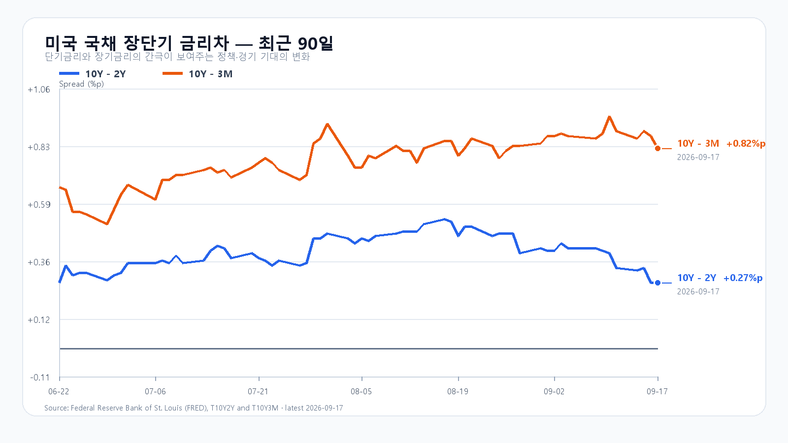

# 2026-09-18 KOSPI·KODEX 일일 리서치

작성 2026-09-18T08:13:30+09:00 / 데이터 최종 확인 2026-09-18T08:13:16+09:00 / 한국 장전.

확정 사실은 출처 시각 기준, 시나리오와 확률은 조건부 전망이다.

유가와 미국 국채금리가 함께 내리자 뉴욕 반도체주가 크게 반등했다. 엔비디아와 마이크론이 오른 흐름은 국내 메모리주에도 힘을 보탤 수 있다. 다만 전날 KOSPI는 외국인 매도에 장중 6,795선에서 6,715.41로 밀렸다. 오늘은 미국의 반등보다 국내에서 그 상승을 받아 줄 매수세가 이어지는지가 중요하다.

9월 17일 미국 정규장에서 SOXX는 3.39%, SMH는 2.76% 올랐다. 마이크론은 5.50%, AMD는 6.36%, 엔비디아는 2.54%, 브로드컴은 2.29% 상승했다. 나스닥 종합지수도 1.7% 뛰었다. 하루 전 연준의 금리 인상으로 무거워졌던 반도체 투자심리가 되살아난 셈이다. [미국 반도체 시세](https://finance.yahoo.com/quote/SOXX/) · [미국 증시 마감](https://apnews.com/article/wall-street-stocks-dow-nasdaq-a8ce06ff4ffcf66d9f28bd3453bdf998)

반등의 배경에는 유가와 금리의 하락이 있다. 브렌트유는 17일 배럴당 104.82달러에 마감해 약 1% 내렸다. 사우디 원유 수송 차질이 완화될 수 있다는 기대가 공급 불안을 낮췄다. 미국 10년물 국채금리도 5.01%에서 4.94%로 내려왔다. 하지만 유가는 여전히 100달러를 넘고, 연준의 추가 긴축 전망도 남아 있다. 오늘 아침 미국 주가지수 선물이 약세로 돌아선 이유를 함께 봐야 한다. [유가와 시장](https://apnews.com/article/26a4da336d561d213a3f28f260f25d2c) · [미 재무부 금리](https://home.treasury.gov/resource-center/data-chart-center/interest-rates/TextView?type=daily_treasury_yield_curve&field_tdr_date_value_month=202609)

한국장에는 전날의 수급이 남았다. 17일 KOSPI는 6,779.02로 출발해 6,795.53까지 올랐으나 6,715.41에 마감했다. 한국거래소와 넥스트레이드를 합친 외국인 순매도는 약 2조 4,606억원이었다. 지수의 6,700선은 지켰지만 오전 상승을 끝까지 유지하지 못했다. 전날의 반등과 매도는 이미 한국장에 반영된 움직임이므로 미국 주식의 뒤이은 상승을 모두 오늘의 새 상승 폭으로 더할 수 없다. [국내 마감과 수급](https://www.mt.co.kr/stock/2026/09/17/2026091715255681035)

메모리 가격도 한 방향으로 움직이지 않았다. TrendForce의 17일 현물 평균에서 DDR5 16Gb는 0.73% 올랐고 DDR4 16Gb는 1.85% 내렸다. DDR4 8Gb는 0.78% 상승했다. 서버 메모리와 HBM을 향한 구조적 수요가 이어져도 품목별 현물 가격과 오늘 삼성전자·SK하이닉스 주가는 각각 다른 속도로 움직인다. [메모리 현물 가격](https://www.trendforce.com/price/dram/dram_spot) · [DRAM 산업 동향](https://www.trendforce.com/presscenter/news/20260907-13219.html)

달러/원은 18일 새벽 하나은행 고시 기준 1,382원으로 전날보다 0.33% 높았다. 환율이 높은 채로 외국인 매도가 이어지면 미국 반도체 상승만으로 KOSPI 6,850 위에 안착하기 어렵다. 반대로 삼성전자와 SK하이닉스가 장전 상승을 정규장까지 지키고 외국인·프로그램 매수가 함께 돌아오면 반등의 폭이 넓어질 수 있다. [달러/원 고시](https://api.stock.naver.com/marketindex/exchange/FX_USDKRW)

오늘 KOSPI의 기본 종가 범위는 6,650~6,850, 확률은 50%다. 6,850을 넘어서고 외국인 현물과 프로그램이 함께 순매수하면 강세 범위 6,850 초과~7,000을 본다. 확률은 30%다. 6,650이 무너지고 두 수급이 순매도라면 약세 범위 6,450~6,650 미만으로 내려간다. 확률은 20%다.

|종가 시나리오|범위·확률|15시 20분 확인 조건|전환 신호|
|---|---|---|---|
|기본|6,650~6,850 · 50%|6,650 이상 · 6,850 이하 · 외국인 매도 축소|범위 이탈|
|강세|6,850 초과~7,000 · 30%|6,850 초과 · 외국인·프로그램 동반 순매수|6,850 아래 재진입|
|약세|6,450~6,650 미만 · 20%|6,650 미만 · 외국인·프로그램 동반 순매도|6,650 회복|

장중 고저 예상 범위는 6,350~7,050으로 둔다. 종가 범위와 장중 범위의 목표 신뢰수준은 각각 90%이며 과거 적중률을 뜻하지 않는다. 대응 점수는 공격 25, 관망 50, 방어 25다. KODEX 레버리지는 전일 저가 102,825원을 1차 지지, 종가 103,490원을 반등 기준, 고가 106,520원을 저항으로 본다. [KODEX 레버리지](https://m.stock.naver.com/domestic/stock/122630/total)

## 장전 가격

|항목|가격·변화|출처 시각|
|---|---:|---|
|KOSPI 전일 종가|6,715.41 · -0.04%|2026-09-17 정규장 종가|
|KODEX 레버리지 전일 종가|103,490원 · -0.09%|2026-09-17 정규장 종가|
|삼성전자 NXT|261,000원 · 3.37%|2026-09-18T08:13:16.785358+09:00|
|SK하이닉스 NXT|1,805,000원 · 3.44%|2026-09-18T08:13:16.785372+09:00|
|달러/원 하나은행 고시|1,382.00원 · 0.33%|2026-09-18T05:50:43+09:00|
|Nasdaq100 선물|29,695.25 · -0.16%|2026-09-18T08:03:08+09:00 · 지연 시세|
|S&P500 선물|7,700.00 · -0.09%|2026-09-18T08:03:09+09:00 · 지연 시세|
|브렌트 선물|104.08 · -0.71%|2026-09-18T07:58:30+09:00 · 지연 시세|
|WTI 선물|101.15 · -0.75%|2026-09-18T08:03:07+09:00 · 지연 시세|

[NXT](https://stock.naver.com/api/polling/domestic/NXT/stock?itemCodes=005930,000660) · [환율](https://api.stock.naver.com/marketindex/exchange/FX_USDKRW) · [Nasdaq100 선물](https://finance.yahoo.com/quote/NQ=F/) · [S&P500 선물](https://finance.yahoo.com/quote/ES=F/)

NXT는 대체거래소 장전 거래, 미국 선물은 지연 시세다.

## 직전 전망 정산

# 2026-09-17 종가 정산

- 정산 기록 2026-09-18T08:06:40+09:00. KOSPI 6,715.41(-0.04%), 시가 6,779.02·고가 6,795.53·저가 6,697.85. KODEX 레버리지 103,490원(-0.09%), 고가 106,520원·저가 102,825원.
- 직전 장전 전망의 기본 종가 범위 6,600~6,750에 들어갔고 당일 전체 고저는 6,300~7,000 경로 안이다. 종가 기본 적중과 별개로 외국인 매도 축소 조건은 15:20 원문 부재로 미확인.
- KRX+NXT 누적 외국인 약 2조 4,606억원 순매도 보도와 KRX 단독 약 2조 2,771억원 보도는 집계 범위가 다르다. 15:20 값처럼 사용하지 않는다.
- 미국 반도체 상승을 국내 지속 반등으로 기대했으나 삼성·하이닉스 정규장 약세와 외국인 매도 때문에 오전 상승을 반납했다. 수급 계측 없는 확률 설명으로 대체하지 않는다.
- KOSPI `price` API는 9/16에서 멈췄다. 9/17 OHLC는 한국거래소 인용 마감 보도 두 곳과 `basic`의 6,715.41을 대조했다.

## 취재 근거와 확인 시각

# 2026-09-18 장전 취재 노트

- 조사 시작 08:01 KST. 한국은 KRX 거래일이며 정규장 개장 전이다. 출처의 거래 시각과 수집 시각은 다르다.
- 국내 종가 원천 충돌: Naver KOSPI 일봉 `price`는 9/16에서 멈췄으나 `basic`은 9/17 종가 6,715.41 PREOPEN이다. 한국거래소 인용 마감 보도 두 곳도 6,715.41을 확인한다. 9/17 KOSPI 시가 6,779.02, 고가 6,795.53, 저가 6,697.85, 종가 6,715.41. KODEX 103,490원(-0.09%), 고가 106,520, 저가 102,825. 외국인 순매도는 KRX+NXT 누적 약 2조 4,606억원, KRX만 집계한 보도는 2조 2,771억원으로 모집단이 달라 구분한다. 15:20 원문 수급은 없다.

## 밤사이 이슈 순위

|순위|후보|근거와 한국 전달 경로|
|---:|---|---|
|1|사우디 원유 공급 우려 일부 완화|브렌트 9/17 정규장 $104.82(-1%)로 하락. 사우디 송유관 복구 기대. 유가 하락이 미국 금리·성장주를 함께 완화하지만 $100 위 잔존. AP와 Reuters 대조.|
|2|미 국채금리 하락과 미국 반도체 반등|미 재무부 9/17 10년 4.94%, 2년 4.67%, 전일 대비 -7bp. SOXX +3.39%, SMH +2.76%, Micron +5.50%, AMD +6.36%. 국내 메모리로 전달 가능.|
|3|전날 국내 외국인 매도와 장중 상승 반납|KOSPI는 장중 6,795.53에서 6,715.41로 반락, 외국인 약 2.46조원 순매도(KRX+NXT). 밤사이 호재를 국내 매수로 자동 등치할 수 없음.|
|4|메모리 현물 품목별 엇갈림|TrendForce 9/17 19:10 KST: DDR5 16Gb $55.233(+0.73%), DDR4 16Gb $86.00(-1.85%), DDR4 8Gb $46.143(+0.78%). HBM 계약·주식 수급과 구분.|
|5|금리 인상과 추가 긴축 전망 잔존|9/16 FOMC는 이미 9/17 한국장에 반영. 새 충격으로 재가산하지 않되 달러/원과 외국인 수급의 배경 위험으로 유지.|
|6|미국 빅테크·반도체 공시|AMD IR 9/15 Form 144, Broadcom 9/10 10-Q 외에 9/17 밤사이 시장을 지배한 신규 실적·대규모 계약 원문은 찾지 못함. 가격 상승을 새 계약 발표로 설명하지 않음.|
|7|강제청산·증자·규제|검색군 조사에서 KOSPI 메모리주에 직접 전달할 신규 확정 원문은 확보하지 못함. Holtec IPO 중단은 미국 AI 전력 투자 심리의 보조 신호이나 국내 주도 재료로 격상하지 않음.|
|8|미국 주가지수 선물 소폭 약세|9/18 07:51 지연 시세 NQ -0.21%, ES -0.12%. 정규장 상승이 아침까지 일방적으로 이어지지 않음.|

## 확인값과 시차

- 미국 9/17 정규장: QQQ 716.92(+1.73%), TQQQ 71.38(+5.08%), SOXX 519.10(+3.39%), SMH 560.61(+2.76%); NVDA 219.34(+2.54%), AMD 545.09(+6.36%), MU 977.50(+5.50%), AVGO 347.30(+2.29%). Yahoo chart 원시 JSON `yahoo-*.json`, 수집 08:02 KST. 시간외 종목별 확정 가격은 응답에 없어 사용하지 않는다.
- 미 국채 9/17 종가: 3개월 4.12%, 2년 4.67%, 10년 4.94%. 10년-2년 +0.27%p, 10년-3개월 +0.82%p. 미 재무부·FRED 원문. 전일 10년 5.01%에서 7bp 하락.
- Brent 9/17 정규장 정산 $104.82(-1%), Yahoo 9/18 07:43 지연 선물 $104.09(-0.70%); 서로 다른 계약·시각이다. WTI 선물 $101.22(-0.68%, 07:50 지연).
- 하나은행 USD/KRW 9/18 05:50:43 고시 1,382.00원(+0.33%). 아침의 새 고시가 나오면 발행 직전 교체한다.
- 9/18 08:02 NXT 삼성전자 260,500원(+3.17%), SK하이닉스 값은 `NXT.json` 원문 참조. 정규장 종가와 별도 거래 세션이다.
- 메모리 산업: TrendForce 9/7 발표 2분기 DRAM 산업 매출 증가와 서버 중심 배분은 구조적 배경이다. 당일 현물은 품목별 엇갈려 업황 전체를 하루의 가격으로 판정하지 않는다.
- 9/18 미국 BLS 주별 고용 지표는 10:00 ET, 9/18 23:00 KST로 한국장 마감 뒤다. 9/17 신규 실업수당 청구는 발표됐으나 수치가 이번 원천 묶음에서 검증되지 않아 원고의 숫자에서 제외한다.

## 직전 전망과 오늘의 조건

- 9/17 `2026-09-17-0813-same-close`: 기본 6,600~6,750, 실제 6,715.41로 종가 기본 적중. 장중 6,697.85~6,795.53은 경로 6,300~7,000 안. 15:20 트리거는 원문 부재로 미확인. 외국인 매도 축소를 기본 조건으로 본 가정은 마감 누적 약 2.46조 순매도와 배치되나 15:20 판정에 소급하지 않는다.
- 오늘 중심 명제: 미국 반도체 반등이 국내 NXT에 전해졌지만 전날 한국장에서 이미 노출된 외국인 매도와 높은 환율 때문에 KOSPI 6,850 위에는 동시 수급 확인이 필요하다.
- 잠정 시나리오: 기본 6,650~6,850(50%), 강세 6,850 초과~7,000(30%), 약세 6,450~6,650 미만(20%). 장중 6,350~7,050(90%), 대응 공격 25·관망 50·방어 25. 최종 장전값과 함께 재판단한다.

## 원문

- https://home.treasury.gov/resource-center/data-chart-center/interest-rates/TextView?type=daily_treasury_yield_curve&field_tdr_date_value_month=202609
- https://www.trendforce.com/price/dram/dram_spot
- https://apnews.com/article/wall-street-stocks-dow-nasdaq-a8ce06ff4ffcf66d9f28bd3453bdf998
- https://apnews.com/article/26a4da336d561d213a3f28f260f25d2c
- https://www.newspim.com/news/view/20260917000942
- https://www.mt.co.kr/stock/2026/09/17/2026091715255681035
- https://www.bls.gov/schedule/2026/
- https://ir.amd.com/financial-information/sec-filings
- https://investors.broadcom.com/financial-information/broadcom-inc-sec-filings

## 미국 정규장 종목별 확인

|종목|9/17 종가|전일 대비|
|---|---:|---:|
|QQQ|716.92|+1.73%|
|TQQQ|71.38|+5.08%|
|SOXX|519.10|+3.39%|
|SMH|560.61|+2.76%|
|NVDA|219.34|+2.54%|
|AMD|545.09|+6.36%|
|MU|977.50|+5.50%|
|AVGO|347.30|+2.29%|
