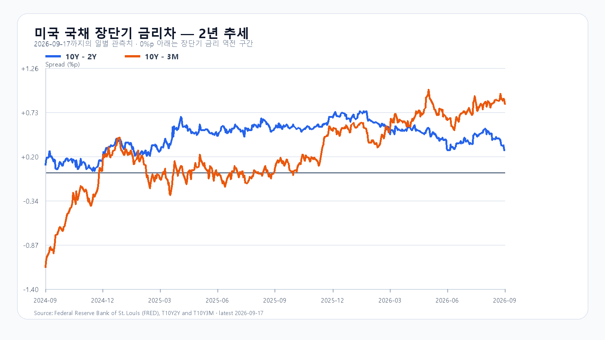

# 2026-09-21 KOSPI·KODEX 일일 리서치

작성 2026-09-21T08:14:50+09:00 / 데이터 최종 확인 2026-09-21T08:14:50+09:00 / 한국 장전.

확정 사실은 출처 시각 기준, 시나리오와 확률은 조건부 전망이다.

금요일 뉴욕 반도체주가 다시 올랐다. SOXX는 2.69%, SMH는 2.21% 상승했고, 마이크론은 3.92%, AMD는 2.70%, 엔비디아는 1.34%, 브로드컴은 2.97% 올랐다. 나스닥100도 강세로 마감했다. 장전 NXT에서 삼성전자와 SK하이닉스가 각각 1.34%, 1.13% 오르며 이 흐름을 받았다.

다만 반등이 곧바로 KOSPI 7,000선 안착을 뜻하지는 않는다. 미국 10년물 국채금리는 금요일 5.00%까지 올랐고, 브렌트유는 100달러 안팎에서 움직였다. 높은 할인율과 에너지 가격은 AI 투자와 반도체 밸류에이션에 동시에 부담을 준다. 오늘 한국장에서는 반도체주의 시초가보다 외국인·프로그램 수급이 그 상승을 지키는지를 먼저 봐야 한다. [미국 반도체 시세](https://finance.yahoo.com/quote/SOXX/) · [미국 증시 마감](https://apnews.com/article/da0dbe004b6f83c36e7d1626a9741a92)

전 거래일 KOSPI는 6,885.70으로 출발해 6,914.08까지 오른 뒤 6,894.23에 마감했다. KODEX 레버리지는 109,265원으로 5.58% 상승했다. 이는 18일 장중에 이미 형성된 국내 반도체 강세다. 미국 금요일 상승분은 장전 기대를 높이는 보조 신호지만, 끝난 한국장의 상승을 같은 충격으로 다시 더하지 않는다. [KOSPI](https://m.stock.naver.com/api/index/KOSPI/price?pageSize=10&page=1) · [KODEX 레버리지](https://m.stock.naver.com/domestic/stock/122630/total)

메모리의 중장기 방향과 당일 주가는 분리해서 본다. 서버용 메모리와 HBM 수요가 이어지는 가운데, 금요일 마이크론의 강세는 공급업체 쪽 기대를 지지한다. 반면 메모리 현물 가격은 품목별로 갈리고, 오늘의 국내 주가는 환율과 외국인 수급에 더 민감할 수 있다. [TrendForce DRAM 현물](https://www.trendforce.com/price/dram/dram_spot)

기본 시나리오는 KOSPI 6,850~7,050, 확률 50%다. 장전 반도체 상승이 이어져도 7,050 위에서는 외국인 현물과 프로그램의 동반 순매수가 필요하다. 이 조건이 충족되면 강세 범위 7,050 초과~7,200을 본다. 반대로 6,850을 다시 밑돌고 두 수급이 함께 순매도로 기울면 약세 범위 6,650~6,850 미만으로 전환한다.

|종가 시나리오|범위·확률|15시 20분 확인 조건|전환 신호|
|---|---|---|---|
|기본|6,850~7,050 · 50%|6,850 이상 · 7,050 이하 · 외국인 매도 확대 없음|범위 이탈|
|강세|7,050 초과~7,200 · 30%|7,050 초과 · 외국인·프로그램 동반 순매수|7,050 아래 재진입|
|약세|6,650~6,850 미만 · 20%|6,850 미만 · 외국인·프로그램 동반 순매도|6,850 회복|

장중 고저 예상 범위는 6,550~7,250으로 둔다. 종가와 장중 범위의 목표 신뢰수준은 각각 90%이며 과거 적중률을 뜻하지 않는다. 대응 점수는 공격 30, 관망 50, 방어 20이다. KODEX 레버리지는 107,310원을 1차 지지, 109,265원을 반등 기준, 110,435원을 저항으로 본다.

## 장전 가격

|항목|가격·변화|출처 시각|
|---|---:|---|
|KOSPI 전일 종가|6,894.23 · -0.04%|2026-09-17 정규장 종가|
|KODEX 레버리지 전일 종가|109,265원 · -0.09%|2026-09-17 정규장 종가|
|삼성전자 NXT|263,000원 · 0.77%|2026-09-21T08:14:50.622692+09:00|
|SK하이닉스 NXT|1,871,000원 · 0.75%|2026-09-21T08:14:50.622702+09:00|
|달러/원 하나은행 고시|1,388.00원 · 0.51%|2026-09-21T07:53:38+09:00|
|Nasdaq100 선물|30,016.75 · +0.33%|2026-09-21T08:04:49+09:00 · 지연 시세|
|S&P500 선물|7,732.25 · +0.26%|2026-09-21T08:04:49+09:00 · 지연 시세|
|브렌트 선물|99.36 · +0.07%|2026-09-21T08:03:13+09:00 · 지연 시세|
|WTI 선물|95.96 · -0.12%|2026-09-21T08:04:45+09:00 · 지연 시세|

[NXT](https://stock.naver.com/api/polling/domestic/NXT/stock?itemCodes=005930,000660) · [환율](https://api.stock.naver.com/marketindex/exchange/FX_USDKRW) · [Nasdaq100 선물](https://finance.yahoo.com/quote/NQ=F/) · [S&P500 선물](https://finance.yahoo.com/quote/ES=F/)

NXT는 대체거래소 장전 거래, 미국 선물은 지연 시세다.

## 직전 전망 정산

# 2026-09-18 종가 정산

- KOSPI는 6,894.23(+2.66%)로 마감했다. 시가 6,885.70·고가 6,914.08·저가 6,830.95였고, KODEX 레버리지는 109,265원(+5.58%)으로 마감했다.
- 9월 18일 장전 전망의 강세 종가 범위 6,850 초과~7,000에 들어갔고, 장중 고저도 6,350~7,050 포락 안에 있었다. 15시 20분 외국인·프로그램 원문은 이번 실행에서 확인하지 못해 해당 조건은 미확인으로 보존한다.
- 미국 반도체 반등과 국내 메모리주의 동반 강세는 방향을 뒷받침했지만, 수급 조건까지 충족했다고 종가만으로 소급하지 않는다.

## 취재 근거와 확인 시각

# 2026-09-21 장전 취재 노트

- 기준 시각: 2026-09-21 08:03 KST. 한국 정규장 전, 미국 정규장은 9월 18일 종가 기준이다.
- 가격: QQQ +0.63%, TQQQ +1.77%, SOXX +2.69%, SMH +2.21%. NVDA +1.34%, AMD +2.70%, MU +3.92%, AVGO +2.97%로 마감했다. 장전 Nasdaq100 선물은 +0.29%, S&P500 선물은 +0.23%였다.
- 상위 이슈: 미국 반도체 반등(가격 확인), 미국 10년물 5.00% 부근과 브렌트 100달러 안팎의 할인율·에너지 부담, 이란의 호르무즈 해협 유조선 공격 보도에 따른 해운·유가 위험, 중국 LPR 발표일이다.
- 국내 전달: NXT 장전에서 삼성전자 264,500원(+1.34%), SK하이닉스 1,878,000원(+1.13%). 하나은행 USD/KRW는 1,388.00원(+0.51%, 07:53:38 고시)이다.
- 메모리: 마이크론 정규장 강세는 공급업체 기대를 지지한다. 현물 가격은 품목별 분화를 유지하므로, 서버·HBM 구조 수요와 당일 주가·수급을 같은 신호로 취급하지 않는다.
- 다음 일정: 9월 21일 21:30 KST 시카고 연은 8월 국가활동지수, 중국 LPR 고시. 이번 주 9월 24일 21:30 KST 미국 주간 신규 실업수당 청구, 9월 25일 21:30 KST 미국 소비자심리·소득 관련 지표를 확인한다.
- 출처: Yahoo Finance chart API, Naver Finance/NXT/하나은행 API, AP 9월 18일 미국 증시 마감, BLS·Chicago Fed 공개 일정, TrendForce 현물가격 페이지.

## 미국 정규장 종목별 확인

|종목|9/17 종가|전일 대비|
|---|---:|---:|
|QQQ|721.45|+0.63%|
|TQQQ|72.64|+1.76%|
|SOXX|533.07|+2.69%|
|SMH|573.00|+2.21%|
|NVDA|222.27|+1.34%|
|AMD|559.82|+2.70%|
|MU|1015.80|+3.92%|
|AVGO|357.61|+2.97%|
