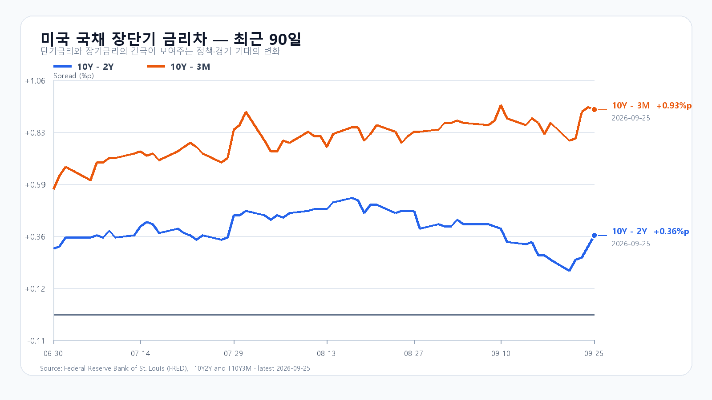
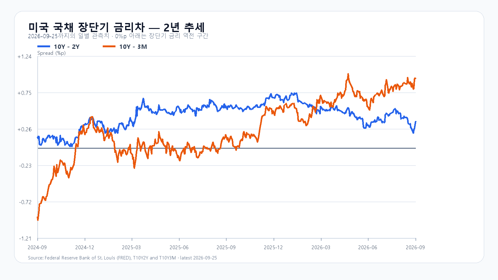

# 2026-09-28 KOSPI·KODEX 일일 리서치

작성 2026-09-28T08:21:05+09:00 / 데이터 최종 확인 2026-09-28T08:21:02+09:00 / 한국 장전.

확정 사실은 출처 시각 기준, 시나리오와 확률은 조건부 전망이다.

AI 인프라 수요는 여전히 가격으로 확인된다. 9월 25일 미국 정규장에서 SOXX는 1.17%, SMH는 1.01% 올랐고 Akamai는 Anthropic과 약 116억 달러 규모의 장기 컴퓨팅 용량 계약을 공시했다. 9월 24일 기준 DDR5 16Gb 현물도 57.667달러로 0.29% 상승했다. 공급 계약과 메모리 가격은 AI 서버 투자가 수요의 바닥을 받치고 있음을 보여 준다.

하지만 KOSPI가 9월 23일 7,080.92로 마감한 뒤 연휴를 마친 첫 장이다. 미국 10년물은 5.17%로 올라 AI 밸류에이션의 할인율 부담이 사라지지 않았다. NXT에서도 삼성전자는 284,500원(-0.35%), SK하이닉스는 1,831,000원(-1.66%)으로 약세였다. 전주 미국 반도체 강세를 지수 상승폭으로 다시 더하기보다, 7,155선 접근 때 국내 수급과 메모리 대형주의 동행을 확인해야 한다.

기본 시나리오는 KOSPI 7,020~7,155, 확률 55%다. AI 수요 계약이 하단을 지지하지만 장기금리와 대형주 분화가 상단을 제한하는 경우다. 7,155를 넘고 외국인·프로그램이 함께 순매수로 기울면 7,155 초과~7,300의 강세 범위를 본다. 반대로 7,020 아래로 밀리며 두 수급이 함께 순매도로 돌아서면 6,850~7,020 미만의 약세 범위로 전환한다.

메모리 현물은 품목별로 갈렸다. DDR5 16Gb는 0.29% 올랐지만 DDR4 16Gb는 0.70% 내렸다. AI 서버용 고사양 메모리 수요와 주식시장의 당일 포지션은 같은 속도로 움직이지 않는다. KODEX 레버리지는 114,555원을 1차 지지, 116,975원을 반등 기준, 119,300원을 저항으로 둔다.

|종가 시나리오|범위·확률|15시 20분 확인 조건|전환 신호|
|---|---|---|---|
|기본|7,020~7,155 · 55%|7,020 이상 · 7,155 이하 · 외국인 매도 급확대 없음|범위 이탈|
|강세|7,155 초과~7,300 · 25%|7,155 초과 · 외국인·프로그램 동반 순매수|7,155 아래 재진입|
|약세|6,850~7,020 미만 · 20%|7,020 미만 · 외국인·프로그램 동반 순매도|7,020 회복|

장중 고저 예상 범위는 6,800~7,350으로 둔다. 종가와 장중 범위의 목표 신뢰수준은 각각 90%이며, 과거 적중률을 뜻하지 않는다. 대응 점수는 공격 25, 관망 55, 방어 20이다.

## 장전 가격

|항목|가격·변화|출처 시각|
|---|---:|---|
|KOSPI 전일 종가|7,080.92 · +0.90%|2026-09-23 정규장 종가|
|KODEX 레버리지 전일 종가|116,975원 · +2.25%|2026-09-23 정규장 종가|
|삼성전자 NXT|284,500원 · -0.35%|2026-09-28T08:21:02+09:00|
|SK하이닉스 NXT|1,831,000원 · -1.66%|2026-09-28T08:21:02+09:00|
|달러/원 하나은행 고시|1,359.00원 · +0.26%|2026-09-28T07:30:33+09:00|
|Nasdaq100 선물|30,802.00 · -0.28%|2026-09-28 08:20 KST · 일요일 재개장 후|
|S&P500 선물|7,782.25 · -0.28%|2026-09-28 08:20 KST · 일요일 재개장 후|
|브렌트 선물|98.50달러 · +1.09%|2026-09-28 08:20 KST · 일요일 재개장 후|

## 취재 근거와 확인 시각

- 미국 가격: QQQ +0.46%, TQQQ +1.30%, SOXX +1.17%, SMH +1.01%. Nvidia +0.22%, AMD +0.22%, Micron +0.16%, Broadcom +0.70%로 9월 25일 정규장을 마쳤다.
- AI 인프라: Akamai와 Anthropic은 기존 마스터 서비스 계약 아래 프로젝트 플랜을 체결했고, Anthropic의 약정액은 약 116억 달러다. 이는 고객명·금액이 공시된 장기 용량 계약이며 반도체 개별사의 매출 계약으로 확대 해석하지 않는다.
- 금리: 미 재무부 9월 25일 기준 2년물 4.81%, 10년물 5.17%, 10년-2년 스프레드 +0.36%p다. 장기금리 상승은 성장주 상단의 조건부 제약이다.
- 메모리: TrendForce 9월 24일 18:10 GMT+8 기준 DDR5 16Gb 57.667달러(+0.29%), DDR4 16Gb 83.784달러(-0.70%), DDR4 8Gb 46.107달러(+0.47%)다. 9월 25일 국제 현물 휴장으로 새 갱신은 없었다.
- 일정: 9월 29일 22:00 KST JOLTS, 9월 30일 21:30 KST BEA 2분기 GDP 3차치와 8월 개인소득·지출, Micron 9월 30일 실적 발표가 예정돼 있다.
- 출처: [Akamai 8-K](https://www.sec.gov/Archives/edgar/data/1086222/000119312526401048/d288154d8k.htm), [미 재무부](https://home.treasury.gov/resource-center/data-chart-center/interest-rates/daily-treasury-rates.csv/2026/all?type=daily_treasury_yield_curve&field_tdr_date_value=2026&page&_format=csv), [TrendForce](https://www.trendforce.com/price/dram/module_spot), [Micron IR](https://investors.micron.com/news/press-release/2026/Micron-Technology-to-Report-Fiscal-Fourth-Quarter-Results-on-September-30-2026/default.aspx), [BLS 일정](https://www.bls.gov/schedule/2026/09_sched.htm), [BEA 일정](https://www.bea.gov/news/schedule).

