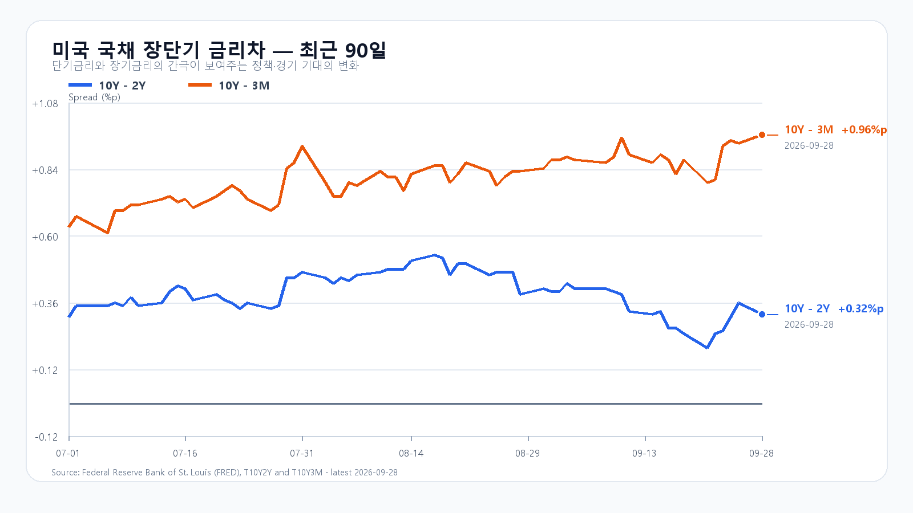
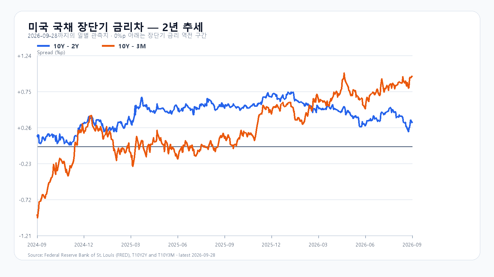

# 2026-09-29 KOSPI·KODEX 일일 리서치

작성 2026-09-29T08:15:27+09:00 / 데이터 최종 확인 2026-09-29T08:15:27+09:00 / 한국 장전.

확정 사실은 출처 시각 기준, 시나리오와 확률은 조건부 전망이다.

미국 반도체주의 반등은 하루를 넘기지 못했다. 9월 28일 미국 정규장에서 SOXX는 2.08%, SMH는 1.08% 내렸고 Micron은 2.62%, AMD는 3.61% 하락했다. 유가가 다시 오르고 장기금리가 높은 자리를 지키는 동안, AI 투자에 필요한 자본비용이 다시 주가의 앞자리를 차지했다.

국내 시장은 이미 9월 28일 KOSPI 6,889.74(-2.70%), KODEX 레버리지 109,370원(-6.50%)으로 크게 조정받았다. 그래서 미국 반도체 약세를 전날 하락폭만큼 다시 계산할 이유는 없다. 장전 NXT에서 삼성전자와 SK하이닉스가 약세를 이어간 만큼, KOSPI가 먼저 6,900선을 되찾는지와 외국인·프로그램 수급의 동행이 오늘 장의 방향을 가를 가능성이 크다.

메모리의 실물 흐름과 주가 흐름은 갈라져 있다. 공개 현물 기준 DDR5 16Gb는 9월 24일 57.667달러로 0.29% 올랐지만 DDR4 16Gb는 0.70% 내렸다. AI 서버용 메모리 수요가 꺾였다는 신호는 아니지만, Micron 실적과 미국 고용·물가 지표를 앞둔 주식시장은 그보다 먼저 포지션을 줄일 수 있다.

기본 시나리오는 KOSPI 6,800~6,950, 확률 45%다. 전날 급락을 소화하면서 6,900선 회복을 시도하되 금리와 유가 부담이 상단을 누르는 경우다. 6,950을 넘고 외국인 현물과 프로그램이 함께 순매수로 돌아서면 6,950 초과~7,100의 강세 범위를 본다. 반대로 6,800을 이탈하고 두 수급이 함께 순매도로 기울면 6,550~6,800 미만의 약세 범위가 열린다.

KODEX 레버리지는 106,000원을 1차 지지, 109,370원을 반등 기준, 112,000원을 저항으로 둔다. 장중 고저 예상 범위는 KOSPI 6,450~7,100이다. 대응 점수는 공격 15, 관망 40, 방어 45다.

|종가 시나리오|범위·확률|15시 20분 확인 조건|전환 신호|
|---|---|---|---|
|기본|6,800~6,950 · 45%|6,800 이상 · 6,950 이하 · 외국인 매도 급확대 없음|범위 이탈|
|강세|6,950 초과~7,100 · 15%|6,950 초과 · 외국인·프로그램 동반 순매수|6,950 아래 재진입|
|약세|6,550~6,800 미만 · 40%|6,800 미만 · 외국인·프로그램 동반 순매도|6,800 회복|

## 장전 가격

|항목|가격·변화|출처 시각|
|---|---:|---|
|KOSPI 전일 종가|6,889.74 · -2.70%|2026-09-28 정규장 종가|
|KODEX 레버리지 전일 종가|109,370원 · -6.50%|2026-09-28 정규장 종가|
|삼성전자 NXT|268,000원 · -0.74%|2026-09-29T08:15:27.832774+09:00|
|SK하이닉스 NXT|1,769,000원 · 0.06%|2026-09-29T08:15:27.832784+09:00|
|달러/원 하나은행 고시|1,360.00원 · 0.07%|2026-09-29T06:53:09+09:00|
|Nasdaq100 선물|30,595.50 · +0.10%|2026-09-29T08:05:12+09:00 · 지연 시세|
|S&P500 선물|7,749.50 · +0.04%|2026-09-29T08:05:24+09:00 · 지연 시세|
|브렌트 선물|98.65 · +0.84%|2026-09-29T08:03:09+09:00 · 지연 시세|
|WTI 선물|93.28 · +0.73%|2026-09-29T08:05:04+09:00 · 지연 시세|

## 취재 근거와 확인 시각

# 2026-09-29 장전 취재 노트

- 기준: 2026-09-29 08:04 KST, KRX 장전. 직전 정규장 확정값은 9월 28일이다.
- 한국장: KOSPI는 9월 28일 6,889.74(-2.70%)로 마감했고 장중 7,065.90에서 6,889.68까지 밀렸다. KODEX 레버리지는 109,370원(-6.50%)으로 마감했다. 전일 장전판의 기본·약세 구간을 함께 하회했다.
- 미국 정규장(9월 28일): QQQ -1.07%, TQQQ -3.22%, SOXX -2.08%, SMH -1.08%. Nvidia +1.68%와 달리 AMD -3.61%, Micron -2.62%, Broadcom -0.92%로 엇갈렸다.
- 이슈 레이더: ① 유가 상승과 미 국채금리 고점권이 기술주 할인율·AI 인프라 차입 부담을 키운 점, ② Micron 실적과 미국 고용·물가 지표를 앞둔 반도체 포지션 조정, ③ 전날 KOSPI·국내 메모리 대형주의 급락, ④ 9월 29일 장전 NXT 약세. 대규모 강제청산·증자·새 공급계약은 상위 이슈를 바꿀 신뢰 가능한 원문이 없어 공개 본문에서 제외한다.
- 장전 확인: 08:04 KST NXT 삼성전자 265,500원(-1.67%), SK하이닉스 1,758,000원(-0.57%). 하나은행 USD/KRW는 1,360.00원(06:53 고시). Nasdaq100 선물은 07:53 KST +0.11%, Brent는 98.71달러(+0.90%).
- 금리: FRED 최신 갱신값은 9월 28일 10년-2년 +0.32%p, 10년-3개월 +0.96%p이다. 미 재무부의 가장 최근 개별 만기 관측은 9월 25일 2년 4.81%, 10년 5.17%, 3개월 4.24%다.
- 메모리: TrendForce의 마지막 확인 가능 공개 현물(9월 24일)은 DDR5 16Gb 57.667달러(+0.29%), DDR4 16Gb 83.784달러(-0.70%), DDR4 8Gb 46.107달러(+0.47%)다. 현물·계약가·주식 수급을 같은 신호로 합치지 않는다.
- 경제 일정: JOLTS는 9월 29일 22:00 KST, BEA의 GDP 및 개인소득·지출은 9월 30일 21:30 KST, Micron 실적은 9월 30일 미국 장 마감 뒤 예정됐다.

## 판단 재료

- 확정 사실: 반도체 ETF와 AMD·Micron 약세, 전날 KOSPI·KODEX 급락, 장전 NXT 약세, 유가 상승과 장기금리 고점권.
- 시장 해석: AI 수요 계약과 DDR5 현물은 서버 메모리 수요의 바닥을 지지하지만, 금리·유가·실적 전 포지션 조정은 당일 주가 수급을 더 빠르게 흔든다.
- 중복 방지: 9월 28일 KOSPI의 -2.70%와 KODEX의 -6.50%에는 아시아 장중 위험회피가 이미 반영됐다. 미국 시간대의 반도체 약세는 별도 악재이나, 전일 국내 하락폭 전체를 다시 더하지 않는다.

## 미국 정규장 종목별 확인

|종목|9/28 종가|전일 대비|
|---|---:|---:|
|QQQ|736.53|-1.07%|
|TQQQ|77.04|-3.22%|
|SOXX|560.79|-2.08%|
|SMH|600.01|-1.08%|
|NVDA|228.86|+1.68%|
|AMD|607.87|-3.61%|
|MU|1053.98|-2.62%|
|AVGO|349.57|-0.92%|

