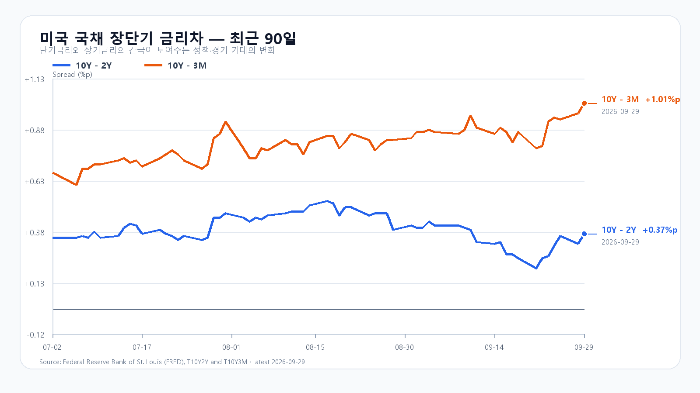
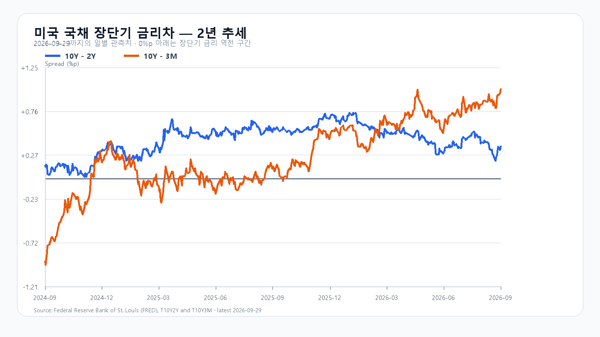

# 2026-09-30 KOSPI·KODEX 일일 리서치

작성 2026-09-30T08:12:34+09:00 / 데이터 최종 확인 2026-09-30T08:12:34+09:00 / 한국 장전.

확정 사실은 출처 시각 기준, 시나리오와 확률은 조건부 전망이다.

9월 29일 미국 반도체주는 다시 올랐다. SOXX는 1.19%, SMH는 1.15% 상승했고 Micron과 Broadcom도 각각 1.05%, 1.58% 올랐다. 밤사이 NXT에서 삼성전자와 SK하이닉스가 나란히 1%대 상승한 배경이다. 전날 KOSPI는 장중 6,782.99까지 밀렸다가 6,870.81로 마감했고 KODEX 레버리지는 110,285원으로 반등했다. 오늘은 전날 낙폭을 줄인 흐름이 6,900선 회복으로 이어지는지 확인할 자리다.

반등의 재료는 분명하지만, 상단을 바로 열어 주는 재료는 아니다. NVIDIA 이사회는 자사주 매입 한도를 1,500억달러 늘려 잔여 한도를 2,350억달러로 높였다. 그러나 Nvidia 주가는 0.72% 내렸다. 반도체 전반의 매수세가 돌아왔어도 가장 큰 AI 종목의 매물이 남아 있다는 뜻이다.

금리는 더 직접적인 제약이다. 미국 10년물은 5.24%, 2년물은 4.92%였고 10년-2년 금리차는 9월 29일 0.37%포인트까지 벌어졌다. Brent는 96달러대로 내려왔지만, 아직 에너지발 물가 부담을 지우기에는 높은 수준이다. 8월 JOLTS 구인은 708만건으로 시장 예상 720만건을 밑돌았고, 오늘 밤 미국 GDP와 개인소득·지출, 내일 새벽 Micron 실적이 그 부담을 다시 시험한다.

메모리의 실물 지표는 주가와 분리해 읽어야 한다. 9월 24일 공개 현물에서 DDR5 16Gb는 57.667달러로 0.29% 올랐고, DDR4 16Gb는 83.784달러로 0.70% 내렸다. 서버 메모리 수요의 바닥을 단정할 만한 변화는 아니며, 오늘 지수는 Micron 실적을 앞둔 포지션과 국내 수급의 영향을 더 크게 받을 가능성이 높다.

기본 시나리오는 KOSPI 6,800~6,950, 확률 50%다. NXT 반등과 원/달러 1,353.50원의 하락이 하단을 받치되, 5%대 장기금리가 6,950선 위의 추격을 제한하는 경우다. 6,950을 넘고 외국인 현물과 프로그램이 함께 순매수로 돌아서면 6,950 초과~7,100의 강세 범위를 본다. 반대로 6,800을 다시 이탈하고 두 수급이 함께 순매도로 기울면 6,600~6,800 미만의 약세 범위가 열린다.

KODEX 레버리지는 108,000원을 1차 지지, 110,285원을 반등 기준, 112,500원을 저항으로 둔다. 장중 고저 예상 범위는 KOSPI 6,550~7,100이다. 대응 점수는 공격 25, 관망 55, 방어 20이다.

|종가 시나리오|범위·확률|15시 20분 확인 조건|전환 신호|
|---|---|---|---|
|기본|6,800~6,950 · 50%|6,800 이상 · 6,950 이하 · 외국인 매도 급확대 없음|범위 이탈|
|강세|6,950 초과~7,100 · 25%|6,950 초과 · 외국인·프로그램 동반 순매수|6,950 아래 재진입|
|약세|6,600~6,800 미만 · 25%|6,800 미만 · 외국인·프로그램 동반 순매도|6,800 회복|

## 장전 가격

|항목|가격·변화|출처 시각|
|---|---:|---|
|KOSPI 전일 종가|6,870.81 · -0.27%|2026-09-29 정규장 종가|
|KODEX 레버리지 전일 종가|110,285원 · 0.84%|2026-09-29 정규장 종가|
|삼성전자 NXT|277,000원 · 1.65%|2026-09-30T08:12:35.895243+09:00|
|SK하이닉스 NXT|1,786,000원 · 1.19%|2026-09-30T08:12:35.895251+09:00|
|달러/원 하나은행 고시|1,353.50원 · -0.48%|2026-09-30T07:32:42+09:00|
|Nasdaq100 선물|30,665.00 · +0.17%|2026-09-30T08:02:28+09:00 · 지연 시세|
|S&P500 선물|7,741.75 · +0.13%|2026-09-30T08:02:32+09:00 · 지연 시세|
|브렌트 선물|96.16 · +0.00%|2026-09-30T08:01:50+09:00 · 지연 시세|
|WTI 선물|89.42 · +0.04%|2026-09-30T08:02:32+09:00 · 지연 시세|

## 취재 근거와 확인 시각

# 2026-09-30 장전 취재 노트

- 기준: 2026-09-30 08:04 KST, KRX 장전. 직전 국내 정규장 확정값은 9월 29일이다.
- 한국장: 9월 29일 KOSPI는 6,870.81(-0.27%)로 마감했다. 장중 6,782.99까지 밀린 뒤 6,870선으로 회복했지만 6,900선에는 닿지 못했다. KODEX 레버리지는 110,285원(+0.84%)으로 마감했고 장중 저가는 107,265원이었다.
- 미국 정규장(9월 29일): QQQ +0.19%, TQQQ +0.55%, SOXX +1.19%, SMH +1.15%. Micron +1.05%, Broadcom +1.58%, Nvidia -0.72%, AMD -0.05%로 마감했다. 반도체 ETF와 메모리주는 반등했지만 Nvidia는 장중 상승을 지키지 못했다.
- 이슈 레이더: ① 10년물 5.24%와 장기금리 고점권, ② Brent 96.16달러까지 내렸으나 높은 유가 수준이 남긴 물가·할인율 부담, ③ Nvidia의 1,500억달러 자사주 승인과 반도체 ETF 반등, ④ 8월 JOLTS 구인 708만건(시장 예상 720만건 하회), ⑤ Micron 9월 30일 16:30 ET 실적 발표. 대규모 청산·증자·공급계약·규제에서 상위 이슈를 바꿀 신규 1차 자료는 없었다.
- 장전 확인: 08:04 KST NXT 삼성전자 275,500원(+1.10%), SK하이닉스 1,785,000원(+1.13%). 하나은행 USD/KRW는 1,353.50원(-0.48%, 07:32 고시). Nasdaq100 선물 +0.19%, S&P500 선물 +0.14%, Brent 96.12달러(-0.04%, 모두 지연 시세)다.
- 금리: FRED 최신 금리차는 9월 29일 10년-2년 +0.37%p, 10년-3개월 +1.01%p. 최신 개별 금리는 9월 28일 3개월 4.28%, 2년 4.92%, 10년 5.24%다.
- 메모리: TrendForce 공개 현물의 마지막 확인값(9월 24일)은 DDR5 16Gb 57.667달러(+0.29%), DDR4 16Gb 83.784달러(-0.70%), DDR4 8Gb 46.107달러(+0.47%)다. 현물가격과 주식 수급을 같은 신호로 합치지 않는다.
- 경제 일정: Micron은 9월 30일 16:30 ET(10월 1일 05:30 KST) 4분기 실적 콜을 연다. 미국 GDP·개인소득·지출은 9월 30일 08:30 ET(21:30 KST) 발표 예정이다.

## 판단 재료

- 확정 사실: 전일 KOSPI의 장중 낙폭 축소, KODEX 반등, 미국 반도체 ETF·Micron·Broadcom 상승, 원화 강세와 NXT 동반 상승, 5%대 미국 10년물.
- 시장 해석: 전날 국내 급락 뒤의 매도 압력은 완화됐고 장전 메모리주는 반등한다. 다만 Nvidia 주가가 자사주 승인에도 약세였고 10년물 5%대가 유지돼, 지수의 상단은 반도체 반등만으로 열리지 않는다.
- 중복 방지: 9월 29일 미국 정규장 반도체 반등은 9월 29일 한국 정규장 마감 뒤 발생한 새 가격 정보다. 반면 미국 ETF의 한국장 후행 반영분은 별도 국내 충격으로 더하지 않는다.

## 원문·출처

- Naver Finance 장전·일봉·NXT·환율 원시 응답: `research/evidence/2026-09-30/`.
- Yahoo Finance 직접 시세 응답(ETF·주요 종목·선물·유가): `research/evidence/2026-09-30/`.
- [NVIDIA 자사주 승인](https://nvidianews.nvidia.com/news/nvidia-announces-a-150-billion-share-repurchase-authorization-increase): 1,500억달러 추가 승인, 잔여 한도 2,350억달러.
- [BLS JOLTS 일정](https://www.bls.gov/schedule/news_release/jolts.htm) 및 9월 29일 발표 결과(구인 708만건, AP 교차 확인).
- [Micron IR](https://investors.micron.com/news/press-release/2026/Micron-Technology-to-Report-Fiscal-Fourth-Quarter-Results-on-September-30-2026/default.aspx): 9월 30일 16:30 ET 실적 콜.
- FRED 시계열: `scripts/update_yield_spreads.py` 실행 결과와 2026-09-30 차트.

## 미국 정규장 종목별 확인

|종목|9/29 종가|전일 대비|
|---|---:|---:|
|QQQ|737.93|+0.19%|
|TQQQ|77.46|+0.55%|
|SOXX|567.44|+1.19%|
|SMH|606.90|+1.15%|
|NVDA|227.21|-0.72%|
|AMD|607.57|-0.05%|
|MU|1065.08|+1.05%|
|AVGO|355.10|+1.58%|

