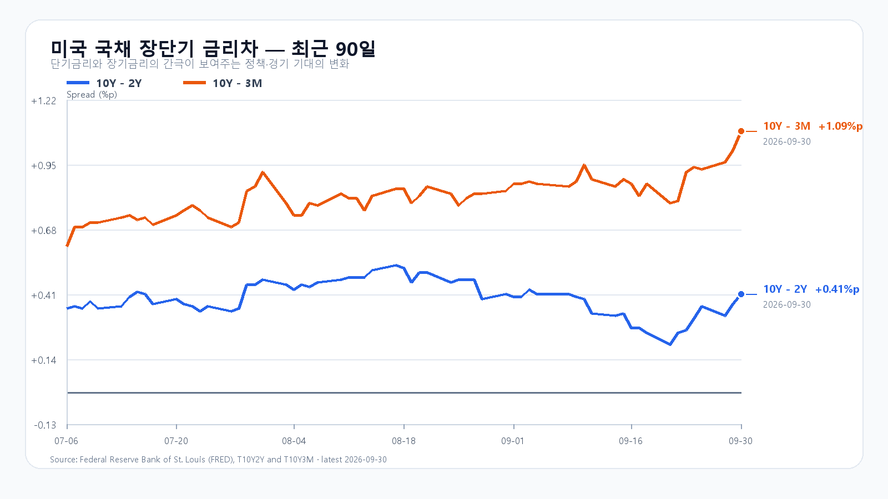
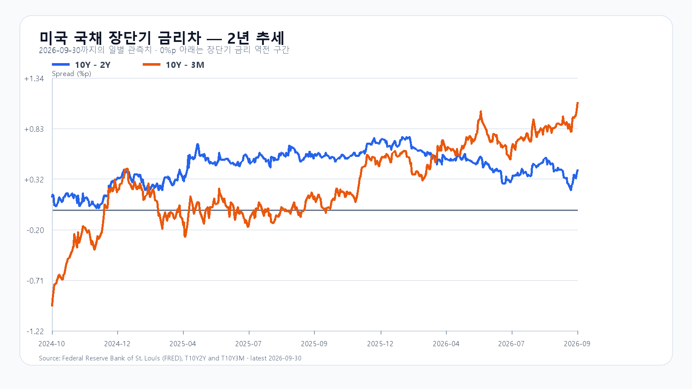

# 2026-10-01 KOSPI·KODEX 일일 리서치

작성 2026-10-01T08:16:15+09:00 / 데이터 최종 확인 2026-10-01T08:16:15+09:00 / 한국 장전.

확정 사실은 출처 시각 기준, 시나리오와 확률은 조건부 전망이다.

Micron이 4분기 매출 542억3천만달러를 발표하고 다음 분기 매출 가이던스를 600억~630억달러로 제시했다. AI 데이터센터의 메모리 수요가 이어진다는 회사의 확인이다. 미국 정규장에서 SOXX는 0.21%, SMH는 0.35% 올랐고 Nvidia도 0.52% 상승했다. 장전 NXT에서 삼성전자와 SK하이닉스가 각각 0.37%, 0.34% 오르는 흐름도 이 재료와 맞닿아 있다.

다만 9월 30일 KOSPI는 6,838.04로 마감했고 KODEX 레버리지는 109,470원으로 0.74% 내렸다. Micron의 실적 호재가 오늘 국내 반도체주의 반등을 뒷받침하더라도, 전날 국내 조정과 미국 반도체 상승분을 같은 충격으로 겹쳐 계산할 이유는 없다. 개장 뒤 외국인과 프로그램 수급이 따라붙는지가 더 중요하다.

금리와 환율은 상단을 제약한다. 미국 10년물은 5.26%, 2년물은 4.89%였고 10년-2년 금리차는 0.41%포인트로 넓어졌다. Brent 선물은 97.61달러로 0.43% 내렸지만 높은 절대 수준은 남아 있다. 하나은행 원/달러 고시는 1,358.00원으로 0.33% 올랐다. 메모리 수요의 개선과 할인율·환율 부담은 같은 방향의 신호가 아니다.

메모리 현물은 마지막 공개값 기준으로 DDR5 16Gb가 57.667달러, DDR4 16Gb가 83.784달러다. Micron의 가이던스는 서버 메모리 수요의 강도를 보여 주지만, 국내 주가에는 이미 높은 기대와 장중 수급이 함께 반영된다.

기본 시나리오는 KOSPI 6,750~6,900, 확률 50%다. Micron 실적과 장전 메모리주 강세가 6,750선 하단을 받치되, 5%대 장기금리와 원/달러 상승이 6,900선 위 추격을 제한하는 경우다. 6,900을 넘고 외국인 현물과 프로그램이 함께 순매수로 전환하면 6,900 초과~7,050의 강세 범위를 본다. 반대로 6,750을 이탈하고 두 수급이 순매도로 기울면 6,550~6,750 미만의 약세 범위가 열린다.

KODEX 레버리지는 107,500원을 1차 지지, 109,470원을 반등 기준, 112,000원을 저항으로 둔다. 장중 고저 예상 범위는 KOSPI 6,500~7,050이다. 대응 점수는 공격 30, 관망 55, 방어 15이다.

|종가 시나리오|범위·확률|15시 20분 확인 조건|전환 신호|
|---|---|---|---|
|기본|6,750~6,900 · 50%|6,750 이상 · 6,900 이하 · 외국인 매도 급확대 없음|범위 이탈|
|강세|6,900 초과~7,050 · 30%|6,900 초과 · 외국인·프로그램 동반 순매수|6,900 아래 재진입|
|약세|6,550~6,750 미만 · 20%|6,750 미만 · 외국인·프로그램 동반 순매도|6,750 회복|

## 장전 가격

|항목|가격·변화|출처 시각|
|---|---:|---|
|KOSPI 전일 종가|6,838.04 · -0.48%|2026-09-30 정규장 종가|
|KODEX 레버리지 전일 종가|109,470원 · -0.74%|2026-09-30 정규장 종가|
|삼성전자 NXT|268,500원 · 0.00%|2026-10-01T08:16:15.927006+09:00|
|SK하이닉스 NXT|1,772,000원 · -0.23%|2026-10-01T08:16:15.927015+09:00|
|달러/원 하나은행 고시|1,358.00원 · 0.33%|2026-10-01T07:31:41+09:00|
|Nasdaq100 선물|30,773.25 · +0.24%|2026-10-01T08:06:13+09:00 · 지연 시세|
|S&P500 선물|7,734.50 · +0.25%|2026-10-01T08:06:03+09:00 · 지연 시세|
|브렌트 선물|97.66 · -0.38%|2026-10-01T07:57:34+09:00 · 지연 시세|
|WTI 선물|90.07 · -0.39%|2026-10-01T08:05:48+09:00 · 지연 시세|

## 취재 근거와 확인 시각

# 2026-10-01 장전 취재 노트

- 기준: 2026-10-01 08:02 KST, KRX 장전. 10월 1일은 KRX 거래일이며 장전 호가가 열려 있다.
- 한국장: Naver KOSPI basic 응답의 직전 종가는 6,838.04다. 9월 29일 종가 6,870.81 대비 -0.48%로 계산된다. KOSPI 일봉 교차 출처의 9월 30일 시가·고가·저가는 각각 6,943.47·6,965.64·6,818.39다. KODEX 레버리지는 109,470원(-0.74%, 시가 111,700원·고가 113,385원·저가 108,110원)으로 마감했다.
- 미국 정규장(9월 30일): QQQ +0.25%, TQQQ +0.74%, SOXX +0.21%, SMH +0.35%. Nvidia +0.52%, AMD +0.69%, Micron +0.00%, Broadcom -1.10%다. AP는 S&P500 -0.3%, Nasdaq +0.2%와 강한 경제 지표 뒤 높게 유지된 금리의 압박을 보도했다.
- 이슈 레이더: ① Micron의 기록적 4분기 실적과 1분기 매출 가이던스 600억~630억달러, ② 미국 10년물 5.26%와 금리차 확대, ③ Brent 97.61달러의 높은 절대 수준, ④ 원/달러 1,358.00원으로의 상승, ⑤ 미국 반도체 ETF 강세와 Broadcom 약세의 혼재. 대규모 청산·증자·신규 제재·공급계약에서 상위 이슈를 바꿀 확인된 1차 자료는 없었다.
- 장전 확인: NXT 삼성전자 269,500원(+0.37%), SK하이닉스 1,782,000원(+0.34%), 하나은행 USD/KRW 1,358.00원(+0.33%, 07:31 고시), Nasdaq100 선물 +0.25%, S&P500 선물 +0.24%, Brent 97.61달러(-0.43%, 모두 지연 시세)다.
- 금리: FRED 최신 금리차는 9월 30일 10년-2년 +0.41%p, 10년-3개월 +1.09%p다. 최신 개별 금리는 9월 29일 3개월 4.25%, 2년 4.89%, 10년 5.26%다.
- 메모리: TrendForce 공개 현물의 마지막 확인값(9월 24일)은 DDR5 16Gb 57.667달러(+0.29%), DDR4 16Gb 83.784달러(-0.70%), DDR4 8Gb 46.107달러(+0.47%)다.

## 판단 재료

- 확정 사실: Micron의 실적·가이던스, 미국 반도체 ETF와 Nvidia의 상승, 장전 삼성전자·SK하이닉스 상승, 5%대 미국 10년물, 원/달러 상승.
- 시장 해석: 메모리 수요의 강도는 반도체주의 하단을 지지한다. 그러나 장기금리와 환율이 동반 상승해 지수 상단은 국내 수급 확인 없이는 열리지 않는다.
- 중복 방지: 9월 30일 미국 정규장 및 Micron 장 마감 뒤 실적은 9월 30일 한국장 마감 뒤의 새 정보다. 9월 30일 한국장 하락은 별도의 추가 충격으로 더하지 않는다.

## 원문·출처

- Naver Finance 장전·일봉·NXT·환율 원시 응답: `research/evidence/2026-10-01/`.
- Yahoo Finance 직접 시세 응답(ETF·주요 종목·선물·유가): `research/evidence/2026-10-01/`.
- [Micron 2026년 4분기·연간 실적](https://investors.micron.com/news/press-release/2026/Micron-Technology-Inc--Reports-Record-Fiscal-Fourth-Quarter-and-Full-Year-2026-Results/default.aspx): 매출 542억3천만달러, AI 수요와 2027년 공급 타이트닝 전망.
- [AP 9월 30일 미국 증시 마감](https://apnews.com/article/1ee73f14dc23f6139eeb12c7397f543e): S&P500 -0.3%, Nasdaq +0.2%, 강한 경제지표와 장기금리 부담.
- [KOSPI 9월 30일 일봉](https://kr.investing.com/indices/kospi-historical-data): 종가 6,838.04, 시가 6,943.47, 고가 6,965.64, 저가 6,818.39. [연합뉴스 종가](https://en.yna.co.kr/view/AEN20260930008100320)로 종가를 교차 확인.
- FRED 시계열: `scripts/update_yield_spreads.py` 실행 결과와 2026-10-01 차트.

## 미국 정규장 종목별 확인

|종목|9/30 종가|전일 대비|
|---|---:|---:|
|QQQ|739.77|+0.25%|
|TQQQ|78.03|+0.74%|
|SOXX|568.64|+0.21%|
|SMH|609.00|+0.35%|
|NVDA|228.38|+0.52%|
|AMD|611.76|+0.69%|
|MU|1065.11|+0.00%|
|AVGO|351.19|-1.10%|

