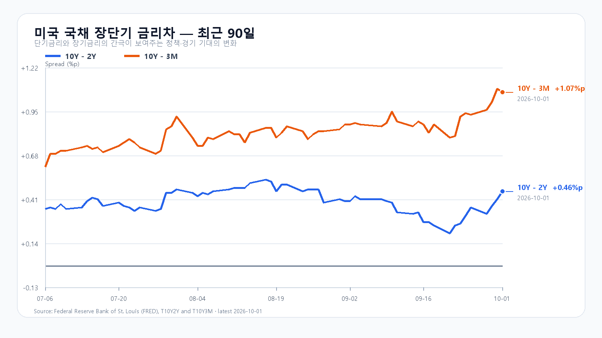
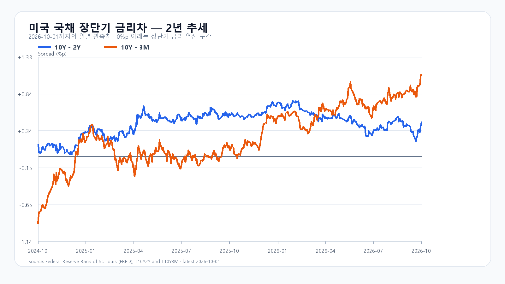

# 2026-10-02 KOSPI·KODEX 일일 리서치

작성 2026-10-02T08:11:21+09:00 / 데이터 최종 확인 2026-10-02T08:11:20+09:00 / 한국 장전.

확정 사실은 출처 시각 기준, 시나리오와 확률은 조건부 전망이다.

미국 반도체주는 10월 1일 정규장에서 다시 강해졌다. SOXX는 1.35%, SMH는 1.45% 올랐고 Micron은 3.03%, Nvidia는 1.09% 상승했다. Micron이 제시한 기록적 실적과 공급 타이트닝 전망이 AI 메모리 수요의 버팀목으로 작용한 흐름이다. 10월 1일 KOSPI도 6,971.35로 마감했고 KODEX 레버리지는 113,255원으로 3.46% 올랐다.

다만 지수는 전날 이미 반도체 강세를 받아들였다. 미국 반도체 ETF와 Micron의 추가 상승은 오늘 장의 하단을 지지할 새 재료지만, 10월 1일 국내 급등분까지 같은 호재로 한 번 더 더할 수는 없다. 장전에서 삼성전자는 275,500원으로 0.18% 내리고 SK하이닉스는 1,843,000원으로 0.55% 올라 두 종목의 결이 갈린다. 7,000선 위에서는 지수보다 외국인·프로그램 수급과 업종 확산이 더 중요하다.

할인율 부담도 남아 있다. 미국 10년물은 5.29%, 10년-2년 금리차는 0.46%포인트이며, 하나은행 원/달러 고시는 1,359.50원이다. 브렌트 선물은 93.03달러로 90달러대에 머문다. 오늘 밤 21시 30분 KST에 나올 미국 9월 고용보고서는 연휴 동안 금리와 달러의 방향을 다시 정할 변수다.

메모리 현물은 마지막 공개값 기준 DDR5 16Gb가 57.667달러, DDR4 16Gb가 83.784달러다. Micron의 공급 전망은 서버 메모리의 가격 환경을 지지하지만, 국내 반도체주에는 이미 오른 주가와 고금리의 밸류에이션 부담이 함께 작용한다.

기본 시나리오는 KOSPI 6,850~7,000, 확률 45%다. 미국 반도체 강세가 6,850선 위를 받치되, 5%대 장기금리와 고용지표 경계가 7,000선 위 추격을 늦추는 경우다. 7,000을 넘고 외국인 현물과 프로그램이 함께 순매수로 기울면 7,000 초과~7,150의 강세 범위를 본다. 반대로 6,850을 이탈하고 두 수급이 함께 순매도로 바뀌면 6,700~6,850 미만의 약세 범위가 열린다.

KODEX 레버리지는 110,000원을 1차 지지, 113,255원을 반등 기준, 116,000원을 저항으로 둔다. 장중 고저 예상 범위는 KOSPI 6,600~7,200이다. 대응 점수는 공격 35, 관망 45, 방어 20이다.

|종가 시나리오|범위·확률|15시 20분 확인 조건|전환 신호|
|---|---:|---|---|
|기본|6,850~7,000 · 45%|6,850 이상 · 7,000 이하 · 외국인 매도 급확대 없음|범위 이탈|
|강세|7,000 초과~7,150 · 35%|7,000 초과 · 외국인·프로그램 동반 순매수|7,000 아래 재진입|
|약세|6,700~6,850 미만 · 20%|6,850 미만 · 외국인·프로그램 동반 순매도|6,850 회복|

## 장전 가격

|항목|가격·변화|출처 시각|
|---|---:|---|
|KOSPI 전일 종가|6,971.35 · +1.95%|2026-10-01 정규장 종가|
|KODEX 레버리지 전일 종가|113,255원 · 3.46%|2026-10-01 정규장 종가|
|삼성전자 NXT|274,500원 · -0.54%|2026-10-02T08:11:20.514718+09:00|
|SK하이닉스 NXT|1,838,000원 · 0.27%|2026-10-02T08:11:20.514743+09:00|
|달러/원 하나은행 고시|1,359.50원 · 0.11%|2026-10-02T07:47:05+09:00|
|Nasdaq100 선물|30,825.75 · +0.21%|2026-10-02T08:01:18+09:00 · 지연 시세|
|S&P500 선물|7,731.75 · +0.10%|2026-10-02T08:01:17+09:00 · 지연 시세|
|브렌트 선물|102.52 · +0.20%|2026-10-02T07:58:04+09:00 · 지연 시세|
|WTI 선물|93.06 · +0.20%|2026-10-02T08:01:16+09:00 · 지연 시세|

## 취재 근거와 확인 시각

# 2026-10-02 장전 취재 노트

- 기준: 2026-10-02 08:03 KST, KRX 장전. 10월 2일은 정규 주식시장 거래일이며, KRX는 추석 연휴 직전인 이날 18시 시작 파생 야간거래만 휴장한다고 공지했다.
- 한국장: Naver KOSPI basic 응답의 직전 종가는 6,971.35다. 9월 30일 6,838.04 대비 +1.95%로 계산된다. KODEX 레버리지는 113,255원(+3.46%, 시가 107,920원·고가 113,280원·저가 106,015원)으로 10월 1일을 마감했다. KOSPI의 10월 1일 OHLC 원문은 이번 응답에서 확인하지 못해 채우지 않는다.
- 미국 정규장(10월 1일): QQQ +0.31%, TQQQ +0.90%, SOXX +1.35%, SMH +1.45%. Nvidia +1.09%, AMD +0.65%, Micron +3.03%, Broadcom -2.15%다. AP는 장기금리의 장중 급등 뒤 되돌림 속 S&P500 +0.2%, Nasdaq 보합권 마감을 전했다.
- 이슈 레이더: ① Micron의 기록적 실적·공급 타이트닝 전망을 배경으로 한 미국 메모리·반도체 강세, ② 5.29% 미국 10년물과 0.46%p 금리차, ③ 93달러대 Brent와 1,359.50원 USD/KRW, ④ 10월 2일 21:30 KST 미국 9월 고용보고서, ⑤ KRX의 추석 연휴 전 파생 야간거래 휴장. 대규모 청산·증자·신규 제재·공급계약에서 상위 이슈를 바꿀 신규 1차 자료는 확인하지 못했다.
- 장전 확인: NXT 삼성전자 275,500원(-0.18%), SK하이닉스 1,843,000원(+0.55%), 하나은행 USD/KRW 1,359.50원(+0.11%, 07:47 고시), Nasdaq100 선물 +0.16%, S&P500 선물 +0.06%, Brent 93.03달러(+0.17%, 모두 지연 시세)다.
- 금리: FRED 최신 금리차는 10월 1일 10년-2년 +0.46%p, 10년-3개월 +1.07%p다. 최신 개별 금리는 9월 30일 3개월 4.20%, 2년 4.88%, 10년 5.29%다.
- 메모리: TrendForce 공개 현물의 마지막 확인값(9월 24일)은 DDR5 16Gb 57.667달러(+0.29%), DDR4 16Gb 83.784달러(-0.70%), DDR4 8Gb 46.107달러(+0.47%)다.

## 판단 재료

- 확정 사실: 미국 SOXX·SMH·Micron·Nvidia 상승, 10월 1일 KOSPI와 KODEX 레버리지 상승, 장전 삼성전자·SK하이닉스 엇갈림, 5%대 미국 10년물, 원/달러 상승.
- 시장 해석: AI 메모리 수요의 강도는 반도체주의 하단을 지지한다. 다만 전날 국내 급등은 이미 가격에 반영됐고, 장기금리·환율과 고용지표가 7,000선 위 추격을 제한할 수 있다.
- 중복 방지: 10월 1일 미국 정규장 반도체 상승은 같은 날 한국장 마감 뒤에 나온 새 정보로만 반영했다. 10월 1일 KOSPI와 KODEX 급등을 오늘 장의 추가 충격으로 중복 가산하지 않는다.

## 원문·출처

- Naver Finance 장전·일봉·NXT·환율 원시 응답: `research/evidence/2026-10-02/`.
- Yahoo Finance 직접 시세 응답(ETF·주요 종목·선물·유가): `research/evidence/2026-10-02/`.
- [Micron 2026년 4분기·연간 실적](https://investors.micron.com/news/press-release/2026/Micron-Technology-Inc--Reports-Record-Fiscal-Fourth-Quarter-and-Full-Year-2026-Results/default.aspx): 기록적 실적과 AI 수요·공급 타이트닝 전망.
- [AP 10월 1일 미국 증시 마감](https://apnews.com/article/c367e6e87c621f06078ea223ab7ce6d1): S&P500 +0.2%, Nasdaq 보합권, 장기금리 변동.
- [BLS 고용보고서 일정](https://www.bls.gov/schedule/news_release/empsit.htm?categoryId=1&orient=1): 9월 고용보고서는 10월 2일 08:30 ET 공개.
- [KRX 휴장일 안내](https://open.krx.co.kr/contents/MKD/01/0110/01100305/MKD01100305.jsp): 10월 2일 18시 시작 파생 야간거래 휴장.
- FRED 시계열: `scripts/update_yield_spreads.py` 실행 결과와 2026-10-02 차트.

## 미국 정규장 종목별 확인

|종목|9/30 종가|전일 대비|
|---|---:|---:|
|QQQ|742.03|+0.31%|
|TQQQ|78.73|+0.90%|
|SOXX|576.33|+1.35%|
|SMH|617.81|+1.45%|
|NVDA|230.86|+1.09%|
|AMD|615.73|+0.65%|
|MU|1097.39|+3.03%|
|AVGO|343.64|-2.15%|

