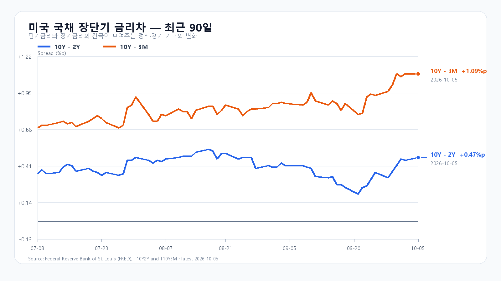
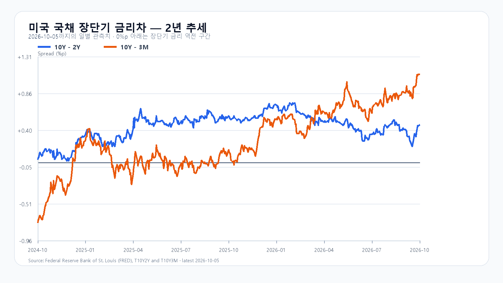

# 2026-10-06 KOSPI·KODEX 일일 리서치

작성 2026-10-06T08:18:15+09:00 / 데이터 최종 확인 2026-10-06T08:18:15+09:00 / 한국 장전.

확정 사실은 출처 시각 기준, 시나리오와 확률은 조건부 전망이다.

미국 증시는 10월 5일 나스닥이 1.1% 올라 사상 최고치를 새로 쓰며 마감했다. Nvidia와 Broadcom은 각각 2% 안팎 올랐지만, 반도체 ETF의 상승폭은 SOXX 0.10%, SMH 0.52%에 그쳤고 Micron은 1.02% 내렸다. AI 인프라 기대가 꺾인 것은 아니지만, 메모리주만으로 한국 지수의 추가 상승을 설명하기에는 밤사이 신호가 고르지 않다.

9월 미국 고용은 비농업 일자리가 2만9천 개 늘고 실업률은 4.2%를 기록했다. 고용 둔화는 장기금리와 달러를 낮춰 주식 할인율에는 우호적일 수 있다. 실제로 하나은행 원/달러 고시는 1,342.50원으로 1.25% 하락했고, 장전 NXT에서 삼성전자는 277,500원(+0.54%), SK하이닉스는 1,843,000원(+0.11%)으로 올랐다. 다만 10년물은 5%대에 있고, 미국 반도체 ETF의 제한된 상승은 추격 매수보다 국내 현물·프로그램 수급 확인을 먼저 보게 한다.

메모리의 중기 수급은 여전히 단단하다. Micron은 최근 실적 발표에서 2027~2028년에도 수요가 공급을 웃돌 수 있다고 제시했다. 이는 HBM과 서버 DRAM의 가격 환경을 받치는 재료다. 그러나 10월 5일 Micron 주가 하락은 메모리 펀더멘털과 개별 주가의 단기 포지션을 분리해 볼 필요를 남긴다. 10월 2일 KOSPI가 7,003.74, KODEX 레버리지가 114,395원으로 마감하며 이미 오른 만큼, 그 상승분을 오늘의 새 호재로 더하지 않는다.

기본 시나리오는 KOSPI 6,950~7,080, 확률 50%다. 원화 강세와 장전 메모리주 상승이 6,950선 위를 지지하되, 7,080선 위에서는 외국인 현물과 프로그램이 함께 순매수로 전환하는지를 확인하는 경로다. 7,080을 넘고 두 수급이 동반 순매수로 기울면 7,080 초과~7,220의 강세 범위를 본다. 반대로 6,950을 이탈하고 수급이 함께 순매도로 기울면 6,780~6,950 미만의 약세 범위가 열린다.

KODEX 레버리지는 111,500원을 1차 지지, 114,395원을 반등 기준, 117,500원을 저항으로 둔다. 장중 고저 예상 범위는 KOSPI 6,700~7,260이다. 대응 점수는 공격 30, 관망 50, 방어 20이다.

|종가 시나리오|범위·확률|15시 20분 확인 조건|전환 신호|
|---|---:|---|---|
|기본|6,950~7,080 · 50%|6,950 이상 · 7,080 이하 · 외국인 매도 급확대 없음|범위 이탈|
|강세|7,080 초과~7,220 · 30%|7,080 초과 · 외국인·프로그램 동반 순매수|7,080 아래 재진입|
|약세|6,780~6,950 미만 · 20%|6,950 미만 · 외국인·프로그램 동반 순매도|6,950 회복|

## 장전 가격

|항목|가격·변화|출처 시각|
|---|---:|---|
|KOSPI 전일 종가|7,003.74 · +0.46%|2026-10-02 정규장 종가|
|KODEX 레버리지 전일 종가|114,395원 · 1.01%|2026-10-02 정규장 종가|
|삼성전자 NXT|278,500원 · 0.91%|2026-10-06T08:18:15.310179+09:00|
|SK하이닉스 NXT|1,842,000원 · 0.05%|2026-10-06T08:18:15.310193+09:00|
|달러/원 하나은행 고시|1,342.50원 · -1.25%|2026-10-06T05:13:43+09:00|
|Nasdaq100 선물|31,334.00 · +0.05%|2026-10-06T08:07:55+09:00 · 지연 시세|
|S&P500 선물|7,831.25 · +0.06%|2026-10-06T08:08:12+09:00 · 지연 시세|
|브렌트 선물|100.28 · -0.04%|2026-10-06T08:03:12+09:00 · 지연 시세|
|WTI 선물|89.28 · -0.17%|2026-10-06T08:06:58+09:00 · 지연 시세|

## 취재 근거와 확인 시각

# 2026-10-06 장전 취재 노트

- 기준: 2026-10-06 08:03 KST, KRX 장전. 10월 5일 대체공휴일 휴장 뒤 첫 정규 주식시장 거래일이다.
- 한국장: Naver KOSPI basic 응답의 직전 종가는 7,003.74다. KODEX 레버리지는 10월 2일 114,395원(+1.01%, 시가 112,120원·고가 114,865원·저가 111,450원)으로 마감했다. 삼성전자는 276,000원, SK하이닉스는 1,842,000원으로 10월 2일 정규장을 마감했다.
- 미국 정규장(10월 5일): QQQ +0.88%, TQQQ +2.61%, SOXX +0.10%, SMH +0.52%. Nvidia +2.12%, AMD -0.34%, Micron -1.02%, Broadcom +2.08%다. AP는 S&P500 +0.7%, Nasdaq +1.1%로 마감했다고 보도했다.
- 이슈 레이더: ① 미국 나스닥 사상 최고치와 Nvidia·Broadcom 강세, ② 반도체 ETF의 제한적 상승과 Micron 약세, ③ 9월 비농업고용 +2.9만명·실업률 4.2%, ④ 5%대 미국 10년물과 100달러 안팎 브렌트, ⑤ 원/달러 1,342.50원 하락이다. 대규모 청산·증자·새 규제·공급계약에서 상위 이슈를 바꿀 새 1차 자료는 확인하지 못했다.
- 장전 확인: NXT 삼성전자 277,500원(+0.54%), SK하이닉스 1,843,000원(+0.11%), 하나은행 USD/KRW 1,342.50원(-1.25%, 05:13 고시), Nasdaq100 선물 +0.05%, S&P500 선물 +0.06%, Brent 100.24달러(-0.08%, 모두 지연 시세)다.
- 금리: FRED 최신 금리차는 10월 5일 10년-2년 +0.47%p, 10년-3개월 +1.09%p다. 최신 개별 금리는 10월 2일 3개월 4.19%, 2년 4.83%, 10년 5.28%다.
- 메모리: Micron은 2027~2028년에도 메모리·스토리지 수요가 공급을 웃돌 수 있다는 전망을 제시했다. 마지막 공개 TrendForce 현물값은 별도 새 공시 전까지 9월 24일 확인값을 유지한다.

## 판단 재료

- 확정 사실: 미국 나스닥·Nvidia·Broadcom 상승, SOXX·SMH의 제한적 상승, Micron 하락, 9월 미국 고용 둔화, 원/달러 하락, 장전 삼성전자·SK하이닉스 소폭 상승.
- 시장 해석: 원화 강세와 미국 기술주 강세가 장의 하단을 지지하지만, 반도체 신호가 엇갈리고 7,000선 위에는 국내 수급 확인이 필요하다.
- 중복 방지: 10월 2일 한국장 상승과 KODEX 레버리지 상승은 오늘 장의 새 충격으로 중복 가산하지 않는다. 미국 ETF에 이미 끝난 한국장 영향이 섞였을 가능성도 새 방향 신호로 사용하지 않는다.

## 원문·출처

- Naver Finance 장전·일봉·NXT·환율 원시 응답: `research/evidence/2026-10-06/`.
- Yahoo Finance 직접 시세 응답(ETF·주요 종목·선물·유가): `research/evidence/2026-10-06/`.
- [BLS 2026년 9월 고용보고서](https://www.bls.gov/news.release/empsit.htm): 비농업고용 +2.9만명, 실업률 4.2%.
- [AP 10월 5일 미국 증시 마감](https://apnews.com/article/7f89624b604f25f313502c77d4d0b010): S&P500 +0.7%, Nasdaq +1.1%, 10년물 5.31%.
- [Micron 2026년 4분기·연간 실적](https://investors.micron.com/news/press-release/2026/Micron-Technology-Inc--Reports-Record-Fiscal-Fourth-Quarter-and-Full-Year-2026-Results/default.aspx): 메모리·스토리지 수급 전망.
- FRED 시계열: `scripts/update_yield_spreads.py` 실행 결과와 2026-10-06 차트.

## 미국 정규장 종목별 확인

|종목|9/30 종가|전일 대비|
|---|---:|---:|
|QQQ|756.20|+0.88%|
|TQQQ|83.12|+2.60%|
|SOXX|589.51|+0.10%|
|SMH|633.90|+0.52%|
|NVDA|238.90|+2.12%|
|AMD|631.75|-0.34%|
|MU|1063.96|-1.02%|
|AVGO|362.51|+2.08%|

