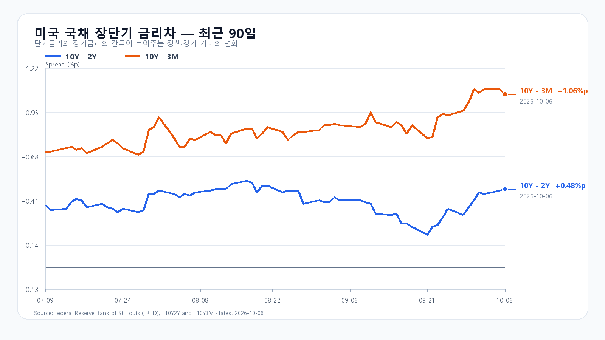
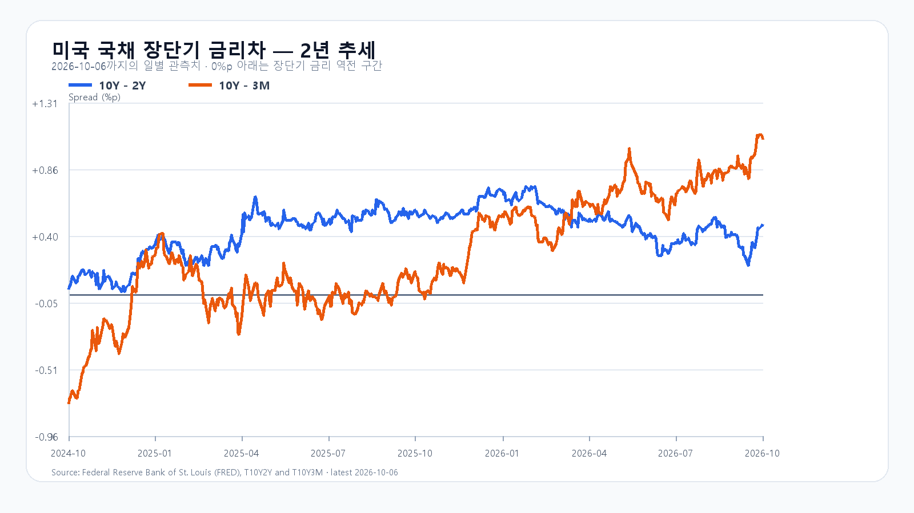

# 2026-10-07 KOSPI·KODEX 일일 리서치

작성 2026-10-07T08:18:19+09:00 / 데이터 최종 확인 2026-10-07T08:16:11+09:00 / 한국 장전.

확정 사실은 출처 시각 기준, 시나리오와 확률은 조건부 전망이다.

미국 증시는 유가와 국채금리가 내려온 틈에 다시 신고가를 썼다. 10월 6일 QQQ는 0.46%, TQQQ는 1.36% 올랐고 Nvidia는 0.14%, AMD는 2.80%, Broadcom은 3.67% 상승했다. 다만 SOXX는 0.01% 내렸고 SMH도 0.22% 하락했으며 Micron은 1.73% 밀렸다. 기술주 전반의 위험선호와 메모리주의 단기 가격 반응은 같은 방향이 아니었다.

국내장은 이 엇갈림을 먼저 해소해야 한다. KOSPI는 10월 6일 6,941.39로 0.89% 하락했고, KODEX 레버리지는 111,805원으로 2.26% 내렸다. 장전 NXT에서 삼성전자와 SK하이닉스가 각각 약세라면, 미국 신고가만으로 전일 하락을 되돌린다고 보기 어렵다. 6,940선은 낙관의 출발점이 아니라 장중 매도 압력이 더 번지는지 가르는 기준이다.

유가와 금리의 완화는 할인율 부담을 덜어 준다. AP에 따르면 미국 10년물 금리는 5.31%에서 5.28%로 낮아졌고, 브렌트유는 장중 97달러 부근까지 내려갔다가 100달러대에서 마감했다. 그러나 유가와 장기금리가 다시 오르면 이 완화는 빠르게 사라질 수 있다. 이날 밤 공개될 FOMC 의사록과 10월 14일 미국 CPI가 다음 변곡점이다.

메모리의 중기 수요는 단기 주가와 분리해서 본다. TrendForce의 10월 5일 현물 시황은 DDR4 8Gb 평균가가 46.321달러에서 유지됐고, 중국 연휴로 호가와 거래가 조용했다고 전했다. 현물의 강세가 꺾였다고 단정할 근거는 아니지만, 오늘 국내 메모리주의 방향은 현물가보다 장전 호가와 외국인·프로그램 수급에 더 민감하다.

기본 시나리오는 KOSPI 6,880~6,990, 확률 50%다. 6,880선을 지키고 미국 선물이 보합 이상인 가운데 외국인 매도가 급격히 커지지 않는 경로다. 6,990을 넘은 뒤 외국인 현물과 프로그램이 함께 순매수로 바뀌면 6,990 초과~7,070의 강세 범위를 본다. 반대로 6,880을 이탈하고 두 수급이 함께 순매도로 기울면 6,780~6,880 미만의 약세 범위가 열린다.

KODEX 레버리지는 110,265원을 1차 지지, 111,805원을 반등 기준, 114,395원을 저항으로 둔다. 장중 고저 예상 범위는 KOSPI 6,760~7,090이며 대응 점수는 공격 25, 관망 50, 방어 25다.

|종가 시나리오|범위·확률|15시 20분 확인 조건|전환 신호|
|---|---:|---|---|
|기본|6,880~6,990 · 50%|6,880 이상 · 6,990 이하 · 외국인 매도 급확대 없음|범위 이탈|
|강세|6,990 초과~7,070 · 25%|6,990 초과 · 외국인·프로그램 동반 순매수|6,990 아래 재진입|
|약세|6,780~6,880 미만 · 25%|6,880 미만 · 외국인·프로그램 동반 순매도|6,880 회복|

## 장전 가격

|항목|가격·변화|출처 시각|
|---|---:|---|
|KOSPI 전일 종가|6,941.39 · -0.89%|2026-10-06 정규장 종가|
|KODEX 레버리지 전일 종가|111,805원 · -2.26%|2026-10-06 정규장 종가|
|삼성전자 NXT|269,500원 · -0.92%|2026-10-07T08:16:12.153455+09:00|
|SK하이닉스 NXT|1,744,000원 · -1.64%|2026-10-07T08:16:12.153469+09:00|
|달러/원 하나은행 고시|1,340.00원 · -0.19%|2026-10-07T07:04:07+09:00|
|Nasdaq100 선물|31,502.50 · +0.06%|2026-10-07T08:06:10+09:00 · 지연 시세|
|S&P500 선물|7,881.25 · +0.09%|2026-10-07T08:06:00+09:00 · 지연 시세|
|브렌트 선물|101.13 · +0.55%|2026-10-07T08:00:51+09:00 · 지연 시세|
|WTI 선물|89.87 · +0.48%|2026-10-07T08:06:11+09:00 · 지연 시세|

## 취재 근거와 확인 시각

# 2026-10-07 장전 취재 노트

- 기준: 2026-10-07 08:03 KST, KRX 장전. KOSPI 10월 6일 종가 6,941.39(-0.89%), KODEX 레버리지 111,805원(-2.26%).
- 미국 정규장(10월 6일): QQQ +0.46%, TQQQ +1.36%, SOXX -0.01%, SMH -0.22%. Nvidia +0.14%, AMD +2.80%, Micron -1.73%, Broadcom +3.67%.
- 이슈 레이더: ① 유가·장기금리 완화 뒤 미국 S&P500·나스닥 신고가(AP, 가격 확인 3/3·직접 노출 2/3·새로움 2/2·출처 3/3·전달 2/2=12), ② 반도체 ETF·Micron 약세와 AMD·Broadcom 강세의 분화(11), ③ 전일 KOSPI·KODEX 급락과 장전 삼성전자·SK하이닉스 약세(12), ④ TrendForce 현물 호가의 정체와 DDR4 8Gb 46.321달러(7), ⑤ 10월 8일 03:00 KST FOMC 의사록·10월 14일 21:30 KST CPI(7). 대규모 청산·증자·구속력 공급계약·신규 규제는 상위 이슈를 바꿀 확정 원문을 확보하지 못했다.
- 장전 확인(원시 응답은 실행 직전 재수집): 하나은행 USD/KRW 1,340.00원(-0.19%), 미국 지수선물·원유는 Yahoo Finance 지연 시세, NXT 삼성전자·SK하이닉스는 개별 응답 시각을 따른다.
- 금리: FRED 수집 결과 최신 금리차는 10월 6일 10년-2년 +0.48%p, 10년-3개월 +1.06%p. 개별 수익률 최신치는 10월 5일 3개월 4.22%, 2년 4.84%, 10년 5.31%이며 AP 보도상 10월 6일 장중·마감 10년물은 5.28%다.
- 메모리: TrendForce 10월 5일 Daily Express는 중국 연휴로 호가와 거래가 조용했고 DDR4 8Gb 3200 평균가가 46.321달러로 유지됐다고 전했다. 현물가는 중기 수요와 당일 국내 수급을 구분해 해석한다.

## 판단 재료

- 확정 사실: 미국 신고가, 장기금리·유가 완화, 반도체 ETF·Micron 약세, KOSPI·KODEX 전일 하락, 장전 국내 메모리주 약세.
- 시장 해석: 할인율 부담 완화는 위험선호를 받치지만, 한국 메모리 대형주의 장전 약세가 전일 낙폭 뒤 반등 폭을 제한한다.
- 중복 방지: 10월 6일 KOSPI·KODEX 하락은 새 미국장 호재의 반대 근거로 중복 계산하지 않는다. 10월 6일 미국 ETF·ADR이 이미 끝난 한국장을 후행 반영한 부분도 오늘의 새 충격으로 사용하지 않는다.

## 원문·출처

- Naver Finance 장전·일봉·NXT·환율 원시 응답: `research/evidence/2026-10-07/`.
- Yahoo Finance 직접 시세 응답(ETF·주요 종목·선물·유가): `research/evidence/2026-10-07/`.
- [AP 10월 6일 미국 증시 마감](https://apnews.com/article/e8285ec7afbe81e9df277e8ee2127982): 미국 지수 신고가, 10년물 5.28%, 브렌트유 움직임.
- [FRED T10Y2Y](https://fred.stlouisfed.org/series/T10Y2Y)·[T10Y3M](https://fred.stlouisfed.org/series/T10Y3M): 금리차.
- [TrendForce Daily Express](https://www.trendforce.com/presscenter): DRAM 현물 시황.
- [연준 2026년 10월 일정](https://www.federalreserve.gov/newsevents/2026-october.htm): 10월 7일 14:00 ET FOMC 의사록.
- [BLS 2026년 10월 일정](https://www.bls.gov/schedule/2026/10_sched.htm): 10월 14일 08:30 ET 9월 CPI.

## 미국 정규장 종목별 확인

|종목|10/6 종가|전일 대비|
|---|---:|---:|
|QQQ|759.66|+0.46%|
|TQQQ|84.25|+1.36%|
|SOXX|589.45|-0.01%|
|SMH|632.50|-0.22%|
|NVDA|239.24|+0.14%|
|AMD|649.42|+2.80%|
|MU|1045.56|-1.73%|
|AVGO|375.81|+3.67%|

