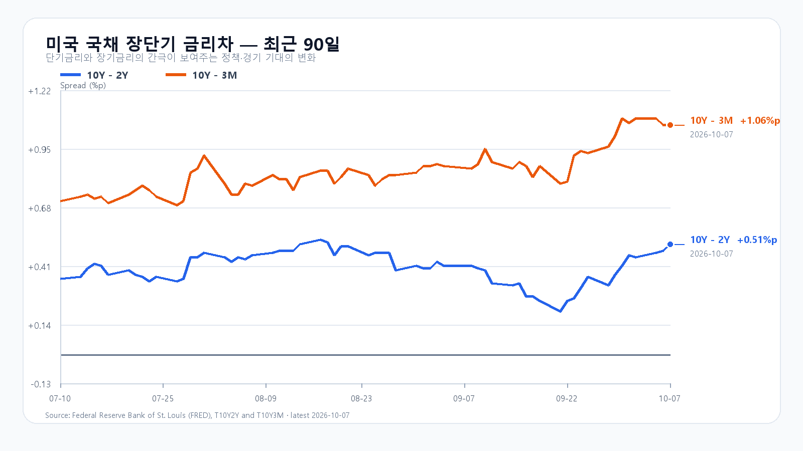
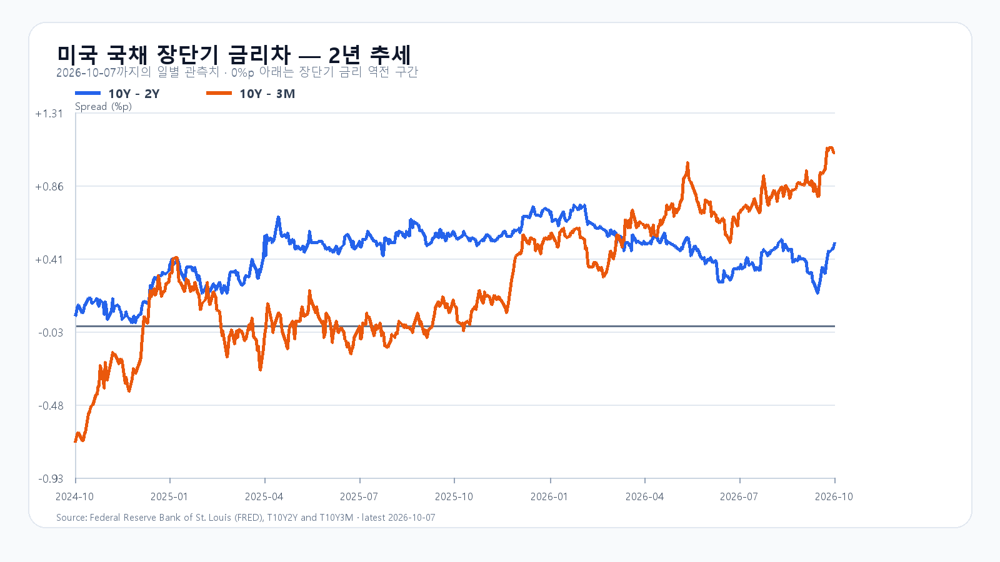

# 2026-10-08 KOSPI·KODEX 일일 리서치

작성 2026-10-08T08:15:00+09:00 / 데이터 최종 확인 2026-10-08T08:14:07+09:00 / 한국 장전.

확정 사실은 출처 시각 기준이며, 시나리오와 확률은 조건부 전망이다.

## 핵심 결론

전일 KOSPI가 6,803.90으로 1.98% 밀린 뒤 미국에서는 FOMC 의사록과 장기금리 경계심이 성장주와 반도체 ETF를 눌렀다. 오늘은 미국 신호 하나보다 6,800선에서 외국인·프로그램 매도가 멈추는지가 더 중요하다. Micron의 4.06% 반등은 메모리 수요의 버팀목이지만, SOXX -1.13%와 전일 국내 수급 공백을 상쇄하는 단독 근거는 아니다.

대응 점수는 공격 15, 관망 55, 방어 30이다. 기본 시나리오는 6,730~6,860(50%)이다. 6,800선을 되찾고 외국인 현물과 프로그램 매도가 줄어들면 6,860 초과~6,990의 강세 시나리오(20%)로 전환한다. 반대로 6,730을 밑돌면서 두 수급이 함께 매도로 확대되면 6,580~6,730 미만의 약세 시나리오(30%)를 본다. 장중 90% 포락은 6,550~7,000이다.

KODEX 레버리지는 전일 저점 107,175원을 1차 지지, 전일 종가 107,230원을 반등 기준, 109,475원을 저항으로 둔다.

## 밤사이 시장을 지배한 이슈

9월 FOMC 의사록은 연준이 인플레이션 상방 위험을 여전히 크게 보고 있음을 보여 줬다. 회의 참가자 전원은 3.75~4.00%로의 인상에 찬성했고, 일부는 에너지 충격과 AI 수요에서 생긴 가격 압력이 더 넓게 번지지 않게 하려면 높은 금리가 필요하다고 언급했다. 10월 7일 미국 장기금리가 다시 올라가자 QQQ는 0.25%, SOXX는 1.13%, SMH는 1.18% 하락했다.

반도체 안에서는 Micron이 4.06% 올랐다. Nvidia와 AMD는 각각 0.74%, 0.55% 내렸고 Broadcom은 0.19% 올랐다. 메모리 가격과 서버 수요가 당일 ETF 수급과 같은 속도로 움직이지 않는다는 뜻이다. 오늘 국내 메모리주의 반등 여부는 이 차이를 해소하는 외국인·프로그램 수급에 달려 있다.

## 전일 대비 바뀐 변수와 유지 변수

유가·금리 완화에 기대던 전일 장전 환경은 바뀌었다. 브렌트유는 장전 지연 시세에서 101달러 부근이고, FRED 금리차는 10년-2년 +0.51%p와 10년-3개월 +1.06%p다. 장기금리의 절대 수준은 여전히 높다.

전일 국내장은 단순한 지수 조정이 아니었다. KOSPI는 6,864.25에 출발해 6,977.77까지 올랐지만 6,803.81까지 밀린 뒤 6,803.90으로 마감했다. 외국인은 2조6,188억원, 기관은 7,101억원 순매도했고 프로그램 전체는 1조9,315억원 순매도였다. 상승 333종목, 하락 527종목으로 시장 폭도 약했다.

## 한국시장·KODEX 대시보드

|항목|전일 확정값|기준 시각|
|---|---:|---|
|KOSPI|6,803.90 · -1.98%|10월 7일 정규장 종가|
|KODEX 레버리지|107,230원 · -4.09%|10월 7일 정규장 종가|
|삼성전자|269,000원 · -1.10%|10월 7일 정규장 종가|
|SK하이닉스|1,715,000원 · -3.27%|10월 7일 정규장 종가|
|원/달러 하나은행 고시|1,341.00원 · +0.07%|10월 8일 07:09 KST|
|삼성전자 NXT|273,000원 · +1.68%|10월 8일 08:13:59 KST|
|SK하이닉스 NXT|1,740,000원 · +0.99%|10월 8일 08:14:07 KST|

## 메모리 반도체 수급

Micron 반등은 고대역폭 메모리와 서버 DRAM 수요의 중기 기반이 훼손됐다는 신호가 아니라는 점을 뒷받침한다. 다만 이번 장전 판에는 새 현물 호가나 확정 공급계약이 없다. 10월 5일 TrendForce의 DDR4 8Gb 평균가 46.321달러는 직전 현물 관측일일 뿐, 오늘의 새 가격이 아니다.

## 미국 반도체·AI

|종목·ETF|10월 7일 미국 정규장|
|---|---:|
|QQQ|-0.25%|
|TQQQ|-0.75%|
|SOXX|-1.13%|
|SMH|-1.18%|
|Nvidia|-0.74%|
|AMD|-0.55%|
|Micron|+4.06%|
|Broadcom|+0.19%|

## 달러/원·국내 수급·시장 구조

하나은행 07:09 KST 고시 원/달러는 1,341.00원이다. 전일 환율보다 1원 높지만, 10월 7일 지수 하락의 중심은 외국인 현물과 프로그램의 동반 순매도였다. 장전 NXT 가격은 유동성이 제한된 참고값이므로 정규장 개시 후에는 지수와 수급이 같은 방향으로 움직이는지를 다시 본다.

## 경제 캘린더

한국은행은 10월 8일 08:00 KST에 8월 경상수지 잠정치를 공표한다. 미국에서는 10월 14일 21:30 KST에 9월 CPI가 나온다. 연준의 다음 정례회의는 10월 27~28일이다.

## 미 국채와 장단기 금리차

FRED 최신 관측에서 10년-2년 금리차는 10월 7일 +0.51%p, 10년-3개월 금리차는 +1.06%p다. 개별 3개월·2년·10년 금리는 10월 6일 기준 4.21%, 4.79%, 5.27%다. 금리차의 양(+)전환보다 5%대 10년물 자체가 성장주 할인율에 주는 부담을 먼저 본다.

## 오늘 KOSPI·KODEX 시나리오

|시나리오|종가 범위·확률|성립 조건|무효화 기준|
|---|---:|---|---|
|강세|6,860 초과~6,990 · 20%|6,860 상회, 외국인 현물 순매수, 프로그램 전체 순매수|6,860 아래 재진입|
|기본|6,730~6,860 · 50%|6,730 이상, 6,860 이하, 외국인 순매도 1조원 미만|범위 이탈|
|약세|6,580~6,730 미만 · 30%|6,730 미만, 외국인 현물 순매도, 프로그램 전체 순매도|6,730 회복|

## 장중 체크리스트

- KOSPI 6,730 방어와 6,800선 회복
- 외국인 현물·프로그램 순매도 둔화 또는 동반 전환
- 삼성전자·SK하이닉스의 정규장 가격이 NXT 참고값과 같은 방향으로 이어지는지
- 미국 지수선물과 10년물 금리의 동반 반등 여부

## 출처와 확인 시각

- [FOMC 의사록](https://www.federalreserve.gov/monetarypolicy/fomcminutes20260916.htm) · 10월 7일 공개.
- [Naver Finance KOSPI](https://m.stock.naver.com/domestic/index/KOSPI/total) · 10월 7일 종가 및 10월 8일 장전 개별 응답.
- [Yahoo Finance QQQ](https://finance.yahoo.com/quote/QQQ/) · 10월 7일 미국 정규장 종가.
- [FRED T10Y2Y](https://fred.stlouisfed.org/series/T10Y2Y)·[T10Y3M](https://fred.stlouisfed.org/series/T10Y3M) · 10월 7일 최신 금리차 관측.
